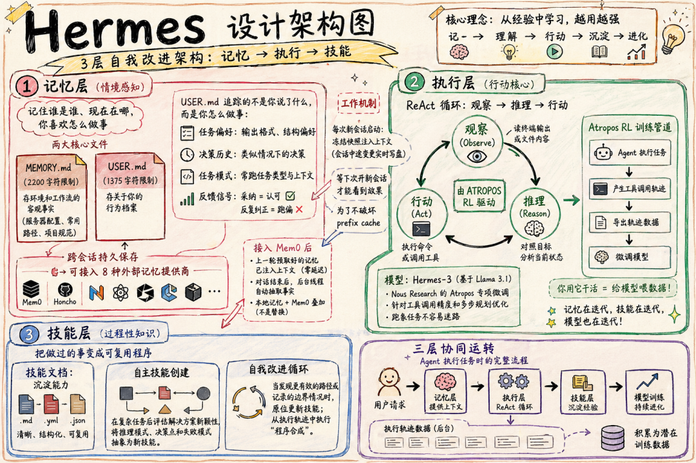
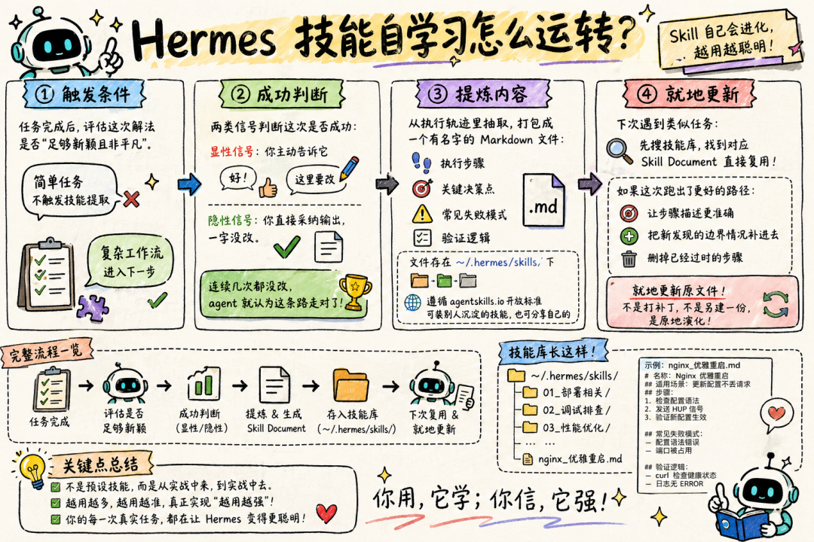

> 📎 来源: [WeTalk伟说](https://mp.weixin.qq.com/s?__biz=MzIzODAwODcwNw==&mid=2460023853&idx=1&sn=a66e95c9376a4dc317afa3a2fd48723c&chksm=ffd49fb0040475f9a9f2b3b9c29681f5baefaf0aa07e1392d0ce3288543d607853e8e2fb56d5&mpshare=1&scene=1&srcid=04288OwSXkxN6S91dmyYNpSL&sharer_shareinfo=e91be9ffd4692155f379d5918727bb6a&sharer_shareinfo_first=e91be9ffd4692155f379d5918727bb6a) | 时间: 2026-04-28 14:28

---

|  |
| --- |
| 我用各种 AI Agent 跑了挺长一段时间，最烦的就是每次新开对话都要重新教一遍。我明明已经反复用了很多次，它却记不住我的工作方式。Hermes Agent 是少数真正在解决这个问题的框架。 |

## 01 Hermes Agent 是什么

Hermes Agent是Nous Research在 2026 年 2 月发布的开源AI Agent框架，MIT协议，GitHub星标已超过 3 万。你可能听过Nous Research——他们做了Hermes、Nomus、Psyche等知名开源模型系列，是一家正经的AI实验室，不是个人开发者。

Hermes的口号很直接："The agent that grows with you"，一个和你一起成长的 Agent。

它和普通聊天机器人、任务执行器不一样，Hermes会自己学习你的工作方式，它能从你的使用过程里自动学习、生成专属技能，还会慢慢优化做事的方式。用的越多，它越懂你，越会做事。

## 02 三层架构：记忆、技能、执行

要理解Hermes为什么不一样，得先看它的三层架构设计。

|  |
| --- |
| **🧠 记忆层** 负责"记住你是谁、现在在哪、你喜欢怎么做事"。核心是两个文件：MEMORY.md存环境和工作流的客观事实（服务器配置、常用部署路径、项目规范），容量约2200字符；USER.md存关于你这个人的行为档案——任务偏好、决策历史、工作模式、反馈信号，容量约1300字符。 |

注意，USER.md追踪的不是你说了什么，而是你怎么做事。你连续几次不改就直接采纳输出，Agent把这个当成你认可的信号；你反复纠正，就说明它跑偏了。每次新会话启动，这两个文件作为"冻结快照"注入，会话中途的变更实时写盘，但不会破坏当前会话的提示缓存。

|  |
| --- |
| **⚡ 技能层** 负责"把做过的事变成可复用程序"。这是Hermes和其他框架差距最大的地方。 |

|  |
| --- |
| **🔧 执行层** 基于ReAct循环——观察、推理、行动，由Hermes-3 模型（基于 Llama 3.1）驱动，Nous Research自家的Atropos做了专项微调，重点针对工具调用精度和多步规划。 |

三层同时运转：执行任务时记忆层在喂上下文，执行完之后技能层在判断要不要把这次的解法提炼成可复用文件，执行轨迹则在后台积累成潜在的训练数据。



图：Hermes Agent三层架构与自我进化闭环

## 03 技能自学习



OpenClaw的Skill 是人工写的——你或者其他开发者写好工具调用指令，Agent照着执行，写死了就是写死了。

Hermes的Skill Document是Agent自己提炼的。

|  |
| --- |
| Hermes会在任务跑完后，先判断这件事值不值得"记下来"。只有那些步骤多、能反复用的复杂流程，才会进入技能学习。它会默默看你的反应：如果你不改直接用，它就知道这条路是对的；如果你反复改，它就知道这个方法不行。确认有效后，它会把整套步骤、哪里容易错、怎么验证才对，一起存成技能文件。下次遇到一样的事，它不用从零开始，直接拿现成的方法跑，跑得更好了，还会自己把旧的技能覆盖更新。 |

## 04 后台评审机制

除了技能自学习，Hermes还有一套更隐蔽但同样重要的机制——后台评审。

系统内置了一个计数器，每次你跟Hermes的对话都会加 1。到第 10 次对话时，它会自动触发一个后台评审线程：在后台新建一个完整的AI Agent，传入对话历史，然后用同一个模型去回顾这些对话，重点看两点——用户有没有透露过自己的信息？用户有没有表达过对你的期望和工作偏好？

如果发现值得记住的东西，就调用Memory工具把它存下来。完成后还会通知你："user profile updated"。

|  |
| --- |
| **📋 实测案例** 有人反复纠正Hermes把思维导图的大节点改成英文，连续纠正了三四次之后，Hermes 在第六轮自动把"用户偏好思维导图大节点用英文、内容用中文"写进了USER.md。从第七轮开始，每次生成思维导图都自动遵循这个规则，不需要再提醒。 |

## 05 四层记忆系统

从架构层面看，Hermes用四层记忆架构配合工作：

|  |
| --- |
| **第一层：冻结提示记忆** MEMORY.md + USER.md。会话启动时一次性渲染并冻结，后续可变内容通过工具按需检索。这个设计直接服务于OpenAI/OpenRouter 等提供商的提示缓存，显著降低延迟与成本。 |

|  |
| --- |
| **第二层：会话搜索** 底层是SQLite数据库，含FTS5全文索引。模型需要历史信息时，检索、摘要、返回，绝不全量塞入提示。解决"上周我们讨论过什么"这类问题。 |

|  |
| --- |
| **第三层：技能库** 作为可复用工作流文档，仅加载索引，需要时再拉取完整内容，避免token膨胀。传统记忆系统关注"知道什么"，Hermes额外解决"知道怎么做"。 |

|  |
| --- |
| **第四层：可选Honcho层** 提供跨会话、跨设备的语义画像与双向建模（用户 + AI自身）。 |

这样既能稳住提示缓存，又能把动态内容交给工具处理，成本和速度都更合理。

## 06 和 OpenClaw 的根本分歧

很多人第一反应是"Hermes 是不是另一个OpenClaw"。但它们赌的方向完全不同。

|  |
| --- |
| 🏗️ **OpenClaw是一个执行系统**——中央网关管所有的会话、路由、工具执行，流程清晰，行为范围精确可控。它的Skill是人工写的，记忆靠手动配置的context文件，社区生态庞大（13,000+ 社区Skill），支持 24 个消息平台。  ✨ **Hermes是一个成长系统**——把Agent执行循环本身当引擎，记忆、技能、工具运行时都围着这个循环转。Skill是自己学的，记忆是自动沉淀的，行为更难预测，但对边界没想清楚的任务反而更能适应。 |

打个比方：OpenClaw像一个"总机"，后面可以接很多接线员，负责把事情高效地分发和执行；Hermes像一个"实习生"，它只有一个人，但会把每次做过的事变成自己的本事，越用越聪明。

如果你已经想清楚了要干什么，OpenClaw更顺手——可预测、好调试。如果你的任务类型比较固定、跑得越多越值，Hermes才是更好的选择。

有意思的是，Hermes还做了从OpenClaw迁移的功能，一条命令就能把你的 soul.md、记忆、技能、API 密钥全部搬过来。Nous Research的态度很明确：Hermes支持直接从OpenClaw迁移数据，很方便。

## 07 如何开始

安装Hermes只需要一行命令：

```
curl -fsSL https://raw.githubusercontent.com/NousResearch/hermes-agent/main/install.sh | bash
```

然后运行 

```
hermes setup
```

 完成配置——选择模型提供商、消息平台等。整个安装过程大约 60 秒。

如果你已经在用OpenClaw，安装完成后Hermes会自动检测并提示你是否要导入现有配置。

Hermes支持目前市场上主流的模型服务商：OpenAI、Anthropic、DeepSeek、OpenRouter等，切换只需要一行命令。它还内置了40多种工具，支持6种执行环境（本地、Docker、SSH、Singularity、Daytona、Modal），可以连接 Telegram、Discord、Slack、WhatsApp、钉钉、飞书、企业微信等聊天平台。

## 08 不是万能药

Hermes也有明确的局限。

技能学太死是个麻烦，换个场景就容易不灵，这一点官方还在优化，暂时没有特别完美的解法。

它不支持Windows（需要 WSL2），学习循环只对复杂任务触发（简单任务不会生成技能），Agent有时会陷入循环。官方文档建议生产环境使用Docker作为后端，用容器作为安全边界。

## ✓ 写在最后

Hermes Agent指向了一个值得关注的方向：传统 Agent只能用固定工具，Hermes 会把用过的方法变成自己的能力。

Hermes的关键是把记忆、技能、执行串成了一个能自己转起来的闭环——Memory 会记牢你的工作习惯和偏好，Skill则把靠谱的做事方法沉淀下来，而Nudge Engine的作用是让这套"记忆-技能-执行"的循环一直转下去。

|  |
| --- |
| 对个人用户来说，能越用越顺手的AI，其实比看起来强大但每次都要重教的AI要实用得多。 |

🔗 相关资源：

官方网站：https://github.com/NousResearch/hermes-agent
