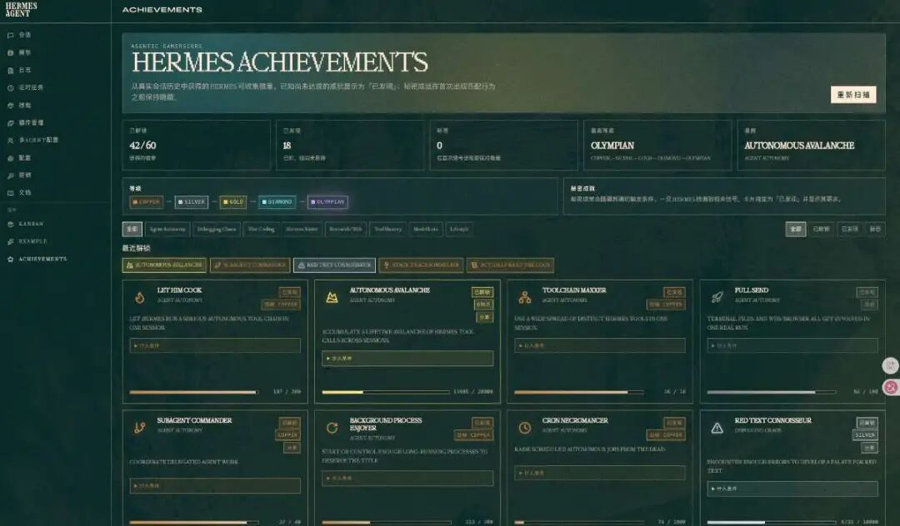
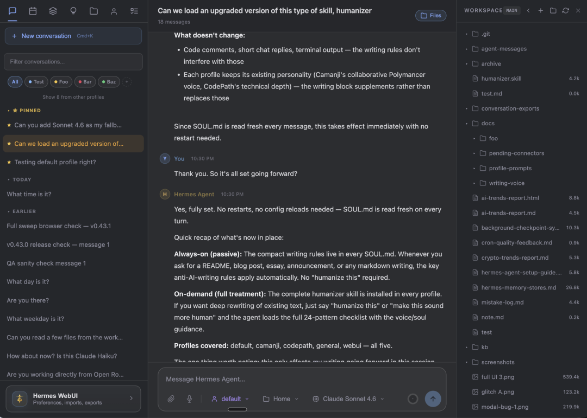
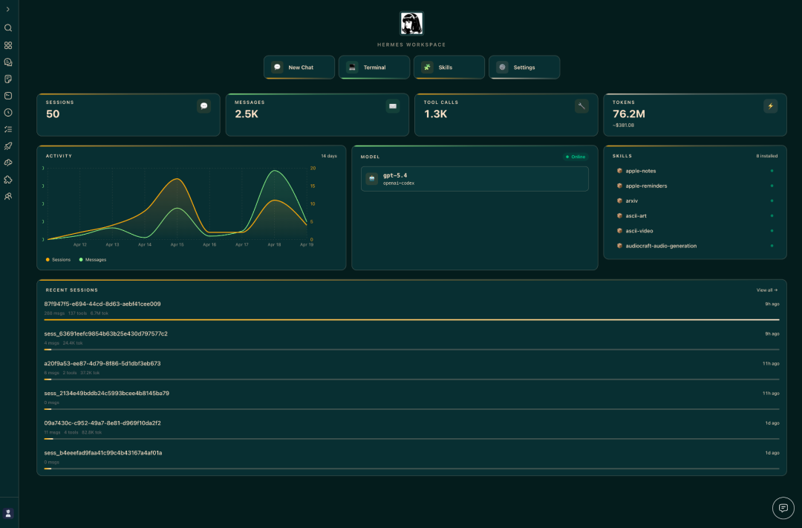
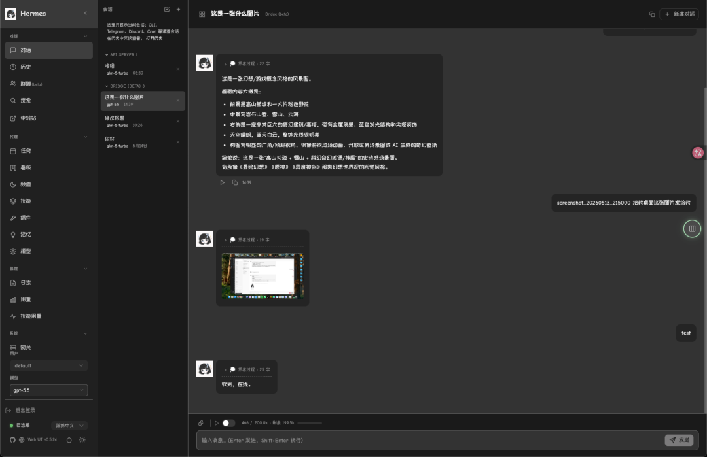
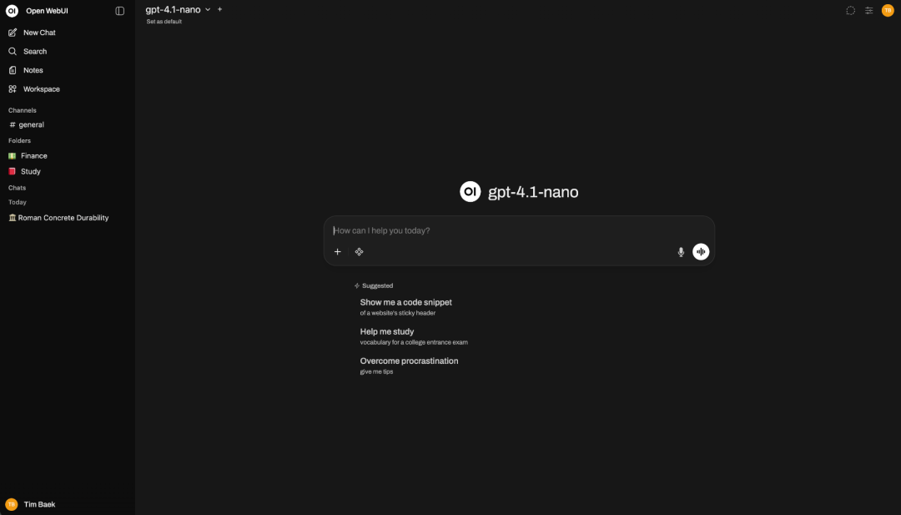

> 📎 来源: [赛博生命虾酱](https://mp.weixin.qq.com/s?__biz=MzA4Mjg1NjU2OA==&mid=2247484763&idx=1&sn=894f36460b76bffacd426097e2b47f29&chksm=9e312d120e7376f74146c0bd38e58db134f0204dcfdcb082dc982ac994b769dcbd58a034072b&mpshare=1&scene=1&srcid=0524TDnQnGH6zWUbDWqsAg2q&sharer_shareinfo=cabc608c0fc582f553747d83905b2ec1&sharer_shareinfo_first=cabc608c0fc582f553747d83905b2ec1) | 时间: 2026-05-24 02:44

---

注：本文按现有互联网上能收集到的资料整合而成，大部分虾酱自己验证过内容的真实性，可以根据自己的需要，选一个更符合自己使用习惯的即可。

Hermes 跑起来之后，真正影响体验的是“每天怎么用”。是继续守着终端，还是换成网页？是一个人手机上随手聊，还是让团队在工作群里调 Agent？这几个 Web 方案不是谁替代谁，而是各有位置。


## 1. 官方 Web Dashboard：最稳的控制面板

官方 Dashboard 更像 Hermes 的系统设置页。它能在浏览器里改配置、管 API Key、看会话、日志、Token 用量、定时任务和 Skills。以前要翻配置文件、敲命令的地方，现在基本能点选完成。

它最大的优点是同源：跟 Hermes 主项目一起走，升级和兼容更放心。适合第一次安装、日常排错，以及不想折腾第三方界面的用户。

缺点也清楚：它偏管理后台，不是最舒服的聊天 App；默认本机访问，官方也提醒不要随便暴露到公网。建议先用它打底，再按需求换更顺手的界面。

现在已经内置在 hermes 中，只需要终端输入； hermes dashboard



## 2. hermes-webui：最像日常聊天 App

nesquena/hermes-webui 的定位很直接：把 Hermes CLI 搬进网页。左边会话，中间聊天，右边文件浏览；模型、profile、workspace 放在输入区附近，Token 状态也能一眼看到。



它用 Python + vanilla JS，没有复杂构建流程，对自托管用户很友好。README 还专门写了手机访问方案，配合 Tailscale 这类内网工具，躺在床上也能查看、对话、停任务。

适合想要“干净、稳定、随手能聊”的个人用户。不适合重度团队管理或多 Agent 调度。

```
https://github.com/nesquena/hermes-webui
```

## 3. Hermes Workspace：程序员的工作台

outsourc-e/hermes-workspace 不是普通聊天壳，更像给 Hermes 做了一套 VS Code 式驾驶舱。聊天、文件、记忆、Skills、终端、任务、仪表盘、Agent View 都在一个工作区里。



如果你经常让 Agent 读项目、跑命令、看日志、拆任务，这种一屏式体验会省很多切窗口的时间。它还强调 Swarm Mode、多 Agent 控制面板和任务板，明显面向更重的开发/自动化场景。

代价是上手门槛更高：需要 Node 22+，还要和 Hermes gateway、dashboard 配合。适合程序员和技术团队，不适合只想开网页聊两句的新手。

```
https://github.com/outsourc-e/hermes-workspace
```

## 4. EKKO Hermes Web UI：更像团队管理后台

EKKOLearnAI/hermes-web-ui 介于聊天界面和管理后台之间。它有会话、搜索、用量统计、定时任务、模型管理、profile、文件、日志和 Web Terminal，也把平台配置做成了页面。



它对国内团队更友好的地方，是 README 明确列了飞书、微信、企业微信等入口，配置不用全靠手改文件。想把 Agent 接进办公沟通链路，这类界面会比纯聊天 UI 更顺手。

注意：你给的 `ekko-ui/hermes-web-ekko` 当前不可访问；这个可访问仓库的 README 平台表里有飞书、微信、企业微信，但没有把钉钉列入同一张表。钉钉接入建议再看 Hermes Gateway 官方集成。

```
https://github.com/EKKOLearnAI/hermes-web-ui
```

## 5. Open WebUI：已有模型平台的人最省事

Open WebUI 不是 Hermes 专属界面，而是通用 AI 前端。它的优势是普及度高：很多人服务器上早就跑着 Ollama、本地模型或 OpenAI 兼容接口。



Open WebUI 官方文档已有 Hermes Agent 连接指南。Hermes 开启 API Server 后，把地址接到 OpenAI-compatible connection 里，Hermes 就能像一个模型一样出现在下拉框。

这条路线最适合“我已经有 Open WebUI，不想再装一套界面”的用户。代价是 Hermes 原生管理项没那么完整，记忆、Skills、cron、平台网关等，还是官方 Dashboard、Workspace 或 EKKO 看得更清楚。

```
https://github.com/open-webui/open-webui
```

## 怎么选？

第一次装 Hermes：官方 Dashboard。

个人日常聊天、手机上用：hermes-webui。

程序员工作台、多窗口少切换：Hermes Workspace。

团队接入、看用量、配飞书/企业微信：EKKO Hermes Web UI。

已经有 Open WebUI：直接把 Hermes 当后端接进去。

一句话：别问哪个最好，先问你每天打开它想干什么。Hermes 是发动机，这几个 Web UI 是不同仪表盘。选对场景，比追最新项目更重要。

我们，下次见！
