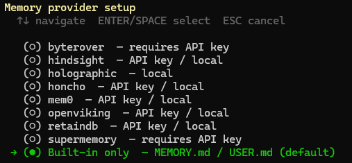
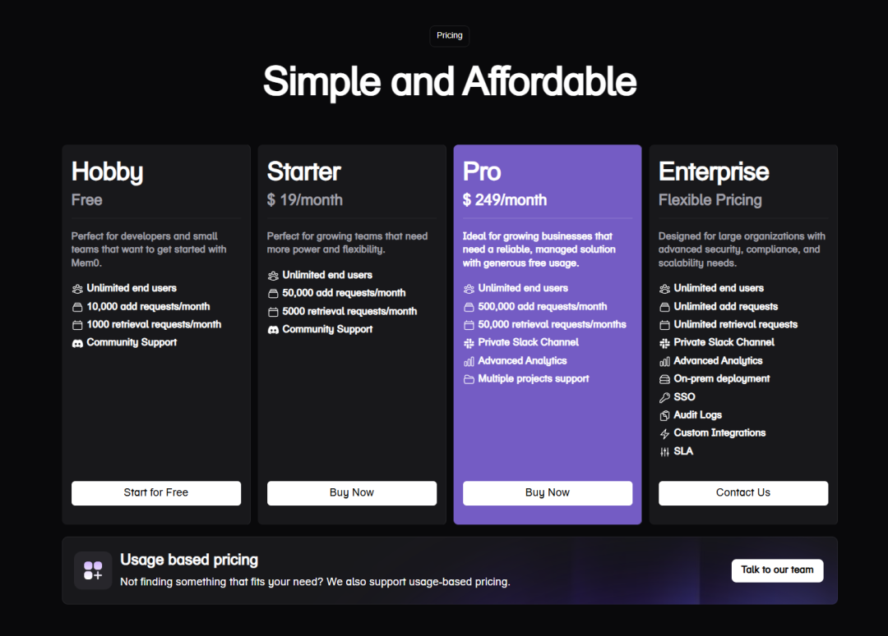
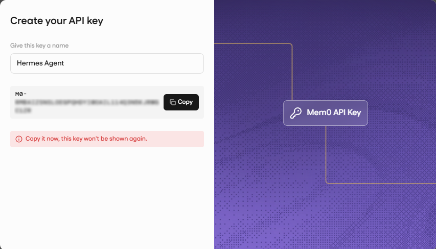
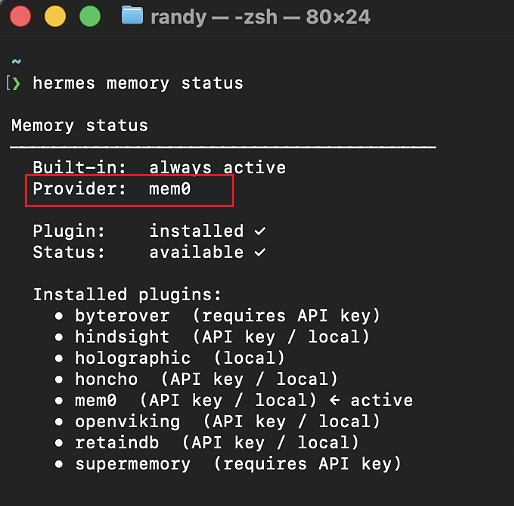
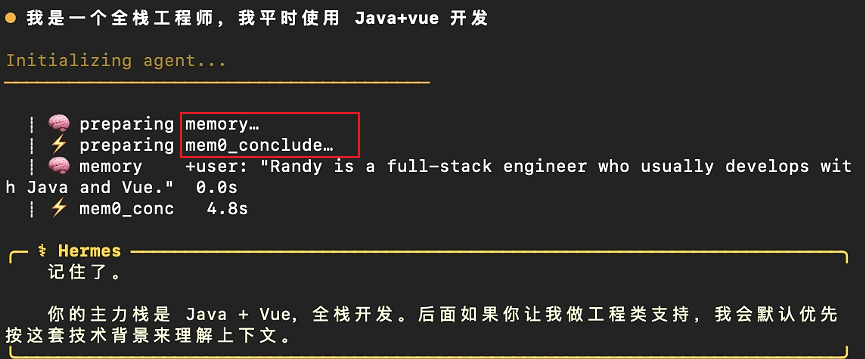
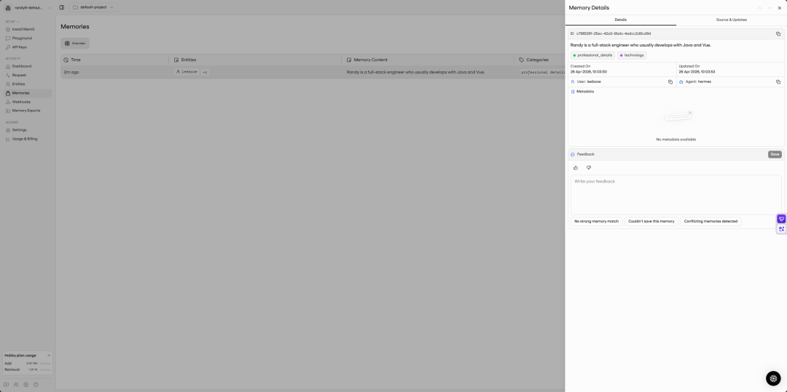
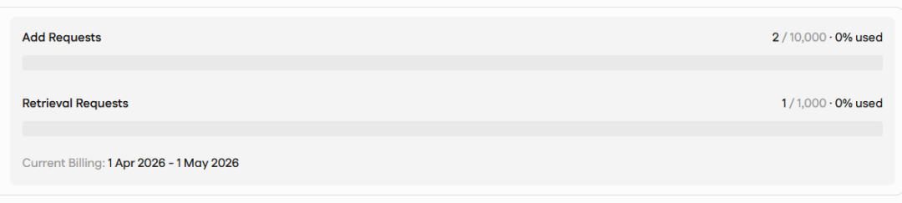

> 📎 来源: [云起泊言](https://mp.weixin.qq.com/s?__biz=MzA5NjAxMTY1OA==&mid=2461868882&idx=1&sn=5b5c0d470d31c10deeca597314b77526&chksm=86e47c19004a08b7b2e8b0b52feca6734bc968c067c2d1d5a9e039f13acf648ce36e9c68f27f&mpshare=1&scene=1&srcid=04262EPPrvgZGCgMzW7hA66i&sharer_shareinfo=210135d8150d13156080d9b79a03bd6d&sharer_shareinfo_first=210135d8150d13156080d9b79a03bd6d) | 时间: 2026-04-26 15:15

---

在使用 Hermes Agent 之前，你是不是也被它强大记忆能力所吸引，然后从 OpenClaw 转到了 Hermes，但是在实际使用过程中，你却经常遇到前几分钟跟它说过的事情，转头就忘了？吐槽最多的就是：“我明明告诉过它，为什么还不记得？”

我之前就是这么跟 Hermes Agent 相处的，每次“失忆”都觉得很郁闷。后来我研究了一下外置的记忆增强工具，才找到了适合自己的方案。

今天我就简单聊聊 Hermes 的内置记忆以及外置记忆工具的优缺点，以及我最终的选择。

---

### #内置记忆（热记忆层）

Hermes 的内置记忆通常由两个文件组成，存储在 `~/.hermes/memories/` 目录下，如果你是多 Agent，那么记忆目录在各自 Profile 下的 `memories` 目录下。

- **MEMORY.md** 是“工作笔记本”，记录环境配置、项目经验、踩过的坑；针对 MEMORY.md，Hermes 存在 **2200** 字符的系统阈值（硬限制）。
- **USER.md** 是“用户档案”，存着你的偏好、沟通风格、技能水平；针对 USER.md，Hermes 存在 **1375** 字符的系统阈值（硬限制）。

内置的记忆确实能用，但有两个明显的缺点：

第一，**上下文窗口容量有限**。内容一多，Hermes 就得做取舍。你可能以为它会智能压缩，但实际机制是：超限就直接拒绝写入，把现有条目摊给你看，让你自己看着办。

第二，**信息容易“污染”**。你用久了会发现，新旧信息、矛盾信息全都堆在一起。我前阵子跟它说我在减肥，一周后又说不减了，结果它还是给我推荐低卡食谱——因为两条记录都在，它分不清哪个是最新的。

打工人卷累了，不想手工删重复过时信息，所以要“外挂”。

---

### #外置记忆工具

Hermes Agent 从 v0.7.0 版本开始，以插件形式开放了记忆增强支持。一条命令就能弹出选择菜单、装上插件。

```
hermes memory setup
```



可以看到除了自带的记忆外还有 8 个记忆工具，下面我列出来它们的对比：

| 工具 | 类型定位 | 核心机制 | 检索方式 | 适合场景 | 优点 | 缺点 |
| --- | --- | --- | --- | --- | --- | --- |
| Mem0 | 记忆层（通用） | 向量 + 知识图谱 | 语义检索 + 图 | 个性化助手 | 易用、生态最大 | 检索能力中等（49% benchmark） |
| Hindsight | 高级记忆系统 | 多策略融合 | 语义 + BM25 + 图 + 时间 | 企业知识 / Agent | 检索最强（≈91%） | 稍复杂 |
| Holographic | 本地记忆 | HRR（全息表示） | 代数检索 | 本地单机 | 超轻量、极速、本地化 | 功能简单 |
| Honcho | 用户建模记忆 | 心智建模 | 推理型 | 个性建模 | 擅长“理解用户思维” | AGPL 限制 |
| RetainDB | 记忆数据库 | 时间序列存储 | 全量时间线 | 高精度偏好记忆 | 偏好记忆最强（88%） | token 开销大 |
| ByteRover | 检索层 | 高性能索引 | 向量检索 | 大规模系统 | 高扩展性 | 需要配合其他工具 |
| Supermemory | 用户工具 | 知识聚合 | 搜索 | 个人知识库 | 易用、UI好 | 不适合开发集成 |
| OpenViking | Agent框架 | 分层记忆（L0/L1/L2） | 优先级加载 | Agent系统 | 调度 + memory结合 | 不是专门记忆系统 |

让 AI 给我搓了个记忆工具对比图，叙述太过于专业化了，又让重新出了个通俗易懂的表格

| 工具 | 像什么 | 它主要干嘛 | 聪明程度 | 上手难度 | 适不适合 Hermes | 一句话总结 |
| --- | --- | --- | --- | --- | --- | --- |
| Mem0 | 🧠 会筛选的大脑 | 自动帮你挑“该记的东西” | ⭐⭐⭐⭐ | ⭐⭐ | ✅ 很适合 | 最省心、最像 ChatGPT |
| Hindsight | 🔍 超级侦探 | 用各种方式帮你找记忆 | ⭐⭐⭐⭐⭐ | ⭐⭐⭐⭐ | ✅ 适合（但重） | 最强但最复杂 |
| Holographic | ⚡ 本地小脑 | 轻量、快速、本地记忆 | ⭐⭐ | ⭐ | ✅ 适合 | 简单但不聪明 |
| Honcho | 👤 性格分析师 | 研究你的习惯和思维 | ⭐⭐⭐⭐ | ⭐⭐⭐ | ⚠️ 一般 | 更懂你，但不存细节 |
| RetainDB | 📼 监控录像 | 把所有东西都记下来 | ⭐⭐⭐ | ⭐⭐⭐⭐ | ⚠️ 一般 | 什么都不丢，但很乱 |
| ByteRover | 🚀 搜索引擎 | 专门帮你快速找记忆 | ⭐⭐⭐⭐ | ⭐⭐⭐⭐ | ⚠️ 需搭配 | 强在性能，不管内容 |
| Supermemory | 📒 AI笔记本 | 帮你存知识/网页/内容 | ⭐⭐ | ⭐ | ❌ 不适合 | 更像 Notion，不是系统 |
| OpenViking | 🏗️ AI骨架 | 搭整个 AI 系统 | ⭐⭐⭐ | ⭐⭐⭐⭐ | ⚠️ 看需求 | 不是专门做记忆的 |

这个图就看着通俗易懂了，其实最近我在网上看到很多大佬们在选择外置记忆工具的时候，选择最多的就是 **Mem0** 或者 **Hindsight**，最终我还是选择了 **Mem0**。

至于我为什么选择 **Mem0**？

- ✅ 开箱即用，配置很简单，输入 API Key 就好了
- ✅ 自动提取记忆，不用你手写规则，它自己从对话里抽关键信息存储
- ✅ 支持用户级 memory，适合长期使用
- ✅ 和 Agent 体系兼容很好，比如给 Hermes 使用

还有一个最重要的点就是**免费套餐** 对于个人用户使用绰绰有余了：



那么我来介绍一下配置的过程吧~

---

### #配置流程

首先我们进入**mem0** 的官网：

```
https://app.mem0.ai/
```

注册登录后创建 **API key**：



获取到后请务必复制保存，弹窗关闭后就看不到了。

然后打开终端，输入命令：

```
pip install mem0ai #安装mem0
```

选择 **mem0**，粘贴保存刚才获取到的 API Key ，然后依次输入**用户标识符**跟**Agent标识符**，提交即可。

继续执行命令（激活mem0）：

```
hermes config set memory.provider mem0
```

验证是否生效：

```
hermes memory status
```



然后进入 Hermes 对话测试：



可以看到记忆走的是mem0，成功。

在 mem0 网站控制台可以看到记忆记录：



可以看到刚才的记忆增加了 2 次请求以及 1 次检索请求，个人使用是绰绰有余了：



---

### #🔧 常见问题排查

**1、问题：配置完 Hermes 没反应？**
试试 hermes restart 重启服务，新配置需要重启才能生效。

**2、问题：API 调用失败？**
先检查 Key 是否正确（别多复制了空格）；然后确认网络能访问 `api.mem0.ai`；
最后去 Mem0 后台看免费额度是否用尽。

**3、问题：想卸载 Mem0？**
在 `~/.hermes/config.yaml` 中找到 `memory_provider` 配置项，改为 null 或删除，然后重启 Hermes。
已经存到 Mem0 云端的记忆不会自动删除，需要去网页端手动清理。

**4、问题：Mem0 和内置 MEMORY.md 会冲突吗？**
不会。Mem0 是“增强层”，叠加在原生记忆之上。MEMORY.md 和 USER.md 继续正常工作。

---

### #写在最后

给 Hermes 装上 Mem0 之后，最大的感受不是“多了个功能”，而是这个 Agent 终于像一个能长期陪伴你的智能助手了。它会记住你的项目偏好、你的沟通习惯、你想让它避开的坑，而且所有记忆都在你不经意间被悄悄打理好。

希望这篇横评 + 教程能帮到你。如果你最后选了 Hindsight、ByteRover 或者别的工具，也欢迎在评论区分享你的体验——每个人的使用场景不一样，你的选择可能正是别人在找的答案。

> 小贴士：Mem0 的免费额度对个人日常使用完全够用。建议先用免费版跑一周，感受记忆调用的精准度后再决定是否付费升级。所有配置都可以随时在 Hermes 终端里调整，不用重装。

- 往期推荐 -

[网易又一次走在了前面：给你的OpenClaw、Hermes 配一个专属工作邮箱](https://mp.weixin.qq.com/s?__biz=MzA5NjAxMTY1OA==&mid=2461868870&idx=1&sn=12e20f9da96bdeb8255de6d711216ad8&scene=21#wechat_redirect)

[DeepSeek V4 终于来了！](https://mp.weixin.qq.com/s?__biz=MzA5NjAxMTY1OA==&mid=2461868859&idx=1&sn=d487ce8b8ca8fba8511544ef55e95e8f&scene=21#wechat_redirect)

[Claude Desktop 支持接入第三方 API 了（附详细操作教程）](https://mp.weixin.qq.com/s?__biz=MzA5NjAxMTY1OA==&mid=2461868849&idx=1&sn=b8808b3a67ccbac193dc3b074000ff76&scene=21#wechat_redirect)

[GPT-5.5 正式发布，冲冲冲！](https://mp.weixin.qq.com/s?__biz=MzA5NjAxMTY1OA==&mid=2461868823&idx=1&sn=527a188d96337ca025754b446a5b7fa5&scene=21#wechat_redirect)

[CliProxyAPI (CPA) 更新，支持GPT Image 2模型，Hermes 跟小龙虾可以直接生图](https://mp.weixin.qq.com/s?__biz=MzA5NjAxMTY1OA==&mid=2461868815&idx=1&sn=2463e7d3a72402e75756f1ed58cfb23b&scene=21#wechat_redirect)

[为你的 Hermes 定义人格和角色](https://mp.weixin.qq.com/s?__biz=MzA5NjAxMTY1OA==&mid=2461868805&idx=1&sn=011f931ba9a855bb106b5803fbc1a128&scene=21#wechat_redirect)

[飞牛 NAS 部署Hermes Web UI教程来啦！！](https://mp.weixin.qq.com/s?__biz=MzA5NjAxMTY1OA==&mid=2461868771&idx=1&sn=e3d2718d07bbff2c6288f941d0ee65fd&scene=21#wechat_redirect)
