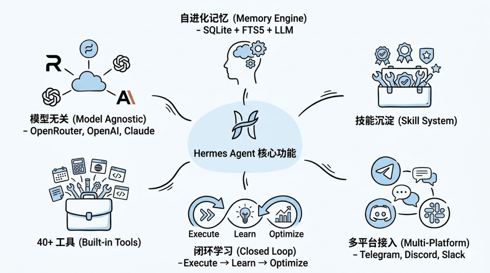
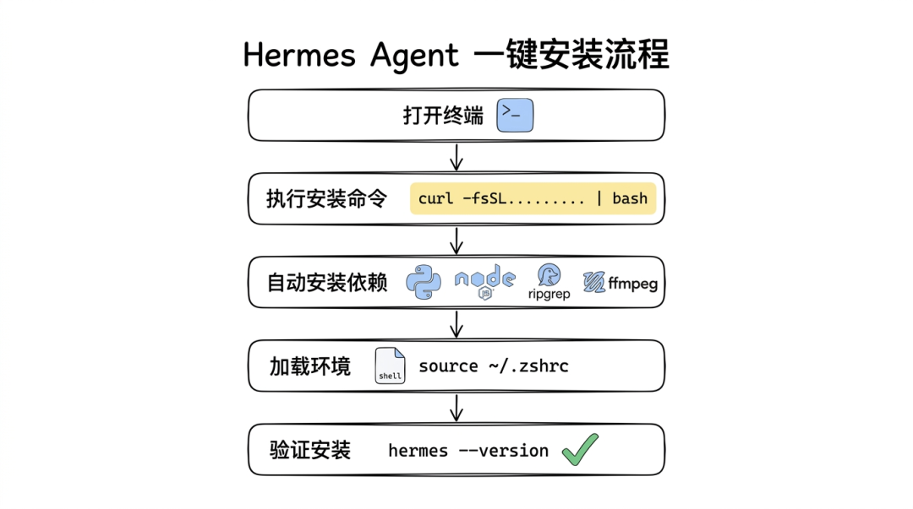
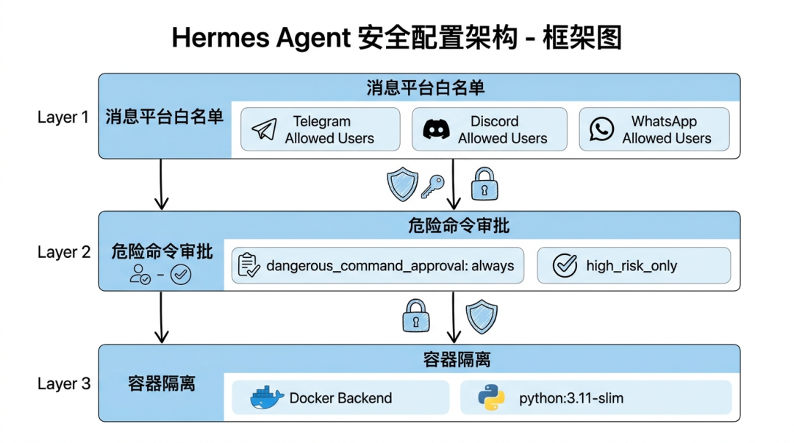

> 📎 来源: [Very Vibe Coder](https://mp.weixin.qq.com/s?__biz=Mzk4ODg1MTM4OQ==&mid=2247484072&idx=1&sn=935222605f993719378463e05f88d486&chksm=c4d2d68cc8ce61a79fabf787315815c520d4516a8cd46553ec6b4b701a04963d5557dfd4d1c4&mpshare=1&scene=1&srcid=0420stdKyvQAf4zPaLH1xpaU&sharer_shareinfo=5e080a6d3d65243f097535d736c63f4f&sharer_shareinfo_first=5e080a6d3d65243f097535d736c63f4f) | 时间: 2026-04-20 19:14

---


**Hermes Agent 官方 Logo**

## 前言

如果你关注开源 AI Agent 领域，最近一定被一个项目刷屏了——**Hermes Agent**。

这个由 **Nous Research**（开源大模型 Hermes 系列开发方）打造的自进化 AI Agent，在 GitHub 上已斩获 **52,800+ Stars**，成为史上增长最快的开源 Agent 项目之一。

它的核心特点是：**越用越懂你、越用越强大**——内置闭环学习系统，能从执行经验中沉淀技能、在使用过程中自主优化能力、跨会话永久记住你的偏好。

本文，我将为你带来**完整的安装配置指南 + 避坑大全**，无论你是 macOS、Linux 还是 Windows 用户（需要 WSL2），都能找到适合自己的安装方式。

---

## 一、Hermes Agent 是什么？

### 1.1 核心定位

Hermes Agent 是一款**开源自主 AI Agent**，与传统的 ChatGPT、Claude 等对话工具不同，它是一个**持久运行的自治系统**：

- 可以部署在服务器上，**7×24 小时在线**
- 跨会话记住你的偏好、习惯、历史任务
- 完成任务后**自动沉淀可复用技能**
- 使用时间越长，能力越强

### 1.2 核心技术背景

Hermes Agent 由 **Nous Research** 开发，这家机构是开源 AI 运动的重要参与者，旗下的 Hermes 3 模型（基于 Llama-3.1 70B 微调）在函数调用和结构化输出方面表现优异。Hermes Agent 正是基于此模型构建的应用层。

### 1.3 核心功能一览

| 功能 | 说明 |
| --- | --- |
| **自进化记忆** | 三层记忆引擎（SQLite + FTS5 + LLM 摘要） |
| **技能沉淀** | 从执行经验中自动生成可复用技能 |
| **多平台接入** | Telegram、Discord、Slack、WhatsApp、飞书等 |
| **40+ 内置工具** | Web、Terminal、File、Browser、Vision 等 |
| **模型无关** | 支持 OpenRouter、OpenAI、Claude、Llama 等多种提供商 |
| **闭环学习** | 执行 → 学习 → 优化的完整循环 |



**Hermes Agent 六大核心功能**

---

## 二、系统要求

### 2.1 支持的平台

| 平台 | 支持情况 |
| --- | --- |
| **macOS** | ✅ 原生支持 |
| **Linux** | ✅ 原生支持 |
| **Windows** | ❌ 不支持原生安装 |
| **Windows + WSL2** | ✅ 推荐使用 Ubuntu 22.04 |
| **Termux** | ✅ 支持 |

> ⚠️ **重要提示**：Hermes Agent **不支持 Windows 原生环境**。Windows 用户请务必使用 **WSL2（推荐 Ubuntu 22.04）**。

### 2.2 硬件要求

| 场景 | 内存 | 显存 | 说明 |
| --- | --- | --- | --- |
| **纯应用层** （使用外部 API） | 1GB+ | 不需要 | 最低可在 1 核 1GB 的 VPS 运行 |
| **本地推理** （跑 Hermes-3-70B） | 48GB+ | 48GB+ | 需要强大 GPU，不适合 VPS |

> 💡 **新手建议**：先使用云端 API（如 OpenRouter、OpenAI）体验功能，不需要本地推理。

### 2.3 软件依赖

安装脚本会**自动处理以下依赖**：

- Python 3.11+
- Node.js v22
- ripgrep
- ffmpeg

---

## 三、安装方式一：一键安装（推荐新手）

这是最简单的方式，适合 macOS、Linux 和 WSL2 用户。

### 3.1 一键安装命令

```
curl -fsSL https://raw.githubusercontent.com/NousResearch/hermes-agent/main/scripts/install.sh | bash
```



**一键安装流程**

### 3.2 安装后加载环境

安装完成后，需要重新加载 shell 配置：

```
# 如果使用 zsh（macOS 默认）source ~/.zshrc# 如果使用 bashsource ~/.bashrc
```

### 3.3 验证安装

执行以下命令验证是否安装成功：

```
hermes --version
```

---

## 四、安装方式二：手动安装（适合进阶用户）

如果你想更好地控制安装过程，可以选择手动安装。

### 4.1 克隆仓库

```
git clone https://github.com/NousResearch/hermes-agent.gitcd hermes-agentgit clone --recurse-submodules https://github.com/NousResearch/hermes-agent.git
```

### 4.2 创建虚拟环境

```
# 安装 uv（如果你还没有）curl -LsSf https://astral.sh/uv/install.sh | sh# 创建 Python 3.11 虚拟环境uv venv .venv --python 3.11source .venv/bin/activate
```

### 4.3 安装依赖

```
# 基础安装uv pip install -e "."# 完整安装（包含所有功能）uv pip install -e ".[all]"# 或者按需安装uv pip install -e ".[cli]"          # CLI 菜单界面uv pip install -e ".[messaging]"     # 消息平台 SDKuv pip install -e ".[voice]"        # 语音合成uv pip install -e ".[image]"         # 图片生成
```

### 4.4 创建符号链接

```
sudo ln -sf "$(pwd)/.venv/bin/hermes" /usr/local/bin/hermes
```

---

## 五、Windows 用户：WSL2 安装指南

### 5.1 什么是 WSL2

WSL2（Windows Subsystem for Linux 2）是 Windows 10/11 自带的 Linux 子系统，可以在 Windows 中运行 Linux 环境。

### 5.2 安装 WSL2

以**管理员身份**打开 PowerShell，执行：

```
wsl --install -d Ubuntu-22.04
```

安装完成后，重启电脑。

### 5.3 切换到 WSL2

打开 Ubuntu 22.04 终端，然后执行与 Linux 相同的安装命令：

```
curl -fsSL https://raw.githubusercontent.com/NousResearch/hermes-agent/main/scripts/install.sh | bash
```

> ⚠️ **注意**：务必在 WSL2 终端中执行，不要在 PowerShell 或 CMD 中执行。

---

## 六、配置指南

### 6.1 运行初始设置向导

安装完成后，运行设置向导：

```
hermes setup
```

这会引导你完成：

- 选择模型提供商
- 输入 API Key
- 选择默认模型
- 配置工具集

### 6.2 配置模型提供商

Hermes Agent 支持多种模型提供商，以下是常见配置：

#### OpenRouter（推荐新手）

OpenRouter 提供 200+ 模型，包括 Claude、GPT-4、Llama 等。

```
# 设置 API Keyhermes config set OPENROUTER_API_KEY your_key_here# 或者直接编辑配置文件# ~/.hermes/.envOPENROUTER_API_KEY=sk-or-v1-your-key-here# ~/.hermes/config.yamlprovider:  name: openroutermodel:  name: anthropic/claude-sonnet-4-20250514
```

#### OpenAI

```
hermes config set OPENAI_API_KEY your_key_herehermes config set model.default gpt-4o
```

#### Nous Portal（免费体验 Hermes 模型）

```
hermes chat --provider nous
```

#### 阿里云通义千问

```
# 设置环境变量export DASHSCOPE_API_KEY=your_key_here# 使用通义千问hermes chat --provider alibaba --model qwen3.5-plus
```

### 6.3 常用配置命令

| 命令 | 说明 |
| --- | --- |
| ``` hermes config set model.default  ``` | 设置默认模型 |
| ``` hermes config set display.personality helpful ``` | 设置人格（helpful/creative/teacher） |
| ``` hermes config set agent.max_turns 100 ``` | 设置最大对话轮数 |
| ``` hermes model ``` | 交互式选择模型和提供商 |
| ``` hermes config show ``` | 显示当前配置 |

### 6.4 配置文件结构

所有配置存储在 

```
~/.hermes/
```

 目录：

```
~/.hermes/├── config.yaml     # 设置（模型、终端、TTS、压缩等）├── .env            # API Keys 和密钥├── auth.json       # OAuth 凭据（Nous Portal 等）├── SOUL.md         # 全局人格定义（可选）├── memories/       # 持久记忆├── skills/         # 沉淀的技能├── cron/           # 定时任务├── sessions/       # 对话会话└── logs/           # 日志文件
```

### 6.5 配置工具集

Hermes Agent 内置 40+ 工具，建议新手先开启核心工具集：

```
hermes tools --set all    # 开启所有工具# 或者按需开启hermes tools --set web,terminal,file,memory,skills,cron
```

**常用工具集：**

| 工具集 | 功能 |
| --- | --- |
| ``` web ``` | 网页搜索和信息获取 |
| ``` terminal ``` | 终端命令执行 |
| ``` file ``` | 文件读写和编辑 |
| ``` browser ``` | 浏览器自动化 |
| ``` vision ``` | 图片识别 |
| ``` image_gen ``` | 图片生成 |
| ``` skills ``` | 技能管理 |
| ``` memory ``` | 记忆管理 |
| ``` cron ``` | 定时任务 |
| ``` code_execution ``` | 代码执行 |
| ``` delegation ``` | 子任务分发 |

---

## 七、启动与使用

### 7.1 启动交互式会话

```
hermes
```

### 7.2 单次查询模式

不想进入交互式界面？使用单次查询：

```
hermes chat -q "请给我解释一下什么是 REST API"
```

### 7.3 常用命令

| 命令 | 说明 |
| --- | --- |
| ``` /new ```   或   ``` /reset ``` | 开始新对话 |
| ``` /continue ``` | 继续上次对话 |
| ``` /skills ``` | 查看和管理技能 |
| ``` /memory ``` | 管理记忆 |
| ``` Ctrl+C ``` | 中断当前任务 |
| ``` Ctrl+Z ``` | 暂停 Agent |

---

## 八、避坑大全 ⚠️

根据大量用户反馈和官方 FAQ，我总结了以下常见问题和解决方案：


**8 个常见避坑点**

### 坑一：安装后找不到  ``` hermes ```  命令

**原因**：shell 配置没有重新加载。

**解决方案**：

```
# 方法1：重新加载配置文件source ~/.zshrc    # zsh 用户source ~/.bashrc   # bash 用户# 方法2：检查 hermes 是否安装which hermes# 方法3：如果是手动安装，创建符号链接sudo ln -sf "$(pwd)/.venv/bin/hermes" /usr/local/bin/hermes
```

---

### 坑二：模型选择报 401/403 错误

**原因**：API Key 配置错误或模型提供商不支持。

**解决方案**：

```
# 1. 检查 API Key 是否正确hermes config show | grep API_KEY# 2. 运行诊断命令hermes doctor# 3. 重新配置模型hermes model# 4. 如果是 OpenRouter，确保使用正确的 KEY 格式# 格式应为：sk-or-v1-xxxxx
```

---

### 坑三：安装时报 Python/Cython 错误

**原因**：部分依赖需要编译工具。

**解决方案（Ubuntu/Debian）**：

```
# 安装编译工具sudo apt updatesudo apt install -y python3-dev build-essential# 清理后重试pip install --no-cache-dir -e ".[all]"
```

---

### 坑四：工具执行报权限错误

**原因**：终端后端配置问题或权限不足。

**解决方案**：

```
# 检查终端配置cat ~/.hermes/config.yaml# 如果使用 Docker 后端terminal:  backend: docker  docker_image: python:3.11-slim# 如果需要 sudo 权限sudo usermod -aG docker $USERnewgrp docker
```

---

### 坑五：消息平台（TG/Discord）收不到消息

**原因**：网关服务未启动或配置错误。

**解决方案**：

```
# 1. 启动网关hermes gateway start# 2. 检查网关状态hermes gateway status# 3. 查看网关日志tail -f ~/.hermes/logs/gateway.log# 4. 检查白名单配置# 确保在 ~/.hermes/.env 中配置了正确的用户 IDTELEGRAM_ALLOWED_USERS=your_user_id
```

---

### 坑六：上下文窗口不足

**原因**：模型上下文限制或 Ollama 配置不匹配。

**解决方案**：

```
# 1. 使用上下文更大的模型hermes model# 选择上下文更大的模型# 2. 如果使用 Ollama，确保 num_ctx 配置匹配# 在 Ollama 运行命令中：ollama run --num_ctx 16384 your_model# 3. 开启上下文压缩# 在 config.yaml 中：compression:  enabled: true  threshold: 0.50
```

---

### 坑七：技能不触发或不被复用

**原因**：技能系统尚未学习到触发条件。

**解决方案**：

```
# 1. 查看当前技能/hermes skills list# 2. 手动触发技能学习# 在对话中明确要求 Agent 沉淀技能：# "请把刚才的操作沉淀为一个技能，命名为 xxx"# 3. 检查技能目录ls ~/.hermes/skills/
```

---

### 坑八：从 OpenClaw 迁移后配置丢失

**原因**：迁移工具未正确执行。

**解决方案**：

```
# Hermes Agent 原生支持从 OpenClaw 迁移# 只需在新环境运行hermes setup# 迁移程序会自动检测并导入旧配置
```

---

## 九、安全配置（生产环境必看）

Hermes Agent 拥有终端命令执行、文件操作等**高危权限**，务必做好安全配置：

### 9.1 消息平台白名单

```
# ~/.hermes/.envTELEGRAM_ALLOWED_USERS=your_user_id_1,your_user_id_2DISCORD_ALLOWED_USERS=your_user_id_1,your_user_id_2
```

> ⚠️ **严禁**设置 

> ```
> GATEWAY_ALLOW_ALL_USERS=true
> ```

> ，否则任何人可以访问你的 Agent！

### 9.2 危险命令审批

```
# ~/.hermes/config.yamlsecurity:  dangerous_command_approval: always  # 始终审批危险命令  # 或  dangerous_command_approval: high_risk_only  # 仅高风险命令审批
```

### 9.3 容器隔离

```
# ~/.hermes/config.yamlterminal:  backend: docker  docker_image: python:3.11-slim
```



**三层安全防护架构**

---

## 十、总结

Hermes Agent 是目前**最值得尝试的开源 AI Agent 项目**之一，其核心优势在于：

| 优势 | 说明 |
| --- | --- |
| **一行安装** | 2 分钟内完成安装 |
| **模型无关** | 支持任意 LLM 提供商 |
| **自我进化** | 越用越强大 |
| **跨平台** | 支持 6+ 消息平台 |
| **开源免费** | MIT 协议，完全免费 |

### 快速安装命令回顾

```
# 一键安装curl -fsSL https://raw.githubusercontent.com/NousResearch/hermes-agent/main/scripts/install.sh | bash# 加载环境source ~/.zshrc# 开始配置hermes setup# 启动使用hermes
```

---

**如果这篇文章对你有帮助，欢迎 + 收藏 + 转发！**

有问题欢迎在评论区留言，我会尽力解答。

> **标签**：#AI工具 #HermesAgent #NousResearch #自进化AI #开源Agent #AI助手
