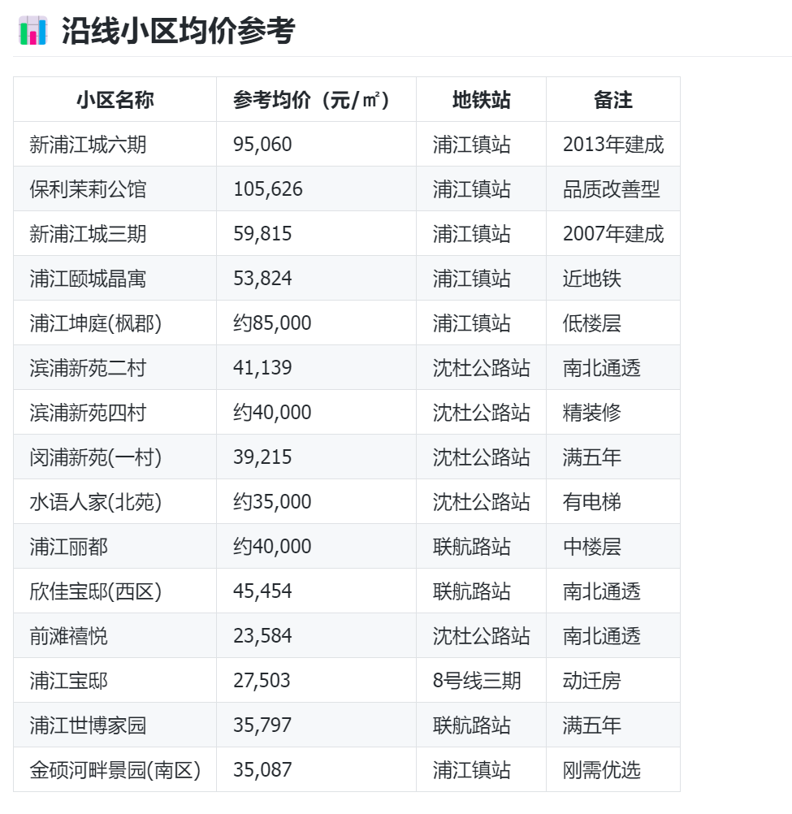
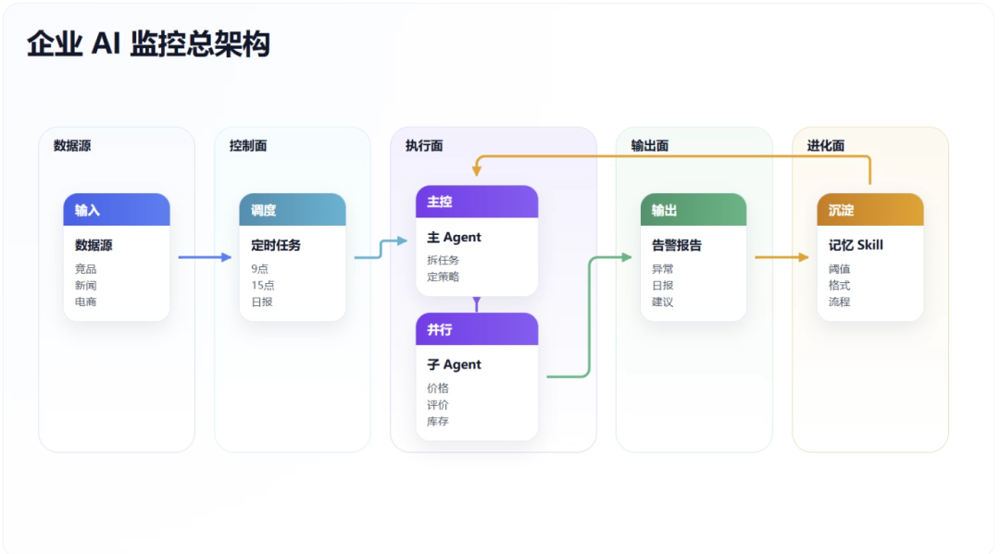
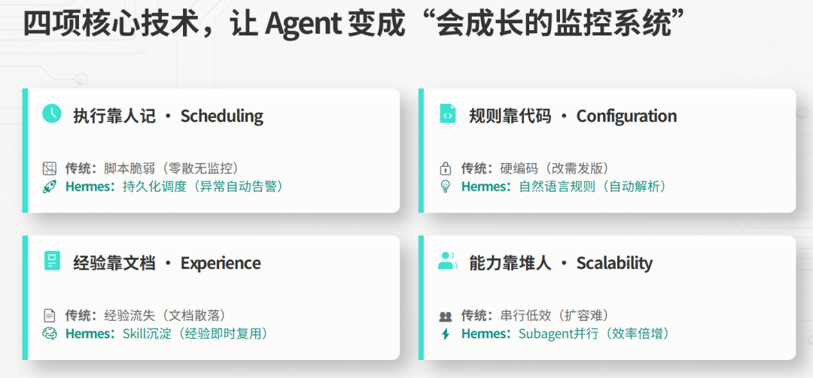
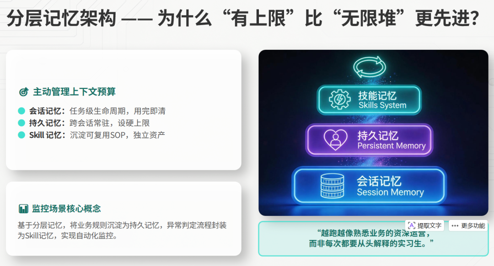
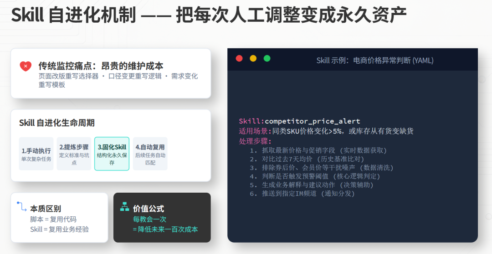
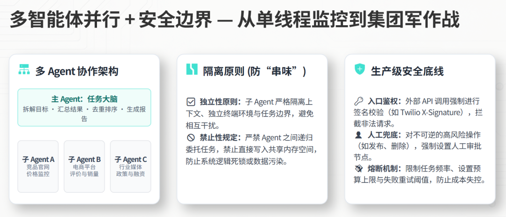
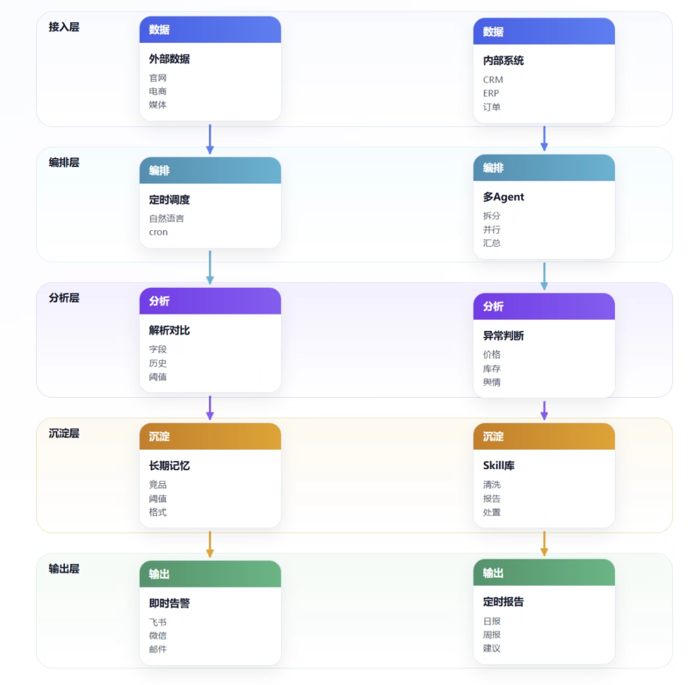

> 📎 来源: [技术传感器](https://mp.weixin.qq.com/s?__biz=Mzg4MDU1MTg0Ng==&mid=2247484358&idx=1&sn=d4828f73a5e8ab1c30dc19047142bca6&chksm=ce4d548fb5cc6f7aca69ddb651553bacc53ab20766d658c9ef2702cfe41845a98bd26a447b97&mpshare=1&scene=1&srcid=0430mtYMCeXDxBdsdGmWm1xN&sharer_shareinfo=8004dd6b9990c6621963851be04d97cf&sharer_shareinfo_first=8004dd6b9990c6621963851be04d97cf) | 时间: 2026-04-30 18:24

---

周五晚上 9 点，竞品悄悄改了价格。

不是全站大促，也没有发公告。

它只是在几个核心 SKU 上做了 8% 的降价，同时把详情页里的交付周期从“7 天”改成了“48 小时”。

你的团队周一早会才发现。

这时销售已经丢了两单，运营还在翻记录，市场同事说：“我上周五好像刷到过，但没来得及整理。”

更让人难受的是：对方可能不是靠人发现机会的。

它的 AI 监控系统可能在价格变化后的 5 分钟内，就已经完成了抓取、对比、判断和通知。

你还在等周报。

对方已经在实时行动。

这就是企业数据监控最残酷的地方：**信息差不是没有，而是你发现得太晚。**

过去，很多公司做监控靠三种办法：

- 运营每天手工整理 20 多个指标；
- 技术写几段爬虫脚本，网站一改版就失效；
- 盯几个固定字段，漏掉大量真正有价值的变化。

问题不在于公司不重视数据。

问题在于传统监控方式太慢、太脆、太依赖人。

真正适合企业的方案，不应该是一堆临时脚本，而应该是一套 7×24 小时值守的 AI 员工：

它能定时采集。

能自动分析。

能发现异常。

能推送报告。

更关键的是，**它能把每一次处理经验沉淀下来，下次越干越熟。**

这篇文章就聊一件事：如何用 Hermes Agent 搭一套企业实时数据监控系统。

目标很明确：

从竞品情报自动采集，到价格波动预警，再到定时报告推送，让企业拥有一套会进化的数据监控中枢。比如：

```
抓取闵行区浦江镇地铁站到沈杜公路地铁站沿线的房价信息给我，要求输出小区名称、楼层、房型、单价、总价、均价等信息，要按今天的日期抓取。以列表的信息呈现给我。
```

我就是验证了一下，他就可以快速给我输出结果，如果我做成定时任务，那么每天早上就可以得到如下的数据。



## 一、Hermes 凭什么适合做企业监控？

很多人一听“数据监控”，第一反应还是爬虫。

但企业真正需要的不是“会爬网页”的工具，而是一个能持续执行任务、记住规则、复用经验、拆分工作的 Agent 系统。

Hermes Agent 的优势，主要在四个地方。



---

## 1. 定时调度：到点就干，不靠人想起来

企业监控最怕一件事：靠人记。

今天运营忙，少看一次。

明天技术请假，脚本没人维护。

月底做复盘，才发现一堆关键变化早就发生了。

Hermes 的定时任务能力，适合把这种“每天必须做，但人做很浪费”的事情交出去。

你可以直接用自然语言描述任务：

```
每天早上 9 点和下午 3 点，抓取这 20 个竞品页面的价格、库存和促销信息。如果任一商品价格波动超过 5%，立即推送到飞书群。每天 18 点生成一份监控日报。
```

也可以用标准 cron 表达式：

```
0 9,15 * * * run price_monitor0 18 * * * run daily_report
```

区别在于，传统 crontab 只会“按时跑脚本”。

Hermes 做的是“按时执行一项完整任务”。

它可以在隔离会话里运行任务，保存任务配置，即使服务重启，也不会把监控任务弄丢。

对业务人员来说，这意味着一件事：

**你不需要懂 crontab，也不需要每天催技术。你只要说清楚想监控什么、多久看一次、什么情况报警。**



---

## 2. 持久记忆：监控策略越跑越准

很多监控系统的问题，不是第一次搭不起来，而是越用越乱。

今天新增一个竞品。

明天调一次阈值。

后天日报格式改一版。

一个月后，没人知道当前规则到底是谁定的、为什么这么定。

Hermes 的价值在于，它不是只看当前这一轮对话。

它有三类记忆：

- **会话记忆**

  ：记录当前任务上下文；
- **持久记忆**

  ：跨会话保存用户偏好、业务规则、重点对象；
- **Skill 记忆**

  ：把“怎么做”沉淀成可复用流程。

放到企业监控里，就很实用。

它会记住你重点关注哪些竞品。

记住价格波动超过多少才算异常。

记住日报要发给谁。

记住老板不想看原始数据，只想看结论、风险和建议动作。

这和普通脚本最大的区别是：

脚本只执行代码。

Agent 会保留上下文和处理习惯。

越跑，越接近一个熟悉业务的运营同事。



---

## 3. Skill 自进化：把每次人工调整变成永久资产

传统监控系统里，最贵的不是服务器成本。

最贵的是“重复维护”。

页面结构变了，重写选择器。

字段口径变了，重写清洗逻辑。

报告格式变了，重写模板。

每次都像从头再来。

Hermes 的 Skill 机制，可以把复杂任务的执行经验沉淀下来。

比如它第一次处理价格异常时，可能经历了这些步骤：

1. 识别价格字段；
2. 对比历史价格；
3. 排除满减、券后价、会员价等干扰项；
4. 判断是否达到报警阈值；
5. 生成一条飞书预警；
6. 记录本次处理方式。

当这套流程稳定后，就可以沉淀为一个 Skill。

下次遇到类似异常，不需要重新解释。

Agent 直接复用。

这就是企业级监控系统真正暴利的地方：

**你每教会它一次，都是在降低未来一百次的人工成本。**

传统方式是“每次监控都要写代码”。

Hermes 的方式是“一次教会，长期复用”。



---

## 4. 多智能体并行：一个人慢，三个 Agent 一起干

企业监控通常不是单点任务。

你可能同时要看：

- 竞品价格；
- 商品库存；
- 用户评价；
- 行业新闻；
- 政策变化；
- 社媒舆情；
- 招聘岗位变化。

如果让一个 Agent 从头跑到尾，速度会慢。

Hermes 可以通过多智能体并行，把任务拆开。

主 Agent 负责拆解目标和汇总结果。

子 Agent 分别处理不同数据源。

例如：

```
主 Agent：今天需要生成竞品监控日报。子 Agent A：抓取 10 个竞品官网价格。子 Agent B：抓取电商平台评价和销量变化。子 Agent C：抓取行业媒体、政策和融资新闻。主 Agent：汇总异常、去重、排序，生成报告并推送。
```

这不是为了显得高级。

这是企业生产力问题。

单线程监控像一个实习生慢慢查。

多 Agent 并行更像一个小组同时开工。



---

## 二、从 0 到 1 搭一套企业数据监控系统

不要把这件事想复杂。

第一套系统不用一开始就接 ERP、CRM，也不用上来就做大屏。

先做一件小而硬的事：

**选一个真实数据源，固定频率抓取，出现变化就通知。**

跑通后，再扩展。



---

## 1. 环境准备：先让系统跑起来

企业部署通常有两条路。

第一种，云厂商镜像一键部署。

适合想快速验证的人。

比如把 Hermes 部署在阿里云、腾讯云等服务器上，配置好访问密钥、消息渠道和任务目录，先跑起来。

第二种，Docker 本地私有化部署。

适合金融、政务、制造业、ToB 企业。

核心诉求是：数据不出内网，访问权限可控，日志可审计。

最小配置只需要三类东西：

```
monitor:  name: competitor_price_monitor  sources:    - https://example.com/product/a    - https://example.com/product/b  schedule: "每天 9:00 和 15:00"  alert:    channel: feishu    threshold: "价格波动超过 5%"  report:    time: "每天 18:00"    format: "结论 + 异常 + 建议动作"
```

这段配置不是重点。

重点是它背后的工作方式：

业务人员用自然语言说需求。

Agent 生成采集和分析流程。

任务定时执行。

结果自动推送。

异常处理经验再沉淀成 Skill。

---

## 2. 场景一：竞品价格监控

这是最容易落地、也最容易看到收益的场景。

可以这样给 Hermes 下指令：

```
帮我监控以下竞品商品页面。每天早上 9 点和下午 3 点抓取一次。字段包括：商品名称、当前价格、促销信息、库存状态、发货周期。如果价格相比上一次变化超过 5%，或者库存状态从“有货”变成“缺货”，立即推送到飞书群。每天 18 点生成一份日报，按风险等级排序。
```

数据流大概是：

```
采集 → 解析 → 存储 → 对比 → 预警 → 推送
```

如果要补一段核心判断代码，真正关键的是“变化识别”，而不是网页抓取本身。

示例：

```
def check_price_alert(old_price, new_price, threshold=0.05):    if old_price <= 0:        return False, 0    change_rate = (new_price - old_price) / old_price    should_alert = abs(change_rate) >= threshold    return should_alert, round(change_rate * 100, 2)old_price = 1999new_price = 1799alert, rate = check_price_alert(old_price, new_price)if alert:    message = f"竞品价格异常：从 {old_price} 变为 {new_price}，波动 {rate}%"    # send_to_feishu(message)    print(message)
```

这段代码很简单。

但企业系统真正有价值的部分在于：

- 哪些价格算有效价格；
- 券后价是否纳入；
- 会员价要不要排除；
- 活动价持续多久才算趋势；
- 哪些 SKU 需要高优先级报警。

这些规则，才是企业监控的资产。

Hermes 要做的不是替你写一个 if。

而是把这些规则持续记住，并且在后续任务中自动复用。

---

## 3. 场景二：行业新闻聚合

第二个高价值场景，是行业新闻和竞品动态。

很多公司每天都有人看新闻，但看完之后没有沉淀。

信息在群里刷过去，第二天就没人记得。

你可以让 Hermes 每天抓取：

- 竞品官网新闻；
- 行业媒体；
- 政策网站；
- 融资数据库；
- 社交媒体热点；
- 技术博客和开源项目动态。

指令可以这样写：

```
每天早上 8 点抓取 AI 数据基础设施、竞品动态、政策监管三个方向的新闻。要求自动去重、摘要、归类。每条新闻给出一句话影响判断。只保留对销售、产品、运营有潜在影响的信息。
```

最终日报不应该长这样：

```
今天共抓取 126 条新闻，详情如下……
```

没人想看。

应该长这样：

```
今日重点：1. 竞品 A 新增企业版价格页，疑似开始主攻大客户。2. 某地政策新增数据跨境限制，可能影响出海客户交付。3. 开源项目 B 更新采集模块，可能降低行业技术门槛。建议动作：- 销售团队关注竞品 A 企业客户报价变化；- 产品团队评估数据合规功能是否需要提前排期；- 市场团队准备一篇“私有化数据监控”的内容。
```

这才是 AI Agent 应该交付的结果：

不是信息堆叠。

而是筛选、解释和行动建议。

---

## 4. 场景三：电商运营数据自动化监控

电商团队尤其适合用这种系统。

因为他们每天都在重复看数据：

- 商品价格；
- 销量变化；
- 评价数量；
- 差评关键词；
- 库存状态；
- 平台活动；
- 竞品上新。

如果这些都靠人手工做，运营每天最好的时间都消耗在复制、粘贴、截图、整理表格上。

Hermes 可以把它变成固定流程：

```
每天 10 点抓取核心商品监控表。每天 16 点补抓一次异常 SKU。晚上 20 点生成运营日报。如果差评关键词中出现“发货慢”“质量差”“涨价”，立即单独提醒。
```

日报可以按业务可读的方式输出：

```
今日异常 SKU：3 个价格波动：2 个差评风险：1 个库存风险：0 个最需要处理：商品 A原因：竞品降价 6.8%，同时评价增长明显。建议：检查自身投放 ROI，必要时调整券包。
```

运营不再需要每天问：“数据整理好了没？”

系统会在约定时间主动把结论送到飞书、微信或企业微信群。

---

## 三、让 Agent 越看越懂行业

一套监控系统，如果只会抓数据，价值有限。

企业真正需要的是“越看越懂”。

第一次，它只是抓到竞品降价。

第十次，它应该知道这个竞品通常在周五晚降价。

第三十次，它应该能判断：这次不是常规促销，而是针对某个渠道的清库存动作。

这就需要把历史数据和处理经验沉淀下来。

Hermes 可以把历史监控数据、关键判断、异常处理逻辑，逐步变成企业自己的竞品情报知识库。

每次报告生成后，系统可以追问三个问题：

```
这次异常是否真实？这次处理是否有效？这套判断规则下次能否复用？
```

如果答案是肯定的，就把流程固化成 Skill。

比如：

```
Skill：电商竞品价格异常判断适用场景：- 同类 SKU 价格变化超过 5%- 库存从有货变缺货- 促销信息出现限时、秒杀、补贴等关键词处理步骤：1. 抓取最新价格和促销字段2. 对比过去 7 天均价3. 排除券后价噪声4. 判断是否触发预警5. 生成业务解释和建议动作6. 推送到指定群
```

这套机制比普通爬虫脚本强的地方在于：

脚本只能复用代码。

Skill 复用的是业务经验。

---

## 四、为什么你需要的是会进化的监控系统，而不是一堆脚本？

爬虫脚本解决的是“能不能抓”。

企业监控解决的是“抓完之后能不能形成决策”。

这两件事不是一个层级。

传统脚本有几个天然问题：

- 网站结构一变，选择器失效；
- 新增数据源，要重新开发；
- 异常判断靠硬编码；
- 业务规则散落在代码和文档里；
- 报告格式一改，又要找技术排期。

而 Agent 化监控系统的核心变化是：

- 采集方式可以调整；
- 判断规则可以记忆；
- 工作流程可以沉淀；
- 多个任务可以并行；
- 结果可以直接送到业务现场。

行业趋势也在往这个方向走。

公开研究里，Gartner 曾预测，到 2028 年，约三分之一企业软件应用将包含 Agentic AI，部分日常工作决策会由 AI 自主完成。

网页数据采集市场也在从“写爬虫”转向“AI 数据管道”：AI 自动识别页面结构、发现隐藏接口、处理反爬和异常字段，再把数据送进企业工作流。

这些趋势背后，其实是同一个判断：

**企业不缺数据。企业缺的是更早发现变化、更快形成动作的能力。**

谁先把监控自动化，谁就先拿到信息差。

---

## 五、从监控走向自动化运营

如果只把 Hermes 用来发报警，那还只是第一层。

更大的价值，是从“被动监控”走向“主动运营”。

---

## 1. 多源数据融合

竞品价格只是外部数据。

企业内部还有 CRM、ERP、库存系统、订单系统、广告投放系统。

真正成熟的监控系统，应该能把这些数据连起来。

比如：

```
竞品降价 → 我方转化率下降 → 某区域库存积压 → 自动提醒销售调整策略
```

再比如：

```
行业政策变化 → 影响目标客户预算 → 自动生成销售话术和客户名单
```

这时 Hermes 就不只是监控工具。

它开始变成企业运营中枢。

---

## 2. 从提醒到建议，再到半自动执行

早期系统只告诉你：

```
竞品降价了。
```

更进一步，它应该告诉你：

```
竞品 A 的核心 SKU 降价 6.8%。过去三次类似降价后，我方转化率平均下降 12%。建议对 SKU B 增加限时券包，持续 48 小时观察。
```

再往后，它可以进入半自动执行：

```
检测到竞品降价。是否自动创建价格调整建议单？是否同步给销售负责人？是否生成一版客户沟通话术？
```

注意，这里不建议一上来就让 Agent 自动改价格、自动下单、自动发客户消息。

企业系统要有边界。

AI 可以辅助决策。

是否替代人做决策，要看权限、风险和合规要求。

---

## 3. 安全与合规：越自动，越要有刹车

企业级监控不能只谈效率。

还必须谈边界。

几个底线要提前定好：

- 尊重 robots.txt 和目标网站服务条款；
- 不采集个人敏感信息；
- 对高频访问设置限速；
- 私有化部署敏感数据；
- 给 Agent 设置最小权限；
- 所有告警和自动动作保留日志；
- 设置成本熔断，防止异常调用产生巨额费用。

尤其是最后一点，很多团队会忽视。

Agent 很勤奋。

如果没有熔断，它可能真的会一直跑。

所以企业部署时，一定要配置任务频率、预算上限、失败重试次数和人工确认节点。

自动化不是放任系统乱跑。

自动化是把规则写清楚，再让系统稳定执行。

---

## 六、你的第一套 AI 监控系统，30 分钟就能开始

不要等系统规划得特别完美再做。

最好的开始方式，是选一个你现在就关心的数据源。

可以是：

- 一个竞品官网；
- 一个价格页面；
- 一个行业媒体；
- 一个政策网站；
- 一个电商商品页；
- 一个社交媒体话题。

然后直接告诉 Hermes：

```
帮我每天监控这个页面。关注价格、库存、促销和页面文案变化。每天 18 点生成一份简短报告。如果出现明显变化，立即推送到飞书。
```

几个小时后，你就能收到第一份 AI 监控报告。

它可能一开始不完美。

字段可能需要调。

阈值可能要改。

报告格式也可能还不顺手。

但这没关系。

因为 Hermes 的优势不是第一次就完美，而是每次调整都会变成下一次的经验。

当你的竞争对手还在人工 Ctrl+C / Ctrl+V 整理报表时，你已经有了一套 7×24 小时运行、自动预警、持续进化的情报系统。

市场上所有人都在抢信息。

区别在于，有的人一周后才看到。

有的人当天看到。

而你可以做到：变化发生后，系统第一时间告诉你。

这就是 AI Agent 带给普通企业的信息差红利。

如果你现在只能做一个自动化项目，优先做数据监控。

因为它离钱最近。

离风险也最近。

而且一旦跑起来，每一天都在替你省人力、抢时间、积累行业判断。

评论区可以留一个你最想监控的数据源。

竞品价格、行业新闻、电商评价、政策变化都行。

---
