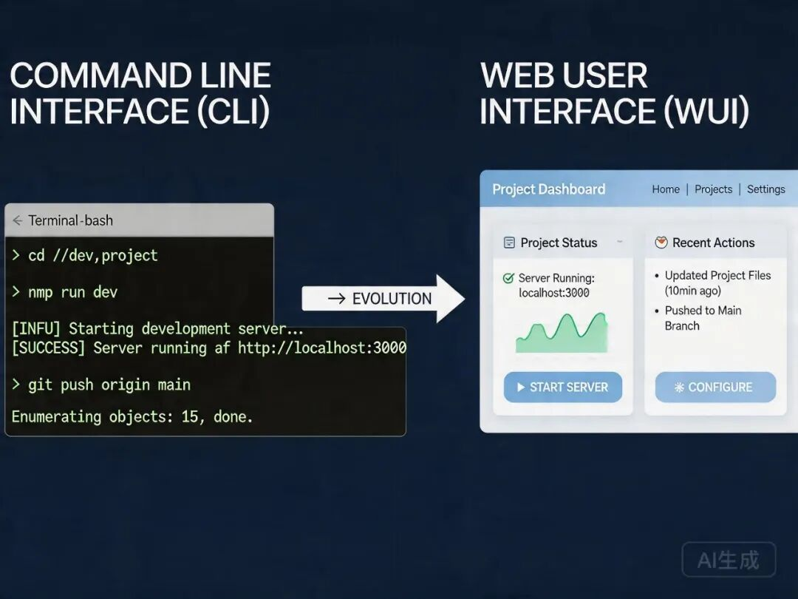
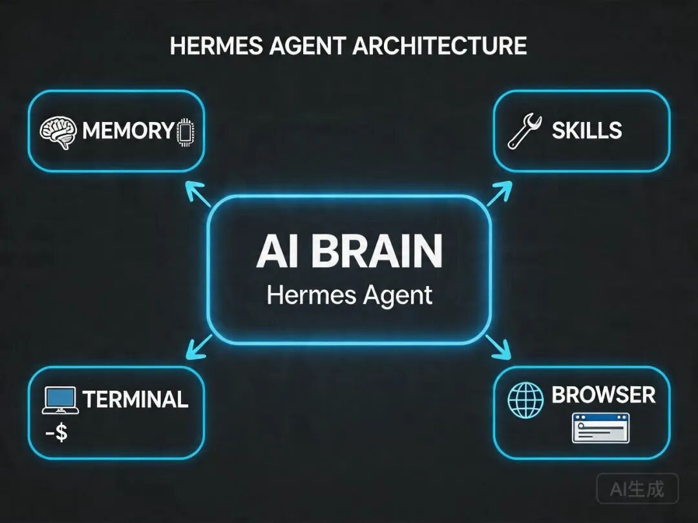

> 📎 来源: [万里数字笔记](https://mp.weixin.qq.com/s?__biz=MzYzOTY3NjUyNw==&mid=2247484765&idx=1&sn=c2b9aa14fcfbdb214a26fd38877c2de3&chksm=f15243108997a7b00116898359e65c799cae07bf98356846cfb73af7ae75d2067ae1f65a8581&mpshare=1&scene=1&srcid=0422i6JIpXokgxOTBrWLkJrm&sharer_shareinfo=c6face7c7edcb90ae091660f78df2088&sharer_shareinfo_first=c6face7c7edcb90ae091660f78df2088) | 时间: 2026-04-22 03:59

---


很多人入坑 Hermes Agent，是因为它够硬核。

但用久了就会发现一个让人抓狂的痛点：**它连个能直接聊天的网页都没有。**

平时在服务器上跑跑脚本、回回微信消息还行。但一旦你想在电脑前跟它深度探讨一个问题，或者想复制粘贴一大段代码、看它调用的工具详情，盯着那个黑框框终端，体验真的太差了。

原生 CLI 就像一台没装显示器的顶级服务器，性能拉满，但操作反人类。

---

最近我在 GitHub 上摸鱼，意外发现社区已经冒出了好几个 Hermes WebUI 项目。

加起来 Star 数都破 5000 了，而且个个都能打。

这些项目完美填补了官方的空白：不用改一行官方代码，只要装个外挂，就能获得 1:1 还原甚至超越 CLI 的网页聊天体验。

今天就把这三个目前最火的项目拉出来遛遛，顺便教你怎么一键装上。

## 为什么你急需一个 WebUI

Hermes 的核心优势在于记忆和工具调用，但这些东西在终端里的表现真的很抽象。

在终端里，Hermes 调用了搜索、终端命令，输出往往是一大坨文本。在 WebUI 里，这些都变成了可折叠的卡片，它干了什么一目了然。

终端一次只能聊一个会话。WebUI 支持左侧栏多会话切换，你这边让它写代码，那边让它搜资料，互不干扰。

不用开 SSH，不用等微信转发。手机浏览器打开就能聊，配合 Tailscale 组网，体验跟原生 App 没区别。



## 社区三强横评

我全网搜了一圈，挑出了三个目前活跃度最高、功能最完整的项目。

### 极简王者：nesquena/hermes-webui

这是目前 Star 数最多的项目。作者显然是个极简主义者。它没有复杂的构建步骤，没有前端框架，就是最原始的 Python 加上原生 JS。

- **安装难度**：极低，git clone 后 pip install 就能跑。
- **界面特色**：经典的三栏布局。左边是会话列表，中间是聊天框，右边是工作区文件浏览。
- **杀手锏**：它不需要额外配置。只要你的服务器上装好了 Hermes，它会自动读取

  ```
  ~/.hermes/
  ```

   下的配置，直接就能用。

### 全能工作台：outsourc-e/hermes-workspace

如果你不仅想聊天，还想在网页上直接看 Hermes 的内存状态、跑终端命令、管理定时任务，选这个。

- **安装难度**：中等，需要装 pnpm，依赖略多。
- **界面特色**：它有一个控制塔概念。不仅能聊天，还有一个完整的 Dashboard 显示资源占用、Token 消耗。
- **杀手锏**：自带终端模拟器。你甚至可以在网页上直接给 Hermes 发终端指令，看到实时输出。

### 配置神器：EKKOLearnAI/hermes-web-ui

这个项目虽然 Star 略少，但它的功能切中了很多人的痛点：多平台配置面板。

- **安装难度**：低，npm install -g 即可。
- **界面特色**：非常现代化的 Dashboard，有详细的成本统计图表。
- **杀手锏**：它提供了一个网页表单，让你直接在浏览器里配置 Telegram、飞书、微信的 Token。填完自动写入配置文件，这比对着文档改文件舒服太多了。



## 实操演示

为了让大家少踩坑，我推荐绝大多数人直接用第一个：nesquena 版。

### 第一步：克隆与安装

在你的服务器终端里，执行两行命令：

```
git clone https://github.com/nesquena/hermes-webui.gitcd hermes-webuipip install -r requirements.txt
```

这就完事了。

### 第二步：启动

```
python main.py
```

你会看到终端提示：Running on http://localhost:8080。

### 第三步：远程访问

这里有个坑。很多人装完发现公网访问不了，或者担心安全问题。

官方推荐的正确姿势是用 SSH 隧道。在你的本地电脑终端运行：

```
ssh -L 8080:localhost:8080 root@你的服务器 IP
```

然后你在本地浏览器打开

```
http://localhost:8080
```

。

为什么这么做？绝对安全，不需要在服务器上开放 8080 端口。无需配置，不用搞 Nginx 反向代理。

## 写在最后

Hermes 的原生设计是无头的，它默认你通过 API 或者网关跟它交互。

但咱们人类，有时候就是需要一个有头的界面，看着那个光标在屏幕上跳动，心里才踏实。

这三个开源项目，就像是给 Hermes 这位幕后极客，穿上了三套不同风格的西装。

想要极简选 nesquena，想要全能选 workspace，想要配微信方便选 EKKOLearnAI。

别犹豫了，挑一个装上。相信我，用过 WebUI 之后，你再也回不去那个黑框框终端了。
