> 📎 来源: [AI已经来啦](https://mp.weixin.qq.com/s?__biz=MzU2MDQ4OTk0Nw==&mid=2247484843&idx=1&sn=cf29e4800fc51e7a171376f5d2969d6b&chksm=fd2d5fe966fc6dcb624a85901233f2d9e30cbe0b518a920f18e8c6edb13a6a15975e8987b041&mpshare=1&scene=1&srcid=0524QmpMGiLcOxXZEsBm2h1E&sharer_shareinfo=e792624ebcf48893d0c6a21078b06f02&sharer_shareinfo_first=e792624ebcf48893d0c6a21078b06f02) | 时间: 2026-05-24 13:58

---

## 如何为每个团队成员配备专属 AI 助手

> **前言：为什么团队需要一个"AI总动员"方案**

> 在日常工作中，你是不是也遇到过这些困惑？

> 产品经理写 PRD 时，AI 总是给出太技术化的建议，看不懂业务语境；前端工程师想让 AI 帮忙设计配色方案，结果 AI 给了个"标准数据库表结构"；安全工程师只是想问一个权限配置问题，AI 却开始讲解微服务架构……

> 问题的根源很简单：**一个通用的 AI 助手，无法真正理解每个专业角色的语境和需求。**

> **Hermes 的答案是：为每个团队角色，配备一个专属的 AI 代理。** 产品经理有产品经理的代理，设计师有设计师的代理，开发者有开发者的代理——它们各自拥有独立的技能配置、独立的记忆体系，以及一个统一的"调度中心"来确保正确的代理响应正确的问题。

---

## 整体方案

本文将手把手教你搭建一套完整的团队级 AI 代理系统。整个方案的核心理念是：**专业化分工 + 统一调度。**

我们将覆盖以下核心模块：12 个专业角色的代理配置、Gateway 智能路由系统、三层知识库体系、批量部署脚本，以及成本估算与方案选型。


*图 1：团队 Hermes 多代理系统部署指南（简化版）*

---

## 目录

本文按照以下结构展开：

**第一章：方案概览** —— 介绍为什么需要团队代理，以及 Hermes 的整体架构。

**第二章：角色详细配置** —— 深入讲解 12 个专业代理的技能配置和典型工作流。

**第三章：Gateway 路由系统** —— 这是整个系统的"大脑"，负责把用户的问题精准路由到对的代理。

**第四章：知识库体系** —— 共享知识库、角色知识库、外部知识源三层架构的设计思路。

**第五章：部署与成本** —— 批量部署脚本的使用方法，以及不同规模的成本估算。

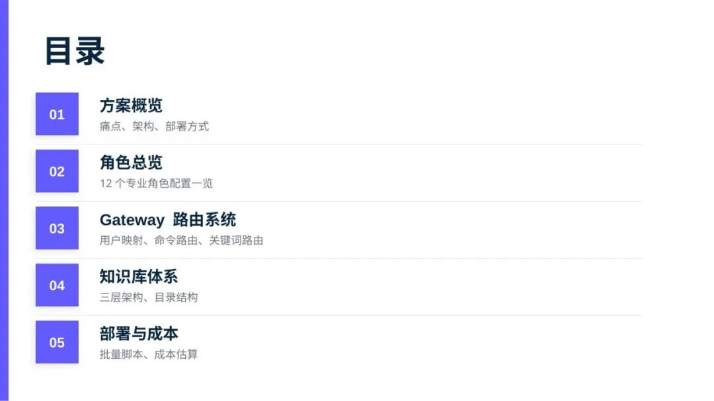

*图 2：本文结构总览*

---

## 为什么需要团队代理？

**痛点一：专业语境缺失。** 产品经理问"这个需求优先级怎么排"，AI 给出的答案可能包含大量技术实现细节；设计师问"这个配色方案是否符合品牌规范"，AI 却开始分析 API 性能。每个角色的专业语境是不同的，用同一个 AI 去处理所有问题，效果必然打折扣。

**痛点二：跨角色协作流程不清晰。** 在实际工作中，一个功能需求往往需要 PM → 设计 → 前端 → 后端 → QA → DevOps 的完整链条。传统 AI 助手无法理解这种协作关系，也无法在角色之间传递上下文。

**痛点三：知识分散难以复用。** 团队的编码规范、设计系统、API 文档往往分散在多个地方。通用 AI 无法针对性地读取这些角色专属的知识库。

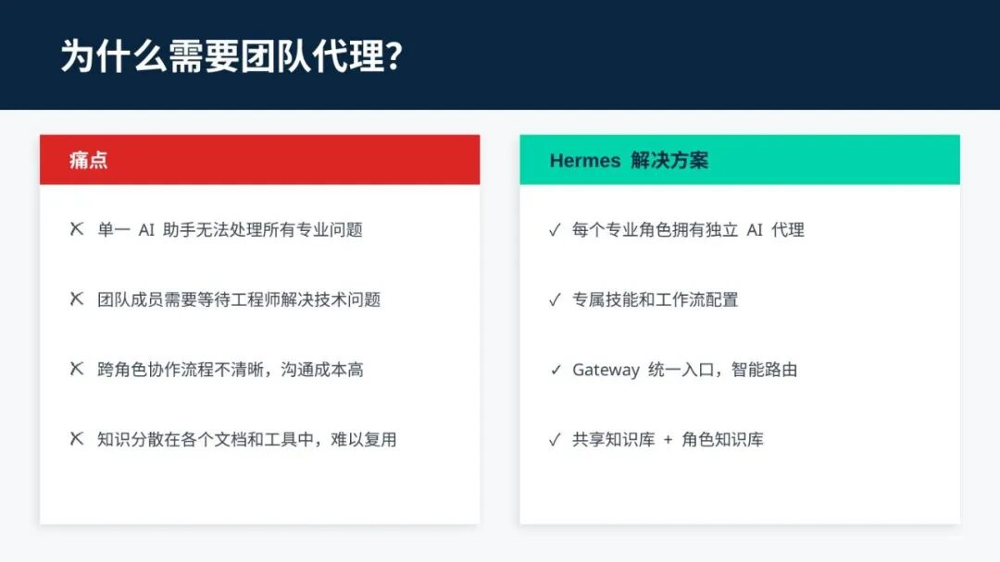

*图 3：痛点 vs Hermes 解决方案对比*

> **Hermes 的解决方案**：为每个角色创建一个"量身定制"的 AI 代理——拥有独立的技能配置（Skills）、独立的记忆系统（Memory）、通过 Gateway 智能路由确保精准触达，代理之间可互相协作形成完整链条。

---

## 整体架构图

理解整个系统，从这张架构图开始。

**最顶层是 Hermes Gateway** —— 整个系统的统一入口，负责接收来自飞书、Slack、Discord 或 Email 的所有消息。Gateway 不做具体工作，核心职责是：**路由**。

**第二层是平台适配层** —— 负责对接各种办公平台，把不同平台的消息格式统一化，交给 Gateway 处理。

**第三层是 Routing Middleware** —— Gateway 的核心决策引擎，根据用户身份、消息内容、命令关键词等多种维度，决定问题应该交给哪个代理。

**第四层是 Profile Agent 集群** —— 12 个角色的专属 AI 代理：PM、UI Designer、Backend、Frontend、AI Engineer、DevOps、QA、Security、Tech Lead、数据分析师、算法工程师和原型设计师。

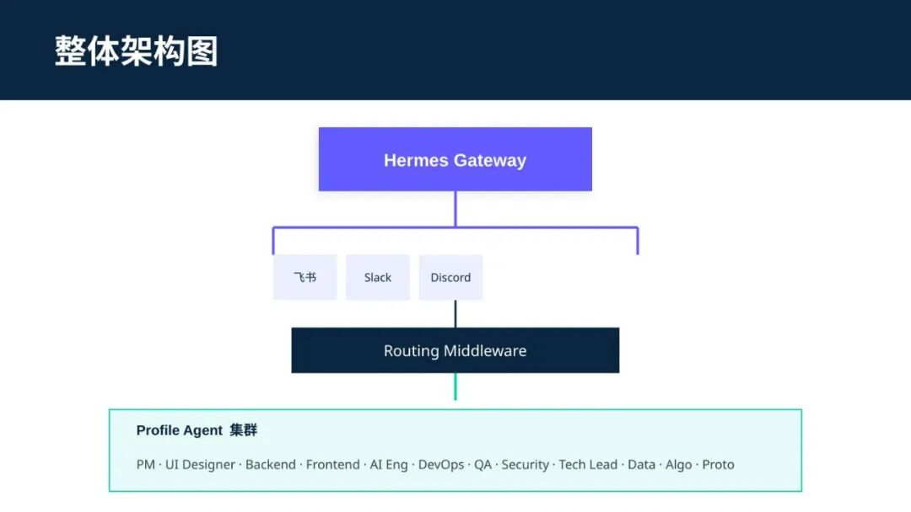

*图 4：Hermes 多代理系统整体架构*

---

## 部署方式选择

在部署之前，你需要先选择适合自己团队的部署架构。Hermes 支持两种部署模式：

**方式一（推荐）：单 Gateway + Profile 分离。** 所有代理共享一个 Gateway 入口，但每个角色有完全独立的 Profile 配置。好处是：统一管理、统一监控，同时保持角色之间的完全隔离。适合企业内团队、多角色协作、需要严格权限控制的中大型团队。

**方式二：共享助手 + 专业子代理。** 所有角色共用一个基础代理，遇到特定领域的复杂问题时再委托给子代理。优点是部署简单、成本低；缺点是复杂任务处理能力有限，不适合大型团队。

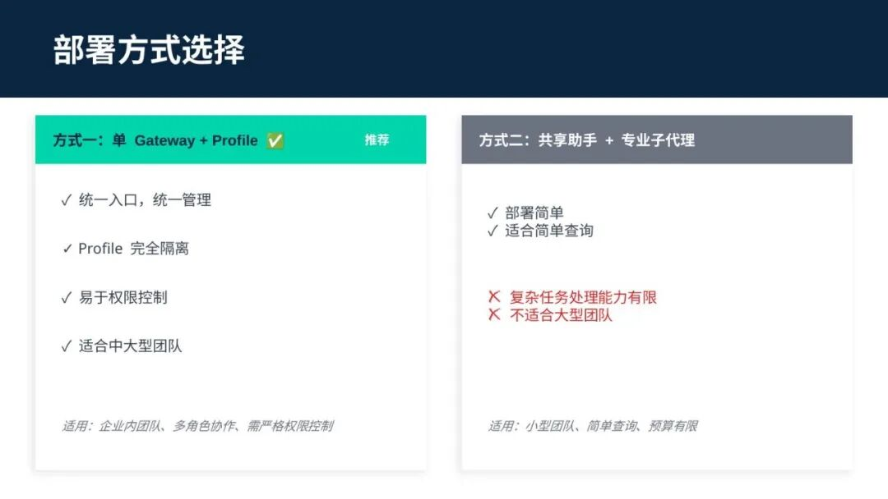

*图 5：两种部署架构对比*

> **建议：** 大多数情况下推荐方式一。架构清晰、扩展性强，长期来看维护成本更低。

---

## 12 个专业角色总览

这是整个系统最核心的一页——12 个专业代理的配置总览。注意 Tech Lead 使用的是 **claude-opus-4**（Anthropic 最强的模型），而其他所有角色均使用 **claude-sonnet-4**。这是经过深思熟虑的——Tech Lead 的核心职责是架构决策和技术评审，需要最强的推理能力。

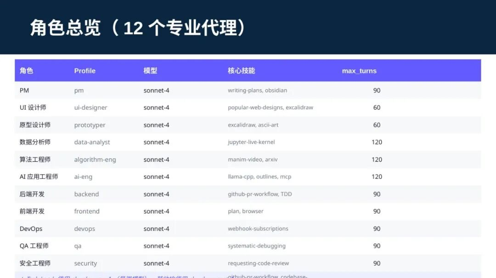

*图 6：12 个专业角色配置总览*

**max\_turns 参数** 控制单次会话中 Agent 与模型的最大交互轮数。AI 工程师、算法工程师、数据分析师和 Tech Lead 设置了更高的阈值（120），因为这些角色处理复杂问题时往往需要更长的推理链条。

---

## Gateway 路由架构

Gateway 是整个系统的"交通枢纽"，它的路由能力决定了用户体验。

**1. Pairing（用户配对路由）** —— 最精准的路由方式，每个用户在系统中有自己绑定的 Profile，直接路由到专属代理。

**2. Command（命令路由）** —— 用户输入特定命令（如 /prd、/color），Gateway 按命令表直接路由到对应角色代理。

**3. Mention（@提及路由）** —— 群聊中 @ 特定代理（@pm、@backend），Gateway 直接路由到被 @ 的代理。

**4. Keyword（关键词路由）** —— 分析消息内容的关键词，判断最可能需要哪个角色的介入。

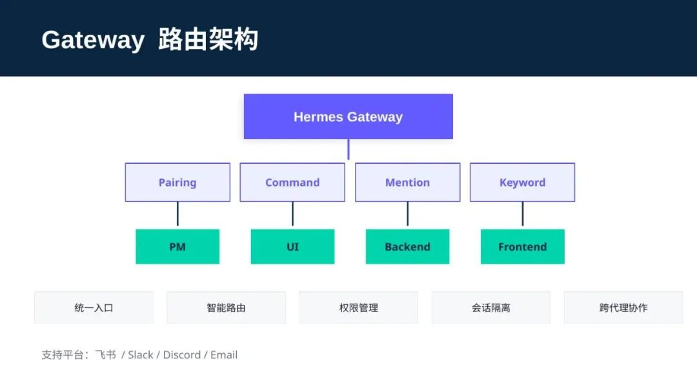

*图 7：Gateway 路由架构图*

---

## 用户到 Profile 的映射

在实际部署中，需要把团队成员映射到对应的代理 Profile。部署命令非常简单：

```
# 将用户绑定到 pm Profilehermes pairing approve  --profile pm
```

这条命令将用户 ID 绑定到 pm Profile，之后该用户的所有对话都会自动路由到产品经理代理。

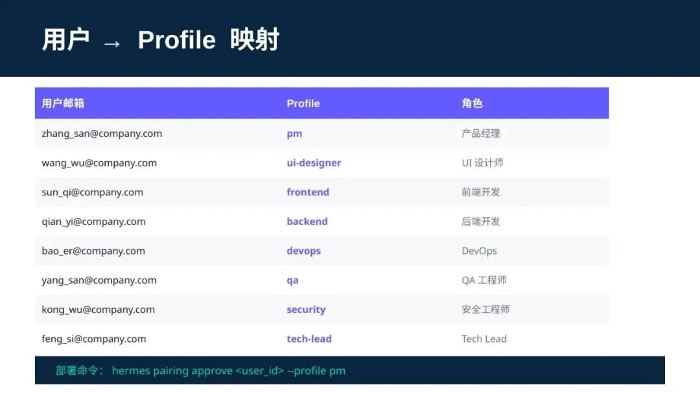

*图 8：用户邮箱到 Profile 的映射关系表*

> **实操经验：** 建议先为每个角色的负责人配置绑定关系，建立起完整的路由表后，再向团队推广使用。

---

## 命令路由与 @提及路由

**命令路由**是最精准的显式调用方式。用户输入特定斜杠命令，Gateway 立即路由到对应角色的代理：

| 命令 | 路由到 | 用途 |
| --- | --- | --- |
| `/prd` | pm | 起草 PRD |
| `/color` | ui-designer | 生成配色 |
| `/api` | backend | 设计 API |
| `/rag` | ai-eng | RAG 设计 |
| `/debug` | qa | 调试问题 |
| `/deploy` | devops | 部署 |
| `/data` | data-analyst | 数据分析 |

**@提及路由**是群聊场景下的核心路由方式。用户只需要 @ 对应的代理名称，就能获得专业帮助——不需要记住复杂的命令。

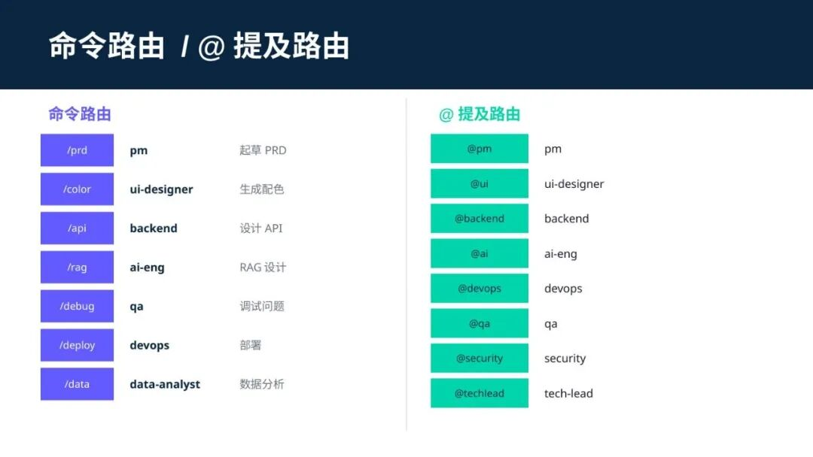

*图 9：命令路由和 @提及路由对照表*

---

## 关键词路由规则

当用户既没有绑定 Profile、也没有使用命令或 @ 提及时，Gateway 启动**关键词路由**作为兜底方案。

典型角色的触发关键词：

- **产品经理（pm）**：需求、PRD、用户故事、优先级、产品规划、竞品分析
- **UI设计师**：配色、设计、界面、图标、视觉、组件、设计规范、品牌
- **后端开发**：API、数据库、服务、接口、后端、REST、ORM
- **AI应用工程师**：LLM、RAG、Agent、Prompt、大模型、Embedding
- **DevOps**：部署、CI/CD、Docker、K8s、监控、告警

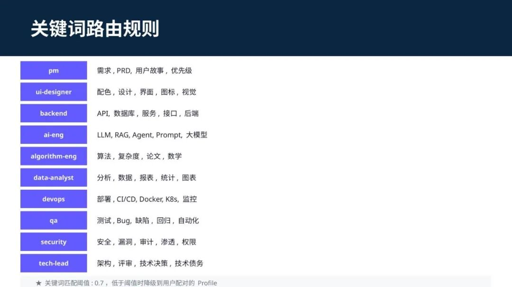

*图 10：各角色关键词路由规则*

> ⚠️ **降级策略：** 关键词匹配阈值是 0.7。匹配分数低于阈值时，系统降级到用户已绑定的 Profile。这保证了：明确绑定的用户，始终得到自己专属代理的服务。

---

## 路由决策流程

理解 Gateway 的决策逻辑，对于排查"为什么我的问题被路由到了错误的代理"非常有帮助。路由优先级从高到低：

① **@特定代理**（最高优先级，不受其他因素影响） → ② **/命令**（按命令路由表匹配） → ③ **关键词匹配**（超过 0.7 阈值才生效） → ④ **用户已配对**（有绑定 Profile） → ⑤ **默认Profile**（最终兜底）

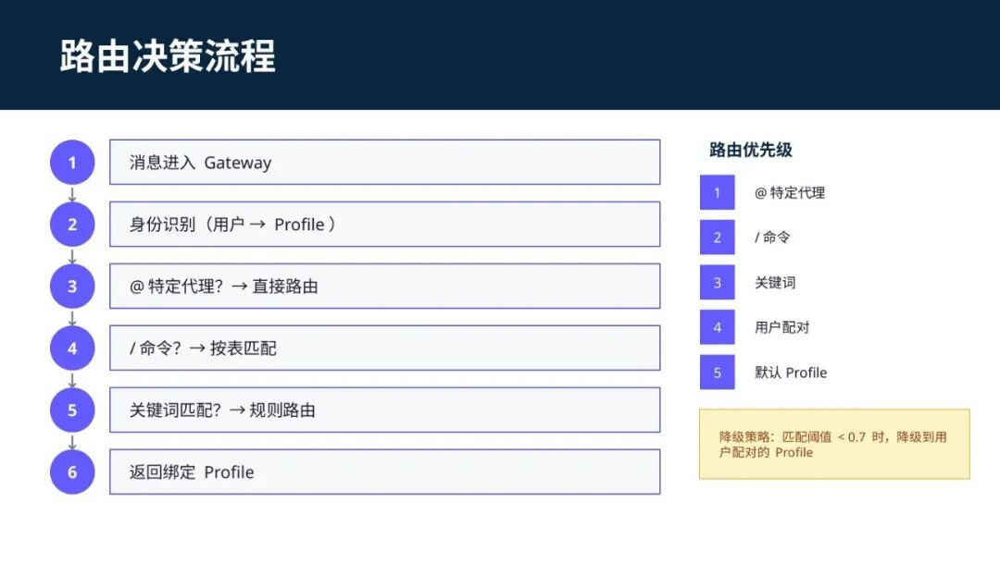

*图 11：Gateway 路由决策流程*

> **有什么用？** 当你发现代理响应不符合预期时，可以尝试使用 @ 提及或 / 命令来强制路由——这两个是优先级最高的路由方式，不受关键词匹配的影响。

---

## 三层知识库架构

**知识库是 AI 代理真正"懂行"的关键。** 没有知识库的 AI 代理只能给出通用性建议；有了知识库的 AI 代理，才能给出真正贴合团队实际的专业建议。

**第一层：共享知识库** —— 所有角色可读，包括公司规范、技术栈标准、API 文档、编码规范。权限：所有 Profile 可读，Tech Lead 可读写。

**第二层：角色知识库** —— 每个 Profile 独立的知识库，仅本角色可读写。PM 的知识库包含 PRD 模板、产品路线图；UI 设计师的知识库包含设计系统、品牌规范。

**第三层：外部知识源** —— 通过 MCP 协议集成的外部知识系统：Obsidian、飞书云文档、GitHub Wiki、内部技术文档站。核心理念：已有的知识资产，不需要迁移，直接对接。

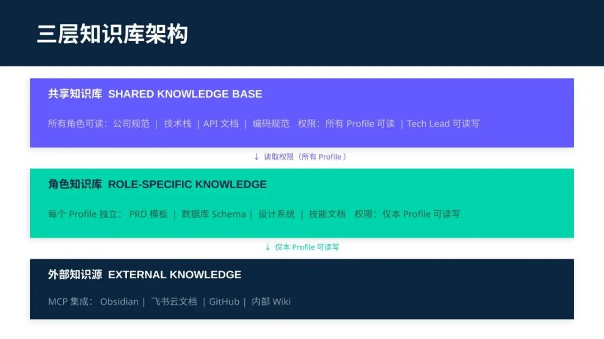

*图 12：三层知识库架构图*

---

## 知识库目录结构

在服务器上，Hermes 的知识库目录结构如下：

```
~/.hermes/knowledge/├── shared/                  # 共享知识库（所有角色可读）│   ├── company norms/       # 公司规范│   ├── tech stack/          # 技术栈标准│   └── api-docs/            # API文档├── profiles/                # 角色知识库（仅本角色可读写）│   ├── pm/prd-templates/    # PRD模板│   ├── backend/schemas/     # 数据库Schema│   └── ui-designer/design-system/  # 设计系统└── external/                # 外部知识源配置    ├── obsidian-config.json    ├── feishu-wiki-config.json    └── github-wiki-config.json
```

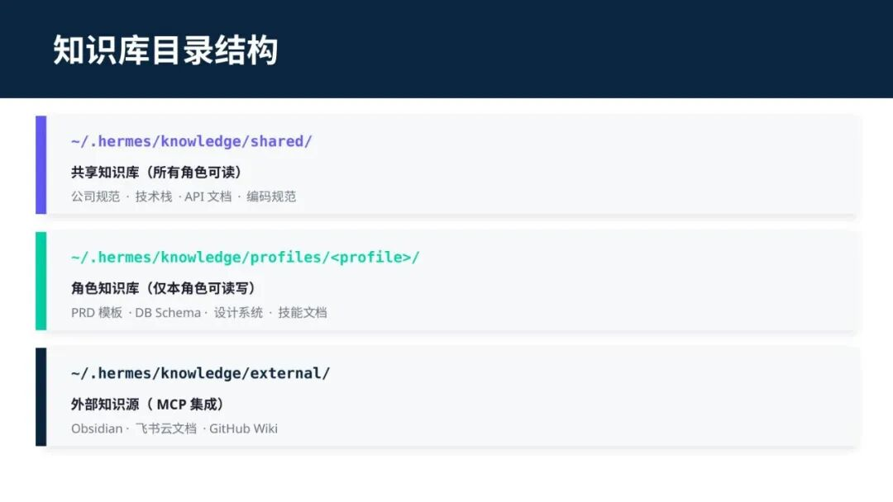

*图 13：知识库目录结构*

> **实操建议：** 每周五下午，让各角色的负责人花 15 分钟更新自己角色的知识库——把本周遇到的问题、解决方案、新沉淀的方法论记录进去。长期坚持，这套知识库会成为团队最宝贵的资产之一。

---

## 批量部署脚本

当团队规模较大时，手动一个个创建 Profile 显然不现实。Hermes 提供了完整的批量部署解决方案：

```
# 1. 创建 Profilehermes profile create pm --model sonnet-4 --max-turns 90# 2. 配置工具集hermes profile config set pm toolsets "file,browser,web,memory,skills,todo"# 3. 批量部署./scripts/batch-deploy.sh --count 100 --team engineering# 4. 验证部署hermes gateway status && hermes profile list
```

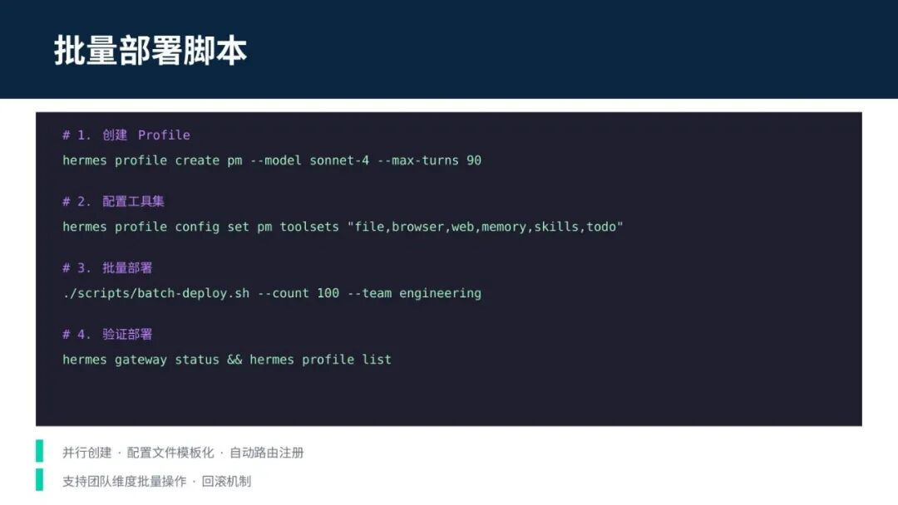

*图 14：核心部署命令一览*

> **批量脚本的核心能力：** 并行创建（大幅缩短部署时间）、配置文件模板化（相同角色的 Profile 使用同一套配置模板）、自动路由注册（Profile 创建时自动加入路由表）。

---

## 成本估算（100 人团队/年）

以 **100 人团队**为例，四种方案的成本对比：

| 方案 | 年成本 | 适用场景 |
| --- | --- | --- |
| 本地化部署（DeepSeek-R1 671B） | ~210 万（一次性硬件） | 大规模、长期使用，数据完全私有 |
| Claude Code 企业版（$200/人/月） | ~144 万/年 | 对 AI 能力有较高要求的团队 |
| GitHub Copilot Enterprise（$39/人/月） | ~28 万/年 | 轻量级开发辅助 |
| **混合方案（推荐）** | **80-120 万/年** | **性价比最优** |

核心角色（PM、AI 工程师、Tech Lead）用企业版，一般开发角色用 Copilot Enterprise——这是目前性价比最优的方案。

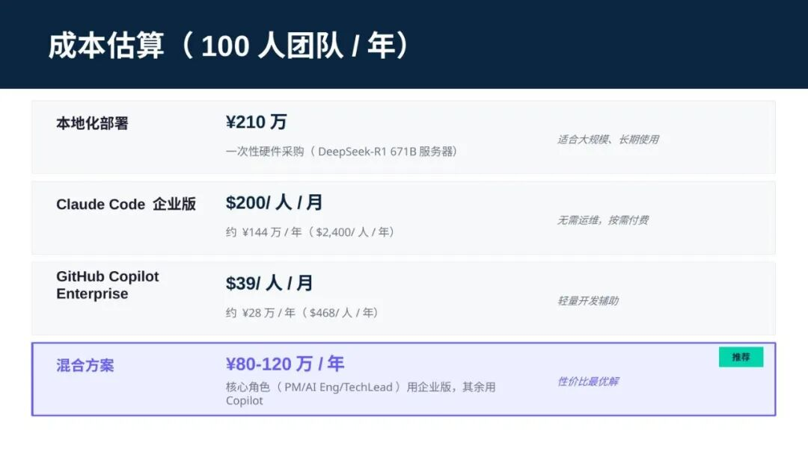

*图 15：四种方案年成本对比*

> **选型建议：** 小团队（10人以下）可以直接用 Copilot Enterprise；中等团队（10-50人）建议混合方案；大型团队（50人以上）建议做详细的 TCO 分析后再决定。

---

## 总结

回顾全文，团队 Hermes 多代理系统的核心价值可以总结为以下五点：

**一，专业化分工。** 每个团队角色拥有专属的 AI 代理，理解这个角色的专业语境、工作流程和常用技能。不是让一个人学会所有技能，而是让正确的 AI 做正确的事。

**二，智能路由降低使用门槛。** Gateway 的四种路由方式（用户配对、命令、@提及、关键词）互相补充，最大程度降低了使用门槛——用户不需要学习复杂的命令。

**三，知识库让 AI 真正"懂行"。** 三层知识库体系确保 AI 代理给出的建议是基于团队实际规范的，而不是泛泛而谈的通用知识。

**四，批量部署让推广不再困难。** 脚本化的部署方式，让新成员在几分钟内获得完整的 AI 辅助能力。

**五，混合方案实现性价比最优。** 不同角色用不同工具，既保证核心能力，又控制整体成本。

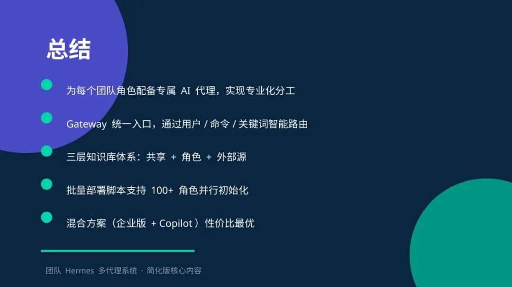

如果你觉得还不错，就关注一下吧！！
