> 📎 来源: [白羊武士弗拉明戈](https://mp.weixin.qq.com/s?__biz=MzUxMDU2ODAxNg==&mid=2247485953&idx=1&sn=c757bbb672dafdd798cb6611cec01c3d&chksm=f8c9bae78447aeebc4fdd6f448a75f356826503606ac31cd2de0cfbc70738792b5e9d0ba2d42&mpshare=1&scene=1&srcid=043089x5azCFIwJQsw3x0FPr&sharer_shareinfo=781c4d2fb4b6feb1ee9b7c5d31b65093&sharer_shareinfo_first=781c4d2fb4b6feb1ee9b7c5d31b65093) | 时间: 2026-04-30 19:34

---

自从 GLM5.1 和 GLM 5 Turbo 出来了以后，这两个模型深受广大人民群众的喜爱，从养虾到养爱马仕，纷纷是炙手可热的宠儿。我也是广大用户中的一个。然后官方也承认，因为用量高峰太高，所以导致资源紧缺，那带来的问题就是每次在正常使用的时候，总时报429（模型请求超时） 这几天我在让我的爱马仕小助手做了一套框架升级想着把它发布到GitHub项目里，然后就遇到了429..... 比如这样：

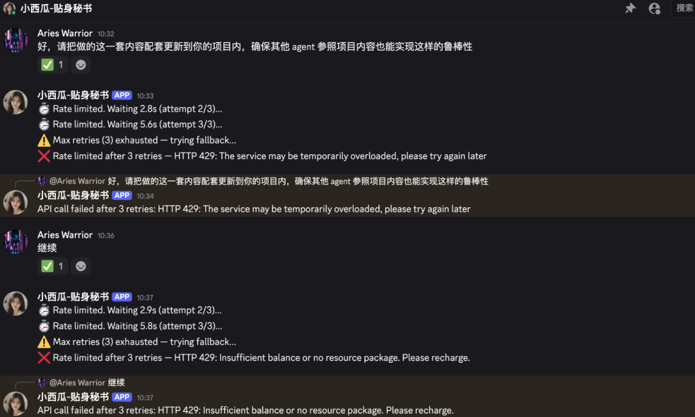

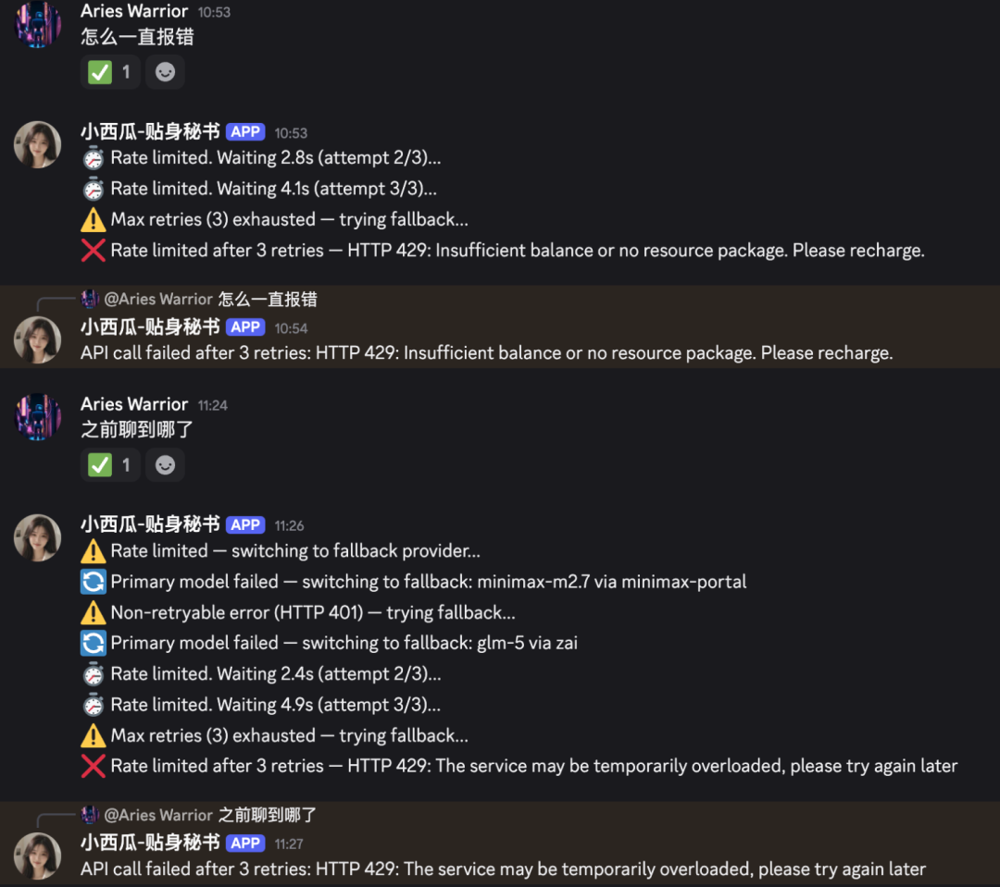

image.png

再比如这样：

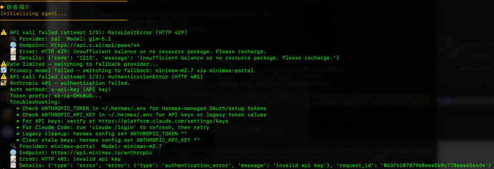

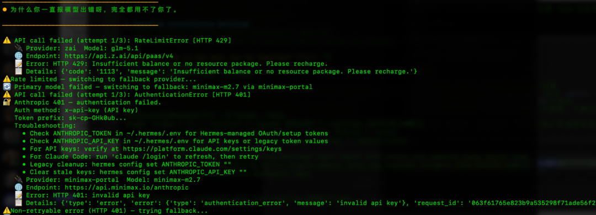

image.png

所以这谁受得了GLM再香，但是他用不了对不对，那这种情况咱就得考虑minimax的旗舰 M2.7还有Moonshot的旗舰模型 K2.6。

**但问题是：Hermes 在初次设置启动的时候，引导页面会有设置模型的功能，但它做得并不像 Openclaw 一样那么清晰。同时，在使用过程中，配置模型和备用模型也没有比较清晰的页面。所以很多人可能会遇到 这三类问题：**

1. **想之后再重新设置模型，结果找不到入口：**输入hermes setup 就进入到了重新设置整个链路的地方，对于普通用户而言，体验不友好，而且稍有不慎就容易改错。

   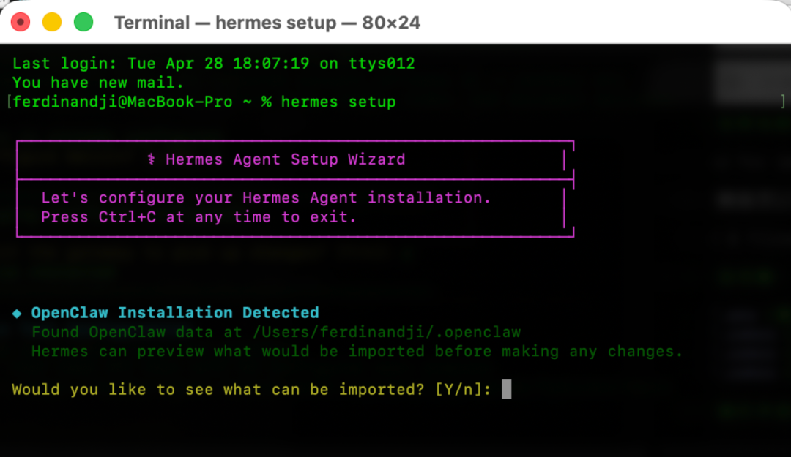
2. **想去设置备用模型，没有入口。**要么通过终端命令行输入 “hermes config edit” 进入 nano 编辑（结果不懂语法）

   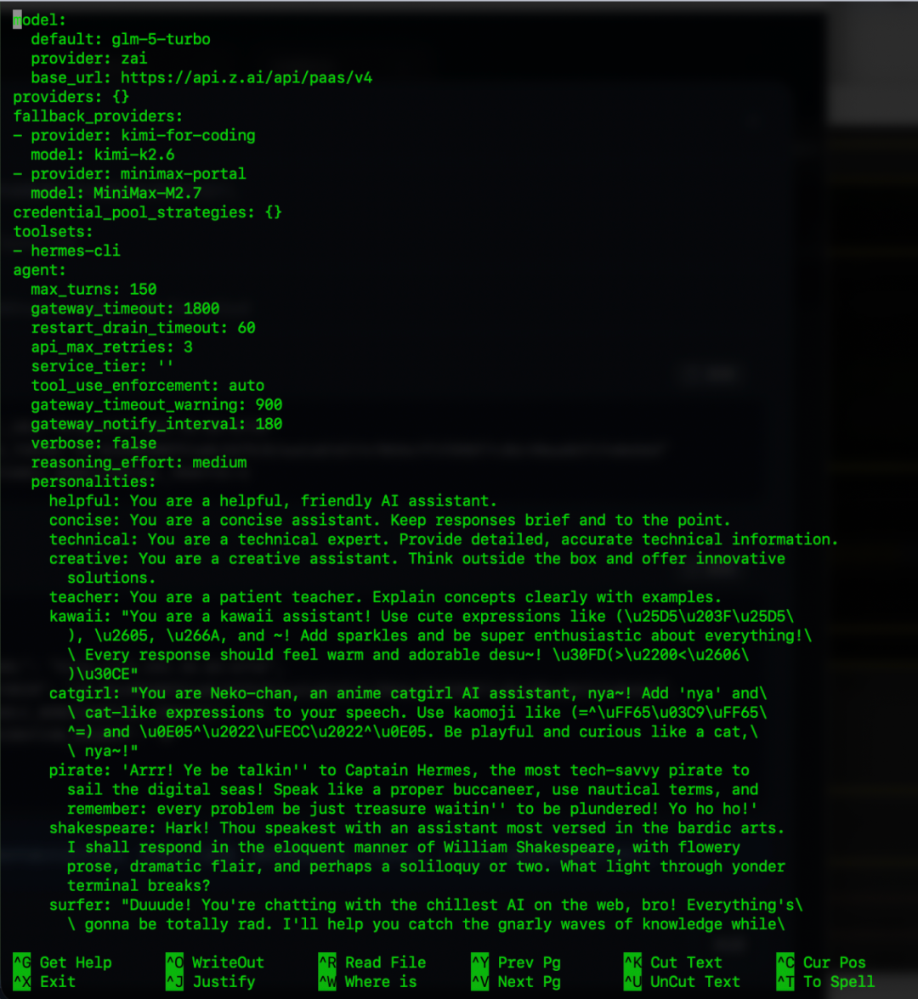
3. **想去设置新模型和备用模型的时候没有任何引导，需要纯手写，不知道格式怎么写。**

   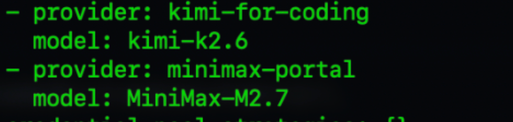

到底应该写 kimi-k2.6 还是应该写kimi-k2p6 (ps:kimi-k2p是 Openclaw 的写法)

*所以以上三个问题我全都碰见了，然后问了一圈 AI，在它的 **“协助”** 下，我顺利有踩了1小时坑：这个minimax它怎么也配置不明白了*

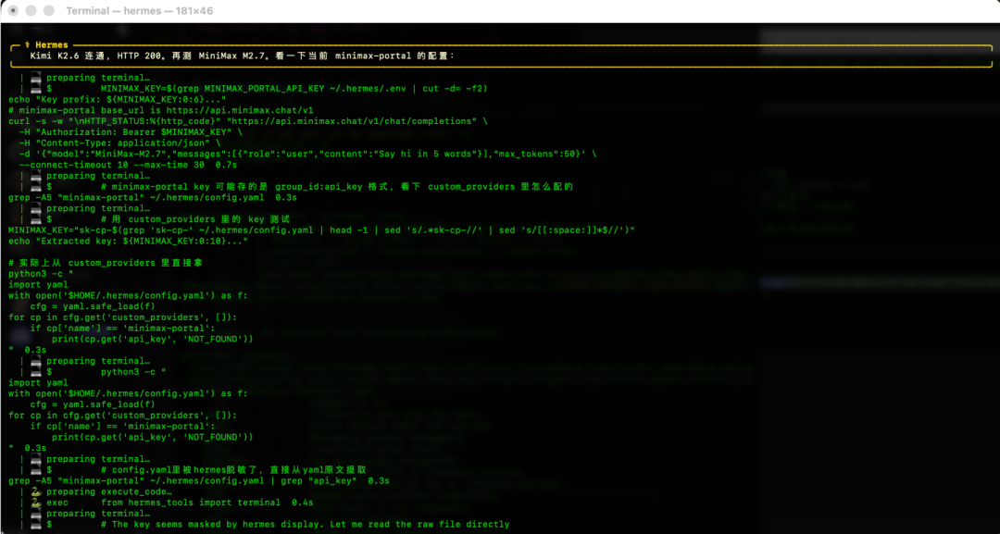

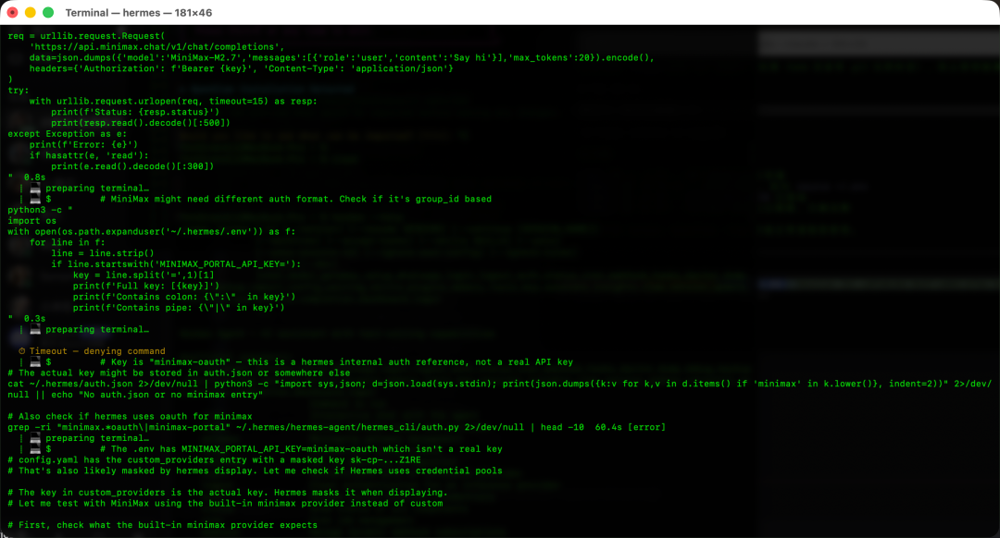

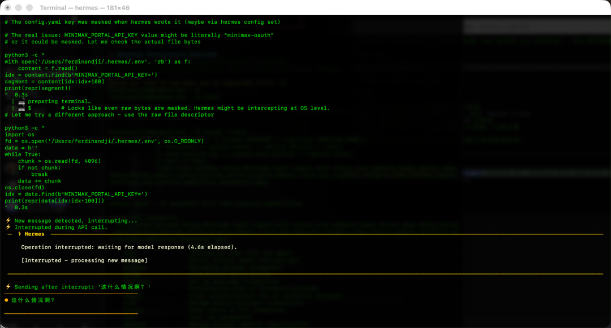

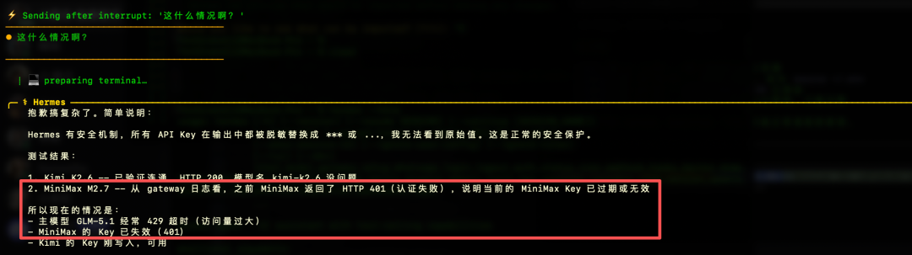

image.png

最后没办法，看了看教程，又问了问claude，然后终于解决了：三步搞定！

# 划重点 教程部分

1. 找到 .env 文件（这个文件是作为一个隐藏文件在 .hermes 这个隐藏文件里边，如果不知道怎么展示Windows或者Mac隐藏文件，可以问一下豆包）

   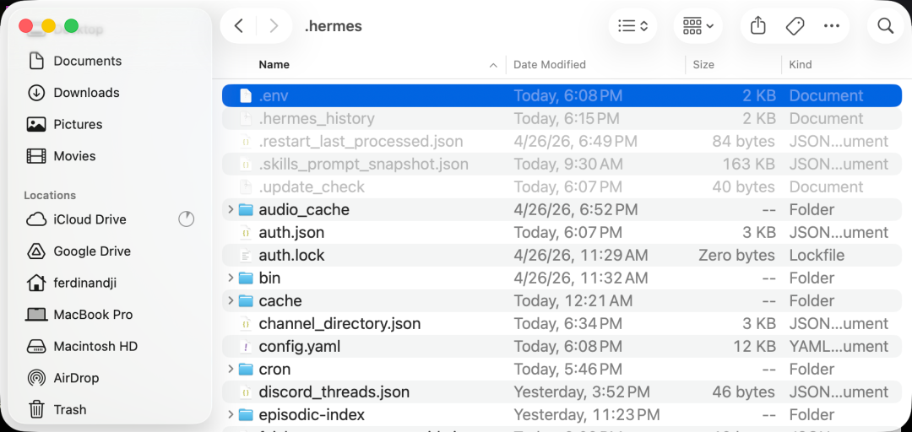
2. 在这个文件中底部增加：MINIMAX\_PORTAL\_API\_KEY=你的 api key

   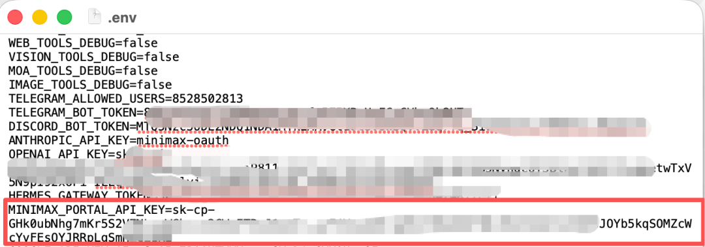
3. 重启 Hermes：

   ```
   hermes gateway restart
   ```

然后再去找你的Hermes就会发现他活过来了。现在我的主模型是GLM5.1，当不可用的时候会替换为Kimi 2.6，再不可用会自动替换为minimax M2.7

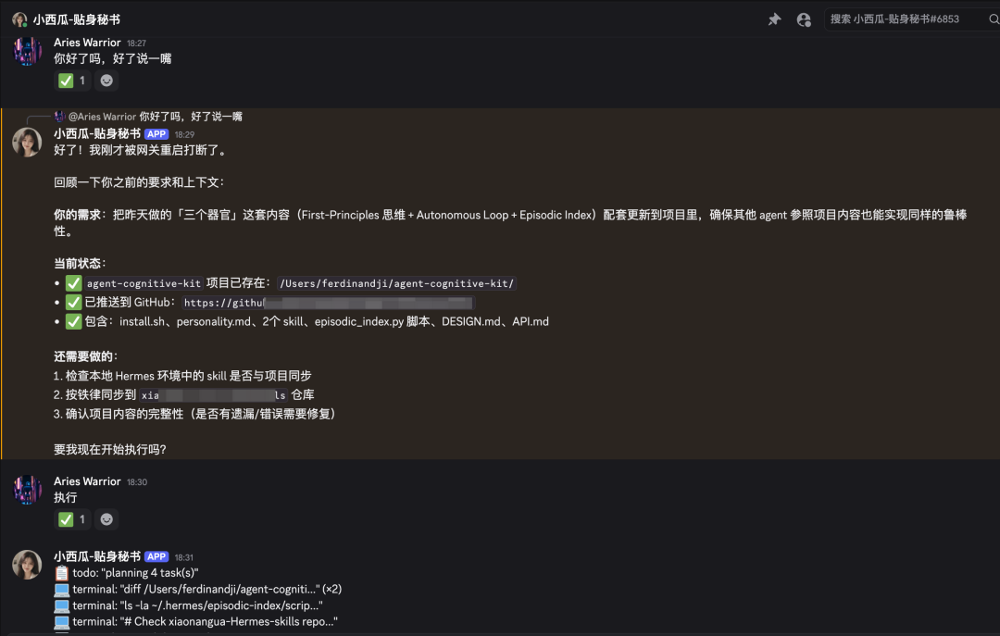

> 如果觉得不错，随手点个赞、在看、转发三连吧，如果想第一时间收到推送，也可以给我个星标⭐ 我们，下次再见。

> 当然，欢迎加我个人微信：**baiyangwushi** ，一起进**白羊武士的修炼道场**和其他同频道的朋友同频共振\*\*，欢迎 AGI 时代的到来。  也期待在今后的日子里能够与你有羁绊，这是种微妙的感觉。希望我的一些想法能对你有所帮助。欢迎你的到来，修行者。
