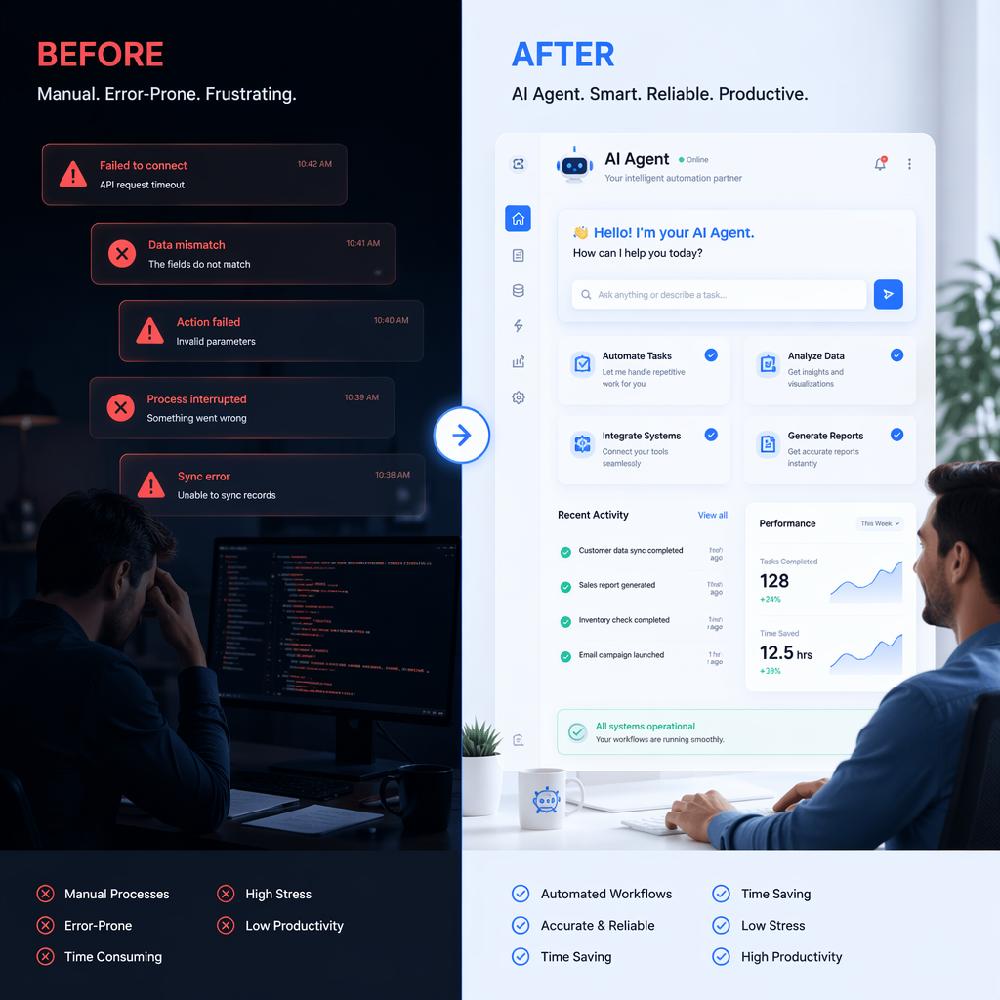
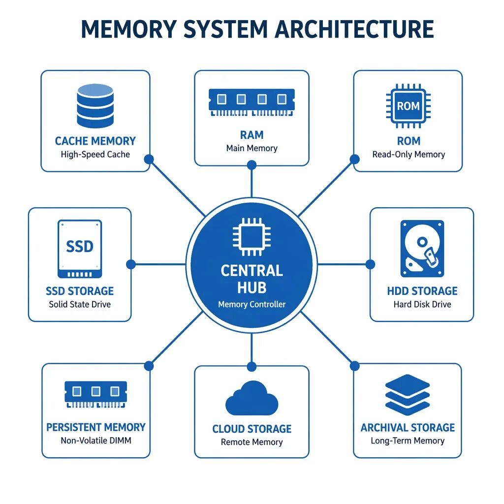
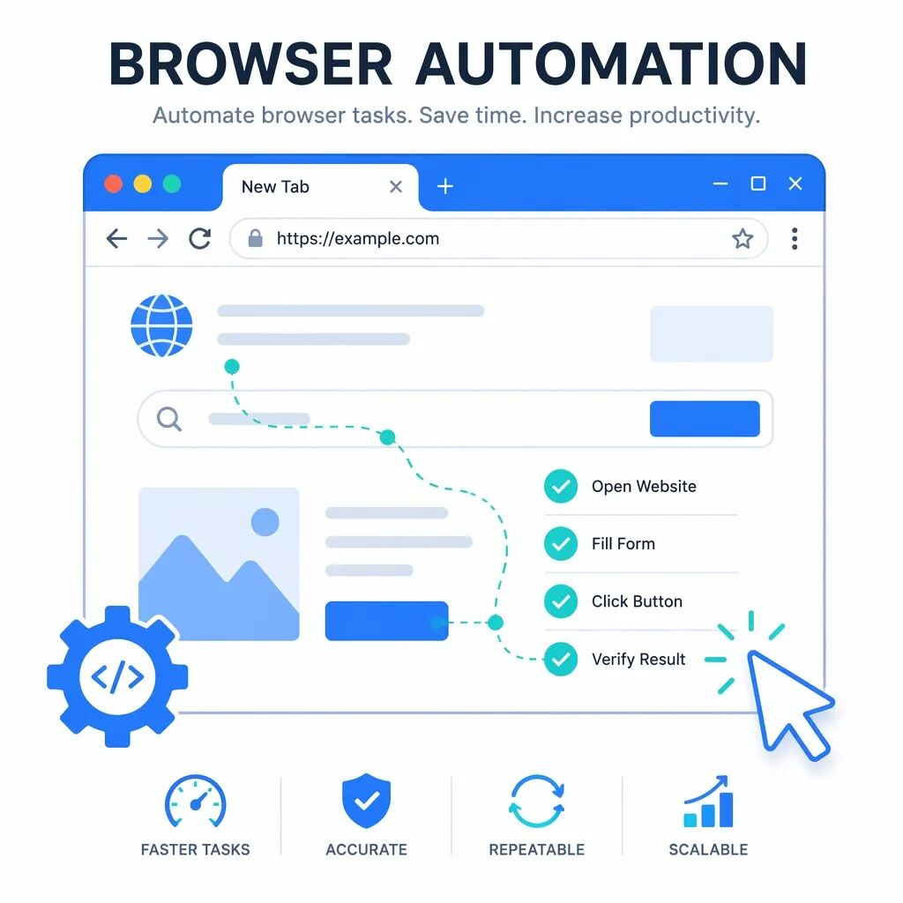
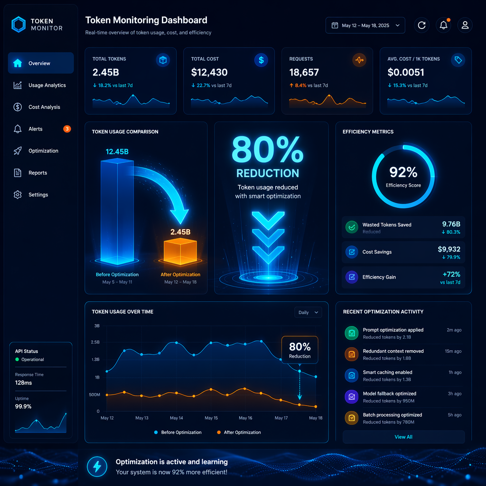

> 📎 来源: [硅基原住民](https://mp.weixin.qq.com/s?__biz=MzA4OTUxMzA0Mg==&mid=2247484934&idx=1&sn=1e4932f48de76b0bb5534ffbd12a8c72&chksm=9138951228ca6949bcf49f3871dcb27366ee958fa4cdd9d195855d0cb3545fdc9b0a6991636f&mpshare=1&scene=1&srcid=0502XfQdT3c1KSZOZjt6XVHI&sharer_shareinfo=f12dc534184b20c594b0eb1c5ca6927e&sharer_shareinfo_first=f12dc534184b20c594b0eb1c5ca6927e) | 时间: 2026-05-02 00:56

---

**摘要：**还在裸奔用Hermes？Token烧得心疼？本文揭秘7步封神配置，Token直降80%、记忆翻倍、效率炸裂，小白也能一次成功！   


       7步封神配置，让Hermes脱胎换骨     

       01.     

## 裸奔 vs 满配：差距到底有多大？

     刚装完 Hermes 那会儿，我和很多人一样，直接开聊。以为装好了就能起飞，结果发现——它连我昨天说过的话都记不住！😅   

     这就是**"裸奔版"Hermes**的真实体验：没有记忆、没有身份、不会上网查资料、Token 消耗像流水。用了一周，感觉就是个加强版 ChatGPT。   

     但当我花了一个周末，按照下面这套配置流程走完后，Hermes 彻底变了——它能记住我的项目背景、自动抓取网页信息、帮我调试前端代码、还能监控 Token 消耗。这才是真正的 **AI Agent**！   

| 能力维度 | 裸奔版 | 满配版 |
| --- | --- | --- |
| **记忆能力** | 单会话，重启即忘 | 跨会话长期记忆，记住项目背景 |
| **信息获取** | 只能问训练数据 | 实时抓取网页、搜索互联网 |
| **浏览器操作** | 无 | 自动点击、填表、调试前端 |
| **Token 管控** | 黑盒，月底吓一跳 | 实时监控，压缩优化省 80% |
| **角色定位** | 通用助手 | 专属领域专家（编程/写作/运营） |

       02.     

## 第一步：定义身份 —— 让 Hermes 知道"你是谁"

     很多人装完 Hermes 第一件事就是直接开聊。但其实，**真正决定输出质量的，不是你怎么问，而是它默认以什么身份来回答**。   

     在 Hermes 里，这一层由 

```
SOUL.md
```

 决定。你可以把它理解成 Agent 的人格文件——角色定位、表达方式、判断偏好、擅长方向，全在这里定义。     

**我的推荐方案：**别从零瞎写，直接用现成模板做起点。   

**agency-agents-zh** 这个仓库里有 211 个中文角色模板，覆盖小红书运营、技术写作、研究助手等场景。我的做法是：先搜索最接近我需求的角色，然后在使用过程中微调。   



`   `

**实用技巧：**在 

```
SOUL.md
```

 里明确写上你的技术栈偏好、代码风格要求、常用工具链。这样每次对话都不需要重复交代背景。   

       03.     

## 第二步：升级记忆 —— 从"金鱼"到"大象"

     Hermes 内置的 

```
MEMORY.md
```

 只能记住约 2200 字符，而且是"Hermes 认为重要时才写入"。这意味着——**你上周提过的项目 deadline，它大概率已经忘了**。   

     解决方案是接入外部记忆系统。我用的是 **Hindsight**，Vectorize 开源的 Agent 记忆系统，在 LongMemEval 基准测试达到 91.4% 准确率。   

**Hindsight 的核心优势：**

       ✅ **自动提取实体关系：**从对话中自动提取人、项目、技术、时间节点     

       ✅ **跨会话记忆：**周一提过的 deadline，周五新会话还能接上     

       ✅ **知识图谱组织：**不是线性文本，而是实体关系网络     

       ✅ **无容量上限：**不再受 2200 字符限制     

`# 安装 Hindsight
       hermes memory setup

# 选择 hindsight
# 配置 API Key
       echo "HINDSIGHT_API_KEY=*** >> ~/.hermes/.env

# 验证安装
       hermes memory status     `

**真实体验：**接入 Hindsight 后，我再也不用担心"重启会话丢失上下文"。它能记住我负责的项目、技术栈偏好、甚至我习惯用单引号还是双引号。这种"被理解"的感觉，是裸奔版完全给不了的。   



       04.     

## 第三步：浏览器自动化 —— 让 Hermes 帮你"动手"

     以前调试前端，我得手动复制浏览器控制台的报错信息，粘贴给 Hermes，等它分析完再手动改代码。现在？**Hermes 直接帮我操作浏览器，自动抓取报错、定位问题、甚至帮我点击测试**。   



       浏览器自动化让 Hermes 能自动调试前端、抓取数据     

**我的浏览器自动化工具组合：**

**Agent Browser** —— 最常用，速度快，能读取 DOM 和控制台     

**Browser Use** —— 自然语言操作网页，适合复杂交互场景     

**Playwright** —— 微软开源，做完整自动化测试     

**CamoFox** —— 反爬利器，指纹伪装     

`# 安装 Agent Browser
       brew install agent-browser
       agent-browser install

# 添加到 Hermes Skill
       npx skills add vercel-labs/agent-browser@agent-browser -g     `

**实战场景：**上周有个前端 Bug，控制台报错但我不确定原因。我直接说："打开浏览器，访问 localhost:3000，把控制台的报错信息抓给我"。Agent Browser 自动完成，返回了完整的错误堆栈。Hermes 分析后定位到是依赖版本冲突，整个过程我一行代码都没写。   

       05.     

## 第四步：内容抓取 —— 让 Hermes 能"看见"互联网

     一个真正能干活的 Agent，不只是要会说，还得会看、会抓、会读网页。这一层我配置了 4 个工具，覆盖不同场景：   

| 工具 | 适用场景 | 成本 |
| --- | --- | --- |
| **Jina Reader** | 单页快速抓取，URL 前加 r.jina.ai/ | 免费 |
| **Crawl4AI** | 批量深度抓取，多层递归 | 免费 |
| **Scrapling** | 反爬绕过，Hermes 内置 | 免费 |
| **Firecrawl** | 企业级抓取，自带代理池 | 付费 |

**我的日常用法：**看到一篇技术博客，直接丢 URL 给 Hermes："总结一下这篇文章的要点"。Jina Reader 自动抓取正文，转成干净 Markdown，Hermes 再提取关键信息。整个过程 10 秒搞定。   

       06.     

## 第五步：搜索能力 —— 从"会查"到"会研究"

     搜索这层，最好的配置是**分层**——不是二选一，而是分工使用：   

**Tavily（主力）：**专为 AI 设计，结果自带引用和摘要，支持深度研究。我主要用它来做技术调研、查文档、找解决方案。   

**DuckDuckGo（兜底）：**零成本、稳定、随时可以做基础搜索。当 Tavily 配额用完或需要简单查询时，用它兜底。   

`# 配置搜索工具
       hermes tools add tavily
       hermes tools add duckduckgo

# 使用示例
       "搜索 React 19 新特性，给出官方文档链接"     `

       07.     

## 第六步：Token 管控 —— 别让账单吓到你

     裸奔版 Hermes 最大的坑——**Token 消耗像黑洞**。系统提示占一大块，工具定义占一大块，消息历史又占一大块，月底一看账单直接懵了。   



       Token 监控仪表盘，实时查看消耗趋势     

**我的 Token 管控三件套：**

**Tokscale** —— 实时监控全局 Token 消耗，可视化趋势图     

**hermes-dashboard** —— 拆到组件级别，看系统提示、工具定义、消息历史分别吃掉多少     

**RTK (Rust Token Killer)** —— 智能压缩终端输出，直接省 60-90% Token     

`# 安装 Tokscale
       npx tokscale@latest

# 查看 Hermes 专属消耗
       tokscale --hermes --week

# 安装 RTK
       brew install rtk
       rtk init -g     `

**实测效果：**接入 RTK 后，我的日均 Token 消耗从 50 万降到 10 万，省下的钱够买好几杯咖啡了 ☕   

       08.     

## 第七步：表达能力 —— 能说、能听、能画

     很多人把 Agent 理解成纯文字工具，但长期用下来你会发现，多模态能力同样重要。   

**我的表达能力工具链：**

       🎤 **Whisper** —— 语音识别，本地可用、多语言支持强     

       🔊 **Edge TTS** —— 语音合成，免费、效果不差     

       🎨 **FAL.ai / Midjourney** —— 图片生成，做封面图、配图、海报     

       09.     

## 最小可行配置：如果你只想记住一套顺序

     配置太多容易上头，建议按这个顺序来：   

**1. 身份层** —— SOUL.md + 中文角色模板     

**2. 记忆层** —— Hindsight 外部记忆系统     

**3. 感知层** —— Jina Reader + Crawl4AI     

**4. 搜索层** —— Tavily + DuckDuckGo     

**5. 浏览器层** —— Agent Browser + Browser Use     

**6. 成本层** —— Tokscale + RTK     

     每加一层，都会直接增强你真实工作的效率，而不是只让配置清单看起来更高级。   

## 写在最后

     很多人迟迟不开始，不是因为不会装，也不是因为不会配，而是总觉得自己还差一个"最优解"。   

     但 Agent 这件事，本来就没有一步到位的最终答案。**真正有用的，从来不是你等来了一个最强版本，而是你已经先搭出了一套能跑、能改、能积累的系统**。   

     Hermes 值不值得用，关键不在于它是不是此刻最强，而在于，你有没有真的把它接进自己的工作流。   

     先跑起来，再持续优化，这比继续观望更重要。💪   

       🎁 附：零成本全栈方案速查表     

文字模型Ollama$0

单页抓取Jina Reader$0

批量抓取Crawl4AI$0

浏览器操作Playwright$0

网页搜索DuckDuckGo$0

Token 监控Tokscale$0

       感谢阅读，点赞、在看、转发三连吧！
       你的 Hermes 配置到哪一步了？欢迎在评论区交流 👇     

📚 关注我们

第一时间获取设计圈前沿资讯、AI 工具测评和实战教程

📚 往期精彩回顾

[谷歌全面拥抱"智能体时代"：75%代码AI生成、1850亿美元豪赌未来](https://mp.weixin.qq.com/s?__biz=MzA4OTUxMzA0Mg==&mid=2247484906&idx=1&sn=d1668b78275a6b040e3d1ad1c798842f&scene=21#wechat_redirect)

[Meta 20亿美元收购梦碎！中国为何紧急叫停Manus交易？](https://mp.weixin.qq.com/s?__biz=MzA4OTUxMzA0Mg==&mid=2247484912&idx=1&sn=d6da74489072d8e96cedd82117fba51a&scene=21#wechat_redirect)

[国产语音模型StepAudio 2.5 ASR拿下SOTA](https://mp.weixin.qq.com/s?__biz=MzA4OTUxMzA0Mg==&mid=2247484840&idx=1&sn=f55d8a5e90740f275e106255c56caae2&scene=21#wechat_redirect)

[DeepSeek V4震撼发布！华为昇腾全面支持，中国AI再次让世界瞩目](https://mp.weixin.qq.com/s?__biz=MzA4OTUxMzA0Mg==&mid=2247484831&idx=1&sn=37919542c5c643805f1cddbde4f012be&scene=21#wechat_redirect)

[GPT-Image-2：10个颠覆性的商业应用场景](https://mp.weixin.qq.com/s?__biz=MzA4OTUxMzA0Mg==&mid=2247484802&idx=1&sn=0ad1ed91a9369966d48ee8712a20854a&scene=21#wechat_redirect)
