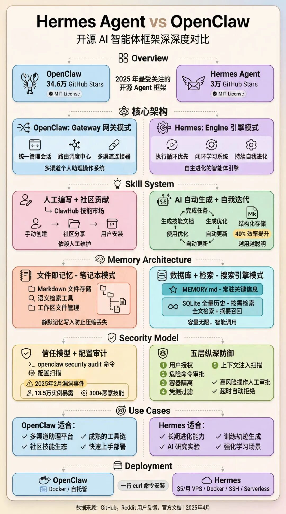
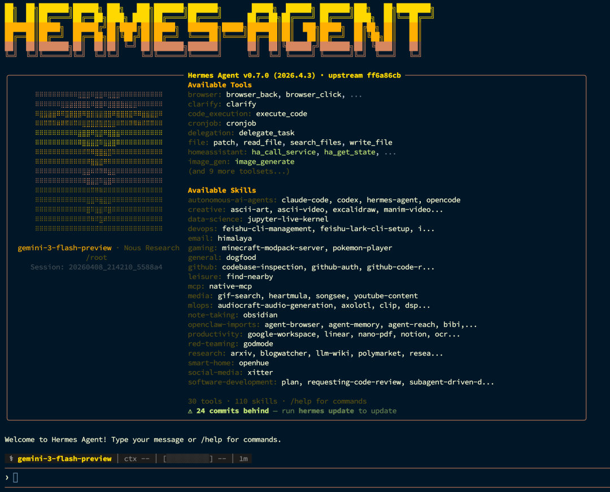

> 📎 来源: [Claw 龙虾实验室](https://mp.weixin.qq.com/s?__biz=MzYzMzAwODUwNQ==&mid=2247483896&idx=1&sn=e88c381892fd48f18a494f990b9b057e&chksm=f12593d77e6d33b8ad5de1c627f336b4b9808525675547bf58a440b3acb127713902ef356a39&mpshare=1&scene=1&srcid=0420OWwIPd75A8sXcKSEQl9f&sharer_shareinfo=6ad446321287c7fa84e70c1bc561b5d2&sharer_shareinfo_first=6ad446321287c7fa84e70c1bc561b5d2) | 时间: 2026-04-20 19:38

---

### 从昨天开始 Hermes Agent 在社区的存在有点强：更新快、讨论多、连“迁移 OpenClaw”都被做成了官方命令。 但说到底，咱们就看一件事：**你能不能在 10 分钟内把它装好、说上话、跑一次小自动化。** 可以的话，它才配叫“入门友好”。 --- Hermes 最近为啥这么火？先把热点捋清 这一波热度，核心不是“概念”，而是几次版本把体验做得更像产品： - **后台任务完成会主动提醒你：**跑构建/测试/训练这种长任务，不用一直盯着（v0.8.0 的 `notify_on_complete`）。 - **会话中途也能换模型：**不管你在 CLI 还是 Telegram/Discord/Slack，想换就换（v0.8.0 的 `/model`）。 - **多实例 Profiles：**一台机器上分项目隔离配置、记忆、技能、网关（v0.6.0）。 - **记忆/凭证/浏览器更“能打”：**可插拔记忆后端、多个 key 轮转、Camofox 这类更不容易被网站当脚本拦截的浏览器环境（v0.7.0）。 想看一手资料： - 仓库：https://github.com/NousResearch/hermes-agent - 快速开始：https://hermes-agent.nousresearch.com/docs/getting-started/quickstart/ - 版本更新：https://github.com/NousResearch/hermes-agent/releases ---  --- Hermes vs OpenClaw：别吵了，先把差异讲人话 先上结论： - **OpenClaw** 更像“多渠道入口 + 控制中枢（Gateway）”，生态大、渠道多、配套 App/Node 很完整。 - **Hermes** 更像“会学习的 agent 运行时”，重点在记忆、技能、自动化闭环，而且把迁移做成了官方能力。 一张表：小白最关心的点 | 你关心啥 | OpenClaw | Hermes Agent（我认为更占优的点） | | --- | --- | --- | | 上手门槛 | 需要 Node 环境，推荐走 `openclaw onboard` | 一行脚本安装 + `hermes setup` 向导，更像“装软件” | | 核心气质 | 多渠道、Gateway、配套 App/Node | 更强调“长期使用”：记忆/技能/自动化闭环 | | 自动化体验 | 强（cron/webhooks/渠道） | 也强；最近把后台通知、审批按钮等体验补齐（见 release notes） | | 多项目隔离 | 有（多 agent / routing） | Profiles 多实例：同机多项目隔离更直观（v0.6.0） | | 迁移成本 | —— | `hermes claw migrate` 官方一键迁移（下面细讲） | Hermes 的优势，我更看重这 3 个（都是实操向） 1. **迁移是“有命令”的：**dry-run、预设、冲突策略都给你备好了，不靠手抄。 2. **适合长期跑：**日志、配置校验、凭证池轮转、跨平台切模型、后台任务通知……这些东西不性感，但真的省命。 3. **技能生态够密：**官方 Skills Hub 页面显示 600+ skills（含 Built-in/Optional/Community），小白特别适合“先拿来用”。 --- 开始前：你只需要准备 3 样东西1）一台电脑（Windows / macOS / Linux 都行） - **Windows**：建议先装 **WSL2**（官方 Quickstart 也是这个路线）。 - **macOS / Linux：**能打开终端就行。 2）能联网（下载 + 调模型） Hermes 是开源的；但它要“能干活”，就得连上模型提供方。 3）一个模型入口（先走省心的） 两条路线： - **省心路线：OAuth / 订阅**（Nous Portal、OpenAI Codex 等） - **自由路线：API Key**（OpenRouter，或你自己的 OpenAI-compatible endpoint） 新手建议：**先选省心路线把流程跑通。**你先体验“它真的会动手”，再折腾本地模型也不迟。 --- 10分钟实操：跟着做就能跑（掐表版）第 0-2 分钟：一行命令安装 在终端执行（Linux / macOS / WSL2）： ``` curl -fsSL | bash ``` 安装完成后，让环境变量生效（一般二选一）： ``` source ~/.bashrc# 或 source ~/.zshrc ``` Windows：请先装 WSL2，然后在 WSL2 的终端里跑上面的命令。 第 2-5 分钟：选模型提供方（向导会带你走） ``` hermes setup ``` 向导里常见几类 provider（Quickstart 提到的）： - Nous Portal（OAuth，省事） - OpenAI Codex（OAuth） - OpenRouter（API Key） - Custom Endpoint（自建/本地/公司内网的 OpenAI-compatible API） 以后想换模型，不用重装： ``` hermes model ``` 第 5-7 分钟：开聊（确认你真的跑起来了） ``` hermes ``` 建议你用一句“验机”提示词： 你能做什么？给我 5 个你最擅长的任务类型，顺便告诉我你有哪些工具。 第 7-10 分钟：做一件“会动手”的小事（新手最重要） 别一上来就让它写一万行代码，先来个稳的： 帮我查看磁盘占用：列出最大的 5 个目录，并解释我该怎么清理。 Hermes 会调用终端工具跑命令，把结果翻译成人话。 如果你还想再体验一下它的“自动化味道”，可以试试这个（Quickstart 也把 cron 当成下一步）： 每天早上 9 点，帮我抓一下 Hacker News 的 AI 热门并总结。 ---  颜值比 openclaw 高一个 level 从 OpenClaw 迁移到 Hermes：最稳的 6 步（照做不翻车） 迁移指南原文（建议收藏）： - https://hermes-agent.nousresearch.com/docs/guides/migrate-from-openclaw/ 我按“最不容易出事”的路径，给你压成 6 步。 Step 1：先备份（别省） 把这些目录打包一份： - `~/.openclaw/` - 老版本：`~/.clawdbot/` 或 `~/.moldbot/` Step 2：先 dry-run，先看清楚再动手 ``` hermes claw migrate --dry-run ``` 你会看到它计划迁哪些、哪些会跳过、哪里可能冲突。 Step 3：决定迁不迁 secrets（API Key/Token） - 想“迁完就能跑”： ``` hermes claw migrate --preset full ``` - 想“先稳住，后面手动补 key”： ``` hermes claw migrate ``` 官方文档里提到：即使迁 secrets，也只会迁一份白名单里的 key，避免把不该搬的东西一股脑复制过去。 Step 4：想把 OpenClaw 的 AGENTS.md 也带走？记得指定位置 ``` hermes claw migrate --workspace-target /path/to/your/workspace ``` Step 5：技能冲突怎么选？我建议第一次保守 默认冲突策略是 `skip。` 我的建议：**第一次就先 skip，让 Hermes 跑起来；**跑通之后再考虑 `overwrite` 或 `rename。` Step 6：迁移后必做 3 件事 1）看认证状态： ``` hermes status ``` 2）如果你在跑 gateway，重启一下（文档示例是 systemd user service）： ``` systemctl --user restart hermes-gateway ``` 3）WhatsApp 记得重新配对：它是扫码逻辑，不是 token 迁移。 --- 新手最常见的坑（提前避雷）坑 1：Windows 没装 WSL2，就在 PowerShell 里硬跑 多半会卡在环境、依赖、路径。 做法：装 WSL2，然后在 WSL2 里按 Quickstart 跑。 坑 2：装好了，但“它怎么不说话？” 大概率是 provider 没配置好 / key 没填对。 做法： - 重新跑 `hermes setup` - 或用 `hermes model` 重新选一次 坑 3：一上来就让它删文件、批量执行命令 新手建议别上头。 做法： - approvals 该确认就确认 - 想更稳：把终端后端切到 Docker/SSH 这种隔离环境（Quickstart 提到过 `terminal.backend docker/ssh`） --- 收尾：只记住这 3 句话就够了 1. **Hermes 的价值不在“会聊”，而在“能长期干活，还会越来越懂你”。** 2. **OpenClaw 强在渠道与控制平面；Hermes 强在记忆/技能/闭环，以及低成本迁移。** 3. **新手别追求一步到位：先跑通安装 → 会话 → 一个小自动化，再谈高级玩法。** 下一篇如果你想看更实战的，我建议两条路线： - “用 Hermes 做一个每天早报 bot（Telegram/飞书二选一）” - “把本地模型（Ollama/LM Studio）接进 Hermes：省钱版工作流”


