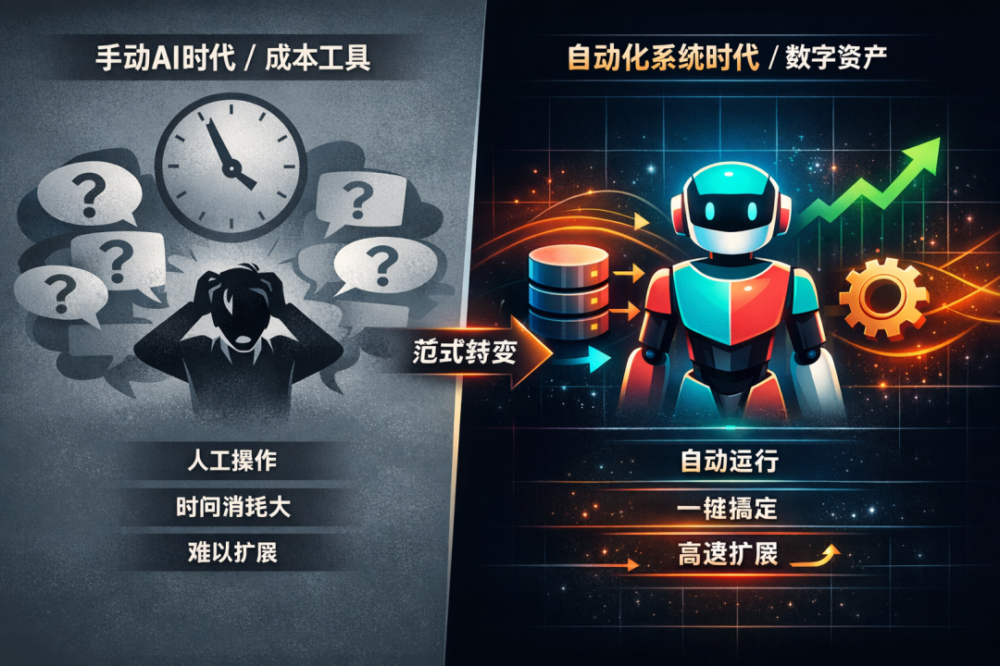
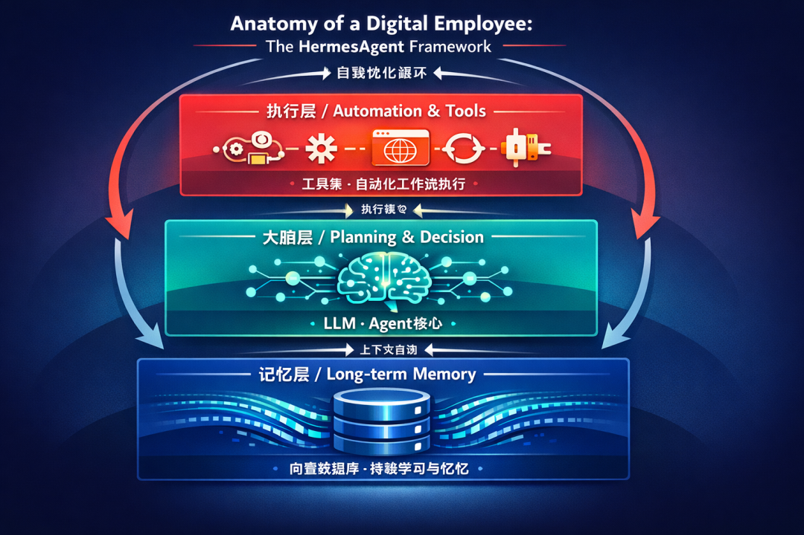
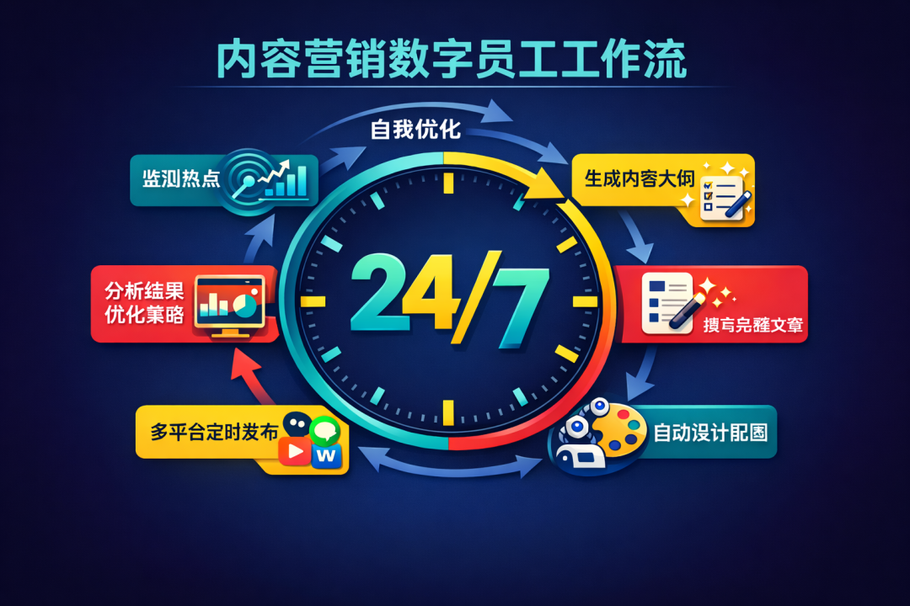
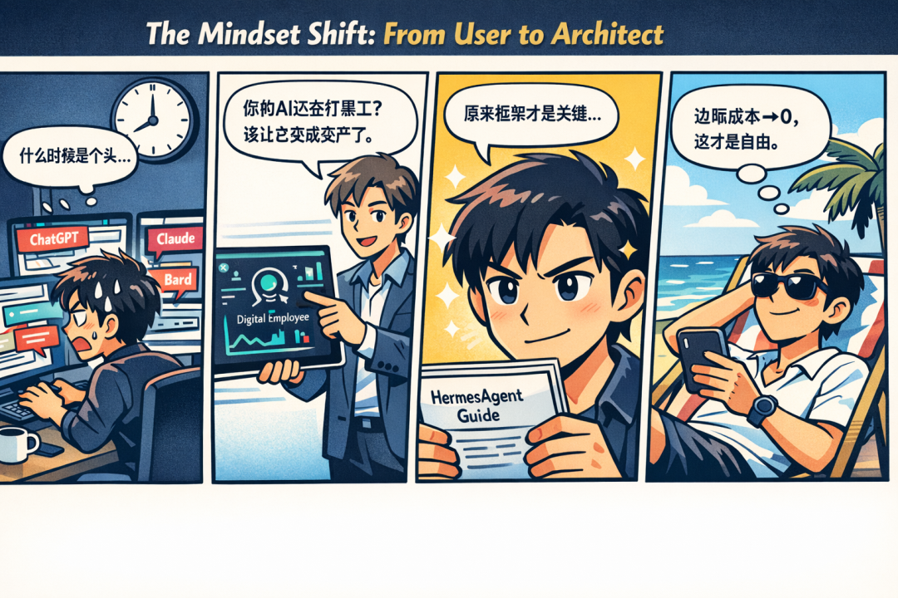

> 📎 来源: [亿人Group](https://mp.weixin.qq.com/s?__biz=MzcxMDE5OTQzMA==&mid=2247484058&idx=1&sn=0ed0c2f83c1fe073af03f471378e5a4c&chksm=f49a391e58236c8f10d83335e7c9849fdacb00edf05237b03f33e6fe54af74399712aac4eeca&mpshare=1&scene=1&srcid=04206MyVfJEjSVEB8zJUnYXT&sharer_shareinfo=686e00bc102989bc0bbdc7d0650ddff9&sharer_shareinfo_first=686e00bc102989bc0bbdc7d0650ddff9) | 时间: 2026-04-20 20:39

---

凌晨三点，你的Claude还在等你喂Prompt，像个嗷嗷待哺的婴儿。我的数字员工已经自动爬完了50个竞品网站，生成了本周的爆款选题库，并开始给第一批潜在客户发个性化邮件。

**别人在睡觉时，你的数字资产在自动增值，这才叫一人公司。你还在熬夜手搓Prompt，那叫给自己打黑工。**

别再手搓 Prompt 了。我只用10分钟，给自己雇了个24小时数字员工。

Nous Research开源的**HermesAgent**，两个月拿到27000+星，直接掀了桌子。这不是玩具，而是一个带**长期记忆、能自我进化、24小时在线**的数字员工原型。

如果你还在纠结哪个AI聊天更聪明，你已经被降维打击了。真正的差距，已经从“单次对话的质量”，变成了“**谁能把AI变成一套自动运转的赚钱系统**”。

> **核心转变：** 你的成本结构必须立刻改变。AI应用正从“工具时代”迈入“系统时代”。

重点结论

过去雇一个初级助理，月薪8000，每天产出10篇稿，他还会摸鱼。
现在，用HermesAgent这类框架搭一个“赛博助理”，**一次性部署成本几乎为零，边际成本趋近于零，7x24小时在线，永不抱怨。**

这直接回答了“选题门槛三问”：

1. **边际成本递减吗？** 是。代码写一次，跑无数次。
2. **能用AI或脚本自动化吗？** 是。这就是自动化本体。
3. **能省下至少3个人力吗？** 是。看下面场景。

这不是效率提升，这是**商业模式的颠覆**。HermesAgent的火爆，标志着一个拐点：**AI应用正从“工具时代”迈入“系统时代”**。工具需要你手把手操作，是成本；系统会自己干活，是资产。

对比图：左右分屏。左侧‘手动AI时代’：一个疲惫的小人面对…

## 你的AI，缺一个“硬盘”和“闹钟”

> **核心问题：** 你现在的AI用法，99%是错的。它最值钱的能力——持续学习和自主执行——被浪费了。

- **普通AI（你的现状）：** 你问，它答。答完就忘。下次同样的问题，你得重新描述一遍背景。**这是消耗你的时间。**
- **带“系统”的AI（如HermesAgent）：** 它会记住你所有的项目背景、客户偏好、工作流SOP。你只需要说“按老规矩，处理一下今天的竞品信息”，它就知道该去哪些网站、抓什么数据、用什么格式整理、发给谁。**这是在积累你的数字资产。**

风险提醒

区别的核心，在于有没有把**你的工作习惯、业务逻辑、知识库**，通过长期记忆沉淀下来，变成越用越值钱的系统。

框架图：一个名为‘数字员工核心系统’的层次化架构。底层是‘…

## 三步，把你的聊天玩具升级成印钞员工

风险提醒

别被“Agent”、“框架”吓到。核心就三步，工具都是现成的，照着抄就行。

**第一步：给它装个“记忆外挂”（硬盘）**

- **工具：** **ChromaDB** (开源免费) 或 **Pinecone** (免费额度足够起步)。
- **动作：** 别光聊天。把你所有的项目文档、客户记录、SOP手册，通过API喂给这些向量数据库。这就是它的“永久记忆库”。
- **结果：** AI不再失忆，你的业务知识成了可复用的资产。

**第二步：给它定好“工作流闹钟”（自动化）**

- **工具：** **n8n** (自托管免费) 或 **Zapier** (有免费额度)。
- **动作：** 设置定时触发。例如：每天上午9点，自动触发你的AI员工，让它去预设的RSS源抓新闻，结合记忆库里的客户画像，生成3条社交内容，并自动发布到平台。
- **结果：** **你每天早上的1小时手动工作，变成了系统的零成本定时任务。**

**第三步：让它学会“自我汇报和进化”（闭环）**

- **工具：** 利用HermesAgent的 **“自我反思”** 机制，或通过**LangChain**框架自行搭建反馈循环。
- **动作：** 在流程里加一个复盘环节。比如，每次发布的内容，自动抓取点赞、评论数据，让AI分析“什么话题互动率高”，并自动更新它的内容生成策略。
- **结果：** **从“你告诉它怎么做”，变成“它告诉你什么有效”。系统越跑越聪明。**

流程图：展示一个‘内容营销数字员工’的7x24自动化工作流…

## 两个场景，看它如何干翻一个团队

直接上案例，算笔账：

**场景一：本地服务公司的“自动销售机”**

- **之前：** 一个做办公室保洁的兄弟，每天花3小时手动搜企业名录、编话术、加微信发广告。相当于雇了半个销售。
- **现在：** 用HermesAgent框架搭了个Bot。记忆库存好服务套餐和话术。Bot自动从**企查查API**抓取新注册公司信息，判断规模，生成个性化邮件，定时发送。他每天花10分钟看报告。
- **人力替代：** **从半个销售（月成本约4000），降到接近0。** 触达量从1天30个，到系统1天自动跑300个。

**场景二：财经自媒体的“印钞流水线”**

- **之前：** 一个美股分析号，需要1个编辑找新闻，1个分析员写解读，1个排版。3人团队，日产2篇深度。
- **现在：** 系统自动抓取**SEC公告**、财经新闻（通过RSS或爬虫），结合记忆库里的“财报分析SOP”，生成初稿。编辑只做最后润色。
- **人力替代：** **直接省下2个人（分析师+排版，月成本至少1.5万）。** 产能从日产2篇，到1人监督系统，日产8篇，时效性碾压对手。

四格漫画：第一格，人物A深夜还在手动操作多个AI工具，满头…

## 今天下班前，用20分钟启动你的数字心跳

操作提示

**启动动作：** 别想一步到位造“贾维斯”。从最小闭环开始，感受“资产”和“工具”的区别。

**打开你的n8n或Zapier，设置这个自动化：**

1. **触发条件：** 每天下午5点。
2. **执行动作：** 调用**OpenAI**或**Kimi**的API，Prompt写死：“请根据我昨天处理的【你的具体业务，如‘跨境电商物流’】相关邮件和文档，总结今天待办事项的后续跟进要点，列出3条。”
3. **输出动作：** 把结果发送到你的飞书/钉钉/Telegram。

**这只需要20分钟。** 但明天下午5点，你会准时收到一份AI生成的“工作备忘”。这就是你数字员工的第一次心跳。感受一下，一个会定时主动给你汇报的“系统”，和一个需要你不断提问的“玩具”，本质区别有多大。

## 最后的风险与灵魂拷问

风险提醒

**风险提醒：** 别沉迷技术炫技。HermesAgent再牛，也只是引擎。你的业务逻辑、数据资产、工作流SOP，才是真正的油箱和方向盘。没有这些，引擎再好也跑不起来，你只是在玩一个昂贵的玩具。

所以，灵魂拷问是： **你花在“调教AI”上的时间，有多少是在积累可复用的数字资产（如记忆库、自动化流程）？又有多少，只是在满足自己“拥有一个聪明玩具”的幻觉？**

把你的答案，或者你打算搭建的第一个自动化场景，写在评论区。我们看看，有多少人真的想从“手工劳动者”，变成“系统设计者”。
