> 📎 来源: [丹姐拥抱AI中](https://mp.weixin.qq.com/s?__biz=MzI1OTQ1MjU0MQ==&mid=2247484022&idx=1&sn=013347d8026e9c69cd8aa9ca31006afe&chksm=eb971282dc3e3b10b2682b22ef2f69e1750e0ef075f6998d3837d77e2e320defdb0317632bde&mpshare=1&scene=1&srcid=0420GUvN4A2mQPPqNRB3LuEM&sharer_shareinfo=962722ac0dc92564ad447443eaf4d48d&sharer_shareinfo_first=962722ac0dc92564ad447443eaf4d48d) | 时间: 2026-04-20 15:39

---

昨天了解了下什么是Hermes.[Hermes 到底是什么？](https://mp.weixin.qq.com/s?__biz=MzI1OTQ1MjU0MQ==&mid=2247484011&idx=1&sn=fed834f6ed2cdd8734d15c26cc257cc5&scene=21#wechat_redirect)

今天我给自己安排了一个小任务：把 Hermes Agent 装起来。

说“小任务”，其实心里也没底。因为我一开始就很清楚，这不是那种点两下就能装好的 App。

所以我没有一上来就自己硬装。

我先做了一件很符合我现在状态的事：凡事先去问AI，所以我开启了 Claude。

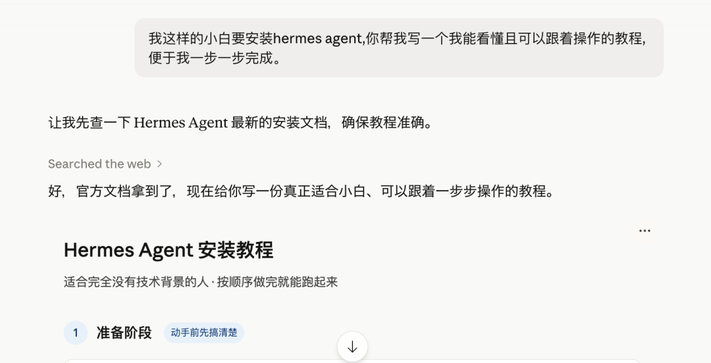

以前我们学工具，第一步是去搜教程。现在我们要学会先让另一个 AI 帮我把“我要怎么学这件事”从我的理解纬度给到更简便的方案。

从这个角度说，今天这件事还挺有意思的：我没有直接去学 Hermes，我先让 Claude当了一次我的安装教练，这个感觉还不错。

## 第一步挺顺：跟着教程走，Hermes 真的装上了

说实话，刚开始那一段比我预想中顺。（我是苹果电脑，本身更方便，win系统步骤有点区别，大家可以先问清楚）

- 步骤一：打开终端（最开始不知道终端是个啥，耽误了一会，搜索终端，打开即可）

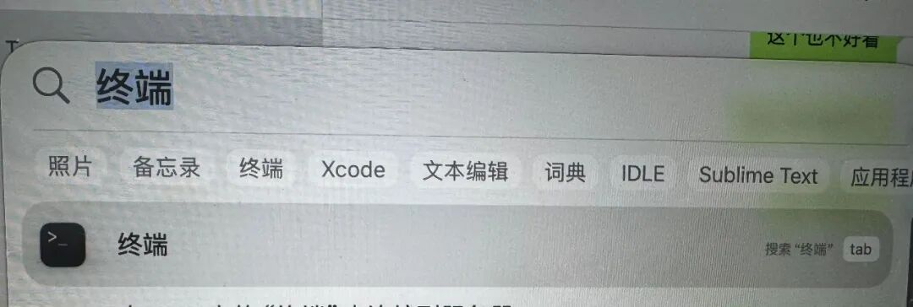

- 步骤二：输入命令，下面这行命令完整复制，粘贴到终端里，按回车：

  curl -fsSL https://raw.githubusercontent.com/NousResearch/hermes-agent/main/scripts/install.sh | bash

  它会自动下载并安装 Hermes 需要的所有东西，包括 Python、依赖库等，全程自动，你不需要做任何操作。

脚本跑起来以后，看到终端里一行一行往下走，等着就好了，全是代码，虽然不怎么看的懂，但很神奇。那种感觉就像你原本觉得看代码跑这件事离自己有点远，结果它在你面前真的发生了。

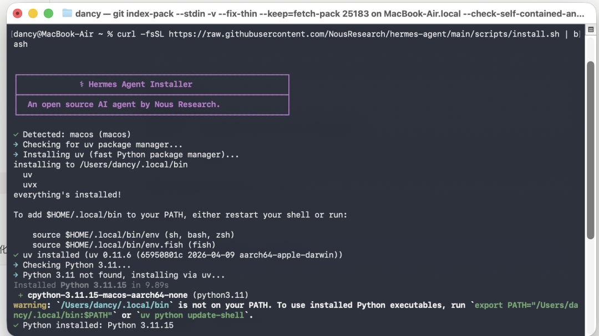

- 步骤三：接着就是 setup。

Hermes 给了两个选项，一个是快速配置，一个是完整配置。我没有逞强，直接选了推荐的 quick setup。回车即可。

对我这种第一次装的人来说，先跑起来，比什么都重要。

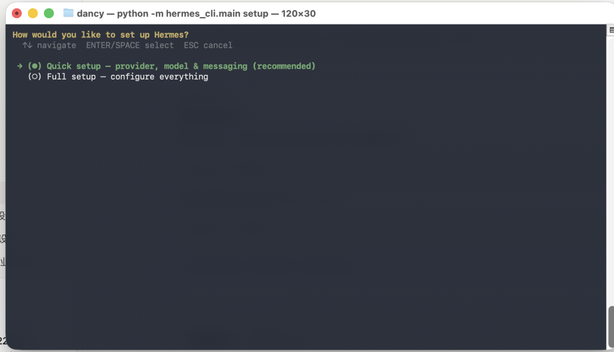

- 步骤四：选 provider。

模型选择这一步我盯着那一长串选项看了好一会儿，很多都不认识。OpenRouter、Anthropic、OpenAI Codex、DeepSeek、Kimi、Google AI Studio……在claude的建议下，我大致明白了我的背景需要怎么选择。

最后我按路径选了 `Qwen OAuth`，因为它写得最直接：复用本地 Qwen CLI 的登录。

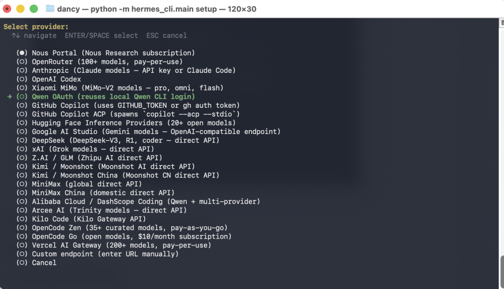

今天有个感受，很多 AI Agent 我们第一反应就是不会装，因为它好像默认你已经有一点点环境基础，否则看到这样的界面就懵了。但今天发现一旦前面有一个能接上的入口，后面就顺很多；没有这个入口，就会在选项页先迷茫。

- 步骤五：消息平台设置

模型选择完成后，就进入消息平台设置，看到了微信，钉钉，QQ等等都有，因为这个还没研究出来怎么配置，我选择了先跳过，后面再说吧，先用起来。

直接跳过这步。

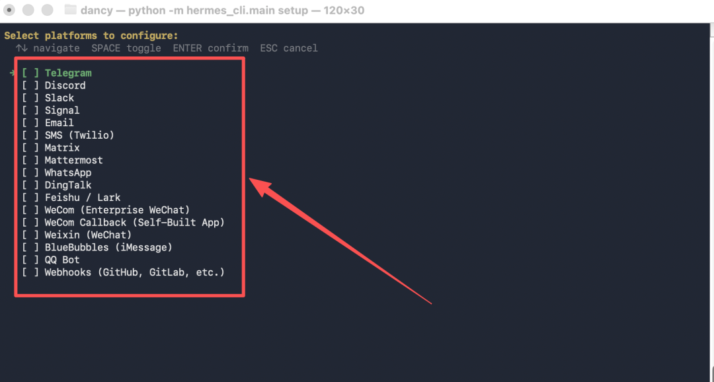

- ## 步骤六：启动对话

## 很快它自己就设置完成了，问我是否要启动 Hermes 对话，直接“Y”

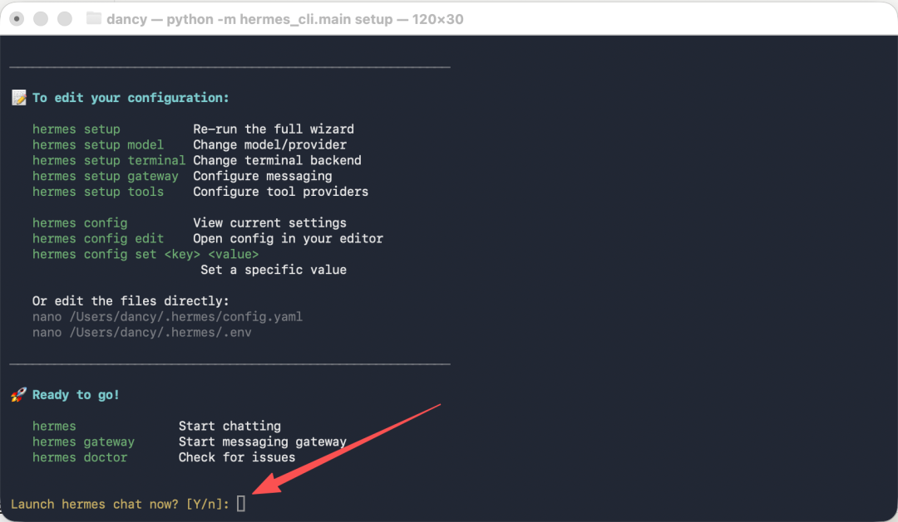

##

## 真正让我兴奋的，不是安装完成，而是它真的跑起来了

等 Hermes 真正在终端里起来的时候，还是挺开心的。

因为那个界面一出来，感觉好像完成了一件大事。

不是“我又装了个工具”，而是“我好像真的把一个不懂的东西也搞起来了。

界面一出来，把 available tools、available skills 一口气列出来，好多东西，原来这东西的想象空间比我刚开始理解的大得多。

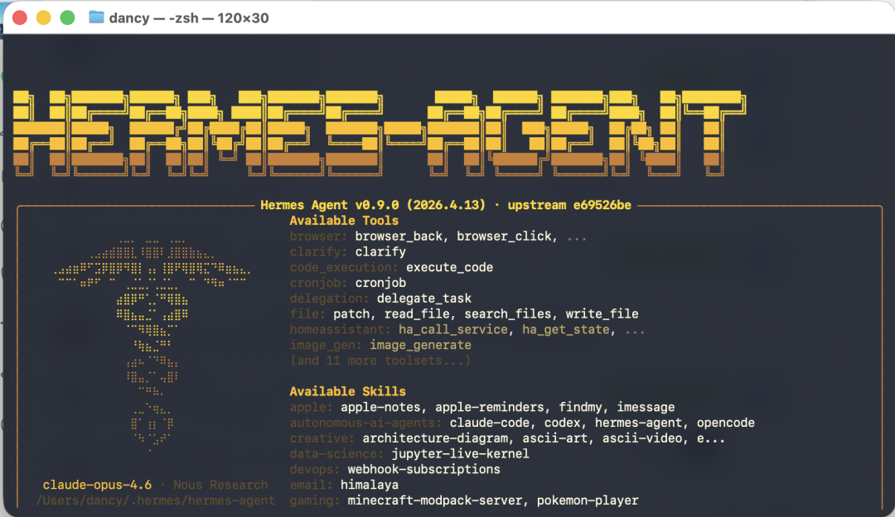

继续往下看，那种感觉更明显。

技能列表里从 apple、github、research 到 productivity、social-media、software-development，密密麻麻一大片。希望以后能够展现出它强大的本领

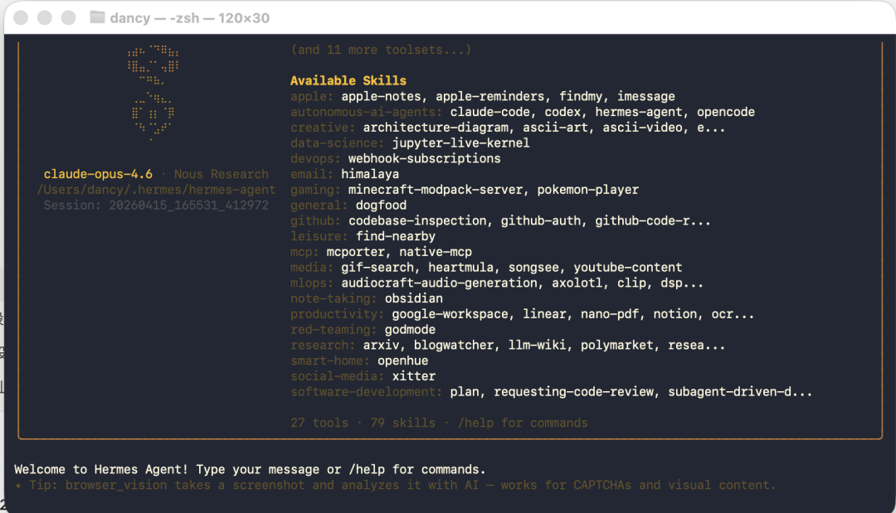

到这一步，基本上按照已经完成了。

安装，只是让它出生。

养成，才是后面的事。主要是想着能够怎么用。

## 中间是不是像写的那么顺利，也不是，中间也翻车过

当然，整个过程并不是一遍过。

中间我也翻了一次，爆了好几次错。

屏幕上先是抛了一个 `OSError: [Errno 22] Invalid argument`，然后我下意识去敲 `source ~/.zshrc`，结果又直接报了 `no such file or directory`。接着我又试了 `source ~/.bashrc`，还是不对。

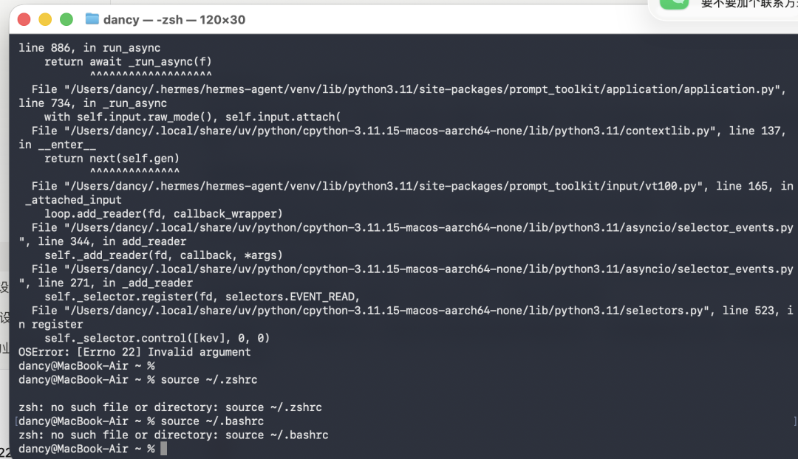

一时间我都有点想放弃，也去问了朋友，但后来我想到了，直接问AI啊，于是乎问题也是很快能解决了。

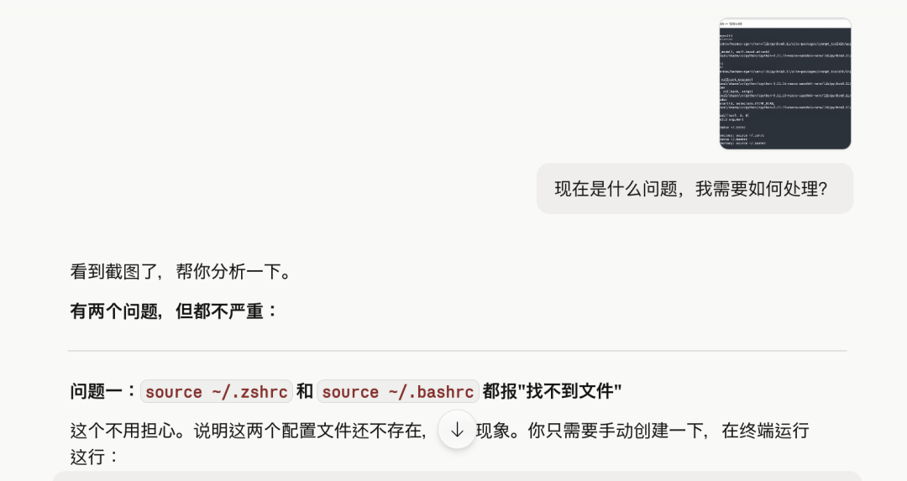

在以前，这种情况一定会把我卡住，但是现在不同了，有了AI工具的帮忙，确实高效了。有时候，我们不是不愿意学，反而是一碰到问题，无法求助，就选择最简单的方式：放弃。现在解决方案显然变得更直接。

但是你只有真的碰到过，就知道下次再看到类似的东西，不会那么慌。

## 到了晚上，我终于跟它说上了第一句话

晚上再打开 Hermes，我先跟它打了个最普通的招呼：你好。

它回我：“你好！有什么我可以帮你的吗？”

那一刻还挺奇妙的。

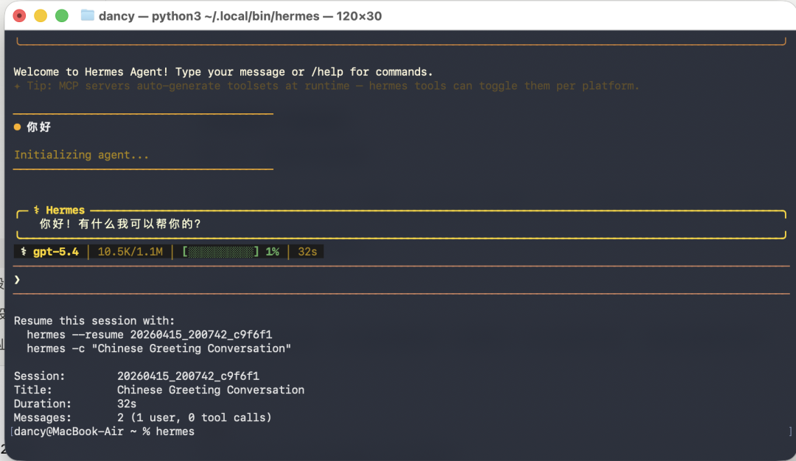

因为这不是什么复杂任务，也不是什么惊艳结果。

但对我来说，这句“你好”意味着：这次安装我成功了。

从白天先问 Claude 写小白教程，到下午照着一步一步装，到中间报错、试错、再回来，最后真的跟 Hermes 对上话，这一整天终于闭环了。

## 但我今天最大的感受，真正去拥抱AI,其实还不赖，自己要你走出启动那一步

Hermes Agent 我已经装好了。

但装好，不等于养好。

因为我现在其实还没走到最关键的那一步。

微信还没绑，TG 也还没绑。也就是说，它现在只是先在我的电脑里活过来了，但它还没有真正进入我的生活流和工作流。

而我自己现在最感兴趣的，恰恰是后面这段。

我希望它能变成一个我可以并且愿意长期用、也真的能替我解决一些复杂问题的 Agent。

## 写给同样想试的人一句话

如果你现在也对这类 Agent 感兴趣，但还停在“我连第一步都不知道怎么走”，我今天的感受可能对你有用。

不要一上来就想着把所有原理搞懂。

也不要先问自己“我是不是技术不够”。

先找一个你能看懂的路径，把它装起来，哪怕中间会卡，哪怕最后只是先说上一句“你好”。

这是我的Hermes Agent 养成日记的第二篇，接下来继续加油吧！

据说Hermes Agent 会自己更新技能，更稳定，未来的应用场景中慢慢感受吧～

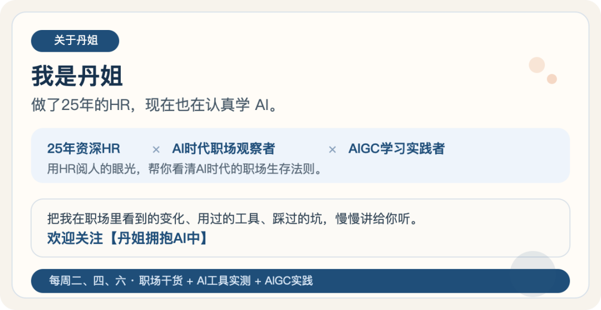
