> 📎 来源: [探索AGI](https://mp.weixin.qq.com/s?__biz=MzkxNjcyNTk2NA==&mid=2247492448&idx=1&sn=23762bcc66107b2fbb00ca2bcc8cd5a6&chksm=c0a8f04c6d1d50138f5052fb1d3a62e787f5518664efdab355b292c082543961f7eeb6281b5a&mpshare=1&scene=1&srcid=0420iP60EdJdHqmLXTc5dpUg&sharer_shareinfo=d2a6c618853f3badbfc784e7c5fa8f45&sharer_shareinfo_first=d2a6c618853f3badbfc784e7c5fa8f45) | 时间: 2026-04-20 15:38

---

Hermes Agent 太火了。自进化真的太好玩了，用久了回不去。

最近为了快速看一些开源项目，我搓了一个小工具。类似于deepwiki、zread那种，完整拆解一个github项目。

但是Mermaid，Excalidraw 这些都玩腻了，我研究了下怎么生成动画视频。网上比较经典的是Manim 库， 3Blue1Brown 做教学视频就是用的这个风格。

这玩意我之前一直觉得是数学领域专用的，但是拿来做技术架构讲解，好像也还不错。另外还有ASCII Video，可以做出来一些很有氛围感的终端动画。 举个例子，我拿Hermes项目做的一个原理拆解视频：

其实想画好Manim这种图还挺麻烦的。各种渲染翻车，文字重叠，箭头指不对，还好有自进化的龙虾，可以持续的总结记忆。

顺着说一下Hermes。如果你是Windows用户，其实想用Hermes还挺折腾的。因为Hermes不支持原生Windows，需要用WSL，在微软商店下载Ubuntu可能就是第一个卡点了，很容易报错。

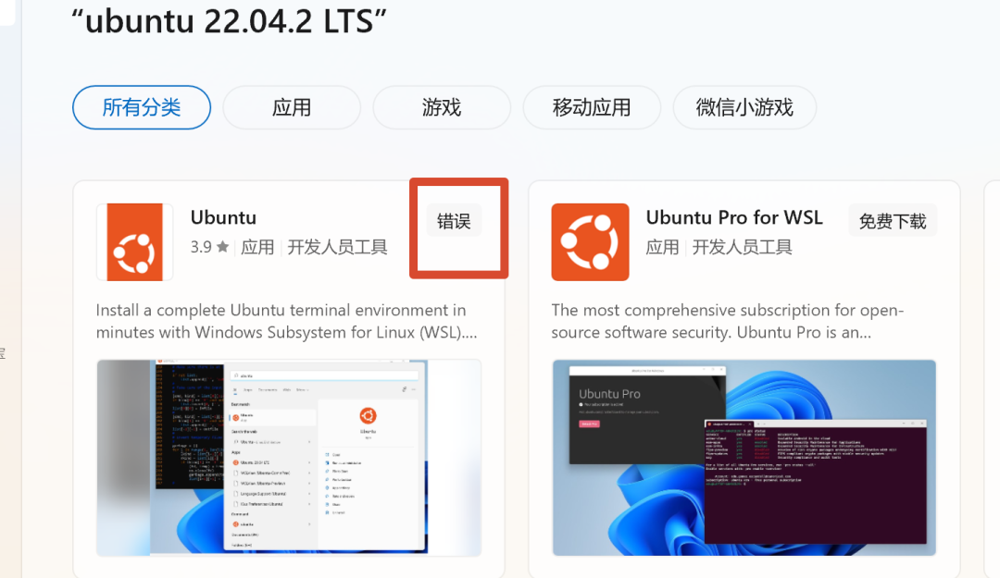

周五刷到帖子，智谱的Autoclaw更新了自进化的机制，目前应该只有这只国产虾支持原生的进化机制。所以这里先用智谱的澳龙测试一下。

举个很简单的例子。我想做一个Manim渲染视频，首先需要确定下Manim是否支持中文字体渲染。我让AutoClaw去做了一番测试。

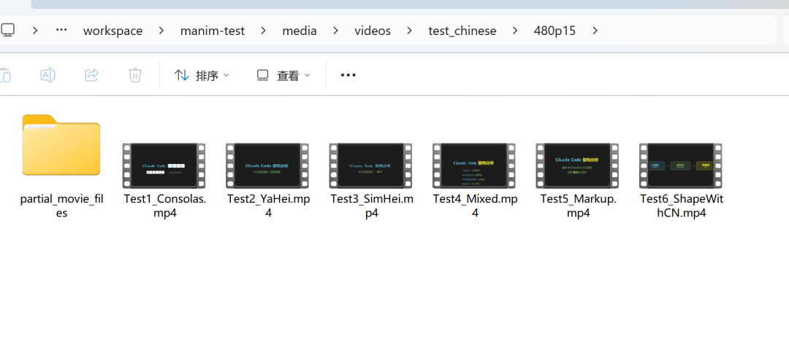

然后发现完全可行。它总结了一下经验。给我弹出来了一张卡片。可以让我确认是否要进化。

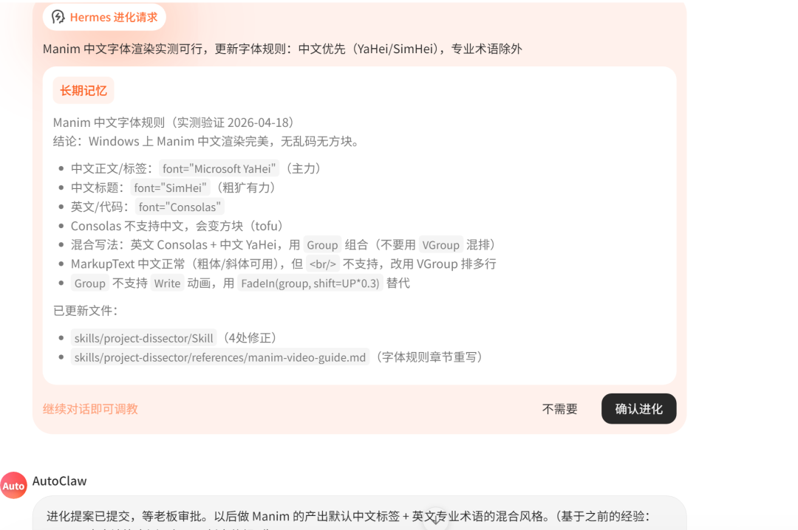

这个就是AutoClaw的自动进化机制，目前似乎是有2种模式，一种是识别到我们的意图，比如“以后xxx”，就会触发记忆存储。另外一种，是他发现这个过程足够复杂，踩了坑，后续可以持续复用，也会触发记忆。

点了批准之后。后面所有，在他制定Manim方案的时候，就会以中文优先。

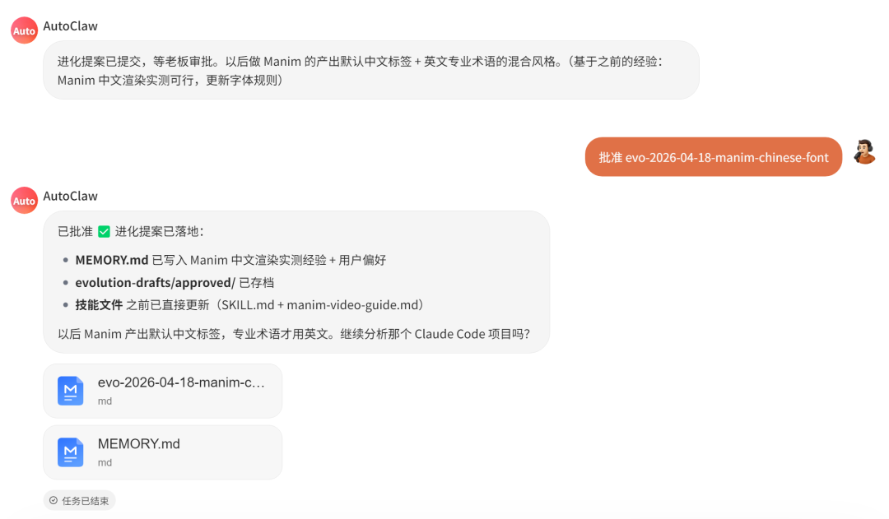

最搞笑的是，进化还有速度。高速模式下，很容易就触发记忆更新。

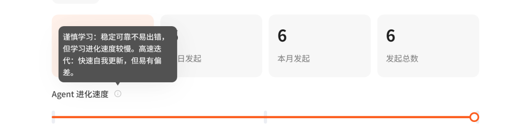

我记得，上一次拖滑条，可能还是推理大模型的thinking budget，可以拖动决定大模型的思考预算。

现在这种进化也有滑条，想让他快速的进化，就拖多一点，想稳一点，就拖少一点。我开的是高速模式，确实很容易就触发进化请求卡片了。

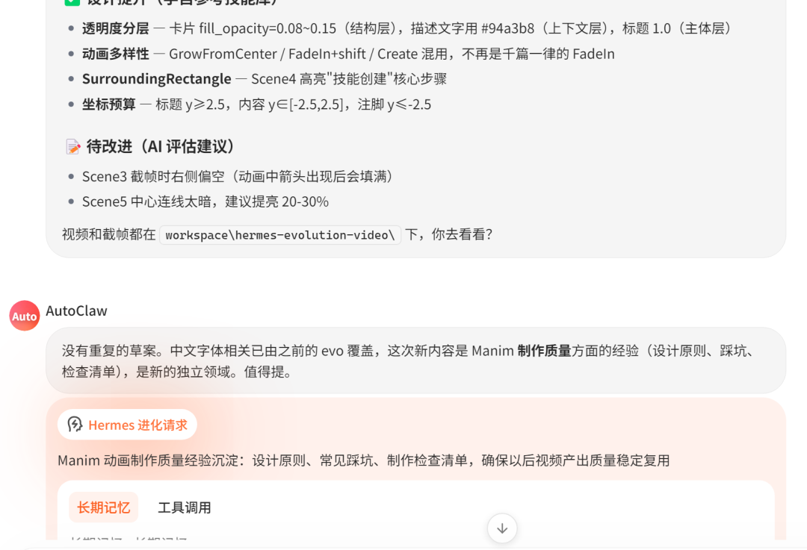

花了一下午的迭代，终于把这个给调教到这个样子了。可以1080p 60帧的动画。在举个claude code 核心循环的视频例子。

整体内容受限于脚本，比如下面这个视频就是完全不同的画风。

最后，让澳龙拆解完整个项目，动态组合Mermaid、Architecture Diagram、Manim Video、ASCII Art、ASCII Video几种绘图方式，自动建立项目wiki。

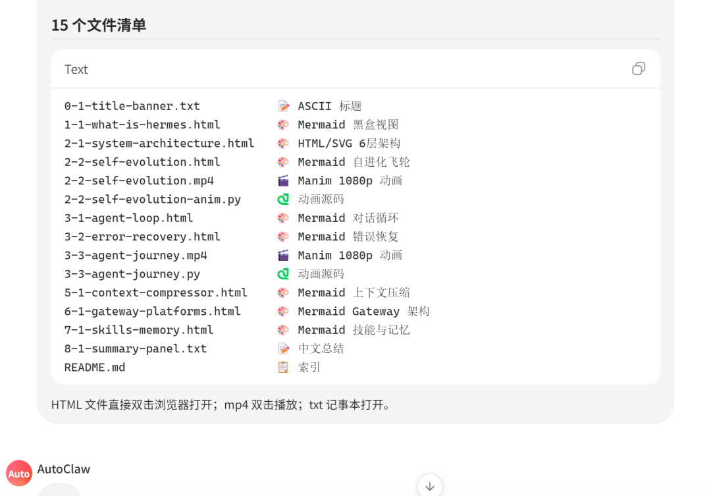

看起来这个样子，整体还是很清晰了。(目前还不太稳定，但是可以评论区获取完整skills。)

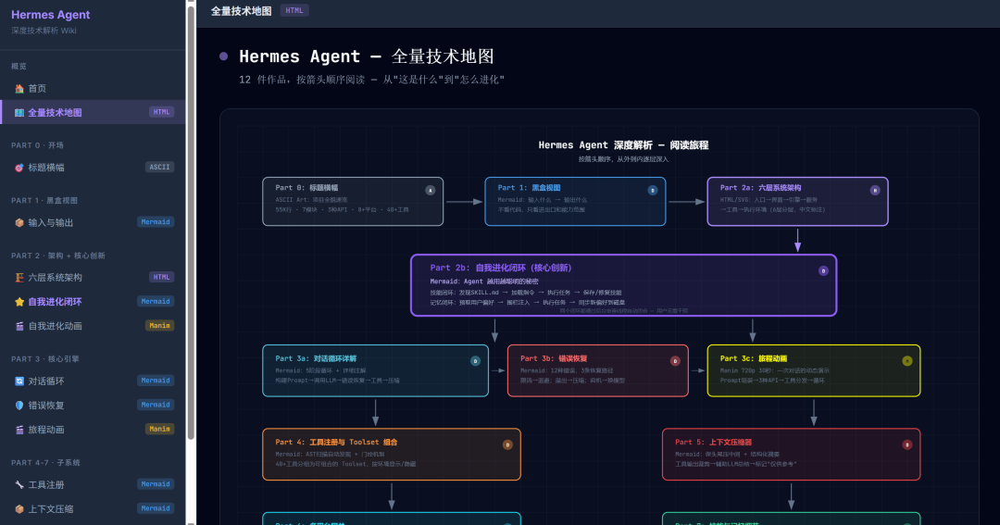

值得一提的是，Autoclaw的skills商店也有很多比较出名的skills。

比如花叔的 女娲skills，随便输个人名，自动把这个人的思维方式浓缩成skills。 自己就可以去复刻审美乔布斯、Karpathy.skills了。 还有张咋啦Zara的那个frontend-slides skills， 我最近都经常用，逼格是真的高。

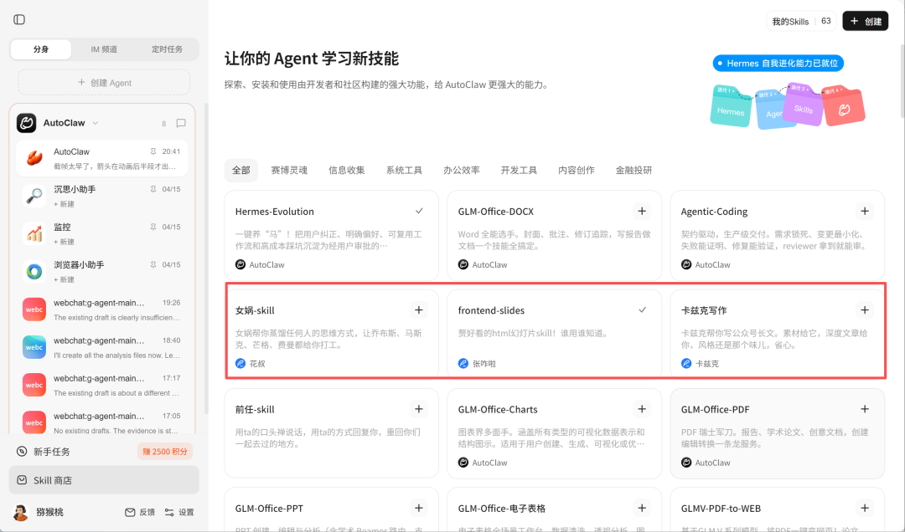

我用张咋啦的这个skills优化了一下刚刚这个wiki页面。 配色，字体都可能逼格高一些了，是个很高的设计起点了。

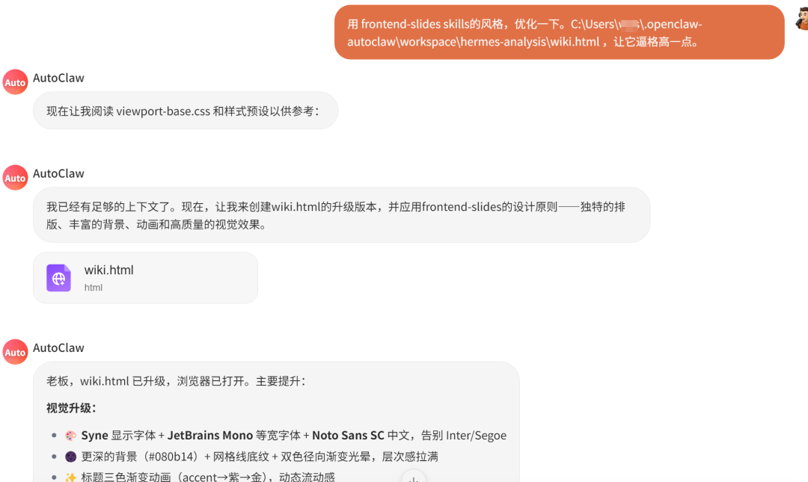

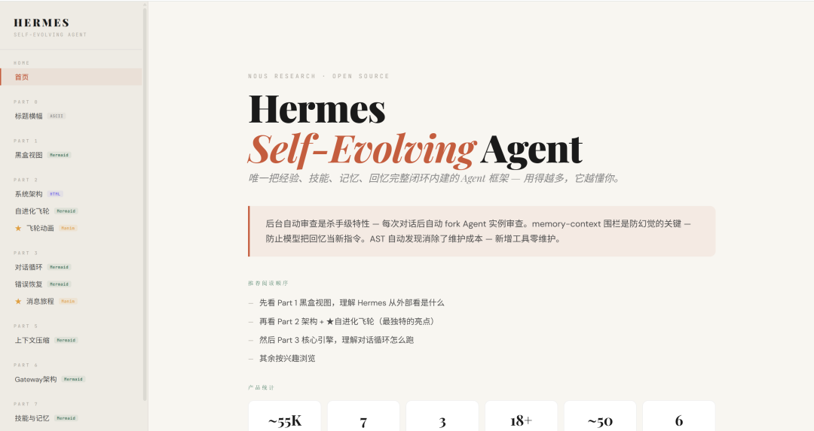

回到最开始的事情。

其实很多时候，我们调教AI的过程，养龙虾的过程，不断指导模型往预期的方向走。这个过程本身，就是一个最原始的自进化循环。

踩坑，纠正，发现规律，记住，下次不再犯。

以前你得始终强调龙虾去记录过程，更新记忆，自己给它列踩坑经验。

现在用这些带自进化的龙虾就可以帮你干了，起码爱马仕和AutoClaw都是这样。

最近DSPy加GEPA、自动Skill生成这些概念炒得很火。Hermes把自进化写进了框架里边，但我觉得大部分人看完还是一脸懵。

而AutoClaw做的事情其实就很简单了。不需要搞明白这些概念。打开它，用就行了。教过一次的事情它记住，踩过的坑它不再踩。

就这样。

AutoClaw下载地址 https://autoglm.zhipuai.cn/autoclaw/?channel=AutoClaw10   或点击阅读原文自动跳转。
