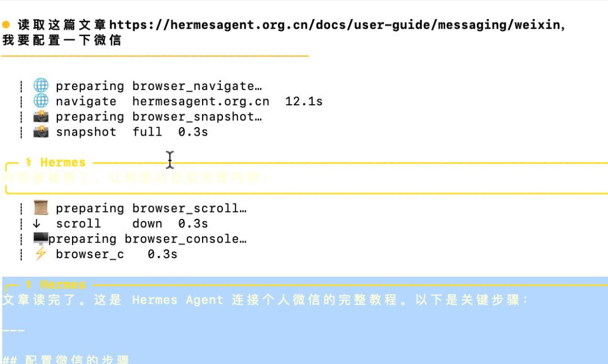
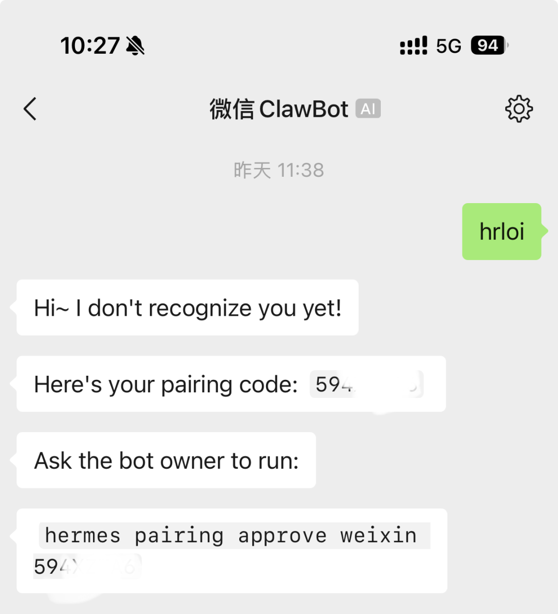
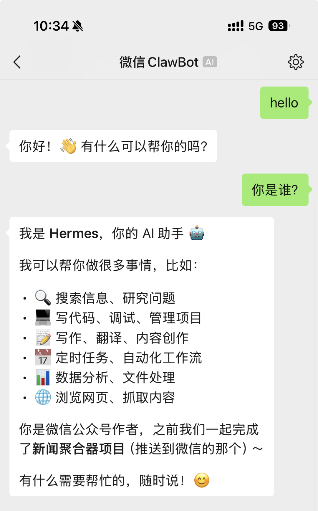
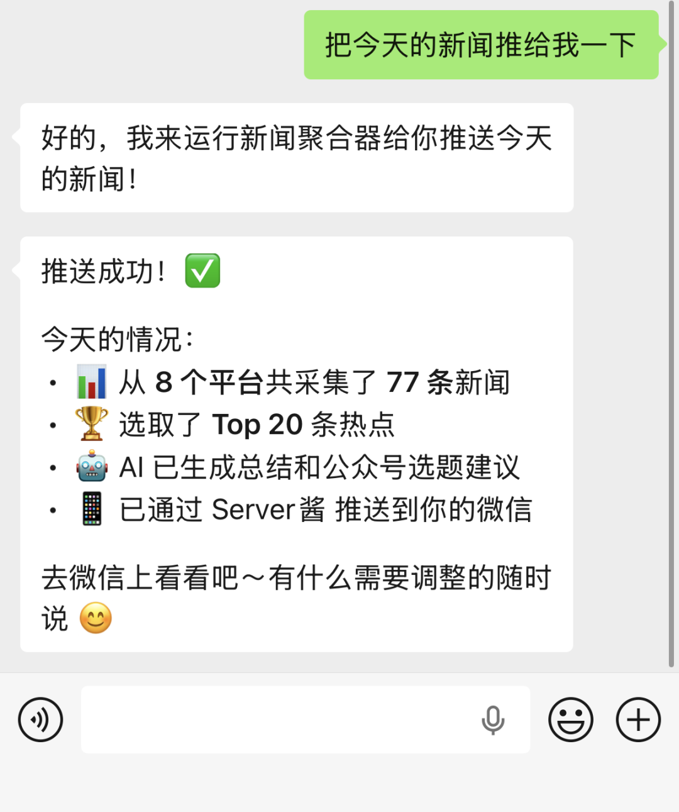
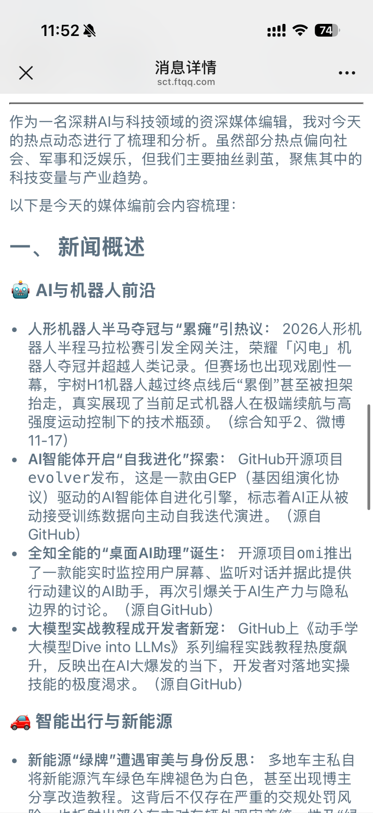
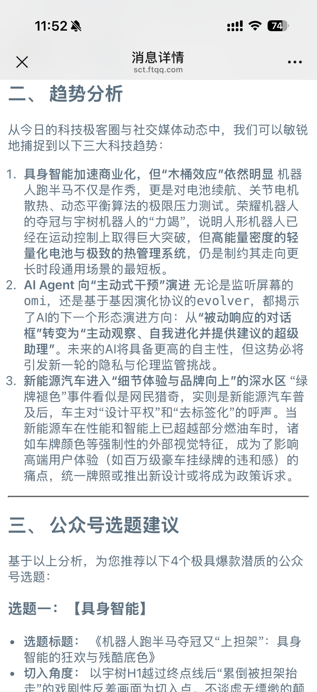
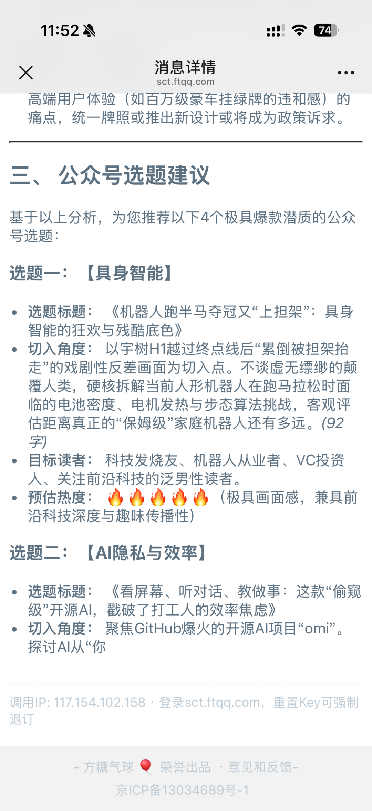

> 📎 来源: [AI学不会](https://mp.weixin.qq.com/s?__biz=MzAwMzU3Nzk4Nw==&mid=2247484105&idx=1&sn=571b587f51af1d9669504b5134044a7e&chksm=9a6a9d2bf3a1f3fd8790853944eeff37507de17be9c0e940992bd69198a637f9ae9d51367d59&mpshare=1&scene=1&srcid=0420OypopQhLTuxdeo64ZTQr&sharer_shareinfo=bc018e333699244c0f1b68184c51b7ca&sharer_shareinfo_first=bc018e333699244c0f1b68184c51b7ca) | 时间: 2026-04-20 19:37

---

# 前阵子用 OpenClaw 跑通了新闻聚合推送（[养虾日记🦞-我用4个AI Agent，搭了个内容创作团队](https://mp.weixin.qq.com/s?__biz=MzAwMzU3Nzk4Nw==&mid=2247484039&idx=1&sn=fcfe3903019c4c44994f3c1ccd511ade&scene=21#wechat_redirect)），定时抓新闻、整理好发给我，体验还行。

但有个问题：它只能推到飞书和邮箱。飞书我日常不怎么开，邮箱看新闻总觉得差点意思——我每天打开最多的，还是微信。

所以我就想，能不能直接把新闻推到微信上？

最近刚好在研究 Hermes Agent，它也支持原生支持微信接入。折腾了一下，居然很快就搞定了。今天把过程记一下。

## 为什么选 Hermes Agent

先简单说下 Hermes Agent 是什么。

它是 Nous Research 今年2月推出的开源 AI Agent。跟其他 Agent 最大的不同是，它有个**自学习闭环**——你用它完成任务，它会总结经验，自动生成可复用的 Skill。说白了就是越用越聪明。

我之前用 OpenClaw 配置新闻推送，得手写 SOUL.md、AGENT.md、各种配置文件。就像招了个助理，工作手册得你从头写到尾。

Hermes 不太一样。你给它一个任务，它自己学着做。做完一次，下次就会了。

这次接入微信，让我体验了一把这个"自学习"。

## 接入微信：最省心的一次配置

说实话，我一开始做好了折腾半天的准备。毕竟接入微信这种事，光各种桥接工具的配置就够头疼的。

现在有agent，就不用再一步一步手动去配置了

我的操作是这样的：**把官方文档链接丢给 Hermes，让它自己看。**



它读完后，自己整理出了一份详细的配置计划，然后一步一步执行：

**第一步：安装依赖**

```
pip install aiohttp cryptography qrcode
```

**第二步：运行设置向导**

```
hermes gateway setup
```

选 Weixin，终端弹出二维码，用微信扫一下，搞定。凭证自动保存。

**第三步：配几个环境变量**

编辑 `~/.hermes/.env`，把账号信息填进去就行。token 是扫码时自动保存的，不用手动折腾。

```
WEIXIN_ACCOUNT_ID=your-account-idWEIXIN_DM_POLICY=open
```

**第四步：启动网关**

```
hermes gateway
```

就四步。整个过程大概十几分钟。

配置完后，微信里会多出一个 ClawBot 的会话。它会生成一个配对码，你把码告诉 Hermes，就连上了。



连上之后，微信上就多了个大模型助手，直接跟它对话就行。



最让我意外的是：**配置过程不是我一点点照着教程敲的，而是把文档丢给 Hermes，它自己读完、自己规划、自己执行的。**

你不用手把手教它怎么配，它自己学会了。这不就是"自学习"的样子吗。

## 跑一下新闻推送

微信连上后，我试了一下原来配好的新闻推送任务。

直接在微信里跟它说：跑一下新闻推送。它就开干了。



搜索新闻、筛选整理、生成摘要，最后推送到微信上。

看下效果：

|  |  |
| --- | --- |
|  |  |

新闻源和内容是我之前用 OpenClaw 时候配好的 Skill，主要关注 AI、科技这些我感兴趣的领域，不是它随便抓的。

## 几点真实感受

**好的地方：**

接入微信真的很方便。以前用 OpenClaw 推到飞书，总觉得不是自己的"主场"。现在直接推到微信，打开就能看，舒服多了。

而且 Hermes 这个"自学习"确实不是吹的。你看我连配置过程都是让它自己学的，跟之前手写一堆配置文件完全不一样。

**还可以更好的地方：**

目前新闻源还是之前 OpenClaw 的 Skill，Hermes 还没完全"学会"我的偏好。用多了之后，它应该会自动迭代，越来越懂我关注什么。但这个得跑一段时间才知道。

另外，新闻定制化的空间还很大。比如指定更可靠的来源、排除不想看的内容、按重要性排序。这些都可以通过优化 Skill 来实现。

## 最后

从 OpenClaw 到 Hermes，最大的感受是：**配置 Agent 越来越不需要"教"了。**

以前是"你教它做事"，现在是"它自己学着做"。虽然还不到完全自动化的程度，但趋势已经很明显了。

感兴趣的话可以试试 Hermes Agent，流程对小白还算友好，不用写代码，照着步骤来就行。

后面我打算多跑几天，看看自学习效果到底怎么样。有了更多数据再来聊。
