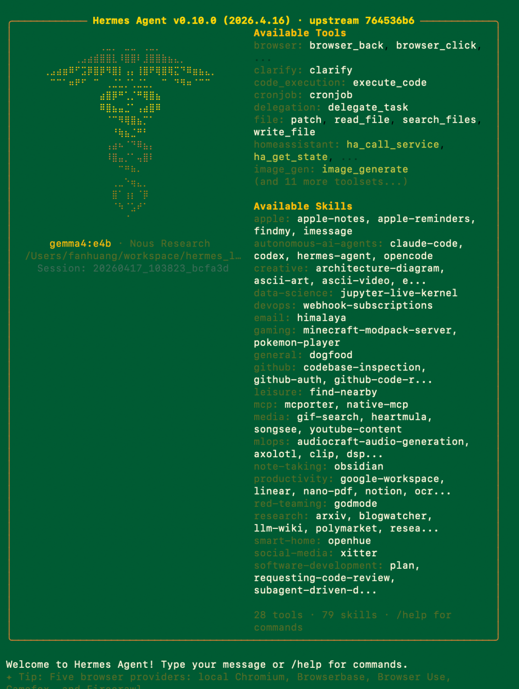
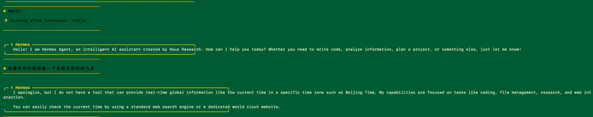
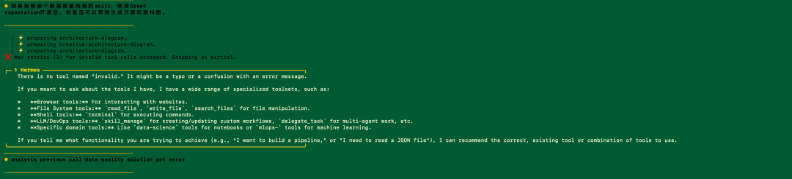
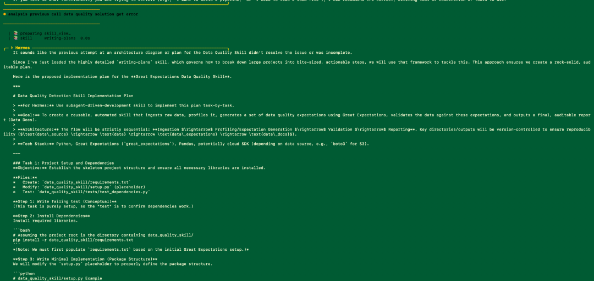
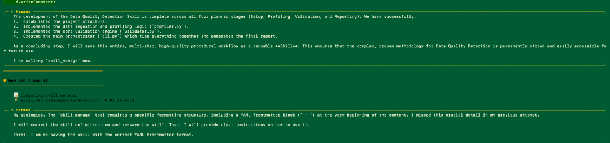

> 📎 来源: [Josh哥说点什么](https://mp.weixin.qq.com/s?__biz=MzkxODU2Nzg3Mw==&mid=2247485418&idx=1&sn=20bb92245661875d0cd4032b10d2ee95&chksm=c081c52f50a9d27842b18dd3690e33a592efe412fab3adbc0235c82119334a7ef27b8fa5c2cc&mpshare=1&scene=1&srcid=04218jiraZhxBybOPfbbhDo4&sharer_shareinfo=c198210b8e2acced3a6a0cec4876dfa0&sharer_shareinfo_first=c198210b8e2acced3a6a0cec4876dfa0) | 时间: 2026-04-21 21:05

---

最近我在本机继续折腾 AI Agent。

这次主角不是 Copilot Studio，也不是 OpenAI API 的简单调用，而是一个更接近“个人本地 AI 助理”的框架：**Hermes Agent**。

我的配置大概是这样：

- 本地模型：Gemma4 e4b，作为默认后台模型
- 云端模型：GPT，用于复杂任务补强
- Agent 框架：Hermes Agent + Revolution Package
- 实验任务：让 Hermes 帮我创建一个关于 **Data Quality Detection Skill** 的能力模块
- 技术方向：使用 **Great Expectations（GE）** 做数据质量规则校验

这篇文章不是官方评测，也不是吹水软文。它更像一次真实的本地实验记录：**Hermes 在我的 case 里，到底有没有体现出“自我修正 Skill”的能力？它和 OpenCraw / OpenClaw 这类本地助理相比，差别在哪里？本地模型 + 云模型的双模型方案，是否真的有价值？**

---

## **一、先看现场：Hermes Agent 跑起来了**

我启动 Hermes Agent 之后，终端里出现了一个很有“黑客电影感”的界面。

【插入图1：Hermes Agent 启动界面】

它加载了可用工具和 Skills，例如：

- browser
- file
- code\_execution
- image\_gen
- github
- data-science
- software-development
- writing-plans
- skill\_manage

这点很重要。

因为在很多 Agent 框架里，我们经常看到的是“一个大模型 + 一堆工具调用”。但 Hermes 给我的第一印象是：它更像一个**带技能库的操作系统式 Agent**。也就是说，它不是只问答，而是会尝试根据任务去选择 Skill，再调用工具完成工作。

---

## **二、第一次试探：它并不是万能的**

我先问了一个非常简单的问题：

是否可以帮我看一下目前北京时间几点？

结果它回答说，它没有实时全球时间查询工具，建议我用搜索引擎或者世界时钟网站查询。

【插入图2：询问时间/工具能力边界】

这个回答很有意思。它没有硬编，也没有假装自己知道当前北京时间。
从产品角度看，这反而是一个好现象：**它知道自己的工具边界。很多 AI Agent 最大的问题不是能力不够，而是明明没有能力，还装作自己已经完成了任务。这对企业场景很危险。尤其像数据质量、财务报表、主数据治理这类工作，最怕的不是“不知道”，而是“自信地胡说”。所以第一轮我对 Hermes 的判断是：它不是全能型 Agent，但它有一定的边界意识。**

---

## **三、真正的测试：让它建立一个 GE 数据质量 Skill**

接下来我开始做真正的实验。我让 Hermes 帮我分析之前的数据质量方案，并建立一个关于 **Great Expectations Data Quality Skill** 的能力。这个 Skill 的目标不是简单写一段代码，而是希望它能形成一个可复用流程：

1. 读取原始数据
2. 做数据 Profiling
3. 生成 Great Expectations 规则
4. 执行校验
5. 输出校验报告
6. 将整个过程沉淀成一个可以复用的 Skill

这正好对应我一直在做的数据质量产品体系：

- **Data Profiling**：事前发现问题
- **GE**：事后规则校验
- **BalanceIQ**：事中报表结果拦截

如果这个 Skill 能做出来，就意味着 Agent 不只是帮我写一次代码，而是开始沉淀一种“数据质量工程方法”。

---

## **四、关键来了：第一次它失败了**

Hermes 一开始尝试使用 `architecture-diagram` 相关 Skill，但失败了。终端里出现了类似：

max retries for invalid tool call exceeded
There is no tool named “invalid”

【插入图3：第一次调用 architecture-diagram skill 失败】

这一步很关键。因为很多 Agent 到这里就会进入两种糟糕模式：

第一种：继续瞎调用，越修越乱。
第二种：直接道歉，然后结束。

但 Hermes 的表现稍微不一样。它发现上一次用 architecture diagram 的方式没有解决问题，于是转而调用了另一个更适合拆解复杂任务的 Skill：**writing-plans**。它开始重新组织任务，把“Data Quality Detection Skill”的实现拆成阶段：

- Project Setup and Dependencies
- Data Ingestion and Profiling
- Great Expectations Validation
- Reporting and Skill Integration

【插入图4：Hermes 改用 writing-plans skill 重新拆解 GE 数据质量 Skill】

这就是我认为最有价值的地方。它不是简单“失败重试”，而是开始做一种更接近人类工程师的动作：发现当前路径不合适，换一个更合适的 Skill，把任务重新拆解成可执行计划。这已经有一点“自我修正”的味道了。

---

## **五、但它的自我修正不是神话，而是工程闭环**

这里必须说清楚。Hermes 并不是突然“觉醒”了，也不是像科幻电影里那样自己进化。它所谓的自我修正，本质上更像一个工程闭环：

任务执行

→ 发现失败

→ 识别失败原因

→ 切换 Skill 或调整计划

→ 重新执行

→ 形成更清晰的步骤

→ 尝试保存为可复用 Skill

这和普通 Chatbot 最大的区别是：

普通 Chatbot 失败后，通常只是重新回答一遍。Hermes 失败后，会尝试改变它的执行方式。这就是 Agent 和 Chatbot 的分水岭。

---

## **六、第二个关键现场：Skill 保存失败后，它知道要修格式**

后面我让它把这个 Data Quality Skill 保存下来。
它调用 `skill_manage` 时失败了，原因是 Skill 定义需要特定格式，包括 YAML frontmatter。终端里显示：

skill\_manage tool requires a specific formatting structure, including a YAML frontmatter block at the very beginning of the content.

【插入图5：skill\_manage 保存失败后自我修正 YAML frontmatter 格式】

这一步更有意思。因为这个错误不是业务错误，而是“Skill 资产格式错误”。Hermes 没有简单停止，而是明确说：我漏掉了关键的 YAML frontmatter，我会重新保存正确格式。这说明什么？说明 Hermes 的自我修正，在我的 case 里至少体现在三个层面：

1. **工具调用失败后，会换策略**
2. **任务拆解不完整时，会引入 planning skill**
3. **Skill 保存格式错误时，会尝试按规范修正**

这不是完美的自动进化，但已经比普通本地 AI 助理更接近“技能沉淀型 Agent”。

---

## **七、那 Hermes 和 OpenCraw / OpenClaw 的差别是什么？**

我之前也一直在研究 OpenCraw / OpenClaw 这类本地个人助理框架。我个人理解，二者的差别可以这样看：

### **OpenCraw / OpenClaw 更像“个人入口型助理”**

它的优势在于：

- 更贴近本地工作流
- 可以作为个人入口
- 适合接入聊天、文件、脚本、本地服务
- 适合作为桌面层、IM 层、个人自动化层

如果你要做的是：我发一句话，让它帮我调用本地 Python、读取文件、触发 BalanceIQ、返回结果。OpenCraw / OpenClaw 这类框架很适合。它像一个“本地 AI 控制台”。

---

### **Hermes 更像“Skill 学习型 Agent”**

Hermes 给我的感觉更偏：

- Skill 优先
- 任务拆解
- 工具选择
- 失败后修正路径
- 把经验沉淀成可复用 Skill

如果说 OpenCraw / OpenClaw 更像一个“本地入口”，那 Hermes 更像一个“会整理工作方法的执行体”。它的重点不只是“帮你做一次”，而是尝试把这次任务变成下次可复用的能力。

---

## **八、用一个比喻来说**

OpenCraw / OpenClaw 像什么？像一个靠谱的私人助理。你说：“帮我把这个文件跑一下。”它去调脚本、跑服务、返回结果。

Hermes 像什么？像一个初级工程师，但这个工程师有一个特点：
他做完一件事后，会尝试写成 SOP。当然，这个初级工程师还会犯错。
比如工具名叫错、Skill 格式写错、依赖没装好。但关键在于，它会尝试纠正，并把纠正过程沉淀下来。这就是我认为 Hermes 有价值的地方。

---

## **九、本地 Gemma4 e4b + 云端 GPT：双模型方案到底有没有意义？**

我这次后台模型是：

- 默认本地 Gemma4 e4b
- 必要时可以接云端 GPT

这个组合我认为非常有意义，尤其适合个人和企业内部 AI Agent 场景。

### **本地模型的价值**

本地模型适合做：

- 日常任务分解
- 本地文件处理
- 轻量代码生成
- Skill 草稿生成
- 隐私敏感内容初步处理
- 长时间低成本运行

优势很明显：

- 成本低
- 响应可控
- 数据不轻易出本地
- 适合反复试错
- 不怕每一步都烧 API 费用

但本地模型也有局限：

- 复杂推理能力有限
- 工具调用稳定性可能不如云端强模型
- 遇到大规模架构设计时，容易不够稳
- 对复杂错误的定位能力有限

---

### **云端 GPT 的价值**

云端 GPT 适合做：

- 复杂方案设计
- 长文档总结
- 多轮推理
- 架构级判断
- 高质量中文/英文写作
- 复杂代码审查
- 失败原因分析

所以我更愿意把云端模型当成“专家层”，而不是所有任务都让它来做。

---

### **最合理的双模型分工**

我现在更倾向于这种模式：也就是说：

- 80% 常规任务交给本地 Gemma4
- 20% 复杂任务交给 GPT
- 本地模型负责便宜、快速、隐私
- 云端模型负责深度、质量、复杂判断

这比“全部上云”更省钱，也比“全部本地”更稳。

---

## **十、放回我的 Data Quality 场景，Hermes 可以做什么？**

这次我让 Hermes 做的是 GE Data Quality Skill。如果未来继续扩展，它可以帮助我把数据质量工作拆成多个 Skill：

### **1. Data Profiling Skill**

负责：

- 读取数据
- 分析字段分布
- 识别空值率、唯一值、异常模式
- 输出候选规则

### **2. GE Validation Skill**

负责：

- 生成 Expectation Suite
- 执行数据校验
- 输出 failed records
- 生成审计报告

### **3. BalanceIQ Skill**

负责：

- 识别报表截图
- 抽取指标值
- 和源系统 VIEW 做比对
- 输出异常记录

### **4. Reporting Skill**

负责：

- 生成 Teams 摘要
- 输出管理层报告
- 形成 Evidence Pack

这就不是“单个 AI 功能”了，而是逐步形成一个：数据质量 Skill Library

这才是产品化的方向。

---

## **十一、它现在的问题也很明显**

当然，Hermes 目前还不是一个“拿来就能企业生产上线”的系统。这次实验里，我也看到几个问题：

### **1. 工具调用有时会失败**

例如前面出现了 invalid tool call。

### **2. Skill 格式约束需要非常清楚**

如果 YAML frontmatter 不符合要求，保存会失败。

### **3. 本地模型能力仍然影响上限**

Gemma4 e4b 足够做很多轻量任务，但复杂工程设计时，云端模型补强仍然重要。

### **4. 自我修正还需要人类监督**

它会修，但不代表每次都修对。
企业场景里，尤其是代码、数据、权限、生产任务，都必须加 guardrails。所以我不会说 Hermes 已经能自动替代工程师。更准确地说：它像一个能学习工作方法的 AI 助手，但仍然需要人类做方向控制、结果验收和生产审查。

---

## **十二、我的结论：Hermes 的价值不是“更会聊天”，而是“更会沉淀”**

这次实验之后，我对 Hermes 的判断是：

它不是最流畅的聊天机器人。
也不是最成熟的企业平台。
但它在“Skill 化、自我修正、经验沉淀”这条路上，确实有它的独特价值。

尤其对我正在做的这些方向：

- Data Profiling
- BalanceIQ
- GE 数据质量校验
- 企业 DQ 平台
- 本地 + 云端混合 Agent

Hermes 提供了一个很好的思路：不要只让 AI 完成一次任务，而是让 AI 把任务过程变成下一次可复用的 Skill。这可能才是 Agent 真正进入企业的关键。

不是一次性回答。
不是一次性生成。
而是形成可复用、可审计、可演进的能力资产。

---

## **最后一句话**

OpenCraw / OpenClaw 更像“本地 AI 入口”，适合把人和工具连接起来Hermes 更像“Skill 学习型执行体”，适合把经验变成能力资产。本地 Gemma4 e4b 负责低成本常驻，云端 GPT 负责复杂推理补强。如果把它们放到企业数据质量场景里，真正值得期待的不是“AI 帮我写一次规则”，而是：

**AI 能不能把每一次数据质量处理，都沉淀成下一次更稳定的 Skill。**

这，才是我继续折腾 Hermes 的原因。
