> 📎 来源: [星言数语](https://mp.weixin.qq.com/s?__biz=MzIzNTE4MjI2NQ==&mid=2247483760&idx=1&sn=65feb8246c5123cc4c3bac81f0a0ea72&chksm=e9812c70018eb989ce524fd4aabc526ed945a58142bb328954ffdfe0cbe04d35fd31ec297f21&mpshare=1&scene=1&srcid=0516YW7tnhtAkTmcbDW8RDVJ&sharer_shareinfo=7694a787c0f1b4fdd75382a660923811&sharer_shareinfo_first=7694a787c0f1b4fdd75382a660923811) | 时间: 2026-05-16 16:13

---

> 原 Hermes Desktop Lite 正式更名为 **Hermes Slate Desk**。
> 1. 这次不是简单改名，而是从“聊天客户端”升级为“能每天使用的 Hermes Agent 桌面工作台”。

> 2. 智能体底座完全基于hermes agent ，打通对话和笔记功能，AI创建笔记、AI润色笔记、AI优化布局等

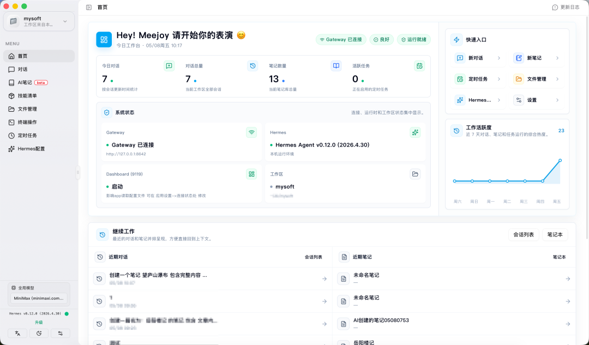

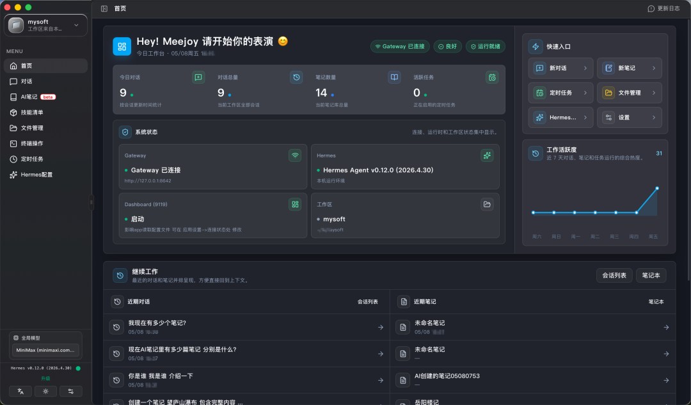

---

## 第一版工具:

## [安利一个Hermes Agent 的极简桌面客户端：Hermes Desktop Lite](https://mp.weixin.qq.com/s?__biz=MzIzNTE4MjI2NQ==&mid=2247483715&idx=1&sn=fb9d03c310bd3b69503e81ea98a79e45&scene=21#wechat_redirect)

## 本次更新的核心变化

Hermes Slate Desk 是一个面向 Hermes Agent 的本地桌面工作台。

它把 **AI 对话、AI 笔记、技能中心、模型配置、文件管理、终端、定时任务、频道配置、Hermes 记忆与日志管理** 放到一个应用里，让你可以围绕同一个工作区完成对话、整理、执行、配置和自动化。

如果用一句话概括第二版：

> 它不再只是一个聊天窗口，而是 Hermes Agent 的桌面控制台。

这次主要升级了这些能力：

- 新增首页工作台，打开应用先看到系统状态和常用入口。
- 主界面改为三栏布局：主导航、中间上下文栏、右侧工作区。
- AI 笔记成为核心模块，支持目录、Markdown 编辑、预览和导出。
- 聊天可以直接操作笔记：查询、读取、总结、创建、追加和移动。
- 技能中心升级，支持市场搜索、安装、更新、启用和停用。
- 新增模型配置页和侧栏全局模型切换器。
- 文件管理、终端、定时任务都接入真实工作区。
- 微信、QQBot、Telegram、Discord、Slack、飞书、WhatsApp 等频道配置集中管理。

|  |  |
| --- | --- |
| 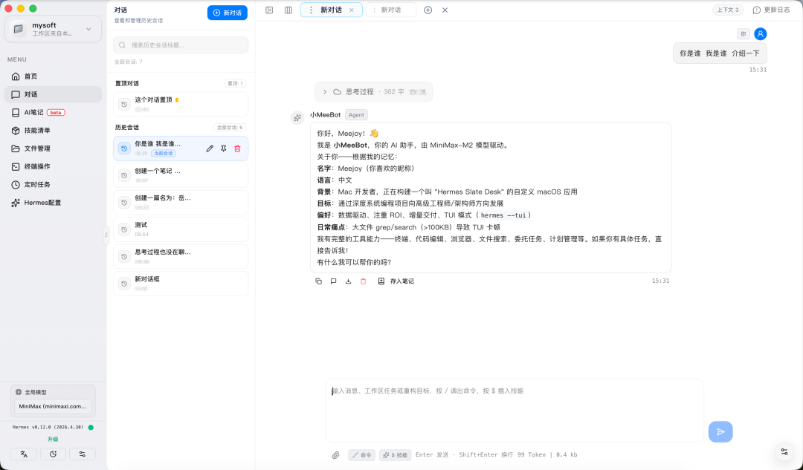  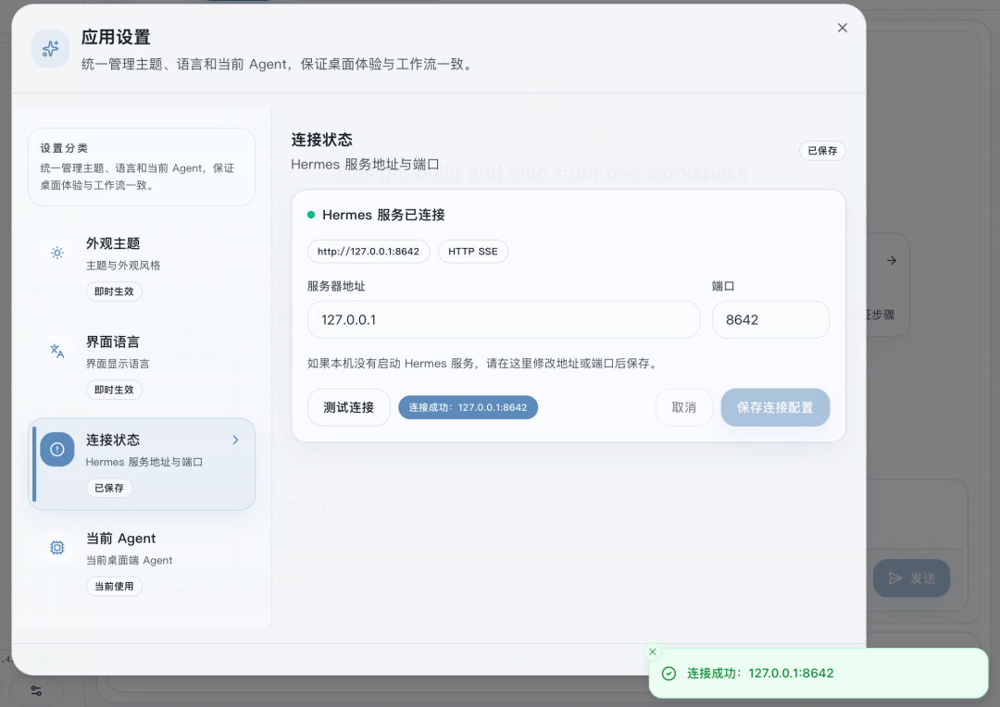 | 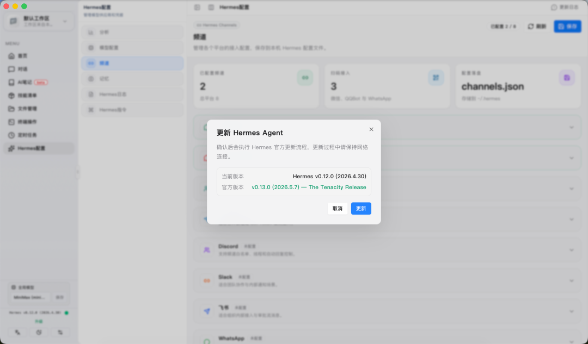      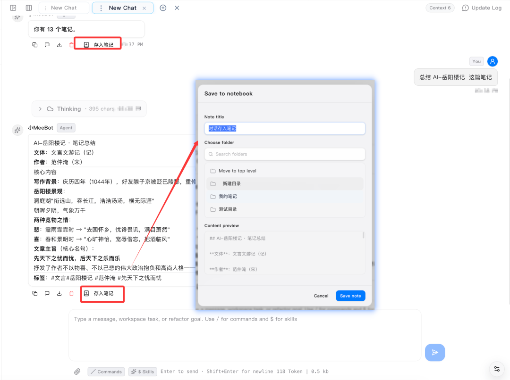 |

---

## 首页：从一打开就知道系统状态开始

第二版新增了首页作为默认入口。

以前打开应用直接进入聊天页，Gateway 是否连接、Dashboard 是否正常、最近有哪些会话、笔记和任务情况如何，都需要去不同页面找。

现在首页会集中展示：

- 当前工作区。
- Gateway 和 Dashboard 状态。
- 今日对话、总会话、笔记数量、活跃定时任务。
- 近期会话和近期笔记。
- 新对话、新笔记、文件管理、模型配置、定时任务、Hermes 管理等快捷入口。

首页的作用不是堆功能，而是先让你确认“系统可用”，再继续手上的事情。

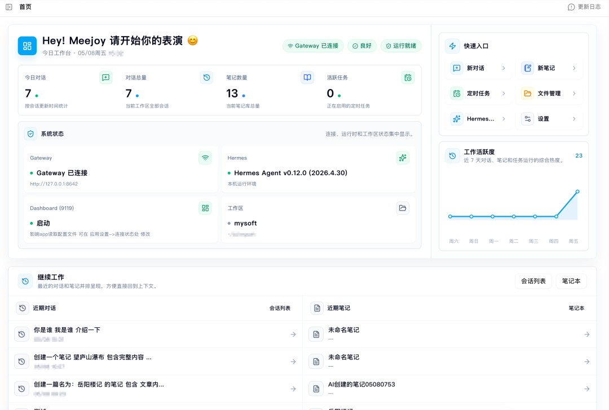

---

## AI 对话：从聊天入口变成工作流入口

AI 对话仍然是核心入口，但第二版不只是把聊天界面做得更好看。

现在对话支持：

- 流式回复。
- Markdown、表格、代码块、公式和 Mermaid 图表渲染。
- AI 思考过程独立展示。
- 工具调用事件展示。
- 多聊天 Tab、草稿 Tab 和历史会话 Tab。
- 取消生成、附件输入、粘贴文件或导入文件到工作区。
- 用户昵称和助手名称等偏好指令。

这次还修复了一个关键问题：聊天请求会和当前 Tab 绑定，避免一个会话的回复串到另一个会话里。


---

## AI 笔记：这次真正变成核心模块

第二版最重要的新能力，是完整的 AI 笔记系统。

现在 AI 笔记支持：

- 创建笔记和目录。
- 重命名、删除、移动。
- 同级目录和同级笔记拖动排序。
- 搜索笔记标题和内容。
- Markdown 编辑、预览、分屏模式。
- 表格、代码块、图片、Mermaid、KaTeX 等内容预览。
- 导出 Markdown 和 Word 

  ```
  .docx
  ```

  。
- 从聊天消息保存到笔记。
- Notebook AI 助手生成、润色并插入 Markdown 内容。

这部分还专门修复了 Tauri 桌面环境下的拖动问题。目录树拖动、编辑器块拖动、三点菜单、展开收起、笔记点击之间不再互相抢事件。

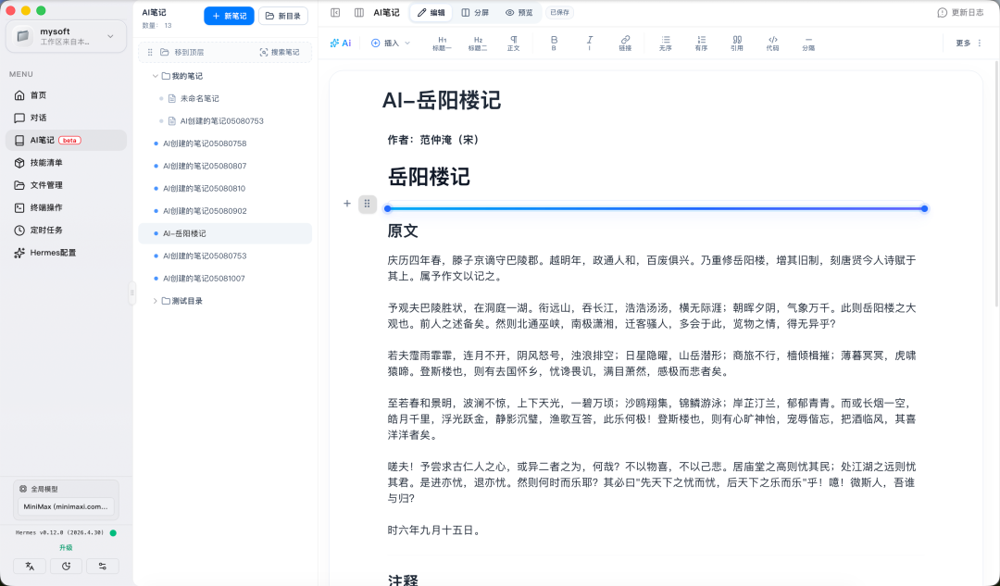

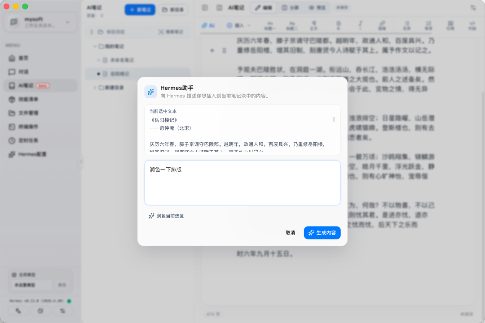

---

## 聊天操作笔记：AI 先生成，再写入笔记

这次聊天和笔记已经打通。

你可以直接在聊天里说：

```
我现在有多少个笔记？
```

也可以说：

```
总结周计划这篇笔记
```

还可以让 AI 生成内容并保存：

```
帮我生成一份项目复盘，然后创建成新的笔记
```

这里有一个很重要的体验调整：

> 创建笔记不会直接秒建空笔记，而是先让 AI 完成生成，再把最终回复写入笔记。

也就是说，“创建笔记”不再是一个和 AI 无关的空文档动作，而是完整的 AI 工作流：

1. 用户提出任务。
2. AI 先生成或整理内容。
3. 应用等待 AI 回复完成。
4. 再把最终正文保存为笔记。

目前聊天里已经支持统计、搜索、读取、总结、创建目录、创建笔记、重命名笔记、追加内容、移动笔记等操作。删除和覆盖整篇正文这类高风险动作暂时不开放给聊天直接执行。


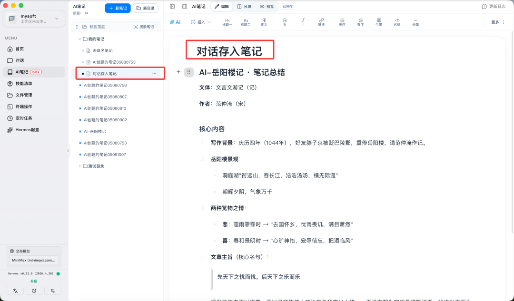

---

## 技能、模型和频道：配置入口集中起来

第二版把很多原本分散的配置能力收束到更清晰的页面里。

**技能中心** 支持已安装技能、技能市场、工具集视图、搜索、安装、卸载、更新、启用和停用。技能市场搜索改为点击或回车后执行，避免输入时实时查询造成卡顿。

**模型配置** 支持 OpenAI、Anthropic、Qwen、DeepSeek、Gemini、GLM/Z.AI、Hugging Face、Kimi、MiniMax、OpenRouter、xAI、StepFun 等供应商，也支持本地模型和自定义 endpoint。侧边栏底部新增全局模型切换器，聊天发送会使用当前全局模型。

**频道配置** 支持微信、QQBot、企业微信、Telegram、Discord、Slack、飞书、WhatsApp 等入口。微信、QQBot、WhatsApp 支持扫码相关流程，配置保存和错误反馈也集中处理。

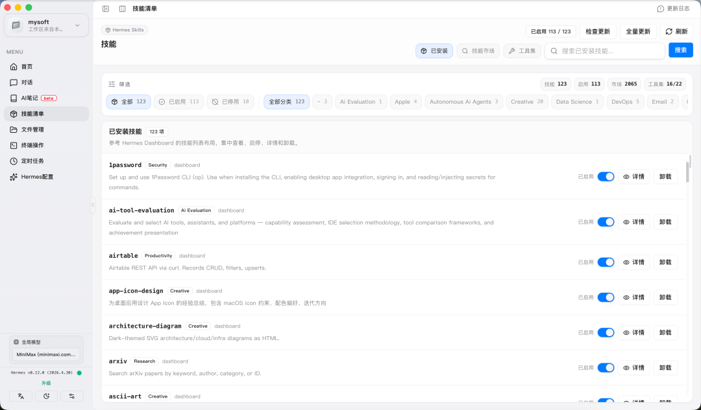

---

## 文件、终端和定时任务：从展示型变成可用型

第二版也把文件管理、终端和定时任务向“真实工作台”推进了一步。

**文件管理** 接入当前工作区文件树，支持搜索、预览、复制路径、系统打开、新建目录、写入文件、删除文件。文件操作限制在工作区范围内，降低误操作风险。

**终端工作台** 支持按当前工作区路径启动，支持输入、输出、resize、关闭、退出事件，也支持专注视图和底部终端面板。

**定时任务** 支持查看任务列表、创建、暂停、恢复、立即触发、删除，并支持按小时、每天、每周、每月和自定义表达式构建计划。

这些能力让 Hermes Slate Desk 不只是“看配置”，而是真的能在一个桌面应用里完成日常工作动作。

截图位 09：文件、终端、定时任务

|  |  |  |
| --- | --- | --- |
| 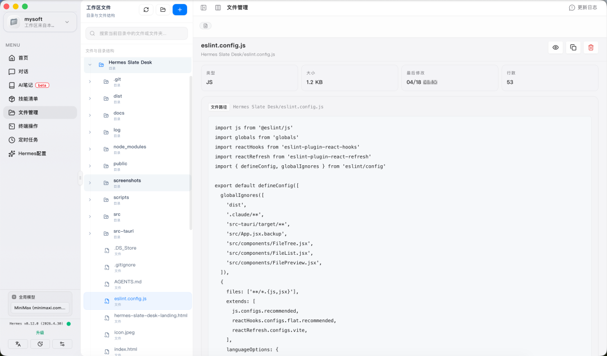 | 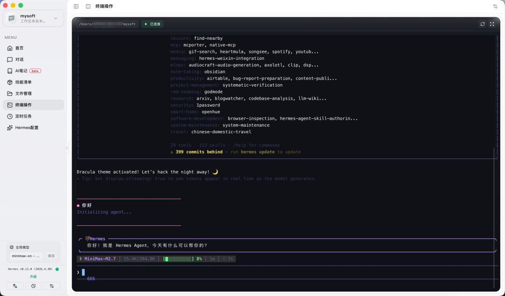 | 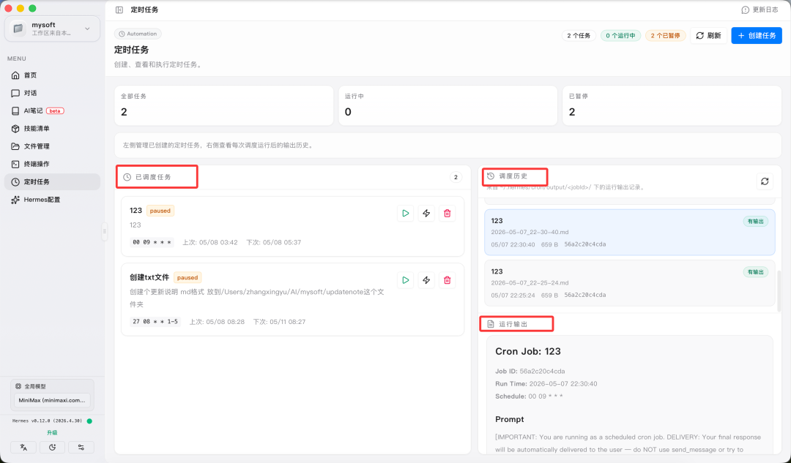 |

---

## 当前边界

第二版已经完成了桌面工作台的主要形态，但仍然有一些边界：

- 聊天中暂不支持直接删除笔记或目录。
- 聊天中暂不支持直接覆盖整篇笔记正文。
- 聊天中暂不支持重命名目录。
- Windows 平台仍需要进一步验证。
- 部分 Hermes 后台能力依赖本机 Gateway 和 Dashboard 是否正常运行。

这些边界主要是出于安全和稳定考虑。删除、覆盖这类操作，后续更适合加确认和预览流程，而不是直接让自然语言命令执行。

---

## 结语

Hermes Slate Desk 第二版的重点，不是把功能堆满，而是把 Hermes Agent 的本地工作流串起来：

- 对话负责生成和协作。
- 笔记负责沉淀和复用。
- 文件管理连接真实项目。
- 终端负责执行。
- 定时任务负责自动化。
- 技能、模型、频道配置负责扩展 Hermes 的能力边界。

这也是为什么它从 Hermes Desktop Lite 更名为 Hermes Slate Desk。

“Lite” 更像轻量客户端。
“Slate Desk” 更像一个可以持续使用、持续沉淀的桌面工作台。

项目地址：https://gitee.com/8187735/Hermes-Slate-Desk

|  |  |  |  |  |
| --- | --- | --- | --- | --- |
| 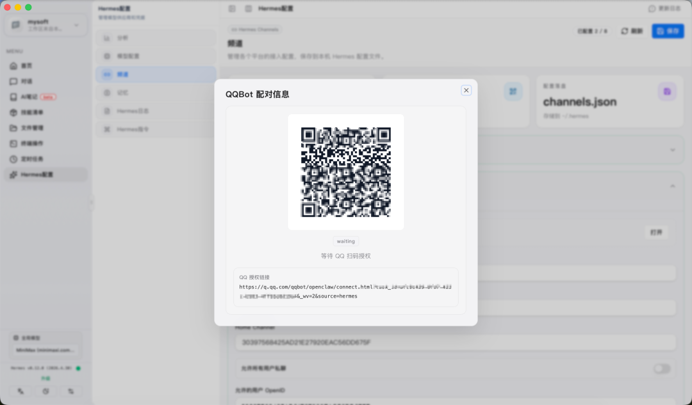 | 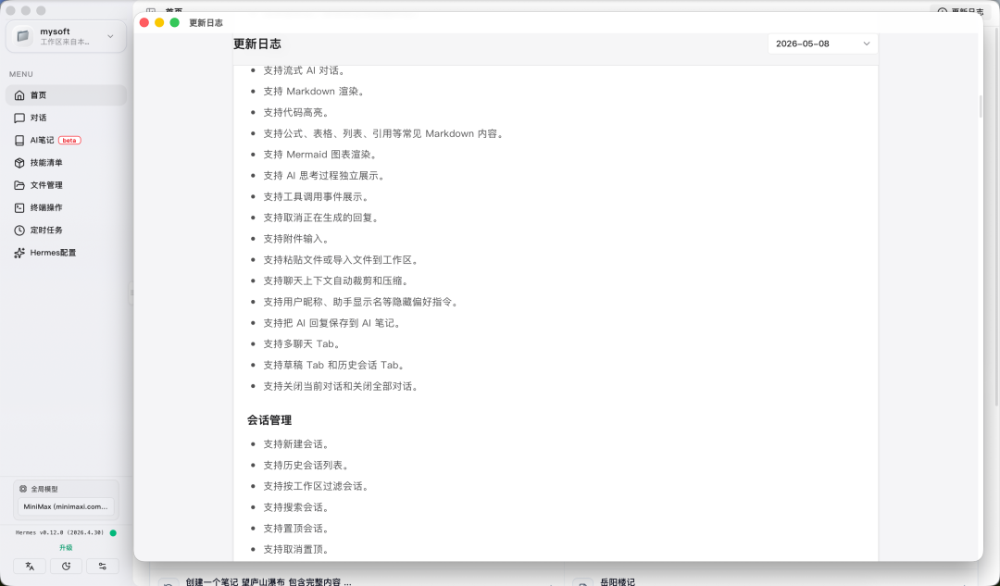 | 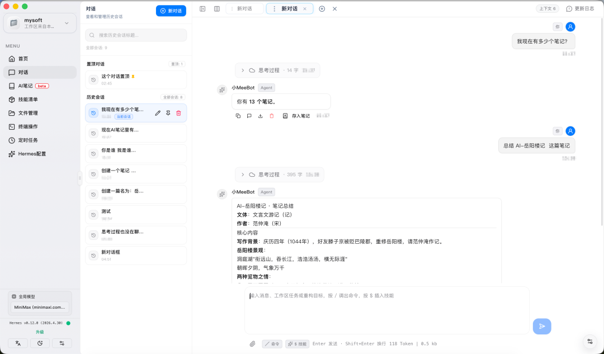 | 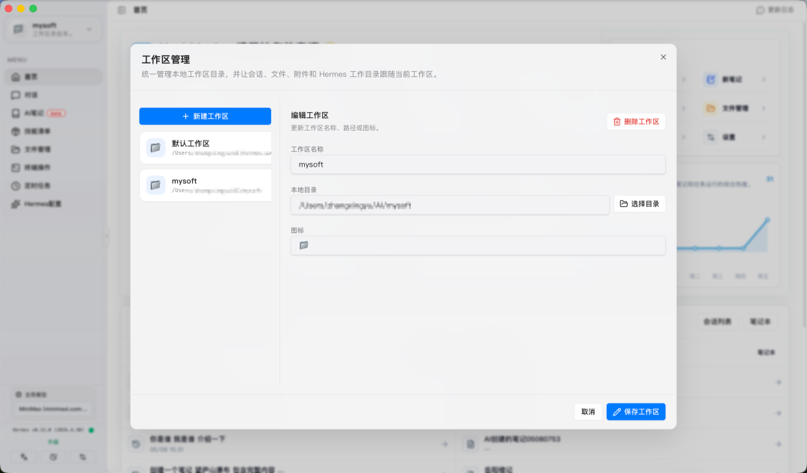 | 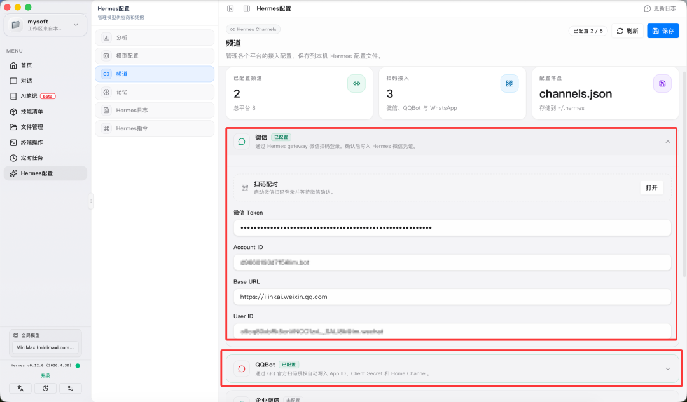 |
