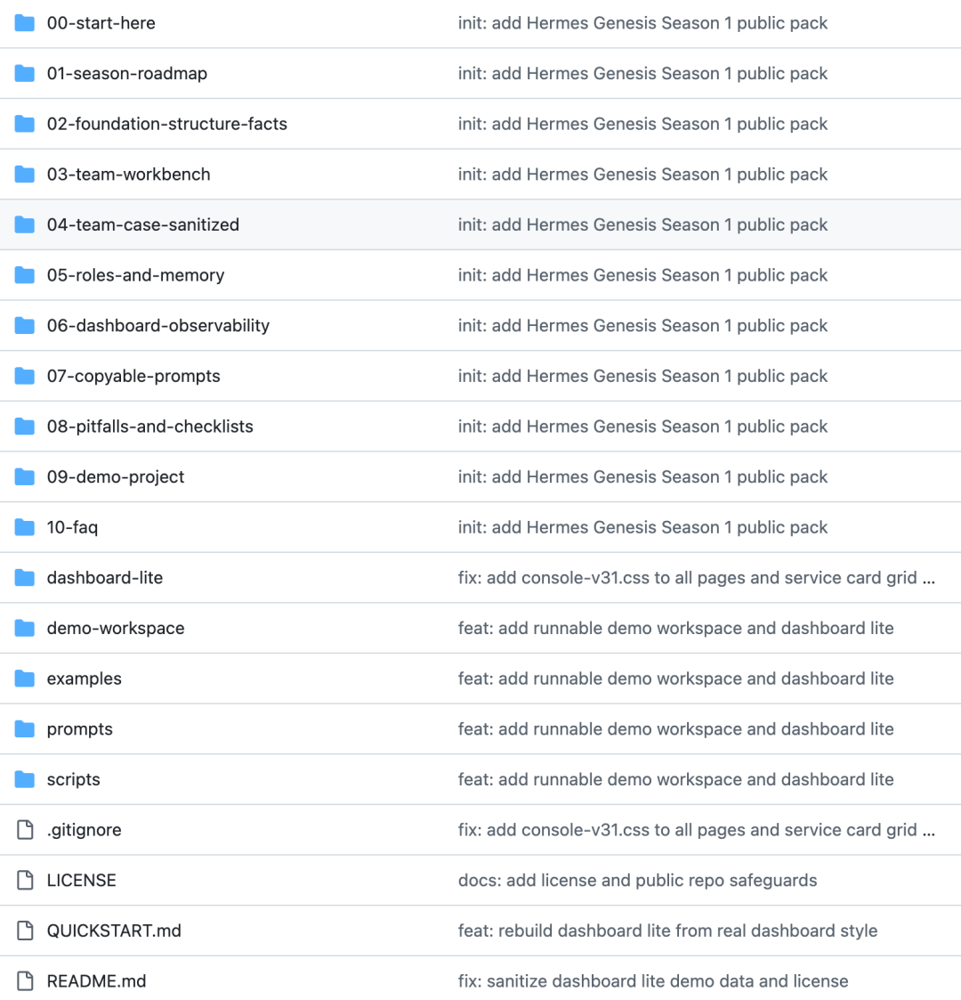
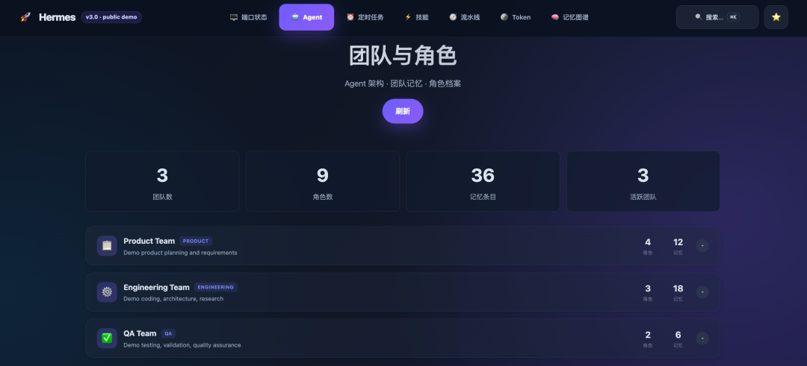
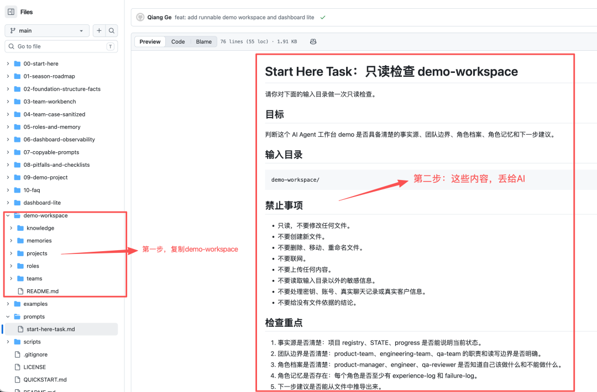

> 📎 来源: [麦尖AI](https://mp.weixin.qq.com/s?__biz=MzY5NDI2OTE5NA==&mid=2247484279&idx=1&sn=663d9f19760d877aef702dcfd67be094&chksm=f5664bda887928b0e71c1ed27c6265a883298e5d9c761222eec1896d7caa20893b3d2ce9409b&mpshare=1&scene=1&srcid=052401Mc6CE9pnhaxheLitf2&sharer_shareinfo=5ffe81349a3646778d883d804a7917bf&sharer_shareinfo_first=5ffe81349a3646778d883d804a7917bf) | 时间: 2026-05-24 02:45

---

# 「单实例总控多团队」工作台资料包

这篇直接给东西。

我把 Hermes Genesis 第一季里能公开、能脱敏、能直接试的内容，整理成了一个公开资料包：

```
https://github.com/liuxiaoqianglongxia/hermes-genesis-season1-pack
```



它不是几段提示词。

也不是单独一个 Dashboard 页面。

它是一套 AI Agent 工作台样板，里面包括：

```
QUICKSTART.mddemo-workspace/dashboard-lite/prompts/scripts/examples/team-boss子代理边界team-registry角色档案角色记忆上下文注入示例基础事实源模板常见翻车检查清单
```

它解决的不是“下载以后自动拥有完整系统”。

而是让你先看懂：

```
AI 该读哪里AI 该找谁AI 该做什么AI 不该做什么AI 该记住什么AI 的结果怎么验收AI 的运行状态怎么看
```

---

## 先按三条路线看

你不用一上来把整个仓库看完。

按自己的需求走就行。

### 路线 A：我只想先有画面感

直接打开 Dashboard Lite：

https://liuxiaoqianglongxia.github.io/hermes-genesis-season1-pack/dashboard-lite/



你会看到一个脱敏静态工作台，里面有：端口状态，Agent，定时任务，技能，流水线，Token

这一步只是让你先有画面感。

AI Agent 工作台不应该只是一堆聊天记录，它应该有运行态。

### 路线 B：我只想省事一点

先看这几个入口：

```
QUICKSTART.mddemo-workspace/prompts/start-here-task.mdscripts/build-demo-context.pyexamples/demo-context-output.md
```

你可以复制 

```
demo-workspace/
```

，再把 

```
start-here-task.md
```

 丢给 AI，让它做一次只读检查。



### 路线 C：我想理解一个 AI 怎么管多个团队

重点看这些：

```
03-team-workbench/demo-workspace/teams/team-registry.example.yamldemo-workspace/roles/demo-workspace/memories/05-roles-and-memory/
```

这条路线才是资料包的核心。

因为“一个 AI 管多个团队”，靠的不是多起几个角色名，而是：

```
事实源团队边界角色档案角色记忆任务分派主代理验收
```

---

## 这份公开包到底是什么

一句话解释：

这是一份 **AI Agent 工作台公开资料包**。

它把“一个 AI 怎么管多个团队”拆成了一组可以看、可以复制、可以改造的文件结构。

你可以把它理解成一套施工样板：

```
文件怎么放事实源怎么定团队怎么分角色怎么写记忆怎么沉淀任务怎么派结果怎么验收运行状态怎么看
```

很多人做 AI Agent，一上来就想要：

- > 多模型
- > 多代理
- > 自动执行
- > 自动发布
- > 复杂 Dashboard
- > 记忆系统
- > 一堆角色

但真正用起来，最先崩的往往不是模型能力。而是这些基础问题：

- > AI 不知道哪个文件是最新事实；
- > README 越写越长，最后变成垃圾桶；
- > 项目状态散在多个地方；
- > 子代理没有边界；
- > 角色只有名字，没有档案和记忆；
- > 多个团队互相串线；
- > 系统说自己跑了，但人看不见证据。

所以这个公开包先解决的是“稳”。

不是先追求酷。

也不是先堆自动化。

而是先把 AI 长期干活需要的地基搭出来。

---

## 第一步：下载公开包，看目录

GitHub 地址：

```
https://github.com/liuxiaoqianglongxia/hermes-genesis-season1-pack
```

可以网页查看，也可以 clone 到本地：

```
git clone https://github.com/liuxiaoqianglongxia/hermes-genesis-season1-pack.gitcd hermes-genesis-season1-pack
```

核心目录大概是：

```
QUICKSTART.mddemo-workspace/dashboard-lite/prompts/scripts/examples/00-start-here/01-season-roadmap/02-foundation-structure-facts/03-team-workbench/04-team-case-sanitized/05-roles-and-memory/06-dashboard-observability/07-copyable-prompts/08-pitfalls-and-checklists/09-demo-project/10-faq/
```

第一次看，不要被目录吓到。

先记住这几个入口：

```
QUICKSTART.md          快速入口demo-workspace/        可复制工作区prompts/               给 AI 的任务提示词scripts/               只读 demo 脚本examples/              输出样例03-team-workbench/     team-boss 和子代理05-roles-and-memory/   角色档案和角色记忆dashboard-lite/        可观测窗口
```

推荐顺序是：

```
QUICKSTART.md→ demo-workspace/→ prompts/start-here-task.md→ 03-team-workbench/→ 05-roles-and-memory/→ dashboard-lite/
```

---

## 第二步：复制 demo-workspace

```
demo-workspace/
```

 是这份公开包最重要的部分之一。

它不是空模板。

它是一个最小 AI Agent 工作区。

你可以复制它：

```
cp -R demo-workspace my-agent-workspace
```

结构是这样：

```
demo-workspace/  knowledge/  projects/  teams/  roles/  memories/
```

这五个目录分别解决五件事：

```
knowledge   放稳定规则projects    放项目事实teams       放团队边界roles       放角色档案memories    放角色记忆
```

### knowledge：放稳定规则

```
knowledge/
```

 放相对稳定的规则和术语。

比如：

```
knowledge/README.mdknowledge/standards/terminology.mdknowledge/standards/structure.md
```

这里不放当前进度。

也不放临时计划。

它只是告诉 AI：

这个工作区里，术语怎么理解，目录怎么分工。

### projects：放项目事实

```
projects/
```

 里放当前项目事实。

关键文件是：

```
projects/registry.yamlprojects/demo-agent-workbench/STATE.mdprojects/demo-agent-workbench/docs/progress.md
```

它们分工不同。

```
registry.yaml
```

 负责登记项目。

```
STATE.md
```

 负责当前状态。

```
progress.md
```

 负责过程记录。

不要把这三件事混在一起。

如果混在一起，AI 就会开始猜。

### teams：放团队边界

```
teams/
```

 里最重要的是：

```
teams/team-registry.example.yaml
```

它告诉 AI：

- > 有哪些团队；
- > 每个团队负责什么；
- > 每个团队能读哪些文件；
- > 每个团队能写哪些文件；
- > 默认角色是谁；
- > 角色记忆怎么映射。

这就是多团队不串线的基础。

### roles：放角色档案

```
roles/
```

 里是角色档案：

```
roles/product-manager.mdroles/engineer.mdroles/qa-reviewer.md
```

一个角色档案至少要说明：

```
我是谁我负责什么我不负责什么我怎么工作我交付什么我的红线是什么
```

### memories：放角色记忆

```
memories/
```

 里是角色记忆。

每个角色都有：

```
experience-log.mdfailure-log.md
```

经验记录告诉 AI：以后可以复用什么。

失败记录告诉 AI：以后不要再怎么错。

这比普通聊天记录更有价值。

---

## 第三步：让 AI 做第一次只读检查

第一次不要让 AI 改文件。

也不要让它联网。

也不要让它上传。

先让它做一次只读检查。

打开这个文件：

```
prompts/start-here-task.md
```

核心任务是：

```
请只读检查 demo-workspace，不要修改文件。检查事实源、团队边界、角色档案、角色记忆和下一步建议。每个结论必须引用具体文件。
```

这一步像体检。

先看工作区是否清楚，再谈自动化。

你可以要求 AI 按这个格式输出：

```
一、总体结论：PASS / PARTIAL PASS / FAIL二、事实源检查- 结论：- 文件证据：三、团队边界检查- 结论：- 文件证据：四、角色档案检查- 结论：- 文件证据：五、角色记忆检查- 结论：- 文件证据：六、主要缺口七、下一步建议
```

关键要求只有一个：

```
每个结论都必须引用具体文件。信息不足就写信息不足。不要猜。
```

如果 AI 连这个 demo 工作区都读不明白，那就说明结构还不够清楚。

这一步比让 AI 直接写代码重要。

---

## team-boss 和 team-registry

多团队不是多起几个名字。

很多人一说 AI 多团队，就会想到：

一个产品经理。

一个工程师。

一个测试。

一个主编。

一个运营。

听起来像团队了。

但如果只有名字，没有边界，就会乱。

产品去改代码。

工程师扩需求。

QA 直接写文件。

项目 A 的经验套到项目 B。

这就是串线。

### team-boss 是总控

公开包里看这个文件：

```
03-team-workbench/team-boss.min.md
```

team-boss 不负责包办所有执行。

它主要负责：

```
理解任务判断归属拆分子任务限定边界回收验收
```

它像一个路由器。

不是万能工。

如果 team-boss 什么都管，最后它会变成另一个大杂烩。

### 子代理要有明确任务边界

子代理任务必须写清楚：

```
目标输入禁止事项输出格式验收标准
```

比如只读检查任务，要明确：

```
不要修改文件不要联网不要上传不要扩大范围每个结论必须引用具体文件
```

如果没有这些边界，子代理就容易陷入循环。

它会一直说“我再检查一下”。

看起来很努力。

实际没有推进。

### team-registry 是防串线的护栏

公开包里看：

```
demo-workspace/teams/team-registry.example.yaml
```

一个简化片段可以长这样：

```
teams:  -id:product-team    scope:      -clarify goals      -define acceptance criteria    related_projects:      -demo-agent-workbench  -id:engineering-team    scope:      -implement small scripts      -keep the workspace runnable    related_projects:      -demo-agent-workbench  -id:qa-team    scope:      -readonly audit      -acceptance checks    related_projects:      -demo-agent-workbench
```

真正有用的是这些字段：

```
scopefacts_boundaryroutingrole_memory_map
```

它们告诉 AI：

这个团队负责什么。

能读什么。

能写什么。

遇到什么关键词该路由到哪里。

角色记忆放在哪里。

### 主代理必须验收

子代理说完成，不等于真的完成。

主代理必须看：

```
目标有没有完成文件证据是否清楚有没有越界有没有改不该改的东西下一步能不能继续
```

这也是为什么公开包里有主代理验收清单。

一个 AI 管多个团队，不是让 AI 自己一路狂奔。

而是让任务在每个节点都能被检查。

---

## 角色档案和角色记忆怎么配

角色不能只有名字。

一个角色叫 product-manager，不代表它真的知道怎么做产品。

一个角色叫 engineer，不代表它知道哪些事情不能顺手改。

一个角色叫 qa-reviewer，不代表它知道自己应该只读验收。

所以需要角色档案和角色记忆。

### 角色档案解决“我是谁”

角色档案在：

```
demo-workspace/roles/
```

比如：

```
demo-workspace/roles/product-manager.mddemo-workspace/roles/engineer.mddemo-workspace/roles/qa-reviewer.md
```

角色档案应该说明：

```
角色定位核心能力工作流程交付物红线
```

比如产品经理角色，要先收口目标和验收标准。

工程师角色，要按确认范围实现，不要扩展需求。

QA 角色，要按检查清单只读验收，不要越权修改。

### 角色记忆解决“下次别从零开始”

角色记忆在：

```
demo-workspace/memories/
```

每个角色至少有：

```
experience-log.mdfailure-log.md
```

例如：

```
demo-workspace/memories/product-manager/experience-log.mddemo-workspace/memories/product-manager/failure-log.md
```

经验记录写：

```
这类任务以后可以复用什么方法
```

失败记录写：

```
这类任务以前哪里翻车了，下次怎么避免
```

一个最小经验记录可以很简单：

```
# experience-log## 2026-01-01任务：整理 demo 工作台需求有效经验：先写清本轮目标和不做范围，再派给工程角色。下次复用：凡是涉及多个角色的任务，先写验收标准，再执行。
```

失败记录也可以很简单：

```
# failure-log## 2026-01-02问题：没有写清“不做范围”，导致 engineer 开始设计额外功能。修正：每次派单必须包含禁止事项。
```

角色系统至少要包括：

```
角色档案经验记录失败记录派单上下文
```

只有角色名，不叫角色系统。

---

## 上下文注入怎么跑

公开包里有一个只读脚本：

```
scripts/build-demo-context.py
```

它的作用是演示最小版“上下文注入”。

在仓库根目录执行：

```
python scripts/build-demo-context.py > examples/demo-context-output.md
```

它只读取 

```
demo-workspace/
```

 里的文件。

大概包括：

```
knowledge/README.mdknowledge/standards/terminology.mdknowledge/standards/structure.mdprojects/registry.yamlprojects/demo-agent-workbench/STATE.mdprojects/demo-agent-workbench/docs/progress.mdteams/team-registry.example.yamlroles/product-manager.mdroles/engineer.mdroles/qa-reviewer.mdmemories/*/experience-log.mdmemories/*/failure-log.md
```

它不会访问真实 Hermes。

不会访问数据库。

不会联网。

不会上传。

它只是把这些文件拼成一份 demo task context。

输出样例在：

```
examples/demo-context-output.md
```

这件事重要在哪里？

不要指望 AI 每次自己想起来。

它可能会读对文件。

也可能会读错文件。

它可能会找到最新事实。

也可能翻出旧材料。

更稳的办法是：

> 派任务前，把它该知道的事实源、团队边界、角色档案、角色记忆放进上下文。

这就是上下文注入的基本思路。

它不神秘。

但很实用。

---

## Dashboard 只是最后的可观测窗口

公开包里也有 Dashboard：

```
dashboard-lite/
```

它来自真实 Hermes Dashboard 前端迁移。

但它不是完整后端。

它只是一个脱敏静态预览。

它能展示：

```
端口状态Agent定时任务技能流水线Token记忆图谱
```

它的价值是“看见”。

但它不是主角。

如果前面的事实源、团队边界、角色记忆都没有，Dashboard 再漂亮也没用。

页面只是展示层。

真正的底层还是：

```
事实源team-registryrole profilerole memorytask context
```

所以我建议顺序是：

```
先有事实源再有团队边界再有角色记忆再有任务流程最后再做可观测
```

如果你一开始就做 Dashboard，很容易做出漂亮幻觉。

页面很好看。

但数据没有来源。

那就没有意义。

---

## 最容易踩的 5 个坑

### 坑一：README 写成数据库

README 只负责导航。

当前事实写：

```
STATE.md
```

过程记录写：

```
progress.md
```

### 坑二：team-boss 写胖

team-boss 只管：

```
路由派单验收
```

团队边界交给 team-registry。

角色能力交给 role profile。

项目事实交给 STATE / progress。

### 坑三：子代理一直努力，但不前进

子代理任务必须限制：

```
只做一步失败几次就停必须输出证据回到主代理验收
```

### 坑四：多个团队互相串线

用 team-registry 写清：

```
scopefacts_boundaryroutingrole_memory_map
```

否则 AI 很容易把 A 团队经验套到 B 团队。

### 坑五：Dashboard 好看，但没有事实源

页面数据必须来自事实源。

如果没有事实源，Dashboard 只是漂亮幻觉。

---

## 今天你可以怎么开始

第一步，打开公开仓库：

```
https://github.com/liuxiaoqianglongxia/hermes-genesis-season1-pack
```

先看 

```
QUICKSTART.md
```

。

第二步，打开 Dashboard Lite：

```
https://liuxiaoqianglongxia.github.io/hermes-genesis-season1-pack/dashboard-lite/
```

先看效果，不用先研究代码。

第三步，克隆仓库：

```
git clone https://github.com/liuxiaoqianglongxia/hermes-genesis-season1-pack.gitcd hermes-genesis-season1-pack
```

第四步，复制 demo-workspace：

```
cp -R demo-workspace my-agent-workspace
```

第五步，让 AI 做只读检查。

打开：

```
prompts/start-here-task.md
```

把它给 AI。

输入目录指向：

```
my-agent-workspace/
```

第六步，按结果补文件。

如果 AI 说事实源不清，就补：

```
STATE.mdprogress.mdregistry.yaml
```

如果 AI 说团队边界不清，就补：

```
team-registry.example.yaml
```

如果 AI 说角色不清，就补：

```
roles/
```

如果 AI 说没有记忆，就补：

```
memories/
```

不要一上来搞复杂自动化。

先让 AI 读懂你的项目。

---

## 第一季到这里，先收住

前面 15 篇，我拆过很多东西。

目录。

规范。

事实源。

team-boss。

子代理。

team-registry。

角色档案。

角色记忆。

上下文注入。

Dashboard。

最后收回来，其实就是一句话：

> 不要先幻想一个全能 AI 团队。

> 先让 AI 知道该读哪里、该找谁、该记住什么、该怎么被看见。

公开包在这里：

```
https://github.com/liuxiaoqianglongxia/hermes-genesis-season1-pack
```

Dashboard Lite 在线预览：

```
https://liuxiaoqianglongxia.github.io/hermes-genesis-season1-pack/dashboard-lite/
```

如果这个公开包对你有帮助，转发给朋友，或关注公众号「麦尖AI」。

访问不了github，可以私信我获取整包。

赞赏只是自愿支持创作，不和资料获取绑定。

## 想看翻车过程，欢迎阅读往期内容

[Hermes Genesis 01：刚下载 Hermes那天，我以为它会自己变聪明](https://mp.weixin.qq.com/s?__biz=MzY5NDI2OTE5NA==&mid=2247484064&idx=1&sn=f92005a83582d81880ccc4db4d128635&scene=21#wechat_redirect)

[Hermes Genesis 02：规范越写越多以后，我发现 AI 不是更聪明，而是更懵了](https://mp.weixin.qq.com/s?__biz=MzY5NDI2OTE5NA==&mid=2247484136&idx=1&sn=e72fbbc2cf96a473244ef9128b35fc29&scene=21#wechat_redirect)

[Hermes Genesis 03：后来我才明白，AI 最缺的不是答案，而是一张导航图](https://mp.weixin.qq.com/s?__biz=MzY5NDI2OTE5NA==&mid=2247484132&idx=1&sn=5420a20bf2280a418f0a36541952c417&scene=21#wechat_redirect)

[源码放送01｜3次翻车后才发现：AI最缺的不是模型。这套带导航层的系统规范，不去GitHub，直接复制拿走。[Hermes Genesis Code Drop 01]](https://mp.weixin.qq.com/s?__biz=MzY5NDI2OTE5NA==&mid=2247484167&idx=1&sn=1cf2bf8062b30eefd393c215f70d6a46&scene=21#wechat_redirect)

[Hermes Genesis 04：一个会话干不了所有事，子代理开始上场](https://mp.weixin.qq.com/s?__biz=MzY5NDI2OTE5NA==&mid=2247484168&idx=1&sn=8b7d30f45ed073575da15e178218842c&scene=21#wechat_redirect)

[Hermes Genesis 05：team-boss 开始像团队了，但我又把它写肿了](https://mp.weixin.qq.com/s?__biz=MzY5NDI2OTE5NA==&mid=2247484169&idx=1&sn=803684c6784dcb687ee618c7648779c1&scene=21#wechat_redirect)

[Hermes Genesis 06：我把 team-boss 和团队技能拆开以后，再拆团队技能，有了新的收获](https://mp.weixin.qq.com/s?__biz=MzY5NDI2OTE5NA==&mid=2247484170&idx=1&sn=93fba398a7cdd7350c2d8e9b546293c3&scene=21#wechat_redirect)

[Hermes Genesis 07：我后来不再求AI自觉读文件，而是直接把上下文塞到它手里](https://mp.weixin.qq.com/s?__biz=MzY5NDI2OTE5NA==&mid=2247484171&idx=1&sn=2d4753d55b5e7f07abf97c59e9522f2a&scene=21#wechat_redirect)

[Hermes Genesis 08：子代理防卡死，步数限制与安全边界，子代理很好用，但我最怕它卡死在一个看起来很努力的循环里](https://mp.weixin.qq.com/s?__biz=MzY5NDI2OTE5NA==&mid=2247484172&idx=1&sn=3b81f7bdf0666298b6f420968e89c031&scene=21#wechat_redirect)

[Hermes Genesis 09：多团队边界，team-registry 防串线，团队一多，我才知道最怕的不是慢，是串线。](https://mp.weixin.qq.com/s?__biz=MzY5NDI2OTE5NA==&mid=2247484173&idx=1&sn=d9785f5e2397ed94683277f90fa20e63&scene=21#wechat_redirect)

[源码放送02｜我让一个AI管66个角色：把Hermes单实例总控多团队的骨架，直接复制拿走 (角色/记忆/注入脚本)[Hermes Genesis Code Drop 02]](https://mp.weixin.qq.com/s?__biz=MzY5NDI2OTE5NA==&mid=2247484174&idx=1&sn=69fa47d8a92fa24758e6a4aac3f6598d&scene=21#wechat_redirect)

[Hermes Genesis 10：系统长期稳定，不是靠 AI 更聪明，而是靠它少走例外](https://mp.weixin.qq.com/s?__biz=MzY5NDI2OTE5NA==&mid=2247484178&idx=1&sn=c2ecbb05018b6a5963640e0d5a0ffa7e&scene=21#wechat_redirect)

[Hermes Genesis 11：Dashboard 出来以后，我才敢说这套系统真的在跑](https://mp.weixin.qq.com/s?__biz=MzY5NDI2OTE5NA==&mid=2247484227&idx=1&sn=d2670d6b9a2e97e4669516108306f60f&scene=21#wechat_redirect)

[Hermes Genesis 12：当系统开始写自己的时候，我突然意识到它不只是工具了](https://mp.weixin.qq.com/s?__biz=MzY5NDI2OTE5NA==&mid=2247484238&idx=1&sn=385f64e35cbda8191e0ec498346d5f93&scene=21#wechat_redirect)

---

📢 欢迎关注「麦尖AI」微信公众号

一个教育从业者的 AI 实战记录。不写教程，只分享真实折腾经历。

如果你觉得这篇文章有用，欢迎转发。你的转发，是我继续折腾的最大动力。
