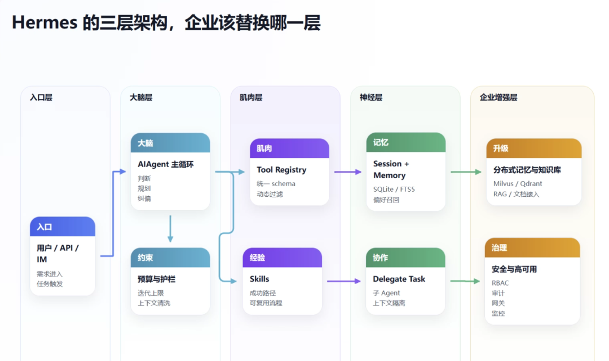
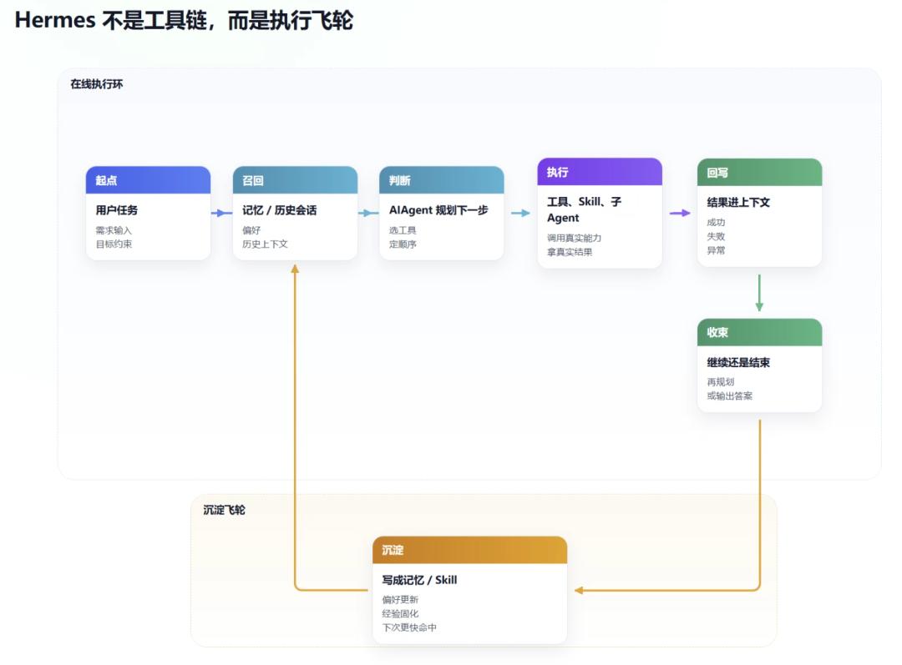
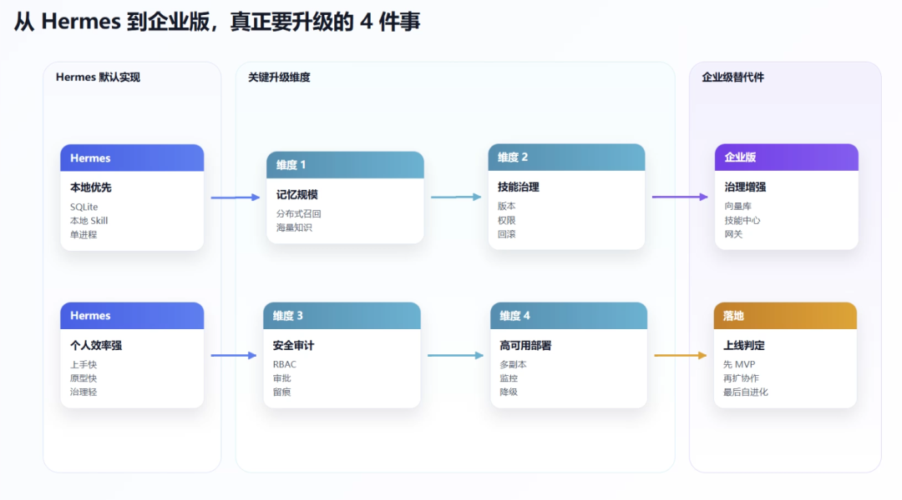

> 📎 来源: [技术传感器](https://mp.weixin.qq.com/s?__biz=Mzg4MDU1MTg0Ng==&mid=2247484320&idx=1&sn=06b300a889e38e5a1b7e48aa11a1131a&chksm=ce96f312d63152c6876df732e650b5c1bf458a851a78fbf7f88965e6f6133fc291c9307a4087&mpshare=1&scene=1&srcid=0421rYWU1SwVi0pVGXo61Zxr&sharer_shareinfo=29c23564740e690f1bc0aa7e849ca434&sharer_shareinfo_first=29c23564740e690f1bc0aa7e849ca434) | 时间: 2026-04-21 21:05

---

如果你这段时间一直在看 Agent 项目，大概率绕不开 Hermes。

它真正吓人的，不只是“能跑命令、能改文件、能开浏览器”。

而是另一件事：**它不是一个把大模型外面包了一层工具壳的玩具，而是一套已经把“记忆、技能、协作、执行、回收”接成闭环的系统。**

这也是为什么很多人第一次用 Hermes，会有一种很强的体感：

它不像在“回答问题”。 它更像在“干活”。

更关键的是，这套东西不是玄学。

我把 Hermes 的关键代码翻了一遍后，发现它的核心并不神秘。真正值得企业抄的，不是它的安装脚本，也不是某个提示词，而是它背后的架构取舍。

截至今天，Hermes Agent 的 GitHub 星标已经超过 **10 万**。4 月 8 日发布的 **v0.8.0**，是它真正出圈的节点之一；而在这之后，v0.9.0、v0.10.0 还在持续快迭代。

所以我不讲“怎么装”。我讨论 3 个问题：

- Hermes 到底强在哪一层
- 企业如果照着学，最该抄什么，不该抄什么
- 如果你想自建一套企业级 Agent 系统，技术路线应该怎么走



---

## 一、Hermes 真正厉害的地方，不是工具多，而是“三层分离”

很多文章讲 Hermes，喜欢从功能清单开始。

能连浏览器。 能跑终端。 能读写文件。 能做子 Agent。 能记住用户偏好。

这些都没错。 但如果你只停在这一层，就很容易把 Hermes 看成“一个工具很全的 Claude Shell”。

这会低估它。

我看完代码后，感觉 Hermes 真正值得拆的是一个很清晰的三层模型：

- **大脑层：负责推理、规划、决策、纠偏**
- **肌肉层：负责工具执行和技能复用**
- **神经层：负责记忆、检索、上下文传递和多 Agent 协同**

这三层不是嘴上说说。 在代码里，它们是分开的。

### 1）大脑层：不是工作流，而是“会看结果再继续想”的执行闭环

很多人以为 Hermes 的核心入口在 CLI。

其实不是。 真正的中枢在 

```
run_agent.py
```

 里的 

```
AIAgent
```

。

它的主循环非常直白：

- 组装 system prompt 和当前消息
- 调模型
- 如果模型发起 tool call，就立刻执行
- 把工具结果再塞回上下文
- 继续下一轮
- 直到模型不再调用工具，直接输出结论

这件事听起来很普通。 但区别在于：**Hermes 不是一次性“规划完再执行”，而是每执行一步，就把真实反馈重新喂回大脑。**

这和很多传统 LangChain 式“链式调用”不一样。 后者更像预先编排好的流程。 Hermes 更像一个持续感知环境变化的执行体。

你可以把它理解成：

不是“先写作战计划，再按计划走完”。 而是“先走一步，看地形，再决定下一步”。

这也是它做复杂任务时更像真人工程师的原因。

### 2）肌肉层：Hermes 不是堆工具，而是把工具做成统一可编排的能力层

Hermes 的第二个高明点，是它没有把工具写成一堆散装脚本。

它有一个统一注册中心。

```
model_tools.py
```

 会在启动时集中导入各个 

```
tools/*.py
```

 模块；每个工具再通过 

```
tools/registry.py
```

 统一注册自己的 schema、handler、toolset、可用条件。

这个设计看似工程细节，实际上很关键。

因为对 Agent 来说，**工具不是脚本，工具是“可被大模型理解、筛选、组合、限制”的能力对象。**

Hermes 之所以扩展快，就是因为它做到了几件事：

- 工具定义统一
- toolset 可以按场景裁剪
- 不可用工具会在 schema 层就被过滤
- ```
  execute_code
  ```

  、

  ```
  browser
  ```

   这类工具的说明还能根据当前可用工具动态改写，避免模型幻觉调用不存在的能力

这一步的价值很大。

很多企业自己做 Agent，第一版经常死在这里： 后端写了一堆函数，但模型根本不知道哪些能用、什么时候该用、用了会返回什么。

Hermes 的做法更像是在给模型建“肌肉群”，而不是扔一箱工具让它自己翻。

### 3）神经层：记忆、检索、委托，不是附件，而是执行系统的一部分

Hermes 的第三层，是它最容易被忽视、但也是最接近“自进化”的地方。

先看记忆。

```
hermes_state.py
```

 里，Hermes 用的是 **SQLite + WAL + FTS5**。 这不是一个花哨方案，但很聪明。

- SQLite 够轻，个人和小团队能直接用
- WAL 让多读单写并发更稳
- FTS5 让历史会话可全文检索
- ```
  messages_fts
  ```

  还通过 trigger 和消息表联动更新

这意味着什么？

意味着 Hermes 的“记住”，不是把上一轮聊天塞进 prompt 那么简单。 而是把会话历史变成了一个可以召回、可以检索、可以跨会话延续的状态层。

再看长期记忆。

```
tools/memory_tool.py
```

 的做法也很有意思。 它把 MEMORY 和 USER 分开维护，而且采用 **frozen snapshot** 机制：

- 会话开始时，把记忆快照注入 system prompt
- 会话中途可以继续写入磁盘
- 但不会反复改 system prompt，避免打爆 prompt cache

这是一个典型的工程化取舍。 不是最“聪明”，但很“能跑”。

最后是多 Agent 委托。

```
tools/delegate_tool.py
```

 明确写了： 每个子 Agent 都拿到一份 **独立上下文、独立 task\_id、独立终端会话**；而且默认禁止递归委托、禁止直接写共享 memory、禁止让子 Agent 自己再开用户澄清。

这背后其实是一条很成熟的原则：

**协作必须有边界。**

一个主 Agent 可以统筹。 但子 Agent 必须隔离。 否则复杂任务一多，整个系统就会因为上下文串味、权限串味、预算串味而失控。



---

## 二、Hermes 为什么会给人一种“越用越顺手”的感觉？

因为它至少做对了 3 件很多 Agent 项目都没做对的事。

### 第一，它把“技能”变成了可积累的程序性经验

Hermes 不是只有工具。 它还有 Skill。

```
tools/skills_tool.py
```

 里，Skill 本质上是 

```
SKILL.md
```

 + 可选 references/templates/scripts 的目录结构，默认存放在 

```
~/.hermes/skills/
```

。

更关键的是，

```
agent/skill_commands.py
```

 在加载 Skill 时，不是粗暴改 system prompt，而是把 Skill 作为一段结构化说明注入消息里，尽量保住 prompt caching。

这意味着 Skill 不只是说明书。 它是**被压缩过的一次成功经验**。

一次复杂任务跑通后，你可以把：

- 触发条件
- 执行顺序
- 关键命令
- 踩坑提醒
- 验收标准

全部固化成可复用经验。

这就是为什么我说 Hermes 像“会成长”。 它不是自己神秘进化了。 而是把一次次任务沉淀成了结构化经验，然后下次更快命中。

### 第二，它把“记忆”分成了几种不同形态

很多团队一说记忆，就只想到向量库。

但 Hermes 给了一个更实用的启发：

- **短期记忆**

  ：当前对话里的消息流
- **长期记忆**

  ：可检索的历史会话和用户偏好
- **技能记忆**

  ：一旦验证有效，就固化成 Skill

这三种东西不是一回事。

很多企业 Agent 项目迟迟做不稳，问题就出在把三者混成一锅粥：

- 把所有历史都塞 RAG
- 把一次性任务记录当长期偏好
- 把临时成功路径误当团队标准流程

Hermes 的价值不在于它记得更多。 而在于它更清楚**什么该记成上下文，什么该记成偏好，什么该记成技能。**

### 第三，它把“协作”建立在资源隔离上，而不是消息互聊上

很多多 Agent 框架喜欢把“Agent 对话”做得很热闹。

但对企业来说，真正有价值的不是热闹。 是可控。

Hermes 的委托机制很克制：

- 子 Agent 没有父上下文历史
- 子 Agent 不能随便再委托
- 子 Agent 工具集可裁剪
- 子 Agent 结果只回传摘要，不把中间噪音全灌回父上下文

这其实非常适合企业系统。

因为企业要的从来不是“十个 Agent 同时聊天”。 而是：

**不同岗位的智能执行体，能不能在权限可控、上下文可控、成本可控的前提下并行干活。**

---

## 三、但企业不能直接把 Hermes 原样搬进去

说实话，Hermes 很强。

但企业如果直接照抄，八成会遇到 4 个问题。

### 1. 记忆规模不够

Hermes 当前这套 SQLite + 本地文件记忆，非常适合个人和小团队。

但企业一旦上量，问题就来了：

- 跨部门知识量大
- 文档源杂
- 会话量高
- 权限边界复杂

这时候单机 SQLite 只能做一个很好的原型，不是终局。

### 2. Skill 适合个人积累，不等于适合组织治理

个人用 Skill 很爽。 但企业要的是：

- 谁能发布技能
- 谁能升级技能
- 技能是否可审计
- 不同部门能否隔离访问
- 一个技能出错后如何快速回滚

也就是说，企业需要的不是“技能目录”，而是“技能注册中心”。

### 3. 安全和审计还不够重

Hermes 已经有不少安全意识，比如危险命令审批、工具限制、子 Agent 工具封禁。

但企业还要更多：

- RBAC 权限
- 操作审计
- 敏感数据脱敏
- 多租户隔离
- API 网关限流
- 合规留痕

个人 Agent 和企业 Agent 的分水岭，往往就在这。

### 4. 高可用不是它当前的主目标

Hermes 今天的定位，本质上还是“高能力的通用 Agent Runtime”。

企业系统要的则是：

- 多副本
- 故障转移
- 模型路由
- 成本治理
- 服务化接入

所以企业要学的，不是 Hermes 的部署形态。 是它的架构思想。



---

## 四、如果让企业自建一套“企业版 Hermes”，我会怎么搭？

我的建议很明确：**别照着 Hermes 一比一复刻，照着它的分层思路重组。**

可以按下面这套五层来搭。

### 1）接入层：先把入口统一

入口不复杂。 关键是统一。

可以接：

- 企业微信 / 飞书 / 钉钉
- Web Portal
- OpenAPI
- 内部工单系统
- IDE / VS Code 插件

入口多不是问题。 入口协议不统一才是问题。

### 2）Agent 编排层：拿大脑，别拿工作流截图冒充大脑

这一层是核心。

如果你的任务是复杂多步、强闭环，我更建议用：

- **LangGraph**

  ：适合做可控图编排，方便把“规划—执行—反思”做成显式状态机
- **AutoGen**

  ：适合多 Agent 协作明显的场景
- **AgentScope**

  ：适合更重的分布式和可观测场景
- **CrewAI**

  ：适合角色比较固定、流程相对稳定的团队协作

总的来说，就是：

- 要精细控制，就上 LangGraph
- 要多 Agent 通信，就看 AutoGen
- 要偏企业分布式，就看 AgentScope
- 要轻量角色协作，就用 CrewAI

### 3）记忆层：别一上来就“All in 向量库”

企业记忆至少要分三层：

- 用户偏好和执行元数据：关系型数据库
- 会话与操作日志：日志存储 / 检索库
- 语义知识与经验召回：向量数据库

向量库选型可以很务实：

- **Milvus**

  ：大规模场景
- **Qdrant**

  ：中型团队很好用
- **Pgvector**

  ：已经重度用 PostgreSQL 的团队最省心

记住一点：**向量库是记忆的一部分，不是记忆本身。**

### 4）技能层：用 Git 管技能，用索引服务管发现

这一层非常关键。

我建议企业直接把 Skill 做成：

- Git 仓库存版本
- 元数据中心存权限、标签、适用部门
- 向量 / 关键词双索引做技能发现
- 发布流程里带审校和回滚

这样做的好处是，Skill 从“个人经验包”升级成“组织可治理资产”。

### 5）知识库和治理层：别让 Agent 裸奔

知识库推荐按企业现状选：

- 想快速落地，可以接 Dify / FastGPT / RAGFlow
- 想深做文档解析和复杂文件理解，RAGFlow 会更强
- 想完全自控，就把解析、切片、重排、检索拆开自己搭

而治理层至少别省掉这几件事：

- **认证**

  ：Keycloak / Casdoor
- **网关**

  ：Kong / APISIX
- **审计日志**

  ：ELK / Loki
- **监控告警**

  ：Prometheus + Grafana

企业不是缺一个会回答问题的机器人。 企业缺的是一套**敢接业务、能审计、出了事能追责**的 Agent 基础设施。

---

## 五、真正能落地的推进路径，别一口气做“全功能智能平台”

如果让我给一家企业排实施顺序，我会分 4 段。

### 第一阶段：先做闭环 MVP

目标只有一个： 证明 Agent 能把一个真实业务任务跑通。

优先做：

- 一个主 Agent
- 3 到 5 个高频工具
- 一个最小记忆层
- 一个企业入口
- 一个能回放的执行日志

这时候不要急着谈“自治组织”。 先让它在单点任务上稳定交付。

### 第二阶段：补记忆和知识

当闭环跑稳后，再加：

- 向量检索
- 企业文档接入
- 技能沉淀
- 工具权限控制

这一步解决的是“能不能复用”。

### 第三阶段：补治理和协作

这时候才值得上：

- 多 Agent 协作
- 技能发布流
- 审计与监控
- 多租户隔离
- 模型路由和降级

这一步解决的是“能不能进组织”。

### 第四阶段：再谈自进化

所谓自进化，不是让 Agent 自己胡乱长。

真正靠谱的自进化，是下面这条闭环：

- 记录执行轨迹
- 识别高成功路径
- 提炼成 Skill 或模板
- 做 A/B 验证
- 审核通过后再发布

也就是说，企业里的“自进化”，本质上是**可审计的持续优化**，不是不受控的自我变异。

---

## 结尾：Hermes 最值得企业学的，不是产品形态，而是架构克制

Hermes 火，不只是因为它会调用工具。

真正厉害的地方在于：

它把 Agent 这件事，从“一个会聊天的大模型”，往前推成了一套有分层、有边界、有记忆、有技能、有协作的执行系统。

它证明了一件很重要的事：

**Agent 不需要一开始就全知全能。它只要把大脑、肌肉、神经三层接好，就会开始出现系统级能力。**

这也是企业今天最该抄的地方。

不是抄某个提示词。 不是抄某个模型名字。 不是抄某个 Demo 页面。

而是抄这套思路：

- 决策层要能闭环
- 执行层要可编排
- 记忆层要可检索
- 技能层要可沉淀
- 协作层要有边界
- 治理层要先于规模化上线

用别人的 Agent，很快。 造自己家的 Agent，很难。

但真正的护城河，从来都不在“会不会用”，而在“你有没有把这套系统长到自己业务骨头里”。

**问题不是你的企业要不要做 Agent。问题是：你准备把它做成一个聊天入口，还是做成下一代执行基础设施？**
