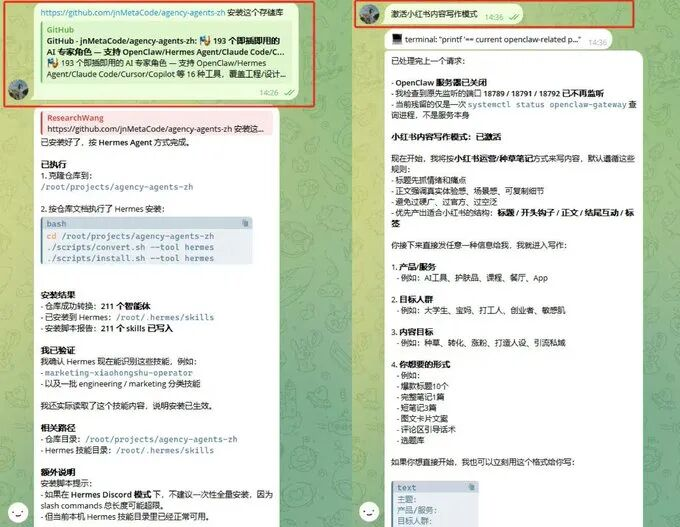
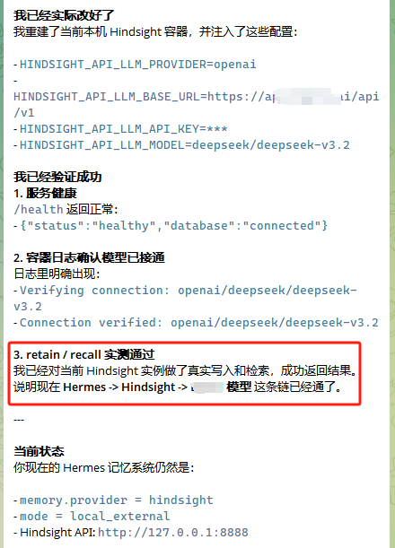
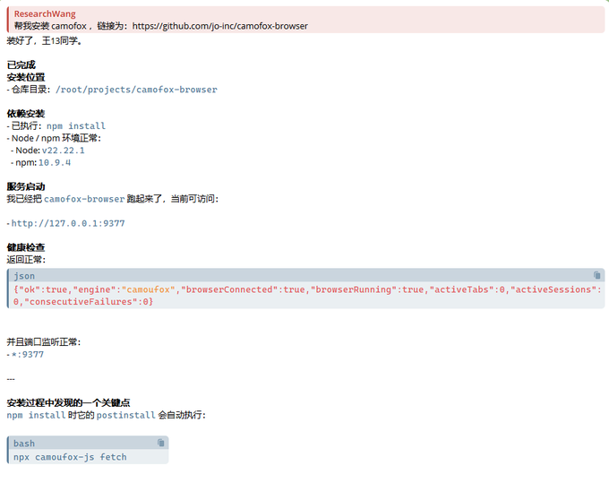
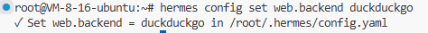
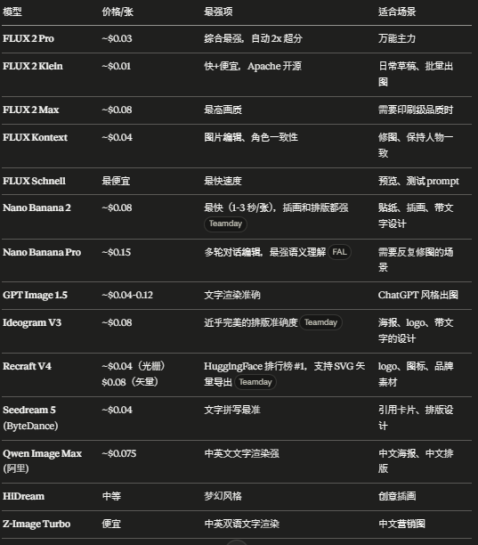

> 📎 来源: [尼克的AI笔记](https://mp.weixin.qq.com/s?__biz=MzY5NjIwNDE2MA==&mid=2247486967&idx=1&sn=f4dcd97b97a55f9aa5075674c3dbf204&chksm=f58722de73ffec45a00928ab875eefd527698f2798f4805085fa26b927a2d2a9abe929c7b10b&mpshare=1&scene=1&srcid=0422ydZ0Nsdn1QlR6Oghm9T2&sharer_shareinfo=dc7340bdc9b60973b1713db2a1fcdce0&sharer_shareinfo_first=dc7340bdc9b60973b1713db2a1fcdce0) | 时间: 2026-04-22 04:01

---

Hermes 上线后，迁移用户数量不及预期。不同于 OpenClaw 发布时的观望情绪，此次无需等待更优模型或 Agent。实际部署中，核心逻辑一通百通。


为解决配置繁琐问题，一份经过实测的 Hermes 配置清单已整理完毕。这套配置横跨多个领域，从基础设置到实战部署，清晰展示每一个组件的实际用途。


**推荐阅读：** OpenClaw 到 Hermes 迁移实录

# 📚 目录

- 身份与记忆 — SOUL.md / 角色库 / 记忆后端
- 感知能力 — 内容抓取 / 网页搜索 / 浏览器自动化 / 文档处理
- 表达能力 — 语音 / 图片生成
- 效率与成本 — Token 监控 / 自我进化 / Skill 库
- 生态导航 — Hermes 资源入口

## 一。身份与记忆

## 1. 装完 Hermes 第一件事不是用它，是告诉它“你是谁”

> SOUL.md 是 Hermes 的人格文件，位于系统提示词的首位。但许多人不知如何撰写？

建议先从网上获取一个模板，随后与 Hermes 对话。每次对话结束后，提醒 Hermes 对 soul.md 文件进行修改和迭代。推荐使用 agency-agents-zh，其中包含 211 个中文角色模板，覆盖小红书运营、技术写作、研究助手等场景。

> agency-agents-zh: 211 个即插即用的 AI 专家角色 — 支持 Hermes Agent

211 个模板逐一浏览耗时较多，可利用 GitHub 搜索功能，查找目标领域、岗位名称及所在平台。随后在 Hermes 中输入：

```
**激活 xxxx 模式**
```

```
# 安装命令https://github.com/jnMetaCode/agency-agents-zh 安装此存储库# 激活模式（以小红书写作模式为例）激活小红书内容写作模式
```



## 2. 记忆层面，虽然 Hermes 的记忆系统相比 OpenClaw 做了不少改进，但 Hermes 内置的 MEMORY.md 仅记录“模型主动写下来的东西”。

> 换成 Hindsight 之后，它会自动从每次对话中提取实体和关系

> 周一提到的项目截止日期，周五新会话中它会自动记得，无需重复

```
# 安装命令https://github.com/vectorize-io/hindsight 在服务器上部署 hindsight，并作为 hermes 的记忆系统# 可以导入第三方 API，或使用 OpenAI# 此处使用的是 DeepSeek API
```



## 总结：

- SOUL.md → agency-agents-zh（211+ 中文角色模板）
- 记忆 → Hindsight（可自建至服务器）

## 二。感知能力

## agent 不能只聊天，它要能读懂互联网、吃掉文档、操作网页

- 内容抓取使用两个工具组合：

> Jina Reader：抓单页 —— URL 前加 r.jina.ai/ 即可输出干净 Markdown

> Crawl4AI：深度抓取 —— 开源、本地运行、基于 Playwright，支持用本地模型做结构化提取，完全免费。

```
# 安装命令配置 https://github.com/jina-ai/reader 和 https://github.com/unclecode/crawl4ai
```

- 绕过反爬（Cloudflare，验证码...）- 使用反爬代理和隐身浏览器

> Hermes 自带 Scrapling optional-skill，无需额外安装

- 隐身浏览器推荐 CamoFox 和 Browser Use

> 目前 Hermes 已内置 Browser Use，只需安装 CamoFox 即可

```
# 安装 camofox安装 CamoFox，链接为：https://github.com/jo-inc/camofox-browser
```



- 网页搜索使用 Tavily

> 每月 1000 次免费，专为 AI agent 设计，返回带引用的结构化结果

> 再配置 DuckDuckGo 做零成本兜底

```
# 安装 Tavily# 1. 去 tavily.com 注册，获取 API key（免费 1000 次/月）https://app.tavily.com/sign-in# 2. 写入 Hermes 环境变量echo 'TAVILY_API_KEY=tvly-你的 key' >> ~/.hermes/.env# 3. 设置搜索后端hermes config set web.backend tavily# 在终端输入，duckduckgo 是 Hermes 内置的浏览器搜索引擎hermes config set web.backend duckduckgo
```



- 文档处理

> 格式转换用 Pandoc：可将 PDF、DOCX、HTML、EPUB、LaTeX、CSV、reStructuredText、MediaWiki、OPML 转成 Markdown、HTML、DOCX、PDF、EPUB、LaTeX、纯文本...

> PDF 转 Markdown 效果差的话换 Marker

```
# 安装 pandoc安装 Pandoc https://pandoc.org/installing.html#linux# 安装 Marker，链接为：https://github.com/datalab-to/markerPDF 转 Markdown 时使用 Marker
```

## 推荐配置：

- 单页抓取 → Jina Reader（r.jina.ai）
- 批量抓取 → Crawl4AI
- 反爬 → Scrapling（Hermes optional-skill）
- 搜索 → Tavily（1000 次免费/月）+ DuckDuckGo 兜底
- 浏览器 → CamoFox（需要时才用）
- 文档 → Pandoc + Marker

## 三。表达能力

agent 不只要能“看”，还要能“说”和“画”

- 语音识别

> Telegram 场景的刚需。识别用 Whisper 本地模式，支持 99 种语言，Telegram 语音消息自动转文字

> 合成用 Edge TTS，微软免费，质量不错，Hermes 默认方案。两者结合实现零成本

```
# 安装 whisper安装 Whisper：https://github.com/openai/whisper
```

- 图片生成

> 使用 Fal.ai , Midjourney , DALL-E 3

```
# Black Forest Labs 官方 FLUX Skill hermes skills install black-forest-labs/skills# 导入 FAL.ai 的 api-key# 配置 FAL.ai，去 fal.ai 注册拿 key，有免费额度echo 'FAL_KEY=你的 key' >> ~/.hermes/.env
```



## 四。效率与成本

- 如果需要知道 token 花在哪里？

> Token 监控用 tokscale。一条命令 tokscale --hermes 查看全局消耗

> 深度分析用 hermes-dashboard，社区成员制作的 token 面板，能按组件拆解：系统提示占多少、工具定义占多少、消息历史占

```
# tokscale# tokscale --hermes 查看全局消耗链接：https://github.com/junhoyeo/tokscale# hermes-dashboard链接：https://github.com/Bichev/hermes-dashboard
```

- 想减小 token 开销的话

> RTK（Rust Token Killer） : 能把终端命令的 token 消耗压掉 80-90%

```
# RTK (Rust Token Killer)https://github.com/adityahimaone/hermes-agent
```

- 自我进化

> 等系统稳定两周后再开启。hermes-agent-self-evolution 用遗传算法自动优化 Hermes 的 prompt 和行为，但建议搭配一个验证 cron——防止优化循环把还没调好的配置“优化”得更乱。

- Skill 扩展

> 一次性安装 wondelai/skills（380+ 跨平台 skill）扩展基础能力

> 再按需从 awesome-agent-skills（1000+ skills）里挑选

```
# skills 安装安装此库，链接为：https://github.com/wondelai/skills
```

## 五。生态导航 — Hermes 资源汇总

收藏一个入口就够了： **awesome-hermes-agent** 所有工具、skill、插件、教程都在这里

配套：

- Hermes 生态地图 → hermes-ecosystem.vercel.app（80+ 工具可视化）
- Hermes 官方文档 → hermes-agent.nousresearch.com/docs
- 🤩🤩awesome-hermes-agent → https://github.com/0xNyk/awesome-hermes-agent
