> 📎 来源: [林月半子的AI笔记](https://mp.weixin.qq.com/s?__biz=MzU4MjY5NTc4OQ==&mid=2247499640&idx=1&sn=419030f1473cffcb219e39d2ea4751f2&chksm=fc5f3117f1ad9965e6f8da27293ccbe251bd8a3a13e9ca574f35b114f9b0b626759c3c52fb81&mpshare=1&scene=1&srcid=0513bX8IJahHO3ShiZEWejNm&sharer_shareinfo=4d974881a9383b0001fc71b006d8329f&sharer_shareinfo_first=4d974881a9383b0001fc71b006d8329f) | 时间: 2026-05-13 13:23

---

关注 「**林月半子的AI笔记**」，设为「**星标**」

我是林月半子，教你用AI干掉90%的重复劳动**！**

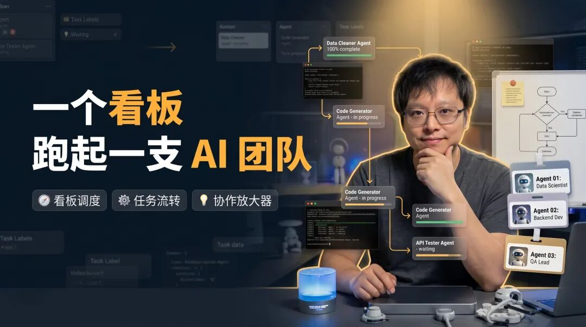

上个月我分享过一篇 [Hermes 多 Agent 管理](https://mp.weixin.qq.com/s?__biz=MzU4MjY5NTc4OQ==&mid=2247499297&idx=1&sn=7db7f2f709e45d71545c76ad93e28b38&scene=21#wechat_redirect)，有好评也有讽刺，在我看来有争议才是好事，都是流量。

最近 Hermes 更新后，出了一个 Kanban 的功能。做过敏捷开发的同学应该秒懂——每天站会盯着那块白板，谁的卡片卡在哪一列，一眼就知道。

但这个 Kanban 可不是给人用的。

移动卡片的不是人，是 Agent。状态流转、失败重试、Agent 交接——全自动。思路跟之前一样，不让一个 Agent 干所有的事，把大任务拆小，分给不同角色，各干各的。

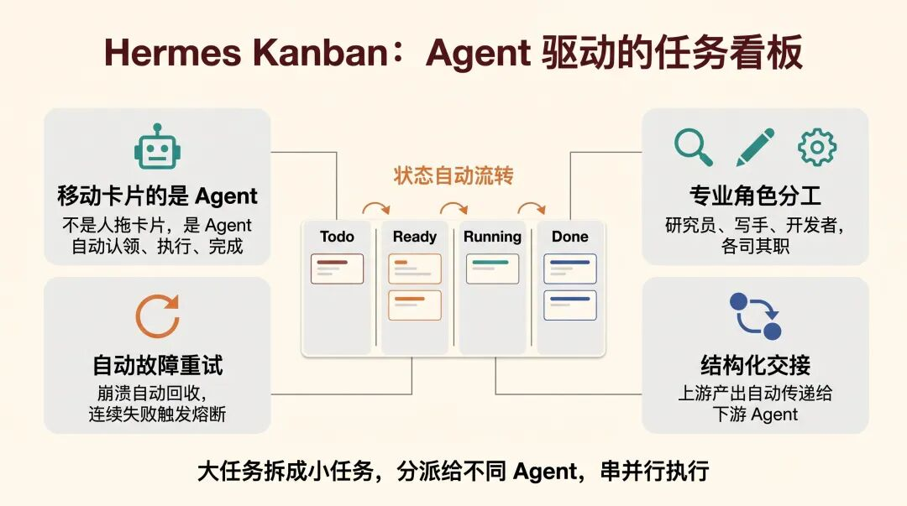

上一篇我提过，协作是能力的放大器，不是补丁。放到 Kanban 里也一样。

说实话这个操作，真的有点像团队里项目经理拆完需求，往看板上一贴，各人领各人的活。

只不过这次领活的全是 AI。

## 两个入口，同一块看板

Hermes Kanban 有两套操作方式：Agent 那边通过内置的工具函数（kanban\_create、kanban\_complete、kanban\_block 等）自动驱动看板；你这边通过 hermes kanban ... 命令行或者 /kanban 斜杠命令来操作。

两套入口读写的是同一个 kanban.db，数据完全一致——Agent 在里面干活，你在外面看进度、留言、解除阻塞，互不冲突。

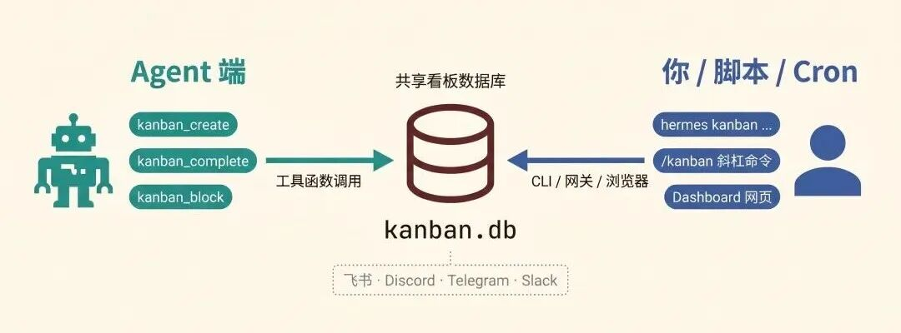

飞书、Discord、Telegram 这些网关里也能直接用 /kanban list、/kanban create 操作看板，不用切到终端。

🎯

如果你用过飞书的话，想象一下，你在飞书群里发一句 /kanban create "写一篇Kanban教程" --assignee writer，然后切到浏览器看 Dashboard，任务已经在看板上了，Agent 正在认领、执行。这个体感，跟你在飞书里给同事派活没什么区别。

## 从零开始：先跑通一个最简单的任务

别着急搞什么多 Agent 并行、任务依赖链。我们先从最基础的开始：创建一个任务，让一个 Agent 把它做完。

### 第一步：准备 Profile

Hermes 里的 Profile 就是你给 Agent 准备的"岗位说明书"。你想让它干什么活，就给它配什么身份。

如果你还没创建过 Profile，先建几个常用的：

```
hermes profiles create researcher   # 调研员hermes profiles create writer       # 写手hermes profiles create coder        # 开发者hermes profiles create video-worker # 视频创作者
```

每个 Profile 可以配自己的技能（Skills）、工具（Tools）和记忆（Memory）。这不是今天的重点，知道有这回事就行。

### 第二步：初始化 Kanban + 启动网关

```
hermes kanban init       # 创建 kanban.db（其实这步可以省，第一次跑任何 kanban 命令都会自动初始化）hermes gateway start     # 启动网关，里面内置了 Dispatcher（调度器）
```

💡

Dispatcher 你可以理解成一个"工头"。它每隔 60 秒扫一遍看板，看看有没有 Ready 状态的任务，有的话就分配给对应的 Agent 去干。Agent 崩了、超时了，它也负责回收和重新分配。

```
hermes dashboard         # 打开浏览器看看 Kanban 长什么样
```

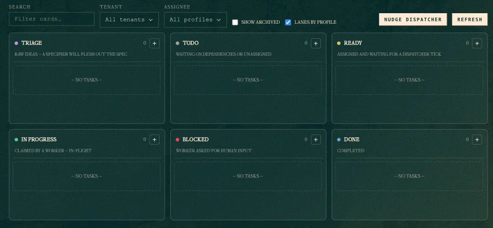

六列状态从左到右：Triage（待梳理）→ Todo（待办）→ Ready（就绪）→ In Progress（进行中）→ Blocked（阻塞）→ Done（完成）。

### 第三步：创建一个任务

```
hermes kanban create "make a video about kanban" \    --assignee video-worker \    --tenant video-pipeline
```

这条命令做了三件事：

1. 1.在看板上新建了一张卡片
2. 2.指定 video-worker 这个 Profile 来干活
3. 3.用 --tenant 给任务打了个标签，方便按项目筛选

跑完之后，Dispatcher 下一次扫描（最多等 60 秒）就会把这个任务分配给 video-worker，然后自动启动一个 Agent 进程来执行。

你也可以点 Dashboard 上的"Nudge dispatcher"按钮，让它立刻调度，不用等。

### 如果任务被 Blocked 了

新手最容易在这里懵。你兴高采烈地创建了任务，结果一看状态——blocked。

```
hermes kanban listBoard: default (1 other board — `hermes kanban boards list`)⊘ t_058c4d9c  blocked   video-worker   [video-pipeline]  make a video about kanban
```

别慌，Blocked 不是报错，是 Agent 在等你的输入。

我只说了"make a video about kanban"，Agent 不知道要什么角度、多长、给谁看，它就主动 Block 自己，在评论区留下了问题。

用 context 命令看看它到底在问什么：

```
hermes kanban context t_058c4d9c
```

输出大概长这样：

```
hermes kanbancontextt_058c4d9c# Kanban task t_058c4d9c: make a video about kanbanAssignee:video-workerStatus:   blockedTenant:   video-pipelineWorkspace:scratch@/Users//.hermes/kanban/workspaces/t_058c4d9c## Prior attempts on this task### Attempt 1 — blocked (video-worker, 2026-05-10 20:59)"make a video about kanban"—need spec:whatangle(intro/tips/comparison/tutorial)?duration?audiencelevel?existingsourcematerial?isthereanarticleorblogposttoconvert,orstartfrom scratch?"
```

Agent 问得挺具体的：什么角度？多长？受众什么水平？有没有现成素材？

回答它：

```
hermes kanban comment t_058c4d9c "做一个入门教程视频，时长1分钟左右，受众是完全不懂kanban的小白，基于我们之前的讨论内容来讲"
```

再解除阻塞：

```
hermes kanban unblock t_058c4d9c
```

Dispatcher 会重新调度这个任务，@video-worker 拿到你的回答后继续工作。

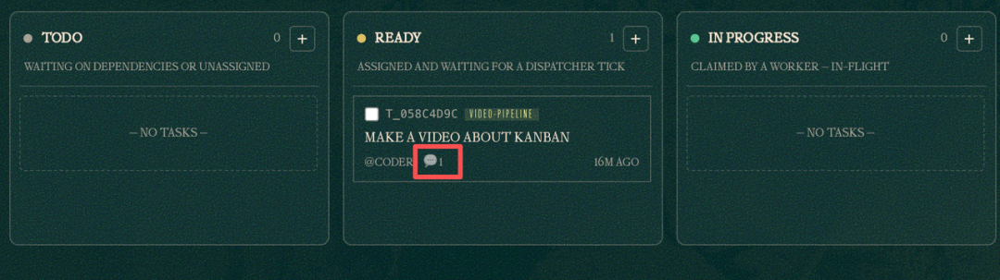

💡

踩坑提醒：comment 和 unblock 是两步操作，别忘了 unblock。光留言不解除阻塞，任务是不会动的。

整个流程用一张表总结：

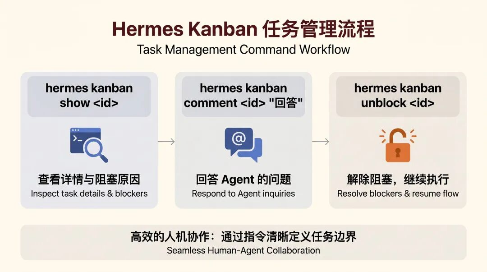

跑通这个基本流程，Hermes Kanban 你就已经能上手干活了。

## 进阶：一句话，让 Agent 自己拆任务

上篇文章发出来后，评论区问得最多的一个问题：能不能在飞书里搞？

当时那篇讲的多 Agent 协作，要在 Discord 里配群组、配 bot、调 @mention，流程确实绕。不少人看完觉得"东西是好东西，但我团队用飞书啊"。

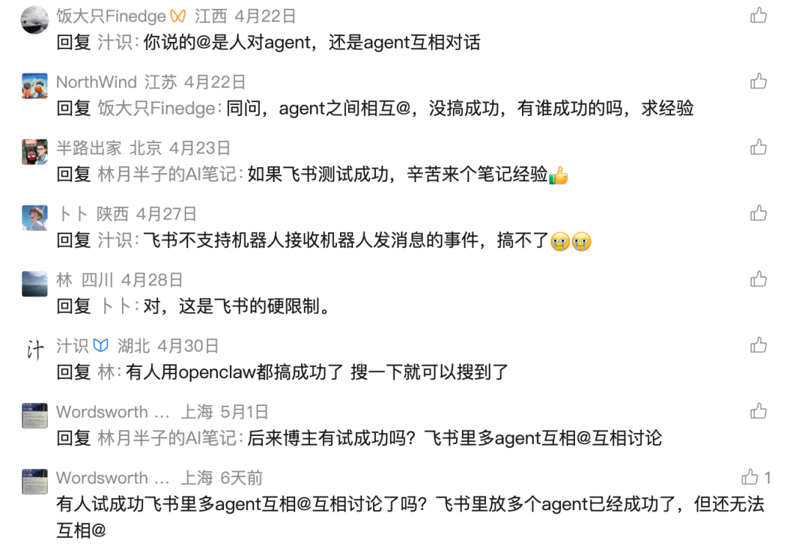

现在有了 Kanban，不用那么复杂了。你在飞书里发一句话，Agent 自己拆、自己跑、自己交接。

不用配 Discord 群组，不用调 bot 权限，不用管 @mention 那些坑。

前面的例子是你手动创建一个任务，Agent 来执行。

但任务复杂了怎么办？

比如"做一个 90 秒的 Hermes 介绍视频"——这明显不是一个 Agent 能搞定的，你得有人调研、有人写脚本、有人生成视频。

手动拆？可以，但累。

有了 Kanban，之前那套复杂的 IM 机器人配置直接省了，变成"对话即工作流"。

你只需要在飞书里说一句话：

💬

创建一个 Hermes Agent 功能介绍视频的任务，分配给 researcher 调研核心功能亮点，再让 writer 写视频脚本，最后让 video-worker 生成 90 秒横版视频。

Agent 收到后，自动拆成这样：

```
T1  t_f3021692  [researcher]    调研 Hermes Agent 核心功能亮点    ✅ ready                       ↓T2  t_391e4acc  [writer]        撰写 90 秒中文视频脚本            ⏳ 等待 T1                       ↓T3  t_8ca0e4dc  [video-worker]  生成 90 秒横版视频               ⏳ 等待 T2
```

T1 跑完后 T2 自动变成 Ready，T2 完成后 T3 接上。全程不需要你介入。

你在飞书里当甩手掌柜，Agent 在后台卷生卷死。

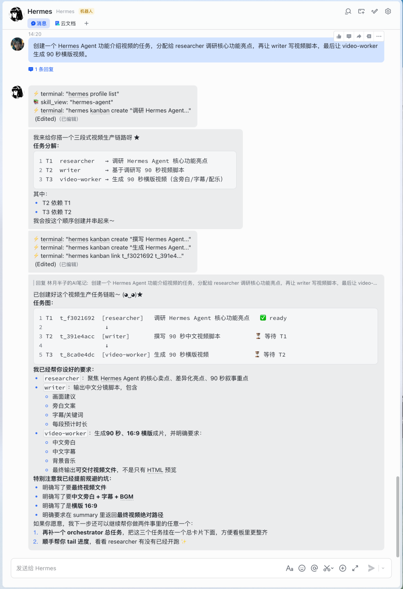

整个过程不需要写一行命令，不需要手动指定 --parent，不需要管依赖关系——orchestrator 自己判断、自己建、自己跑。

🎯

这就是 Kanban 里 orchestrator 角色在干的事。你给它一个目标，它自动拆子任务、建依赖、分配 Agent。你在飞书里聊天就能驱动多 Agent 协作，跟给同事派活一样。

Dashboard 里也能实时看到每个子任务的状态，哪个在跑、哪个在等、哪个卡住了。

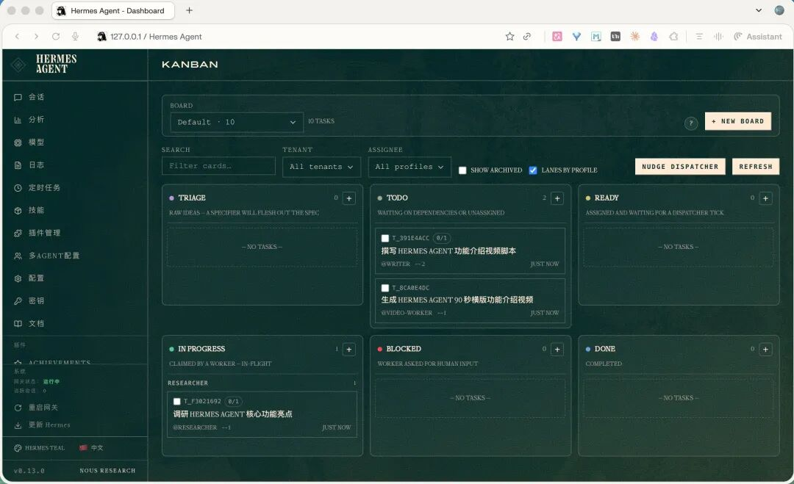

喜欢终端的话，hermes kanban watch 也能实时看任务的生命周期——created → linked → claimed → spawned → completed，每一步都有日志。

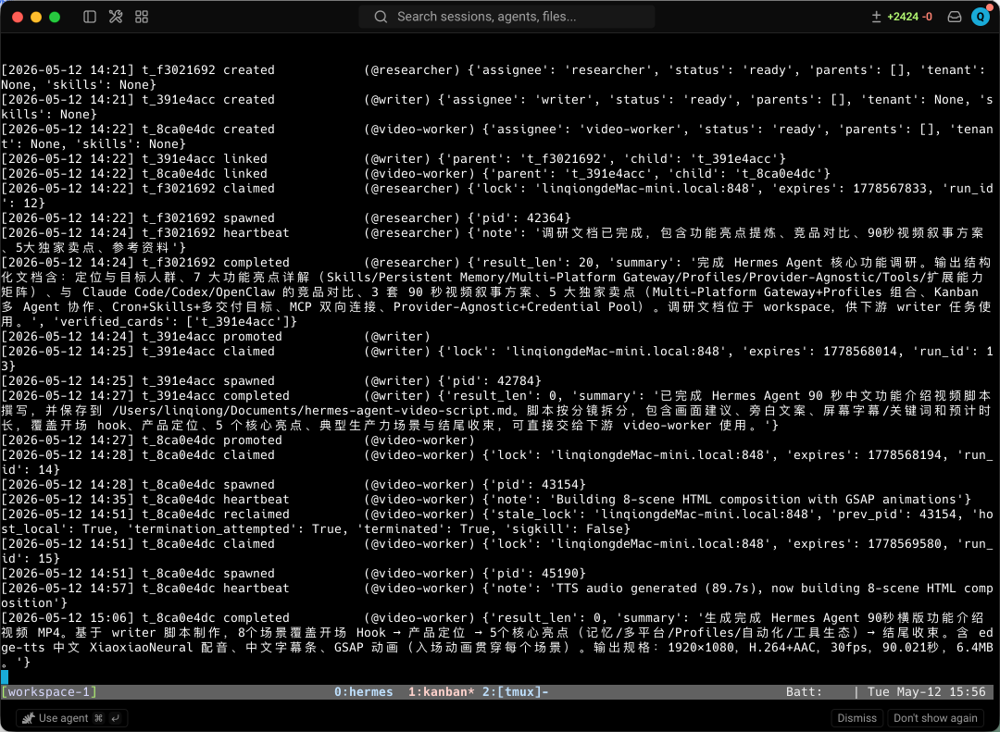

最终 video-worker 产出的视频长这样：

当然，学习阶段你想精确控制每一步，也可以自己手动创建任务链：

```
# 第一步T1=$(hermes kanban create "调研 Hermes 核心功能" \    --assignee researcher --tenant video-pipeline --json | jq -r .id)# 第二步，依赖 T1T2=$(hermes kanban create "写视频脚本" \    --assignee writer --tenant video-pipeline \    --parent $T1 --json | jq -r .id)# 第三步，依赖 T2hermes kanban create "生成视频 mp4" \    --assignee video-worker --tenant video-pipeline \    --parent $T2
```

两种模式的区别看这张图：

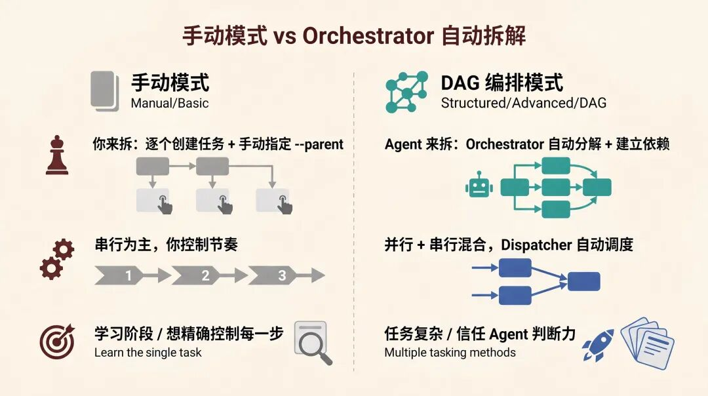

到这里，单个看板上的玩法就讲完了——从手动建单任务，到 Orchestrator 一句话自动拆，入门到进阶的主要场景都覆盖了。

但如果你跟我一样，同时在做公众号内容、客户项目、日常杂事，全堆在一个 default 看板上，任务一多就眼花。

## Boards：一个项目一块看板

Hermes Kanban 支持多看板（Boards），每个 Board 的数据库、工作空间、调度器完全隔离。

下面这张图一看就懂：

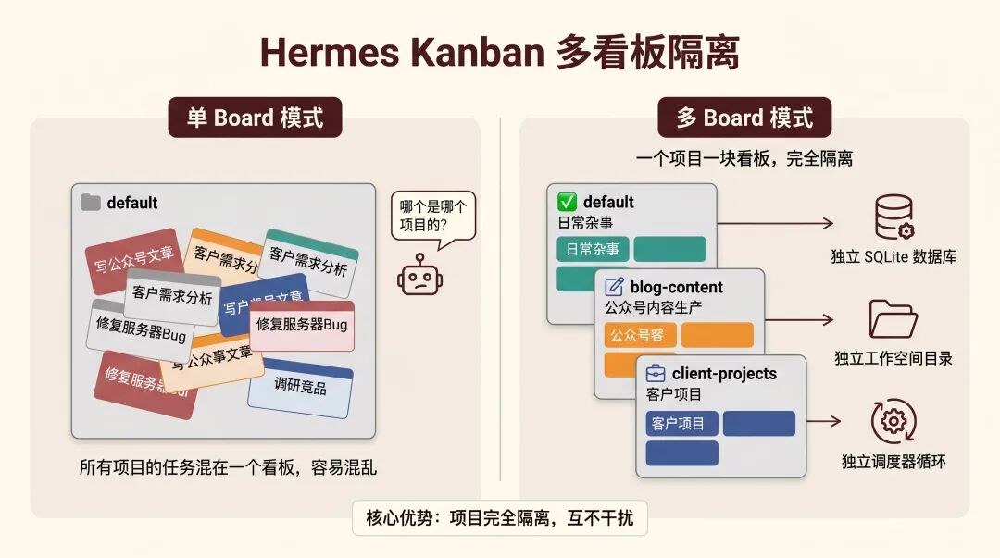

操作也简单：

```
hermes kanban boards create blog-content    # 新建一个叫 blog-content 的看板hermes kanban boards switch blog-content    # 切到这个看板hermes kanban boards list                   # 看看有哪些看板hermes kanban boards show                   # 当前在哪个看板
```

切到某个 Board 后，你所有的 hermes kanban 命令都只操作那个 Board，不影响其他的。

也可以不切换，直接用 --board 参数操作指定看板：

```
hermes kanban --board blog-content listhermes kanban --board client-projects create "做客户项目需求分析" --assignee researcher
```

对比一下：

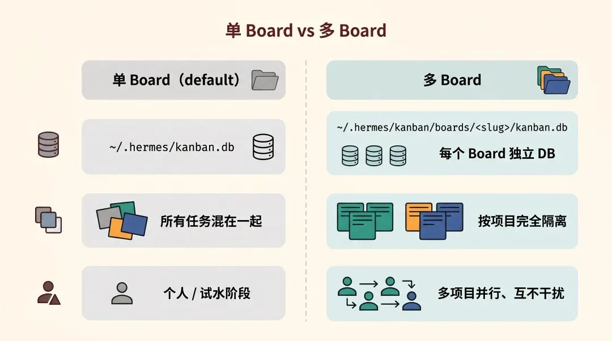

Boards 就是干这件事的：一个项目一块看板，互不干扰。

## 底下跑的是什么？聊聊核心机制

前面讲的都是怎么用，这里说说为什么跑得动。

整套系统围绕本地 SQLite 数据库转。每次 Agent 认领任务是原子事务——多个 Agent 竞争同一个任务时，只有一个能拿到，不会出现两个 Agent 同时干同一件事。

Agent 崩了？

Dispatcher 通过进程存活检测（kill(pid, 0)）自动发现，回收任务，重新分配。

连续失败三次还触发熔断，任务自动锁定等人工介入，不会让看板空转。

任务之间可以建父子依赖。

上游完成后的摘要和元数据自动传给下游 Agent。

T2（写脚本）能知道 T1（调研）发现了什么——不是靠"翻聊天记录"，是结构化的数据交接。

拿我们刚跑的视频任务来说，hermes kanban show t\_391e4acc 能看到 T2 的完整信息：

```
Task t_391e4acc: 撰写 Hermes Agent 功能介绍视频脚本  status:     done  assignee:   writer  parents:    t_f3021692  children:   t_8ca0e4dcBody:请根据 researcher 的调研结果，撰写一份 Hermes Agent 功能介绍视频脚本...上游调研任务 workspace 路径: ~/.hermes/kanban/workspaces/t_f3021692/
```

Kanban 里每个任务有自己独立的 workspace 目录。

T1（researcher）跑完后，调研文档、notes、summary 都落在自己的 workspace 里。

T2 的 body 里写了上游 workspace 路径——writer 启动后直接去那个目录读文件，拿到 T1 的全部产出。

T1 完成时还会写一个 summary，说自己做了什么、产出了哪些文件、关键结论。

下游 Agent 同时看两样东西：T1 的 summary（快速了解全貌）和 T1 workspace 里的实际文件（拿具体内容）。

这就是 Kanban 的传参方式——文件式交接 + 任务状态推进，不是共享上下文。

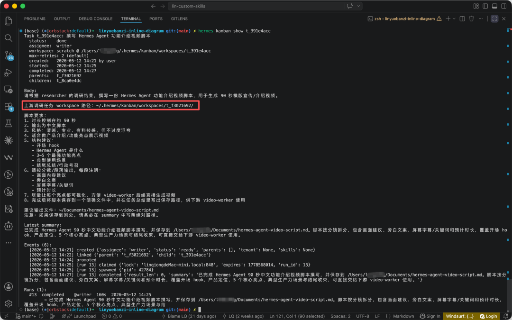

官方文档里列了一些协作模式，挑几个常用的：

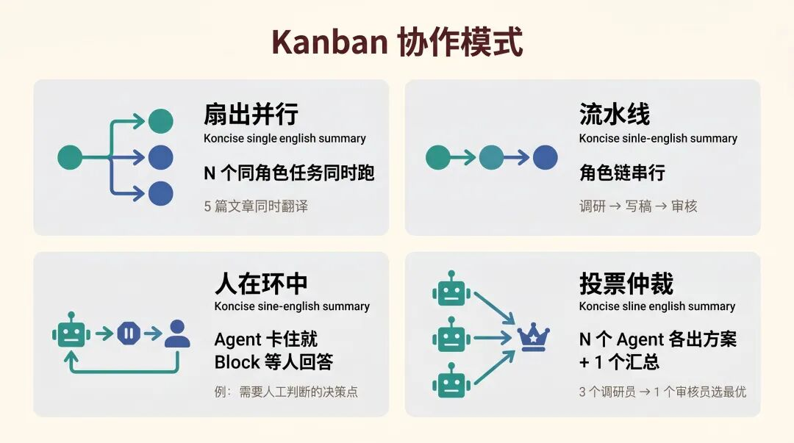

Web Dashboard 通过 WebSocket 实时推送事件，不用刷新页面就能看到任务状态变化。

## 跟 delegate\_task 有什么区别？

如果你之前用过 Hermes 的 delegate\_task（子 Agent 委派），可能会想：这跟 Kanban 有什么不一样？

一句话：delegate\_task 是函数调用，Kanban 是工作队列。

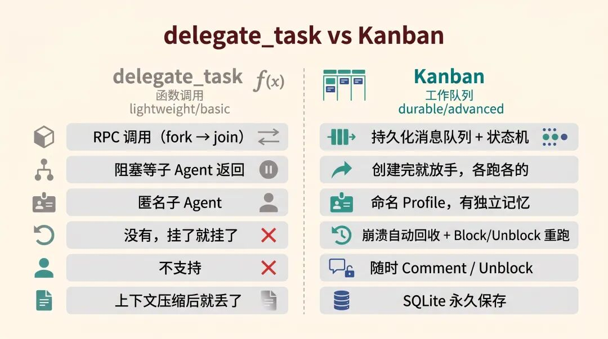

要一个快速的问答结果，用 delegate\_task。

跨 Agent 的、需要人工介入的、要活过重启的复杂任务，用 Kanban。

两者可以共存——一个 Kanban Worker 执行任务的过程中，内部完全可以用 delegate\_task 去问另一个 Agent 一个小问题。

## 写在最后

多 Agent 协作这件事，之前总觉得"演示看着酷，真用起来不太行"。

以前搞多 Agent，要么是一个 Agent 内部疯狂调子 Agent，上下文越来越乱；要么是多个 Agent 各跑各的，没有统一的地方看进度。

Kanban 把任务拆解、分配、执行、交接、失败重试、人工介入这些事情拉到了一个看板上。

打开 Dashboard 就能看到所有 Agent 在干什么、卡在哪、产出了什么。

如果你之前看过我那篇 Hermes 多 Agent 的文章，这篇算是它的实战升级版。

建议先从最简单的单任务跑起来，跑通了再试任务链，最后再玩 Orchestrator 自治拆解。

## 加入社群

我平时主要折腾 n8n 自动化、OpenClaw 和各种 AI Agent 实战，群里经常有人分享踩坑经验、工作流配置和新工具的第一手体验。

遇到问题群里问，看完文章群里聊。点击下方加入，一起搞。    

如果觉得不错，随手点个「赞」和「在看」，转发给需要的朋友吧～ 第一时间收到推送，记得给我个星标⭐
