> 📎 来源: [林月半子的AI笔记](https://mp.weixin.qq.com/s?__biz=MzU4MjY5NTc4OQ==&mid=2247499392&idx=1&sn=b708052b847b32b04a36f4886967ee57&chksm=fceddc984ca82ad5fab5d9d71c7491fe9ee887e989cceea388e8fbd8cd8a0a33ba52e08529bb&mpshare=1&scene=1&srcid=0429NeLx12GsJZVzX5QEYNpQ&sharer_shareinfo=d26b73894a65bf8660fd5377f0f658b5&sharer_shareinfo_first=d26b73894a65bf8660fd5377f0f658b5) | 时间: 2026-04-29 11:50

---

关注 「**林月半子的AI笔记**」，设为「**星标**」

我是林月半子，教你用AI干掉90%的重复劳动**！**


前不久我写了一篇《Hermes 这个技能我一直没碰，跑完一遍后悔没早试》，讲的是怎么用 Hermes Agent 跑通 Karpathy 那套 LLM Wiki 知识库方法论。

文章 2.8 万阅读，4000 多个转发，对我这种小号来说算挺意外的成绩。但发出去之后我后台和私信被一个问题刷屏了。

不是问效果怎么样，也不是问知识库结构怎么设计。问的全是：

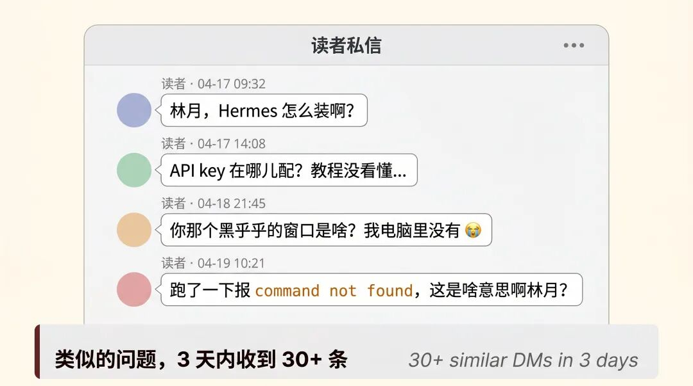

我当时刷着这些消息，心情挺复杂的。

对我们这种天天泡在终端里的人来说，curl 一下、brew install 一下、改个 ~/.zshrc，这就是肌肉记忆。但对绝大多数普通人来说，打开终端这四个字本身就是劝退的第一道门。

我有个做新媒体的朋友，看完那篇 Hermes 文章兴致勃勃地说要搭一个选题素材库，结果在"打开 Terminal 装 Hermes "这一步卡了两天。最后跟我说："你能不能搞个不用敲命令的版本？"

那时候我心里就一直在转一个念头：LLM Wiki 这套东西本身没毛病，毛病出在门槛卡在了不该卡的地方。Karpathy 也好、Hermes 也好，搞这套东西的预设受众一直是极客。但最该用上会自己长大的知识库的，恰恰是那些不会敲命令的人。

得有个不一样的方案。

结果前几天，我发现真有人把这事儿干了。

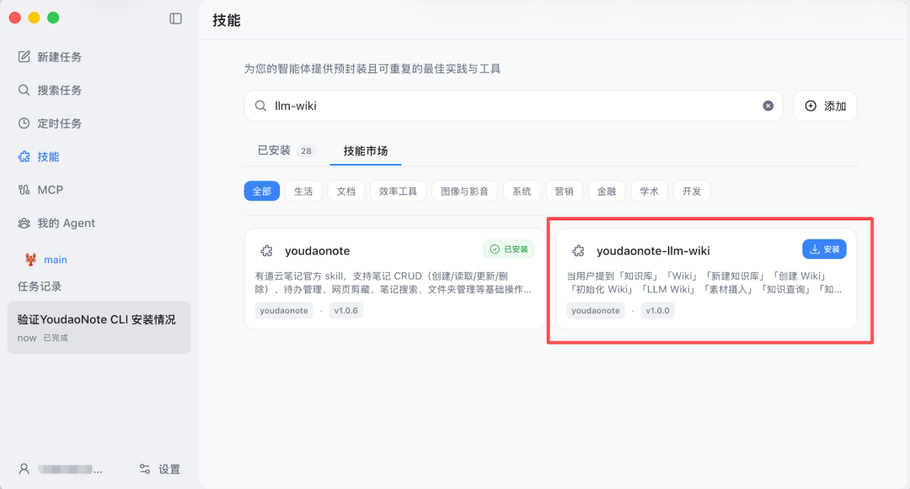

有道云笔记官方推出了 youdaonote-llm-wiki skill，它干的事情用一句话说就是：把 Karpathy 那套 LLM Wiki 方法论，原原本本搬到了有道云笔记里。如果你用的是有道龙虾，可以直接在技能市场安装这个 Skill。

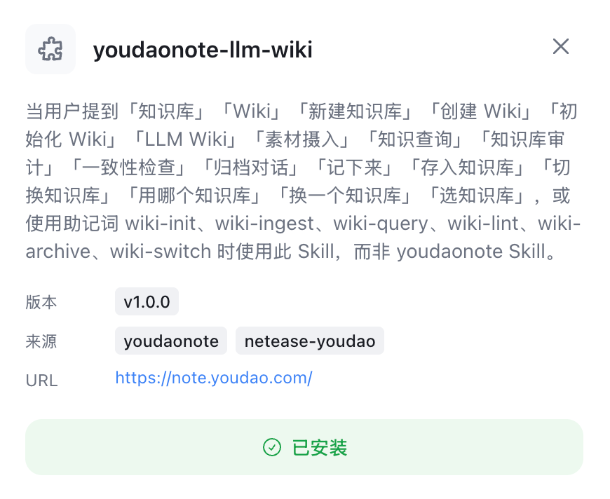

Karpathy 那套 raw / entities / queries 三层架构里的核心动作，基本都在里头。多出来的几个像切换知识库、选知识库这种多库管理的能力，原版本来是没有的。

最重要的是，跑完之后的成果直接落到有道云笔记里，不是某个本地文件夹。

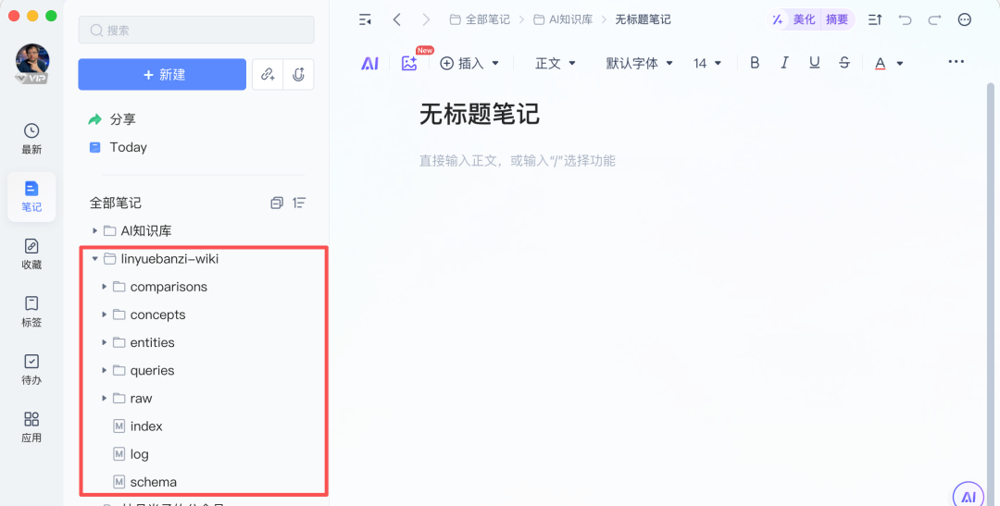

这一下，你的笔记目录里会自动长出一个个会自己更新的百科式知识库。手机、网页、电脑端，打开都能看。"终端"这道门就这么被拆了。

OK 故事讲完，下面进入正题。

## 先看效果，再看怎么做

我习惯先把效果亮出来，让大家有个预期，再决定要不要花十分钟跟着搭。

📌

视频里这个流程，按官方的说法是这样的：

搜集资料 → 跟 AI 说话 → 在有道云笔记里查看成果。

整理跟归档这些事，AI 全包了。

听着有点像营销话术。但我跑了一遍下来，感觉差不多就是这么回事。

我从头到尾没新建过文件夹，没敲过标题，没整理过笔记。我做的事就两件：往里扔素材、跟 AI 说话。

看完视频可能你会想，这玩意搭起来是不是很复杂？我跟你说，从零到跑通第一个知识库，整个过程不超过 15 分钟。下面我手把手带你走一遍。

## 这套流程到底怎么跑通的？

讲实操之前，我想先把整个数据流向画一下。这个图能帮你建立一个全局认知，后面卡住的时候你会感谢现在这两分钟。

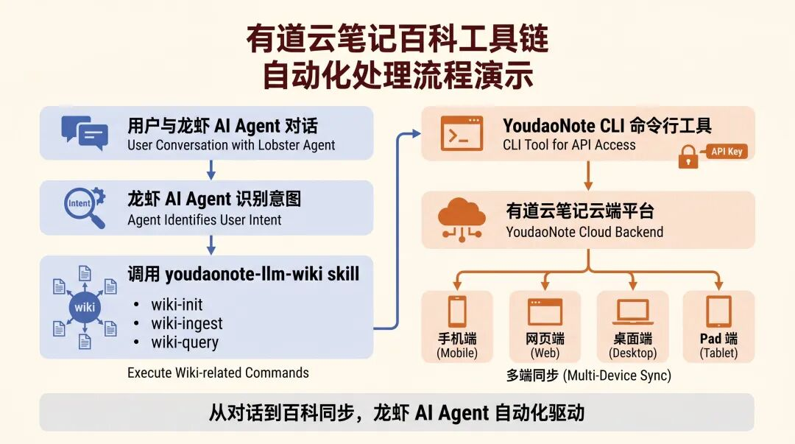

这张图我建议你看完就行，不用记。我当时第一次画完盯着它看了一会儿，琢磨明白了一件事：skill 本身就是个"懂你想干啥"的翻译器，它自己不会去动你的笔记。真正干活的是中间那个 CLI，它拿着 API Key 去调有道云笔记的接口，把 AI 生成的内容写进你云端。这套架构挺取巧的，三件事各干各的，挂掉哪一层另外两层也不会被拖死。

## STEP 1：装 YoudaoNote CLI

先打开你的终端（Mac 和 Linux 用自带的 Terminal 就行），把下面这条命令贴进去：

```
curl -fsSL https://artifact.lx.netease.com/download/youdaonote-cli/install.sh | bash -s -- -f -b ~/.local/bin
```

回车，等几秒钟。

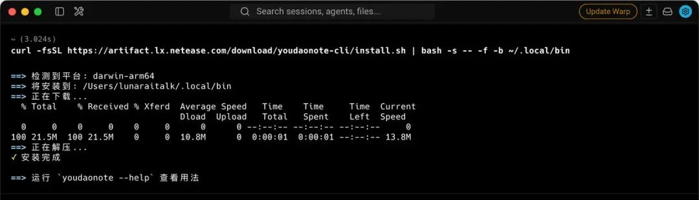

看到 ✓ 安装完成 就 OK 了。然后跑一下版本验证：

```
youdaonote version
```

输出 1.3.0（或更高），说明 CLI 装好了。

💡

用 Windows 的朋友看这里：上面这个一键脚本只支持 macOS 和 Linux，Windows 需要去官方文档下载手动安装包，配置一下 PATH 就行。如果卡住了私信我，我截屏带你过一遍。

看到这一步可能有人已经懵了，你不是说要拆掉终端这道门吗，怎么还要敲命令？

讲真我自己写到这一步的时候也卡了一下。龙虾里其实可以直接让 AI 帮你执行 bash 命令，就是把上面那条 curl 直接丢进龙虾对话框，AI 自己会调 bash 工具帮你装好，连终端都不用打开。

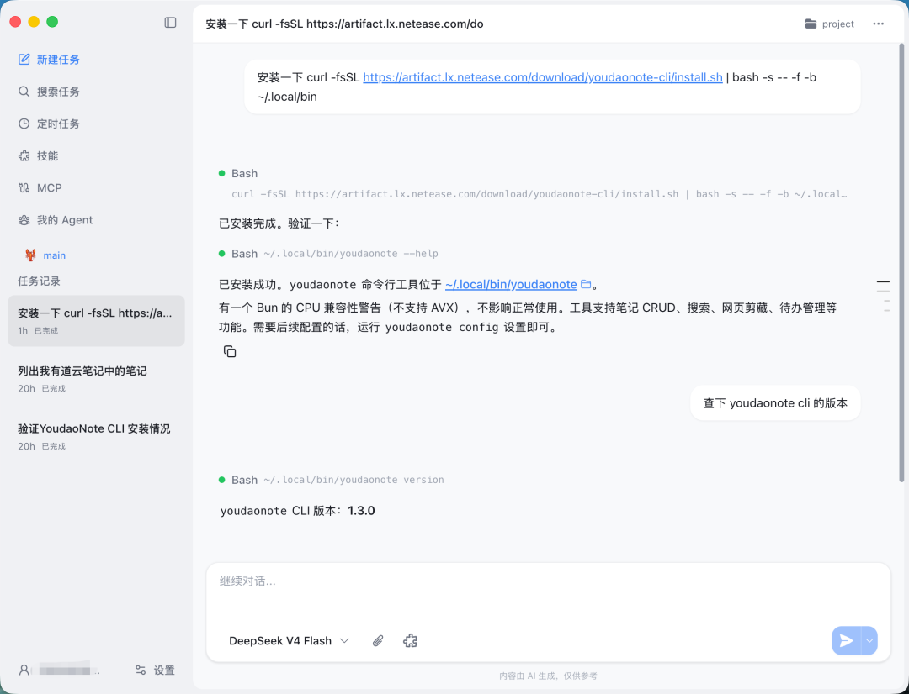

所以这一步你有两条路：

- 会用终端的：照上面 curl 那条命令直接装，最快
- 看到终端就头疼的：把命令复制到龙虾对话框里发出去，让 AI 帮你装

不管走哪条路，装完一次以后日常都不用再碰，后面全程在龙虾里跟 AI 说话、在有道云笔记里看结果。

## STEP 2：到有道云笔记 MCP 平台拿 API Key

CLI 装好之后，得让它知道你是谁、能操作哪个账号的笔记。这就要去拿一个 API Key。流程不复杂，看下面这张图就够了

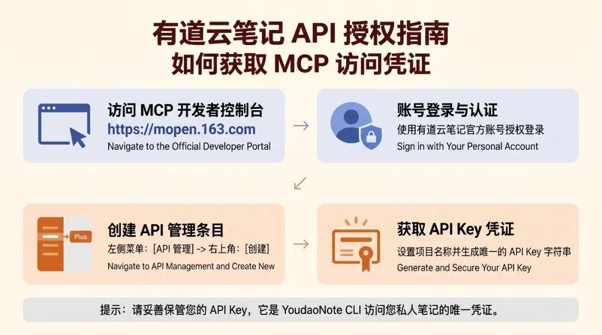

拿到 Key 之后，跟 STEP 1 一样，你有两条路。

### 路线 A：直接在龙虾里搞定（推荐）

把下面这段话发给龙虾，把 YOUR\_API\_KEY 替换成你刚才复制的那串：

💬

帮我用 youdaonote config set apiKey YOUR\_API\_KEY 配置一下，然后跑 youdaonote list 验证一下能不能列出我有道云笔记里的文件夹。

AI 会自己跑这两个命令，配完直接给你列出来。我跑出来是这样：

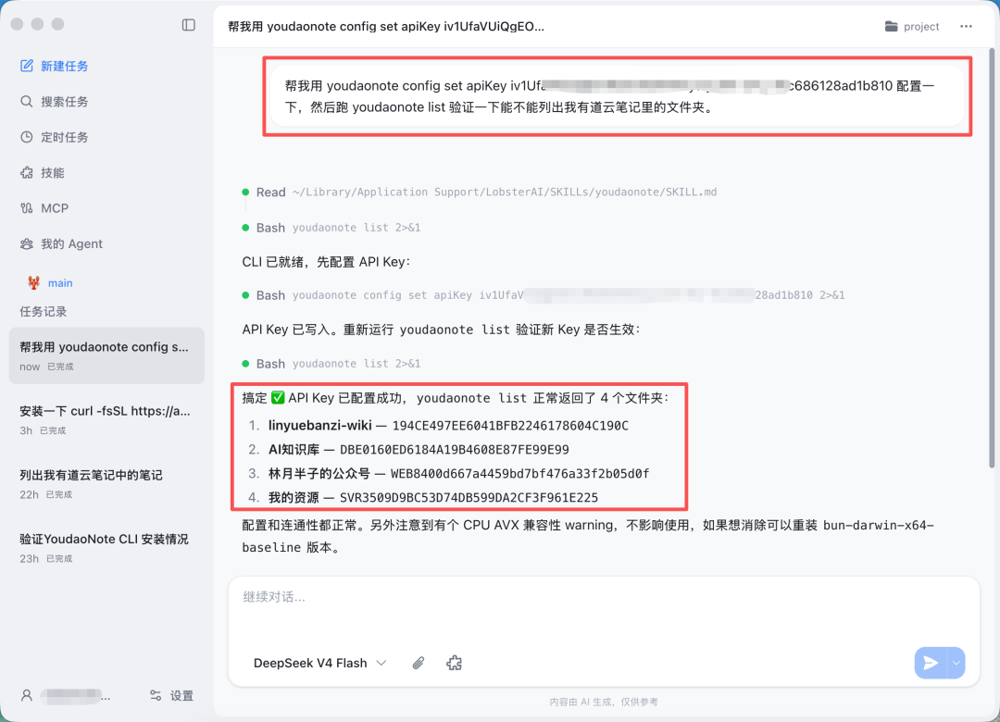

能列出文件夹，说明 CLI 已经成功连上你的有道云笔记了。

### 路线 B：熟悉命令行的就直接来

```
# 把 YOUR_API_KEY 替换成你刚才复制的那串字符。youdaonote config set apiKey YOUR_API_KEYyoudaonote list
```

返回类似下面这种就 OK：

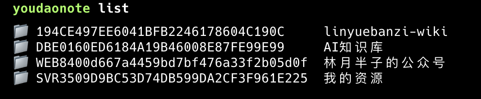

到这一步，CLI 这边的活就全搞定了。

## STEP 3：在龙虾里装上 youdaonote-llm-wiki skill

打开龙虾 App，左侧菜单点【技能】→ 切到【技能市场】→ 搜索框输入 llm-wiki。

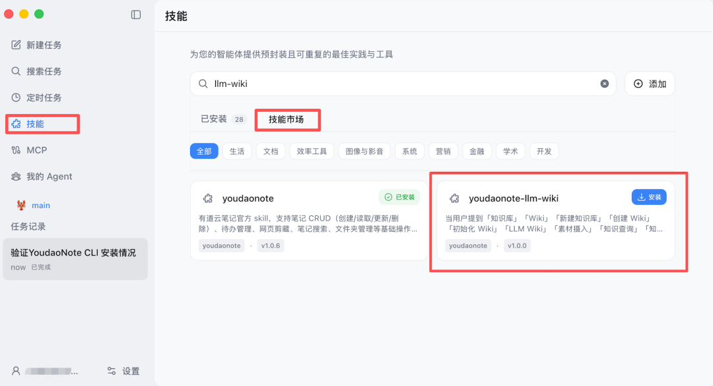

找到 youdaonote-llm-wiki，点【安装】，搞定。

💡

顺便说一下：这个 skill 本身是开放的，你接到别的 AI Agent 上也能跑。但我自己日常重度用有道云笔记，干脆全家桶来一套，有道龙虾 + 有道云笔记原生打通，配置上几乎零摩擦，省心。所以本文后面都以有道龙虾为例。

## STEP 4：配置一个能打的模型

LLM Wiki 这套流程对模型有要求，它得做"知识编译"这种相对复杂的结构化任务，模型太弱会崩。

上周国产之光 DeepSeek 发布了 V4，LobsterAI 里已经支持了，我也试过了，速度很快，建议直接上 V4 Flash。在【设置】→【模型】→ 找到 DeepSeek，开启，把 API Key 填进去。

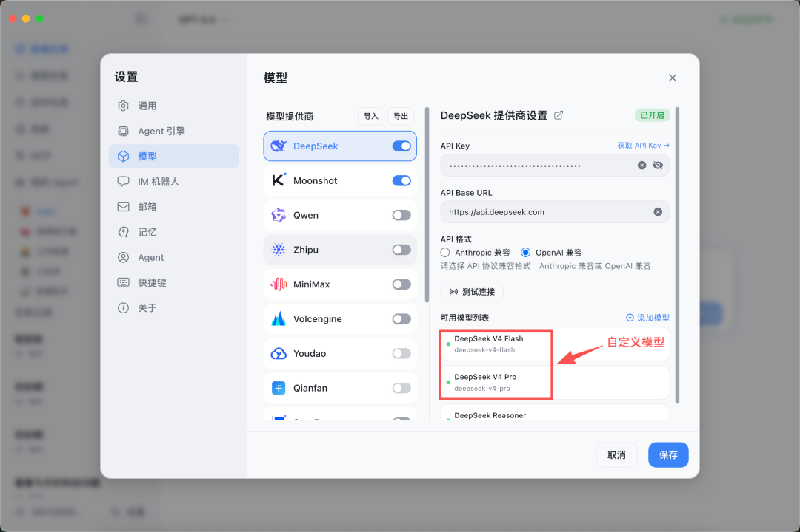

到这里准备工作就全做完了，下面进入正菜：怎么用它真的搭一个能用的知识库出来。

## STEP 5：用一句话搭出第一个知识库

我决定拿我自己最熟悉、也最痛的场景来开张：把我公众号过往的文章整理成一个 AI 知识库。

为啥选这个场景？因为做内容创作的人都懂，写过的东西很容易就忘了。每次想引用自己之前的某个观点、某个案例，都得回去翻历史文章，效率不行。要是有个能随时问的私人知识库，对创作者来说会省很多事。

我之前已经把所有公众号文章的草稿都同步到了有道云笔记，统一放在一个叫《林月半子的公众号》的文件夹里。

回到龙虾的对话框，我说了这么一句话：

💬

请读取我云笔记中《林月半子的公众号》文件夹中的内容，帮我搭建一个 AI 的知识库。

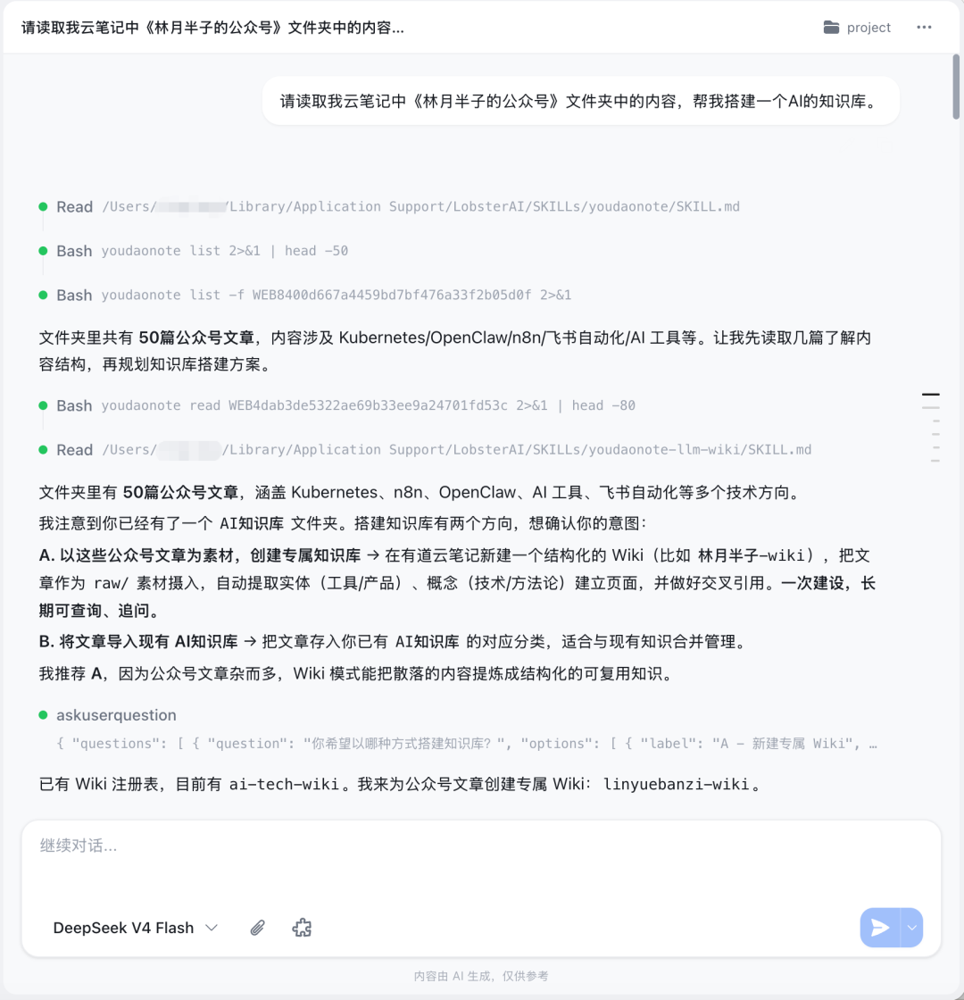

剩下的事就交给 AI 了，我喝了口茶。

回来一看，整个知识库已经搭好了：

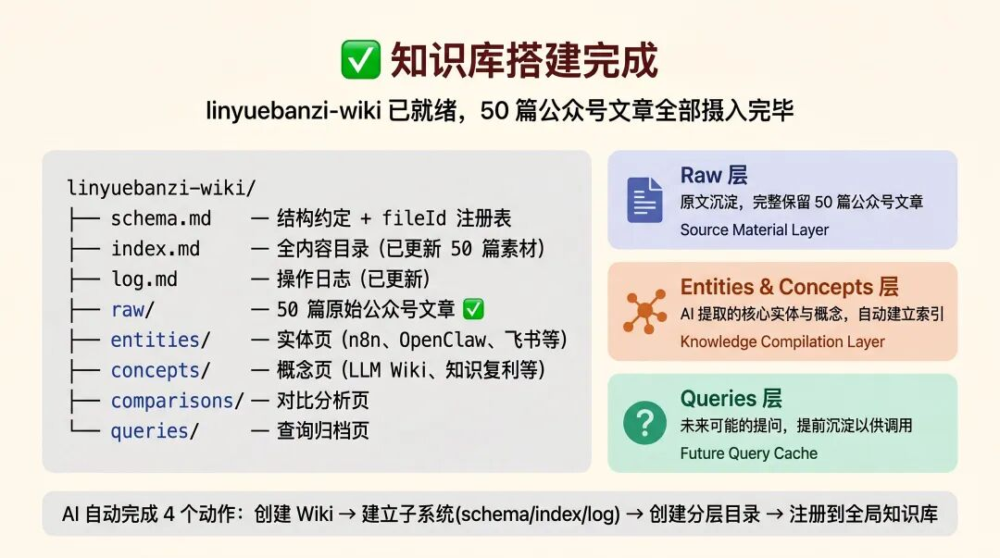

整个目录搭得整整齐齐，我没敲过一个字。

第一次看到这画面我盯着屏幕坐了好一会儿，心里只有一个想法：要是早点知道有这个东西，我之前手动整理的那几百个小时算白花了。

## STEP 6：跟知识库对话，让它"越用越活"

知识库搭好之后，下半场才是真正的高潮。

比如我最近在准备一篇关于AI 自动化变现的文章，但思路有点散。我直接在龙虾里问：

💬

根据 linyuebanzi-wiki 知识库的内容，我之前关于 AI 自动化变现都写过哪些角度？帮我列一下，按变现路径分类。

这个回答没让 AI 跑去网上瞎搜，也不是泛泛丢几条建议给我。

它跑了几次 youdaonote search 和 youdaonote read，把我自己写过的东西从知识库里捞了一遍，整理出 5 条具体的变现路径，每一条都标了素材来源、核心模式和工具组合：

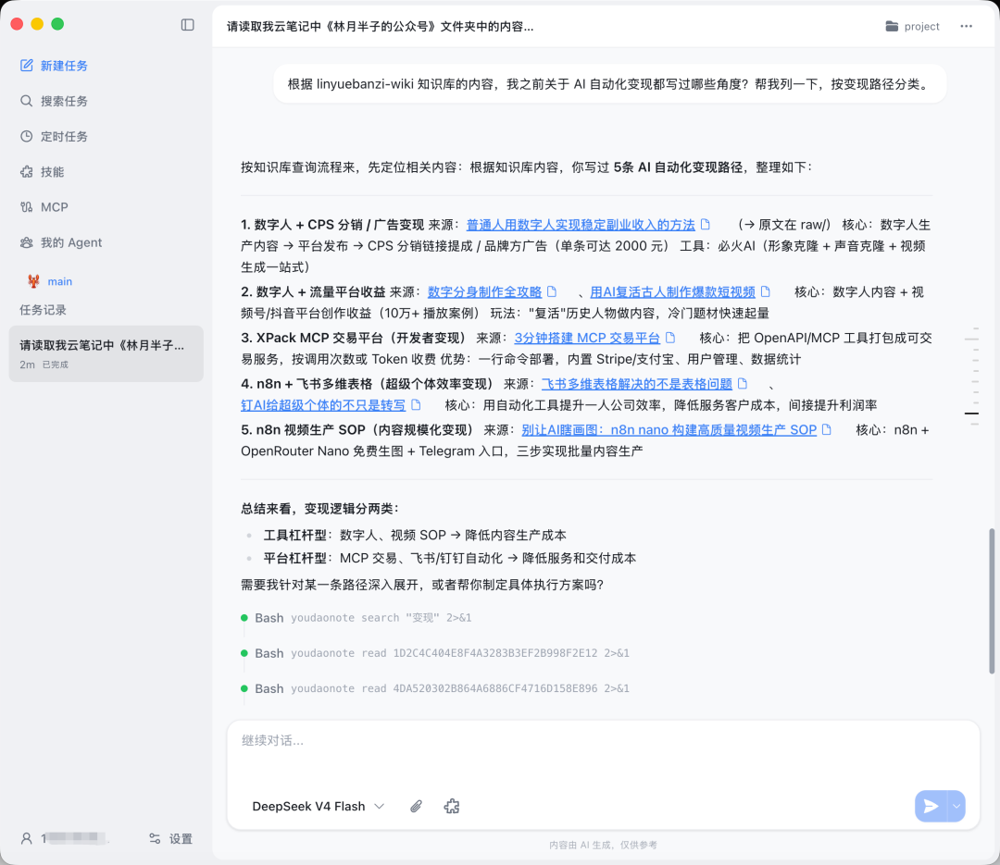

最后还顺手帮我把 5 条按"工具杠杆型"和"平台杠杆型"分了两类。

这份清单我自己来梳理至少要一个小时。回头翻历史文章那种活，谁干谁知道。AI 用了不到一分钟，而且翻得比我自己还彻底，有几条路径是我之前写文章的时候顺手提了一句就忘了的，AI 全给挖出来了。

更关键的是下面这一步：

💬

把刚才这份分析存进 linyuebanzi-wiki 知识库。

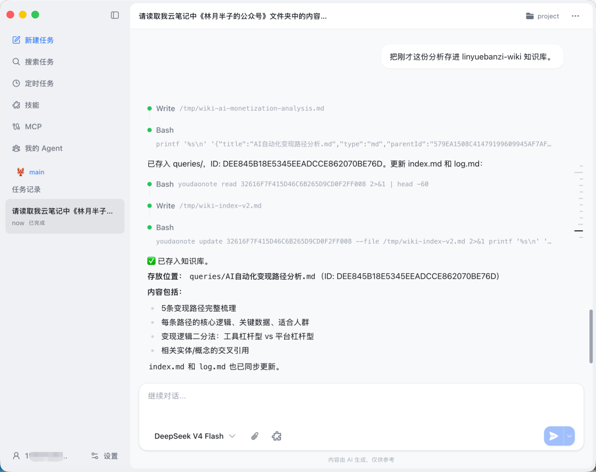

它把这次的分析存进了 queries/AI 自动化变现路径分析.md，同时把 index.md 和 log.md 也同步更新了。我打开有道云笔记看了一眼：

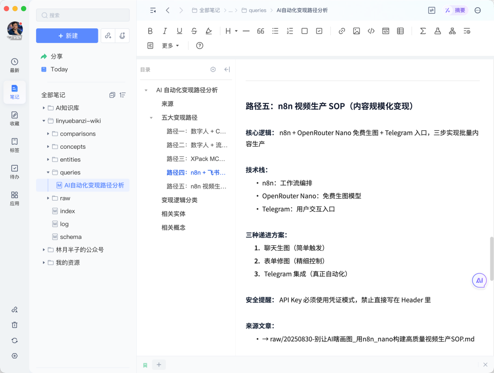

注意看正文最底下那行。"来源文章：→ raw/20250830-别让 AI 瞎画图..."。这次新生成的 queries 笔记，反向链接回了 raw 层的原始文章。也就是说，知识库里的笔记之间已经开始互相引用了，越来越像一本真正的百科全书。

下次我再问类似的问题，它会先翻到这篇分析，再基于上面的结论往下接，不用再从头爬一遍 50 篇原文。

这就是 Karpathy 嘴里说的知识复利。每提问一次，知识库都会比上一次更强一点。

我喜欢这个设计的地方在于：它把"跟 AI 聊天"和"沉淀知识"两件事合并了。我以前每次跟 AI 大段大段聊完都觉得可惜，关掉窗口就什么都没留下。LLM Wiki 这套机制下，每次有价值的对话都会自动变成知识库里的一篇。

至于跟 RAG 的区别，一句话：RAG 是查完就走，LLM Wiki 是查完留底。同样是问知识库，LLM Wiki 越问越厚。

## STEP 7：补充新素材，知识库继续生长

最厉害的是，这个知识库不是搭完就死的。

比方我哪天看到一篇好文章，想纳入到知识库里，不需要再走一遍初始化流程，直接跟龙虾说：

💬

帮我把这篇文章保存到 linyuebanzi-wiki 知识库[文章链接]

AI 会自动读取文章内容、判断它该归到知识库的哪一层、跟现有 entities 有没有关联，然后悄悄把它补进去。

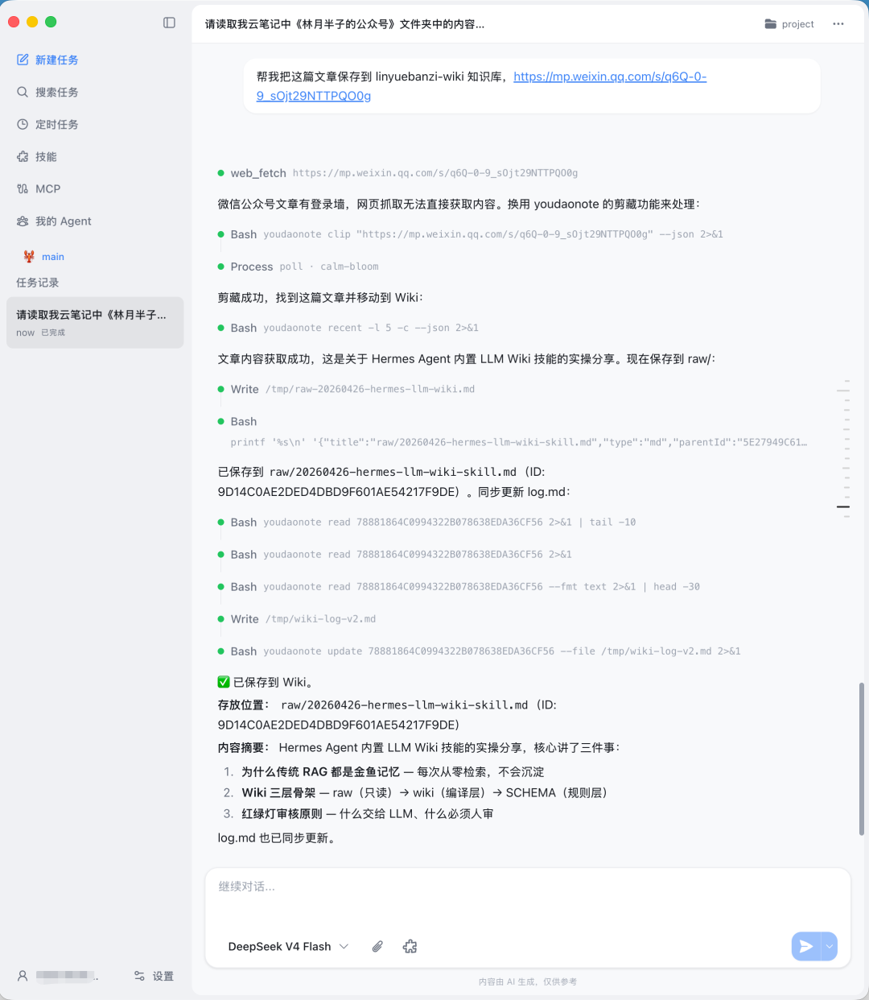

下次你再问跟这篇文章相关的问题，它已经在知识库里了。

这一整套跑完，你会发现一件事：自己几乎不用再手写笔记了。

要做的就两步，把素材丢进去，剩下的交给对话框。整理归档这些活 AI 都干掉了。

💡

没素材也能开始

上面我是用现成的公众号文件夹起步的，但你手头要是空的也没事。直接跟 AI 说"帮我创建一个知识库，主题是 XXX"就行，它会建好结构等你往里扔东西。所以不管你是已经攒了一堆素材想整理，还是从零开始想搭个新主题的库，这套都跑得通。

## 这套方案，到底适合谁？

得稍微泼一下冷水：不是所有人都需要这套东西。

LLM Wiki 这套范式有它的边界：它不是企业级知识库（千万文档、向量检索、权限管理那种是另一回事），它是"个人活百科"。一图胜千言：

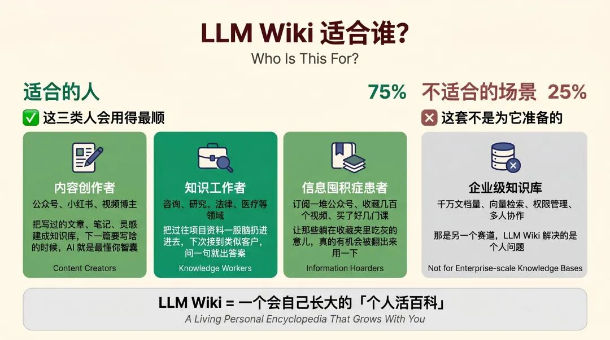

如果你属于上面那三类，又一直被终端、本地笔记软件的配置或者海外工具的学习成本拦在门外，那有道云笔记 + youdaonote-llm-wiki 这个组合是目前我见过最适合普通人上手的方案。

## 写在最后

跑完这一整套，我心里有个挺强的感受：过去两年我们用 AI，基本都是一次性对话。

开个新窗口，问一句，复制走，关掉。第二天遇到类似的问题，又得从头再来。AI 不记得你昨天问过啥，更不知道你过去三年的思考是怎么走过来的。

LLM Wiki 在干一件不太一样的事。用老程序员的话说：这跟单次脚本和持久化服务的区别一样大。前者跑完就消失，后者越跑数据越厚、越懂你。

我猜往后一两年这种形态会越来越多。但目前在国内能让普通人零门槛跑通的，有道云笔记 + youdaonote-llm-wiki 是我见过最快的一条。

回到开头那个问题：那些天天私信我怎么装 Hermes的朋友，我现在终于有了一个能直接甩给他们的答案：

💬

别装 Hermes 了，去下载有道龙虾，技能市场搜 youdaonote-llm-wiki，跟着我这篇跑一遍就行。

如果你也想试试，相关的 skill 入口和详细介绍可以在有道云笔记的【帮助中心】→【拓展能力】里找到。

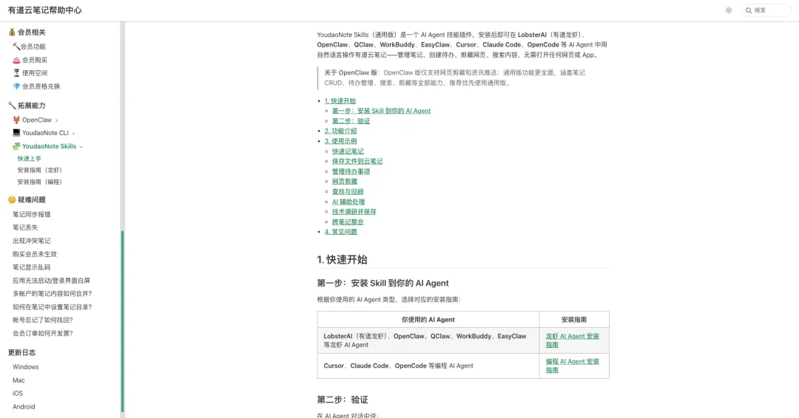

知识库搭起来不难，难的是让它跑起来。光看我写的没用，自己去试试，半小时就能跑通第一遍。

如果觉得不错，随手点个「赞」和「在看」，转发给那些总在跟你抱怨"笔记吃灰"的朋友吧～
