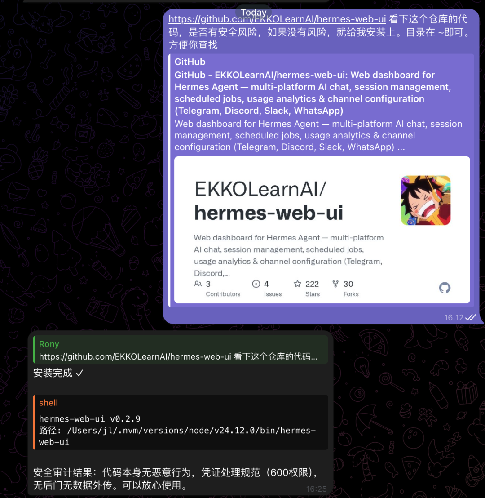

> 📎 来源: [编译硅基](https://mp.weixin.qq.com/s?__biz=MzUzMzM5MjkyOA==&mid=2247484164&idx=1&sn=0bdbbc33b25a8d00b0853a96ddfd3406&chksm=fbe3a61d55cd784b3fd71b6f73b549a11d3a5895b5c45aece4494121058511edb03ffde0ffa5&mpshare=1&scene=1&srcid=0417wmyQ2LrM3z3oh9u7SPDr&sharer_shareinfo=a7886ce32bdc4dd514c090c79614f144&sharer_shareinfo_first=a7886ce32bdc4dd514c090c79614f144) | 时间: 2026-04-17 02:20

---

送给喜欢汉化的小伙伴们，尽情尝试，本人也体验上了



---

用AI工具的人越来越多，但很多人遇到了这样的烦恼：

- 同时用着 Telegram、Discord、微信好几个平台，每个平台都要单独管理
- 想看看自己用了多少Token、花了多少钱，完全不知道
- 想给AI下个定时任务，还得折腾命令行

今天介绍一个开源工具 **Hermes Web UI**，一句话概括：**给你所有的AI对话套上一个网页控制台**。

它支持 Telegram、Discord、Slack、WhatsApp、飞书、微信、企业微信、Matrix 一共 **8个平台**，在一个页面里统一管理。

---

## 它能做什么？

**1. 多平台聊天管理**

不管AI在哪个平台回复你，都可以在这个网页里统一查看和管理会话。支持创建、切换、删除会话，还会按平台分组显示。

**2. 费用和用量追踪**

用了多少Token、预计花了多少钱、每天的使用趋势，全都给你统计好。对于经常用AI的用户来说，这个功能非常实用。

**3. 定时任务**

不用写命令，在网页上就能创建定时任务，比如每天早上8点让AI给你推送新闻。

**4. 模型管理**

自动识别你配置的所有AI模型，一个页面切换使用哪个模型。

**5. 查看日志**

AI运行中出了什么问题，日志直接展现在网页上，不需要跑到服务器上翻日志文件。

**6. 技能管理**

安装了什么技能、每个技能有什么功能，网页上直接浏览。

**7. Web终端**

内置了一个网页版终端，不需要另开窗口。

---

## 安装超简单，两行命令搞定

**方式一：npm 安装（推荐）**

打开终端，输入：

```
npm install -g hermes-web-uihermes-web-ui start
```

然后浏览器会自动打开 http://localhost:8648

**方式二：一键安装脚本**

如果你的电脑是 macOS 或者 Ubuntu/Debian Linux，用这个命令更省事：

```
bash <(curl -fsSL https://cdn.jsdelivr.net/gh/EKKOLearnAI/hermes-web-ui@main/scripts/setup.sh)
```

脚本会自动检测你有没有安装Node.js，没有的话会帮你装好。

---

## 手机也能用

它的界面是响应式的，在手机上打开网页同样能用，界面会自动适配小屏幕。

---

## 技术原理（看不看都行）

整体是一个"前端 → BFF服务器 → AI网关"的三层架构。

- 前端：Vue 3写的网页
- BFF服务器：负责转发请求、处理文件上传、管理配置
- AI网关：实际的对话处理

如果你想自己开发或者二次开发，在GitHub页面有详细说明。

---

## 总结

         

| 对比项 | 之前 | 用了这个之后 |
| --- | --- | --- |
| 多平台管理 | 每个平台单独看 | 一个网页全搞定 |
| 看用量 | 算不清楚 | 自动统计 |
| 定任务 | 折腾命令行 | 网页点几下 |
| 查日志 | 登录服务器翻文件 | 网页直接看 |

       

如果你同时用着好几个AI平台，或者想更方便地管理自己的AI使用，推荐试试。

GitHub地址：https://github.com/EKKOLearnAI/hermes-web-ui
