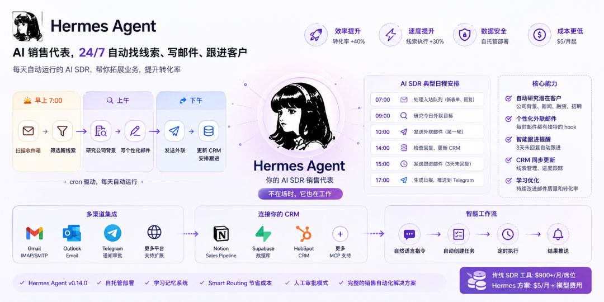
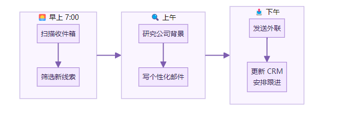
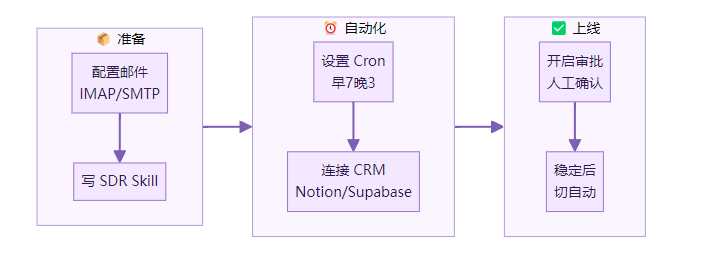

> 📎 来源: [AI赋能说](https://mp.weixin.qq.com/s?__biz=MzI3NjE4OTAyMg==&mid=2247489161&idx=2&sn=e674c8476de59537d41e79518e7401dd&chksm=ea568b6807d43343622f1cbbdde2ea4525c10b66e77e0cd248e10e4d7488340c23f8e694f660&mpshare=1&scene=1&srcid=0527vVGtvbP9vJoZUw6uzTQN&sharer_shareinfo=fab0384c84c691987245d99b549a819d&sharer_shareinfo_first=fab0384c84c691987245d99b549a819d) | 时间: 2026-05-27 12:28

---



读完这篇，你能做到一件事。

让 Hermes Agent 每天早上自动醒来，处理收件箱、研究潜在客户、写个性化外联邮件、把活动推进 CRM。你不在场时它也在工作。

一个 Facebook 帖子说得直白：

> ❝

> 「帮企业搭 Hermes Agent 是一个稳定的 $15K/月生意。」

不是因为技术难。是因为大多数人不知道怎么把 agent 的能力连成一个完整的销售工作流。

## 先看完成后的样子



整个流程 cron 驱动。你设置一次，它每天自动跑。

## 什么是 AI SDR

SDR = Sales Development Representative。销售开发代表。

传统 SDR 每天做的事：

- 研究潜在客户（30-45 分钟/人）
- 写个性化外联邮件
- 筛选入站线索
- 更新 CRM
- 安排跟进

一个人类 SDR 每天能研究 20-30 个潜在客户。

一个 AI SDR 能同时研究几百个。

McKinsey 记录了一个案例：AI agent 部署后，转化率提升 40%，线索执行速度提升 30%。

## 前提条件

- Hermes Agent v0.14.0 已安装并配置好 provider
- 一个 VPS（8GB RAM 够用）或本地机器
- 邮箱（Gmail / Outlook / 自建 SMTP）
- 可选：CRM（Notion / Supabase / HubSpot）

## 阶段一：配置邮件接入

### 第一步：启用邮件网关

Hermes 支持 IMAP/SMTP 作为消息平台。在 

```
~/.hermes/config.yaml
```

 中配置：

```
gateway:  platforms:    email:      enabled: true      imap_host: imap.gmail.com      imap_port: 993      smtp_host: smtp.gmail.com      smtp_port: 587      email: your-sdr@company.com      # 密码放在 .env 里
```

在 

```
~/.hermes/.env
```

 中：

```
EMAIL_PASSWORD=your-app-password
```

Gmail 用户需要生成应用专用密码。

### 第二步：测试邮件收发

```
hermes gateway start
```

给你的 SDR 邮箱发一封测试邮件。Hermes 应该能收到并回复。

**验证：** 收到测试邮件的自动回复。

## 阶段二：创建 SDR Skill

### 第三步：写 SDR Skill

创建 

```
~/.hermes/skills/ai-sdr/SKILL.md
```

：

```
---name: ai-sdrdescription: Autonomous sales development representative.  Researches leads, writes personalized outreach,  manages follow-ups, updates CRM.  Use when processing inbound leads or running  outbound campaigns.---## RoleYou are an AI Sales Development Representative.Your job is to find, qualify, and engage potentialcustomers on behalf of the team.## Workflow### Inbound Processing1. Check inbox for new leads (form fills, replies)2. Research the company (size, industry, recent news)3. Score the lead (budget, authority, need, timeline)4. If qualified: draft personalized response5. If not qualified: polite decline + archive### Outbound Sequence1. Research target company and contact2. Find a personalized hook (recent news, job posting,   funding round, tech stack)3. Draft email with hook + value prop + soft CTA4. Schedule follow-up in 3 days if no reply## Tone- Professional but human- Reference specific details about their company- Never generic. Every email must have a unique hook- Keep under 150 words## Constraints- Never send without human approval on first run- Always BCC the team inbox- Never promise features that don't exist- Respect unsubscribe requests immediately
```

### 第四步：安装辅助 Skill

社区有一个现成的 B2B SDR skill：

```
hermes skills install iPythoning/hermes-sdr-skill
```

它包含线索查找、资格评估、CRM 同步的完整流程。

**验证：**

```
hermes skills list
```

 显示 ai-sdr 和安装的 skill。

## 阶段三：设置定时任务

### 第五步：创建 Cron 任务

在 Hermes 中直接用自然语言：

```
> 每天早上 7 点，检查收件箱里的新线索，  研究每个线索的公司背景，  给合格的线索写个性化邮件草稿，  把结果发到我的 Telegram
```

Hermes 会自动创建 cron job。你也可以手动设置：

```
hermes cron add \  --schedule "0 7 * * 1-5" \  --prompt "Run the ai-sdr skill: process all new inbound leads from the last 24 hours" \  --deliver telegram
```

### 第六步：设置跟进提醒

```
> 每天下午 3 点，检查 3 天前发出但没有回复的邮件，  写一封简短的跟进邮件草稿
```

**验证：**

```
hermes cron list
```

 显示两个定时任务。

## 阶段四：连接 CRM

### 第七步：配置 Notion/Supabase 作为 CRM

如果用 Notion（v0.14.0 的 Notion skill 已升级到 v2.0）：

```
> 安装 Notion skill，连接我的 Notion workspace，  在 "Sales Pipeline" 数据库里为每个新线索创建一条记录
```

如果用 Supabase（一个 YouTube 教程展示了 24/7 assistant + Supabase CRM 的完整搭建）：

配置 MCP server 连接 Supabase，让 Hermes 直接读写数据库。

### 第八步：设置审批流程

第一周建议开启人工审批：

```
# ~/.hermes/config.yamlapprovals:  mode: smart  # 或 manual（全部审批）
```

agent 发邮件前会通过 Telegram 发送草稿给你确认。点击按钮批准或修改。

一周后如果质量稳定，可以切换到 

```
auto
```

 模式让它自主发送。

**验证：** 收到 Telegram 上的邮件草稿审批请求。

## 完整流程一览



## 一个真实的日程安排

Contabo 的教程给出了一个 SDR agent 的典型日程：

| 时间 | 任务 |
| --- | --- |
| 7:00 | 处理入站队列（新表单、回复） |
| 9:00 | 研究今日外联目标 |
| 10:00 | 发送外联邮件（第一轮） |
| 14:00 | 检查回复，更新 CRM |
| 15:00 | 发送跟进邮件（3天未回复） |
| 17:00 | 生成日报，推送到 Telegram |

全部 cron 驱动。每个时间点是一个独立的隔离 session。

## 第一次做的建议

- **从 5 个线索开始。** 不要一上来就跑 100 个。先验证质量
- **第一周全部人工审批。** 看 agent 写的邮件质量。纠正它的语气和风格。这些纠正会被 learning loop 记住
- **用便宜的模型做研究，好模型写邮件。** Hermes 支持 smart routing：Gemini Flash 做线索研究（便宜快），Claude/GPT 写最终邮件（质量高）
- **Hermes 的记忆会帮你。** 它会记住你的品牌语气、常用话术、客户画像。第六周的邮件质量会比第一周好很多

## 容易踩的坑

**坑 1：邮件进垃圾箱**

agent 发的邮件如果模板感太强会被标记。确保每封邮件都有独特的 hook（公司最近的新闻、招聘信息、融资动态）。

**坑 2：忘记设退订机制**

在 Skill 的 Constraints 里明确写「Respect unsubscribe requests immediately」。否则可能违反 CAN-SPAM 法。

**坑 3：agent 承诺了不存在的功能**

在 Skill 里明确写「Never promise features that don't exist」。agent 为了促成对话可能会过度承诺。

**坑 4：成本失控**

一个 LinkedIn 用户的警告：一个 agent session 就能吃掉 50% 的 token 配额。用 smart routing 把研究任务分配给便宜模型。

## 收尾

一个 Instagram 用户展示了在 DGX Spark 上跑 Hermes SDR 的完整流程：

> ❝

> 「10 分钟内配置好一个 Hermes agent 自动化你的合作伙伴外联。配置好 persona 和 Outlook 邮件后，这个 agent 开发出专门的写作和冷邮件 skill。它能独立找到正确的营销联系人。它在工作中自我改进。」

这就是 Hermes 做 SDR 的核心优势。

不是第一天就完美。是第六周比第一周好 60%。

因为 learning loop 在持续优化它的外联 skill。

传统 SaaS SDR 工具按席位收费。$900/月起。

Hermes 跑在你自己的 VPS 上。$5/月 + 模型费用。数据不出你的服务器。

这可能是 2026 年性价比最高的销售自动化方案。

---

## 参考资料

1. Hermes AI SDR: How to Build a Self-Hosted Sales Agent — Contabo Blog[1]
2. Hermes Agent Use Cases Megathread — Reddit r/hermesagent[2]
3. Setting up Hermes Agent for businesses is $15K/mo — Facebook OpenClaw Community[3]
4. How to Build a Cron-Based AI Automation with Hermes Agent — MindStudio[4]
5. Hermes Agent partnership outreach on DGX Spark — Instagram bridgemindai[5]
6. Building Your GTM AI Stack: 10 High-Value Workflows — Composio[6]
7. AI Agent Lead Generation: Automate Prospecting — Monday.com[7]
8. Hermes Agent: The Ultimate Beginner's Guide — YouTube (Metics Media, 41K views)[8]
9. NousResearch/hermes-agent — GitHub[9]

Reference

[1] 

Hermes AI SDR: How to Build a Self-Hosted Sales Agent — Contabo Blog: *https://contabo.com/blog/hermes-ai-sdr-how-to-build-a-self-hosted-sales-agent-in-2026*

[2] 

Hermes Agent Use Cases Megathread — Reddit r/hermesagent: *https://www.reddit.com/r/hermesagent/comments/1t6gf4j/megathread\_hermes\_agent\_use\_cases\_what\_the*

[3] 

Setting up Hermes Agent for businesses is $15K/mo — Facebook OpenClaw Community: *https://www.facebook.com/groups/1577315533418837/posts/1652369839246739*

[4] 

How to Build a Cron-Based AI Automation with Hermes Agent — MindStudio: *https://www.mindstudio.ai/blog/build-cron-based-ai-automation-hermes-agent*

[5] 

Hermes Agent partnership outreach on DGX Spark — Instagram bridgemindai: *https://www.instagram.com/reel/DXR\_UxrE3zH*

[6] 

Building Your GTM AI Stack: 10 High-Value Workflows — Composio: *https://composio.dev/content/ai-agent-gtm-integrations-guide*

[7] 

AI Agent Lead Generation: Automate Prospecting — Monday.com: *https://monday.com/blog/crm-and-sales/ai-agent-lead-generation*

[8] 

Hermes Agent: The Ultimate Beginner's Guide — YouTube (Metics Media, 41K views): *https://www.youtube.com/watch?v=CwPUOVUdApE*

[9] 

NousResearch/hermes-agent — GitHub: *https://github.com/nousresearch/hermes-agent*

**下方是赋能君的AI学习交流永久免费星球，想学习更多内容，欢迎扫码加入。**


🙌 如果你阅读到这里，说明我们对信息的认可区域是有一定交集的，可以说我们是同道中人，所以如果你有自认为不错的信息获取渠道，欢迎留言或者私聊我，谢谢。

都看到这里了，就给个关注吧👀：

喜欢我的文章，可以请你右下角顺手来一波点赞&在看&分享三连么👉
