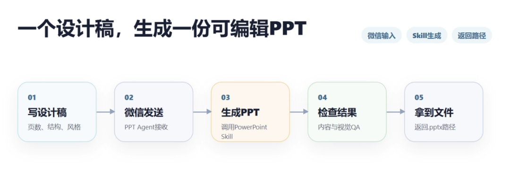
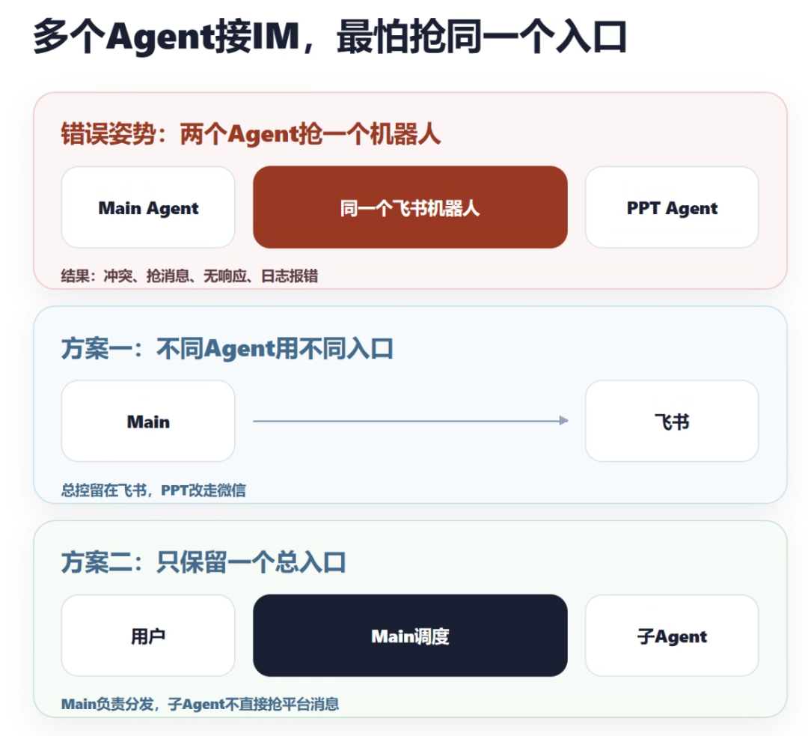
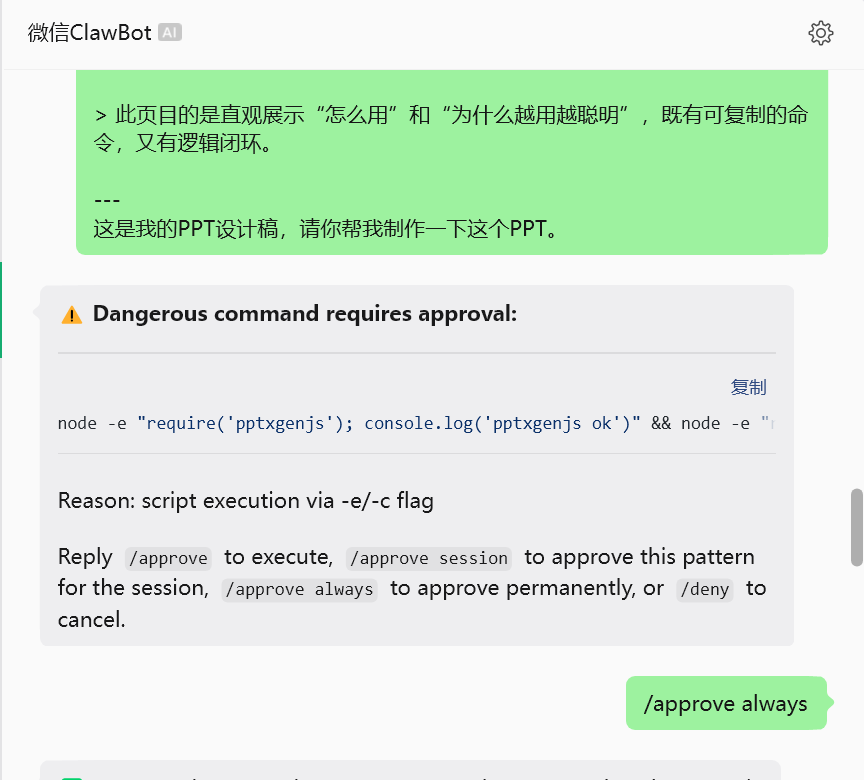
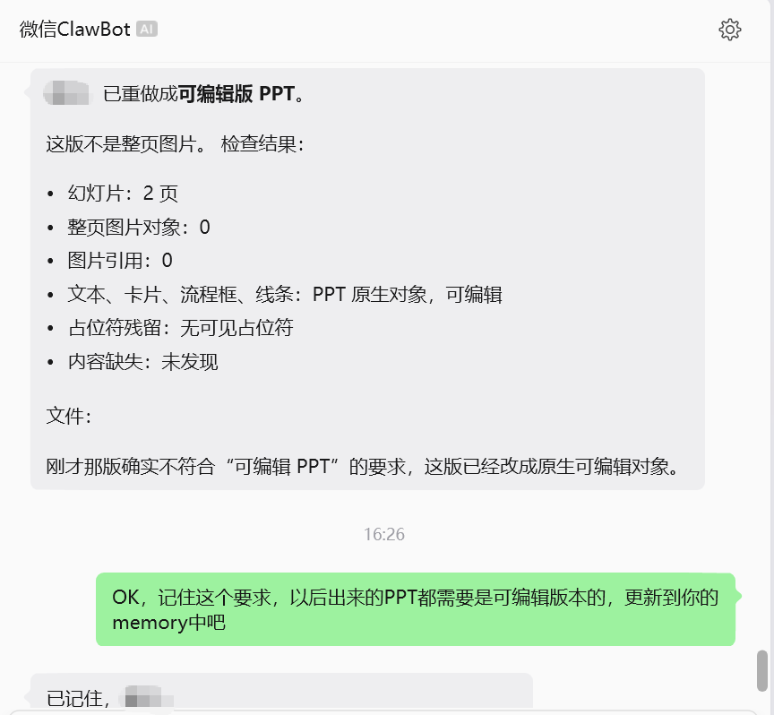
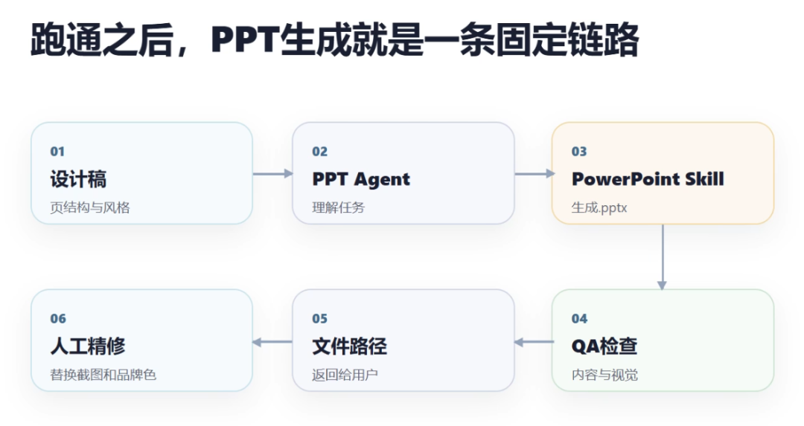
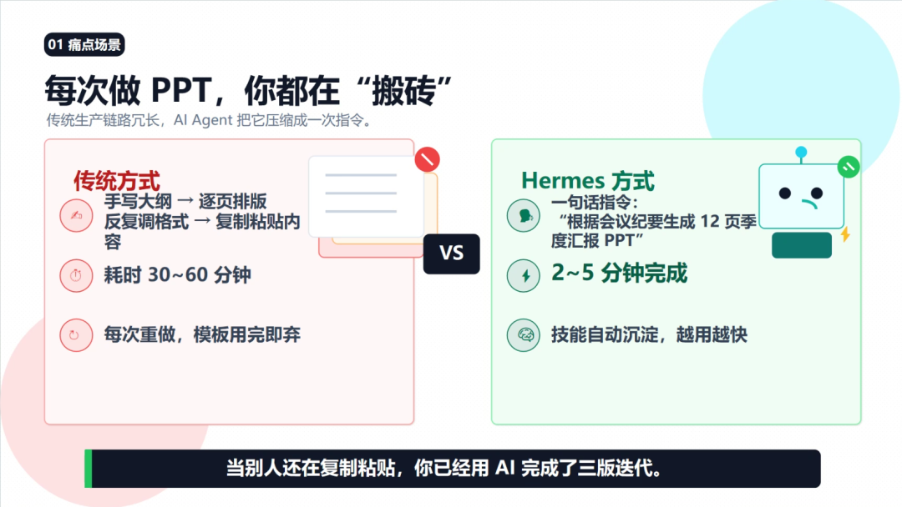
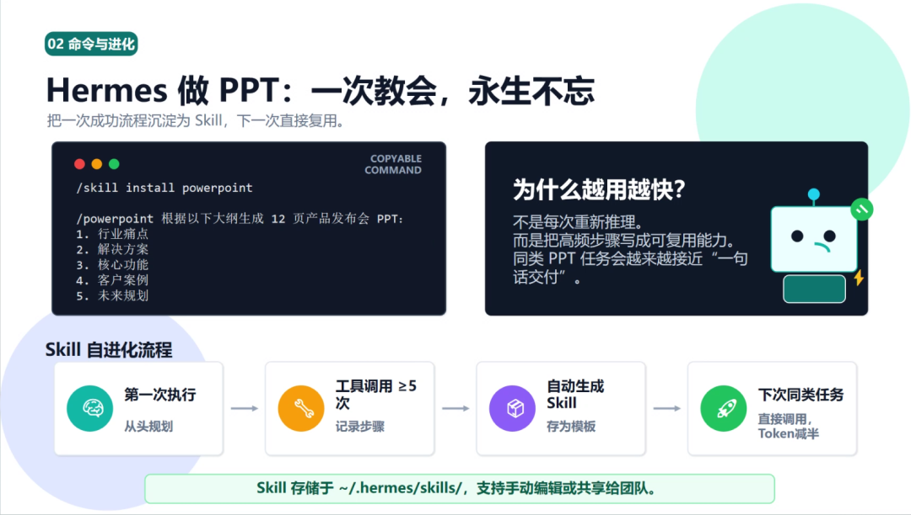

> 📎 来源: [技术传感器](https://mp.weixin.qq.com/s?__biz=Mzg4MDU1MTg0Ng==&mid=2247484369&idx=1&sn=03e623c0da23479519aeed3f1cc122d9&chksm=ce3927764b826fe19c9e84b896a60a5fd75ef20d0a1216f43a2681f5b71d8386f5bfa62aa4ba&mpshare=1&scene=1&srcid=04290weCGbjMsvqX3awM45If&sharer_shareinfo=7daa3a26de5b3fbdc4dd87757d14153b&sharer_shareinfo_first=7daa3a26de5b3fbdc4dd87757d14153b) | 时间: 2026-04-29 03:28

---

# 用 Hermes 一句话生成 PPT：从飞书踩坑到微信实战，我的真实操作记录

如果你经常做 PPT，应该懂那种烦躁。

内容明明已经想好了，真正耗时间的却不是思考，而是搬砖。

找模板。

调标题。

改字号。

对齐三个图标。

复制一段内容，再删掉一半。

半小时过去，第一页还没顺眼。

所以我最近冒出一个很直接的念头：**能不能像使唤实习生一样，让 AI 直接帮我把 PPT 初稿做出来？**

不是让它写一段大纲。

也不是让它给“PPT制作建议”。

而是我直接发一句话、一个设计稿，它生成一个真实的 

```
.pptx
```

 文件，告诉我文件在哪。

正好 Hermes 里有一个 PowerPoint Skill，我就顺手试了一把。

这次只记录我这次从飞书踩坑，到微信跑通，再到真正让 PPT Agent 接收需求的完整过程。

你看完之后，基本也能照着搭一遍。（PPT最终效果在最后）



---

## 1. 先确认：PowerPoint Skill到底有没有？

我的第一步很粗暴。

我直接问 Hermes：

```
PowerPoint Skill，这个skill我们装了么？没装的话，你装一下。这个我们专门用来制作PPT的。可以新开一个PPT制作agent。不和代码开发Agent等混在一起。
```

结果比我想象中顺。

Hermes 检查后告诉我：PowerPoint Skill 已经在当前环境里了。

也就是说，这一步不需要我去手动找插件、不需要重新装一套东西。

更关键的是，我让它单独新开了一个 PPT 制作 agent/profile。

这个细节很重要。

因为我现在已经有几个长期任务线：软件开发、项目文档写作。如果 PPT 也混在同一个 agent 里，迟早会变成一锅粥。

我的想法是：

- 代码开发归开发 agent；
- 项目文档协作归写作 agent；
- PPT 就单独归 PPT agent。

这样它的记忆、习惯、输出方式都会更聚焦。

后面我让它做 PPT 时，它不需要再理解“我到底是在写文档，还是在生成演示文稿”。

它只需要干一件事：把 PPT 做出来。

给大家的建议也很简单：

你不用一上来就背命令。

你可以直接用自然语言问：

```
帮我确认 PowerPoint Skill 是否可用。如果可用，创建一个专门做PPT的 agent/profile。
```

让 Hermes 自己去检查和配置。

---

## 2. 第一个坑：我原本想接飞书，结果撞车了

我的最初设想是：以后 PPT 设计稿就在飞书里发。

比如我在飞书里写：

```
做一份2页PPT。第1页是标题页，主题是AI Agent企业落地指南。第2页写三个痛点：数据安全、效率低、技术门槛。风格要商务科技感。
```

然后 PPT Agent 自动生成文件，回我一个路径。

听起来很自然。

但我很快踩到了第一个坑：**默认 Hermes Agent 已经接了飞书机器人。**

如果 PPT Agent 也去接同一个飞书机器人，就会出现两个问题：

1. 两个 gateway 都想监听同一个飞书应用；
2. 消息到底该给 main agent 还是 PPT agent，会混乱。

这类问题不一定表现成明显报错。

有时是没反应。

有时是另一个 agent 抢走消息。

有时是日志里提示“另一个本地 gateway 已经占用了这个 app\_id”。

最后我没有继续在飞书上硬拧。

我换了一个思路：**PPT Agent 单独走微信。**

这样主 Hermes 继续留在飞书，PPT Agent 用微信接入。

两个入口彻底分开。

以后飞书里聊文档、开发、总控；微信里专门发 PPT 设计稿。

这个方案反而更清楚。



这里给大家一个避坑建议：

如果你要让多个 agent 接入飞书、钉钉、企业微信这类平台，最好一开始就规划清楚。

要么不同 agent 用不同机器人。

要么只让一个 main agent 接平台，其他 agent 由 main 转发任务。

不要几个 agent 抢同一个机器人。

这不是 AI 能力问题。

这是消息入口设计问题。

---

## 3. 换微信继续：连接成功，但又遇到“没反应”

我切到微信之后，继续配置 PPT Agent 的 gateway。

大致动作是：

```
ppt gateway setupppt gateway start
```

然后微信扫码、配对。

这里我又踩了一个小坑。

我在微信里发消息后，PPT Agent 没反应。

一开始我以为是微信没接上。

后来检查才发现：不是微信没接上，而是配对批准到了默认 Hermes，不是 PPT Agent。

我当时执行的是：

```
hermes pairing approve weixin S9XXL5TW
```

但我真正要批准的是 PPT profile：

```
ppt pairing approve weixin S9XXL5TW
```

这一点非常容易搞错。

因为 

```
hermes
```

 和 

```
ppt
```

 是两个不同 profile。

你在默认 Hermes 里批准，只代表默认 agent 认可这个微信用户。

PPT Agent 仍然会认为你是未授权用户。

现象就是：微信里发了消息，但 agent 没回复。

日志里会看到类似：

```
Unauthorized user on weixin
```

正确做法是：

```
ppt pairing listppt pairing approve weixin 配对码ppt gateway restart
```

重启后，再发消息测试。

这一步跑通后，微信就真的变成了 PPT Agent 的入口。

---

## 4. 还有一个细节：微信里怎么批准危险命令？

PPT Agent 第一次生成 PPT 时，可能会检查环境依赖。

比如它会执行：

```
node -e "require('pptxgenjs')"node -e "require('sharp')"which libreofficewhich pdftoppm
```

这些命令本身只是检查环境。

但因为里面有 

```
node -e
```

 这种脚本执行形式，Hermes 会把它标记成需要审批的命令。

微信里会出现类似提示：

```
Dangerous command requires approvalReply /approve to executeReply /approve session to approve this pattern for the sessionReply /deny to cancel
```

这里不需要回到命令行。

**你就在微信聊天窗口里直接回复：**

```
/approve session
```

我建议用这个，而不是 

```
/approve always
```

。



（我是为了测试，所以直接批准了always）

区别是：

- ```
  /approve
  ```

  ：只批准这一次；
- ```
  /approve session
  ```

  ：批准本轮会话类似命令；
- ```
  /approve always
  ```

  ：永久批准；
- ```
  /deny
  ```

  ：拒绝执行。

环境检查类命令，用 

```
/approve session
```

 比较合适。

但如果你看到下面这些，就别随便批：

```
rm -rfsudocurl ... | bashnpm install -gpip installchmod -R
```

尤其是删除、安装、提权、批量改权限这类动作，必须单独确认。

这个审批机制一开始看着麻烦，但其实是好事。

因为 PPT 生成涉及文件写入、依赖检查、可能还要调用 LibreOffice 转 PDF 做视觉检查。

如果完全无审批，风险会更大。

---

## 5. 真正开始：用自然语言写一份PPT设计稿

配置跑通后，我真正需要做的事反而很少。

我只要在微信里发一份设计稿。

比如一个最小版本：

```
PPT 第 1 页：痛点场景页页面标题：每次做 PPT，你都在“搬砖”核心文案（分三栏）：传统方式 Hermes 方式✍️ 手写大纲 → 逐页排版 → 反复调格式 → 复制粘贴内容 🗣️ 一句话指令：“根据这份会议纪要生成 12 页季度汇报 PPT”⏱️ 耗时 30~60 分钟 ⚡ 2~5 分钟完成🔁 每次重做，模板用完即弃 🧠 技能自动沉淀，越用越快底部金句：当别人还在复制粘贴，你已经用 AI 完成了三版迭代。配图建议：左侧一个凌乱的办公桌或堆满 PPT 文件的图标（红色叉号）右侧一个 Hermes 机器人的图标 + 闪电符号（绿色对勾）此页目的在于制造痛点共鸣，让读者立刻感受到“这事确实烦，我想换种方法”。📄 PPT 第 2 页：核心命令 + Skill 自进化流程页面标题：Hermes 做 PPT：一次教会，永生不忘上半部分（命令示例）：text/skill install powerpoint/powerpoint 根据以下大纲生成 12 页产品发布会 PPT：1. 行业痛点2. 解决方案3. 核心功能4. 客户案例5. 未来规划下半部分（自进化流程，用三个箭头+文本框串联）：text[第一次执行] → [工具调用≥5次] → [自动生成 Skill] → [下次再执行同类任务]     🧠               🔧               📦               ⚡  从头规划         记录步骤          存为模板         直接调用，Token减半底部脚注：Skill 存储于 ~/.hermes/skills/，支持手动编辑或共享给团队。配图建议：三个图标：齿轮（执行）→ 芯片（记录）→ 文件夹（保存）→ 火箭（复用）此页目的是直观展示“怎么用”和“为什么越用越聪明”，既有可复制的命令，又有逻辑闭环。
```

这就是设计稿。

不需要我写代码。

不需要我告诉它每个文本框坐标。

我只要把页面意图讲清楚：

- 这一页是什么类型；
- 主标题是什么；
- 内容分几块；
- 风格大概是什么；
- 哪些地方要重点突出。

如果你想更稳定，可以按这个模板写：

```
帮我生成一份PPT，主题是：xxx页数：x页受众：老板 / 客户 / 技术团队 / 培训学员风格：商务科技 / 极简 / 深色高级 / 活泼培训输出：生成.pptx文件，并告诉我路径第1页：标题页- 主标题：xxx- 副标题：xxx- 视觉要求：xxx第2页：目录页- 模块1：xxx- 模块2：xxx- 模块3：xxx第3页：内容页- 页面主判断：xxx- 结构：三栏 / 流程图 / 对比表 / 时间轴- 内容：xxx最后一页：结论页- 一句话结论：xxx- 行动建议：xxx
```

这个模板比“帮我做个PPT”稳定得多。再偷懒的话，你就让DeepSeek或者豆包帮你生成设计稿（我就是这么干的）。

因为它给了 AI 足够清楚的页面边界。

---

## 6. 生成结果：它不是顶级设计师，但足够做初稿

PPT Agent 接到设计稿后，大概会做几件事：

1. 理解每页的意图；
2. 拆出页面结构；
3. 选择版式和配色；
4. 调用 PowerPoint Skill 生成 

   ```
   .pptx
   ```

   ；
5. 检查内容是否缺失；
6. 必要时导出图片做视觉检查；
7. 返回文件路径。

这个流程跑完后，它会告诉我文件生成在哪里。

比如类似：

```
/mnt/d/dev_work/ppt/2026-04-28/ai_agent_guide.pptx
```

我的感受是：它还不是顶级设计师。

但作为内部汇报、方案初稿、培训课件、会议材料，它已经能省掉最烦的第一步。

以前我从0开始做，至少半小时起步。

现在我先让它给一个可编辑版本。

我再人工改几处标题、换几张截图、调一下品牌色。

整体效率差很多。

这里有个很实际的判断：

**AI生成PPT最大的价值，不是一次到位，而是把“空白页恐惧”消灭掉。**

只要它先给你一个结构完整、风格基本统一的PPT，你就已经从“从0开始”变成“基于初稿修改”。

这一步就值了。

---

## 7. Skill沉淀：第二次会更顺

Hermes 里比较有意思的一点，是它不只是执行一次任务。

它可以把复杂任务里的经验沉淀成 Skill。

但这里要说准确一点：不是每一次都会自动神奇变强。

更可靠的理解是：**当一套流程被跑通之后，你可以把它固化成可复用的 Skill 或工作流。**

比如这次 PPT 生成流程里，就有几个值得沉淀的东西：

- PPT Agent 单独使用微信入口；
- 设计稿要按“页类型 + 主判断 + 结构 + 内容 + 风格”写；
- 环境检查命令可以在会话里审批；
- 生成后要返回 

  ```
  .pptx
  ```

   路径；
- 如果是正式材料，要做内容 QA 和视觉 QA。

第一次跑通，主要是在摸索。

第二次再做，就可以直接套这套流程。

这就是 Agent 的实际价值。

不是它第一次就完美。

而是你把“怎么做”教给它之后，以后不必每次重讲一遍。



---

## 8. 完整流程，其实就这一条线

把这次过程压缩成一张图，就是这样：

```
用户写设计稿（微信）→ Hermes PPT Agent 接收→ 理解页面结构→ 调用 PowerPoint Skill→ 生成 .pptx 文件→ 内容/视觉检查→ 返回文件路径→ 用户打开修改
```



这条链路里，最关键的不是模型有多聪明。

而是入口、权限、工具、文件路径都跑通了。

很多 AI 工具看着强，但最后卡在“怎么交付文件”。

Hermes 这类 Agent 的优势在于，它可以真的去操作本地环境，生成真实文件，再告诉你文件在哪。

这比只给你一段“PPT大纲建议”实用得多。

---

## 9. 适合谁，不适合谁

这套方式适合：

- 内部汇报；
- 快速方案原型；
- 培训课件初稿；
- 会议材料；
- 技术方案第一页版本；
- 内容已经有了，只缺排版的人。

不太适合：

- 对外融资路演最终稿；
- 高级品牌视觉提案；
- 复杂动画和交互；
- 非常严格的企业VI模板；
- 一页里有大量精细图表的材料。

我的建议是：不要把它当“替代设计师”。

把它当“PPT实习生”。

你给它清楚的设计稿，它给你一个可编辑初稿。

你再做最后的审美和业务判断。

这样用，效率最高。

---

## 10. 你可以照着做的5步

如果你也想试，最小路径是这样：

### 第一步：确认 PowerPoint Skill

直接问 Hermes：

```
PowerPoint Skill 可用吗？帮我确认一下。
```

或者执行技能列表检查。

### 第二步：创建独立 PPT Agent

```
帮我创建一个专门做PPT的 agent/profile。不要和文章、代码、小说任务混用。
```

### 第三步：选择一个 IM 入口

飞书、微信、钉钉都可以。

但多个 agent 不要抢同一个机器人。

### 第四步：写一份清楚的设计稿

不要只说“帮我做PPT”。

要说清楚每页：标题、结构、内容、风格。

### 第五步：审批必要命令，拿文件路径

如果微信里弹出审批提示，根据命令风险选择：

```
/approve/approve session/deny
```

生成完成后，直接去它返回的目录找 

```
.pptx
```

 文件。

---

## 结尾：这件事真正改变的是“开始速度”

这次体验下来，我最大的感受不是“AI已经能做出多么惊艳的PPT”。

还没到那个程度。

真正有价值的是：**从想法到可编辑文件，中间那段最烦的搬砖工作，被压缩掉了。**

以前我做 PPT，第一步是打开空白页发呆。

现在第一步是给 PPT Agent 发一段设计稿。

两分钟后，我至少有一个能改的版本。

这就够实际。

对个人来说，它节省的是时间。

对团队来说，它节省的是沟通成本。

对长期使用者来说，它还能把你的模板、结构、审批习惯慢慢沉淀下来。

如果你已经在用 Hermes，建议直接试一次。

不用搞复杂。

就做两页。

标题页 + 痛点页。

你会很快知道，这东西是不是能进入你的日常工作流。

最后放上我出来的效果图：





#Hermes #PPT #Agent

---
