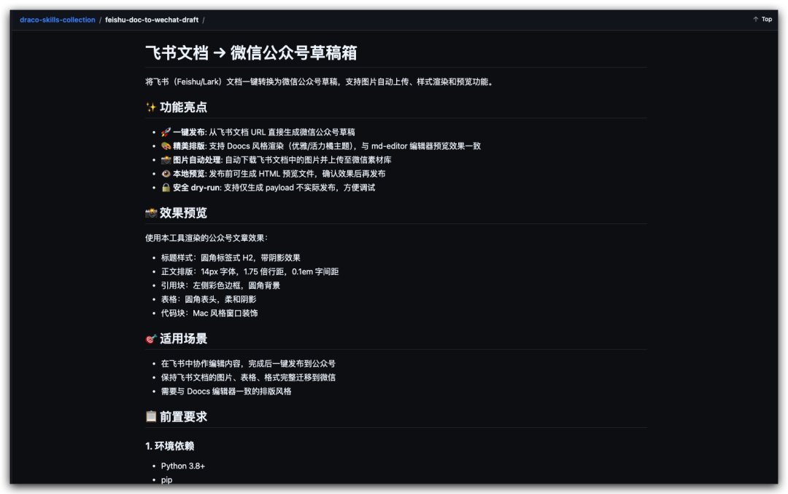

> 📎 来源: [Draco正在VibeCoding](https://mp.weixin.qq.com/s?__biz=MzI2NzM4MTQwMg==&mid=2247495474&idx=1&sn=66c4be39c844517be3146336279ae805&chksm=eb812d31b3e32d189e8ad73d042284ee027a73b339dd07cd8589fc1eb2157af5a55ce26d38e7&mpshare=1&scene=1&srcid=0410MGeDV787n73BZaxxyk3H&sharer_shareinfo=7b342d8f576aab8f536830de683152b8&sharer_shareinfo_first=7b342d8f576aab8f536830de683152b8) | 时间: 2026-04-13 16:15

---

# 有了Hermes Agent之后，可以放心地在飞书生态中进行更多日常工作了（via 飞书CLI）！今天把内容创作也从Obsidian尝试搬到了飞书。

但是，之前本地是有从写作到发布公众号的全套自动化/半自动化工作流的，而把写作搬到了飞书上，首先需要封装一个直接将飞书文档中的内容进行渲染并推送到微信公众号草稿箱的skill。

今天全程使用Hermes Agent完成了这个skill的创建，并且开源了：

**项目地址**：https://github.com/dracohu2025-cloud/draco-skills-collection/tree/main/feishu-doc-to-wechat-draft



> 当然，本篇文章就是在飞书上完成撰写并使用该skill完成渲染并推送到公众号

以下是对这个skill的介绍~ 欢迎试用并给出反馈；如果用的还不错，请动动手指在Github上给我个star吧~

---

如果你平时用飞书写内容，然后复制粘贴到公众号后台，一定会遇到这些头疼的问题：

•飞书里的图片要一张张下载再上传

•表格复制过去格式全乱

•代码块没有高亮，显示成纯文本

•排版和预览时看到的效果不一致

这篇文章介绍一个开源工具，可以把飞书文档一键转成微信公众号草稿，图片自动上传，格式完整保留。

---

## 这个工具能做什么

简单说，它解决三个核心问题：

**1. 图片自动处理**

飞书文档里的图片会自动下载，上传到微信素材库，替换成微信 CDN 链接。你不需要手动一张张处理。

**2. 格式完整保留**

表格、引用块、代码块、分割线，这些在飞书里的格式，转成 HTML 后都能正确显示。特别是代码块，支持 Mac 风格的美化显示。

**3. 排版风格统一**

工具内置了 Doocs 风格的渲染方案，和我们平时在 md-editor 编辑器里看到的预览效果一致。标题、正文、引用都有统一的视觉风格。

---

## 适用场景

这个工具适合以下情况：

•**团队协作**：在飞书文档里多人协作编辑，定稿后直接发布到公众号

•**内容迁移**：把飞书知识库里的内容快速同步到公众号

•**保持格式**：需要保留原文的表格、代码、层级结构

如果你只是偶尔发一篇纯文字内容，直接复制粘贴可能更简单。但如果你有固定栏目、需要保持统一的视觉风格，这个工具能省下大量排版时间。

---

## 前置准备

使用之前需要准备三样东西：

**1. 飞书 CLI 工具**

```
npm install -g @larksuiteoapi/lark-clilark-cli login
```

登录一次后，工具就能访问你有权限的飞书文档。

**2. 微信公众号凭证**

登录微信公众平台，在「开发」-「基本配置」里获取：

•AppID

•AppSecret（只显示一次，记得保存）

同时把你的服务器 IP 添加到「IP 白名单」，否则调用接口会报错。

**3. 封面图的 media\_id**

微信要求每篇文章必须有封面图。获取封面图 media\_id 的方法有三种：

**方法一：微信公众平台后台（最简单）**

1.

登录微信公众平台

2.

左侧菜单 →「内容与互动」→「素材库」

3.

点击「图片」标签页 →「添加」上传封面图

4.

上传成功后，用浏览器开发者工具（F12）查看网络请求

5.

找到 

```
add_material
```

 或 

```
add_news
```

 接口的返回数据，里面包含 

```
media_id
```

**方法二：微信在线调试工具**

1.

访问微信公众平台接口调试工具（mp.weixin.qq.com/debug）

2.

接口类型选择「素材管理」→「新增永久素材」

3.

输入 AppID 和 AppSecret 获取 access\_token

4.

上传图片文件，执行后会返回 

```
media_id
```

**方法三：使用代码上传**

如果你熟悉 Python，可以直接调用微信 API 上传：

```
import requestsaccess_token = "你的access_token"url = f"https://api.weixin.qq.com/cgi-bin/material/add_material?access_token={access_token}&type=thumb"with open("cover.jpg", "rb") as f:    files = {"media": ("cover.jpg", f, "image/jpeg")}    response = requests.post(url, files=files)    media_id = response.json()["media_id"]    print(f"封面图 media_id: {media_id}")
```

---

## 安装和使用

**安装**

```
git clone https://github.com/dracohu2025-cloud/draco-skills-collection.gitcd draco-skills-collection/feishu-doc-to-wechat-draftpython3 -m venv .venvsource .venv/bin/activatepip install -r requirements.txt
```

**配置环境变量**

```
export WECHAT_APP_ID="你的AppID"export WECHAT_APP_SECRET="***"
```

**生成预览（推荐先预览再发布）**

```
python3 scripts/run.py render-preview-feishu-doc-default \  --doc "https://your-domain.feishu.cn/docx/DocID" \  --output /tmp/preview.html
```

在浏览器打开 preview.html 确认效果无误。

**发布到公众号草稿箱**

```
python3 scripts/run.py publish-feishu-doc-default \  --doc "https://your-domain.feishu.cn/docx/DocID" \  --thumb-media-id "你的封面图media_id" \  --author "作者名"
```

执行成功后会返回 draft\_media\_id，登录公众号后台，在「草稿箱」里就能看到这篇文章了。

---

## 样式配置

### 关于 Doocs 样式

本工具的排版样式参考了 Doocs/md 项目，一款开源的微信 Markdown 编辑器。

•**项目地址**：https://github.com/doocs/md

•**开源协议**：WTFPL —— 你可以随意使用，建议保留版权声明

Doocs/md 是一款高度简洁的微信 Markdown 编辑器，支持 Markdown 语法、自定义主题样式、内容管理等特性。本工具提取并实现了其 CSS 渲染逻辑，确保在命令行环境下也能获得一致的排版效果。

### 可调参数

工具支持丰富的样式参数，可以控制：

•**主题风格**：grace（优雅）、simple（简洁）、default（默认）

•**字号**：14px、15px、16px 三档

•**代码主题**：github、one-dark、vitesse 等多种高亮方案

•**标题样式**：实心背景块、左侧边框、下划线等

•**排版细节**：两端对齐、首行缩进、Mac 风格代码块

### 完整样式配置示例

下面是一个覆盖全部样式参数的配置案例，你可以直接复制使用，也可以按需调整：

```
style:  # === 基础样式 ===  profile:doocs# 渲染方案: default | doocs | classic | minimal  theme:grace# 主题: default | grace(优雅) | simple(简洁)  primary_color:"#FA5151"# 主题主色，影响标题、强调色  font_family:"-apple-system,BlinkMacSystemFont,HelveticaNeue,PingFangSC,MicrosoftYaHei"  font_size:14# 正文字号: 14 | 15 | 16  line_height:1.75# 行高倍数  # === 排版控制 ===  justify:false# 段落两端对齐: true | false（建议关闭，左对齐更易读）  indent_first_line:false# 首行缩进: true | false  # === 标题样式 ===  heading_style:solid# 标题整体风格: solid | left-bar | underline | minimal  heading_styles:# 各级标题单独设置    h1:default# H1样式: default | color-only | border-bottom | border-left | custom    h2:default# H2样式    h3:default# H3样式    h4:default    h5:default    h6:default  # === 代码块样式 ===  code_theme:github# 代码高亮主题:                                    #   dark | light | github | github-dark | github-dark-dimmed                                    #   | github-light | one-dark | vitesse-light | vitesse-dark  mac_code_block:true# Mac风格代码块（红黄绿三个圆点）: true | false  code_line_numbers:false# 显示代码行号: true | false  # === 其他元素 ===  hr_style:dash# 分隔线样式: dash(虚线) | star(星号) | underscore(下划线)  caption_mode:hidden# 图片题注显示: title-first | alt-first | title-only | alt-only | hidden  footnote_links:false# 外链转底部脚注: true | false
```

保存为 

```
my-style.yaml
```

，然后通过 

```
--style-config
```

 使用：

```
python3 scripts/run.py publish-feishu-doc-default \  --doc "https://your-domain.feishu.cn/docx/DocID" \  --thumb-media-id "你的media_id" \  --style-config my-style.yaml
```

### 命令行快速设置

如果只需要调整几个参数，可以直接在命令行指定：

```
python3 scripts/run.pypublish-feishu-doc-default\  --doc"https://your-domain.feishu.cn/docx/DocID"\  --thumb-media-id"你的media_id"\  --profiledoocs\  --themegrace\  --font-size14\  --line-height1.75\  --mac-code-block\  --no-justify\  --heading-stylesolid
```

---

## 技术实现

工具的工作流程分为四步：

1.

**获取文档**：用 lark-cli 下载飞书文档内容和图片

2.

**格式转换**：把飞书格式标准化为 Markdown

3.

**HTML 渲染**：按 Doocs 风格生成微信兼容的 HTML

4.

**发布草稿**：图片上传素材库，调用微信 API 创建草稿

代码完全开源，在 GitHub 上可以找到。核心逻辑用 Python 实现，不依赖复杂的框架，方便二次开发。

---

## 局限性和注意事项

使用过程中有几个地方需要注意：

**图片大小限制**

微信要求图片不超过 10MB。工具会自动压缩过大的图片，但建议在飞书里就控制好图片尺寸。

**格式兼容性**

飞书的一些高级功能（如嵌入视频、复杂表格合并单元格）可能无法完美转换。建议发布前预览检查。

**权限问题**

确保运行工具的环境能访问飞书文档，且服务器 IP 已添加到微信白名单。

---

## 总结

这个工具把「飞书写内容 → 公众号发布」的流程自动化了，省去手动处理图片和调格式的时间。

对于内容团队来说，可以在飞书里完成协作编辑、审核流程，定稿后一键发布，保持格式统一。

代码开源，免费使用。如果你也有从飞书同步内容到公众号的需求，可以试试看。

---

## 致谢

•Doocs/md - 样式渲染参考了该项目的 CSS 设计，一款优秀的开源微信 Markdown 编辑器

---

**项目地址**：https://github.com/dracohu2025-cloud/draco-skills-collection/tree/main/feishu-doc-to-wechat-draft

**安装文档**：README.md 里有详细的安装步骤和参数说明。
