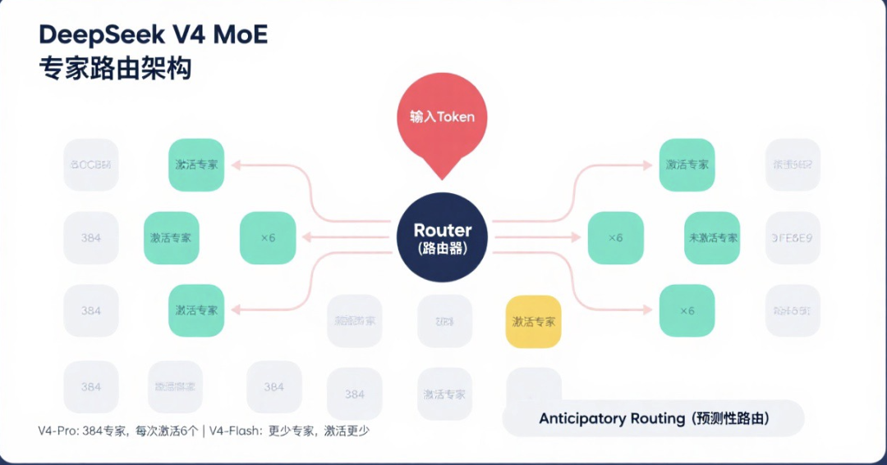
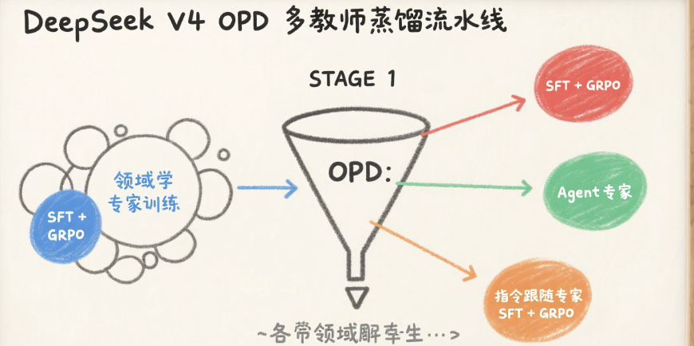
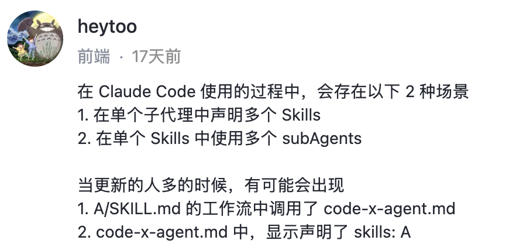
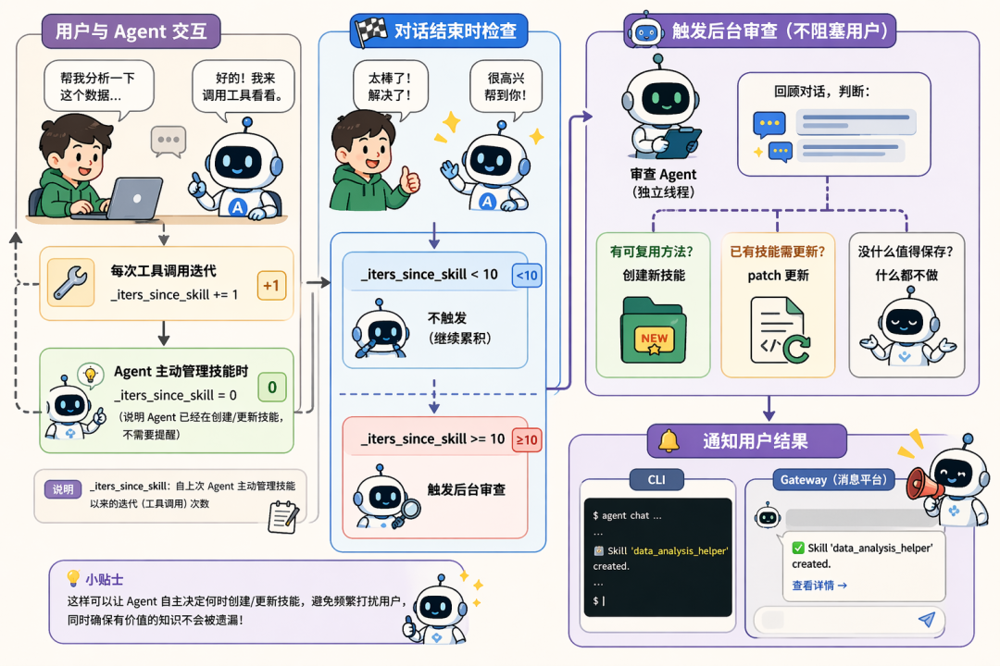

> 📎 来源: [星城前端](https://mp.weixin.qq.com/s?__biz=MzUxNTQ0ODg0Nw==&mid=2247484094&idx=1&sn=3feae852439726f89c61799017f5bdf2&chksm=f89e65d6e151f4d659e8ffa9640f40b9f4e0b6f35139e2399fdba7477cc88074b815b5de45fd&mpshare=1&scene=1&srcid=0428PjkAJTMKUsxuOmo6YwfX&sharer_shareinfo=9fec0dffff4c9b9a27f6ff5f662ed1e6&sharer_shareinfo_first=9fec0dffff4c9b9a27f6ff5f662ed1e6) | 时间: 2026-04-28 19:43

---

用了一个月之后，终于我的 Hermes 变呆了

是的，那个号称能自主进化的 Hermes， 它变呆了

事情是这样的

今天翘首了3个月的 Deepseek V4 发布了，让 Hermes 帮忙分析几篇文章跟视频

Hermes，它变慢了……

输出的风格，严格来说是不怎么一致了

特别是让它帮我生成几张架构图的时候，可以说是囧异





它终于如期的变呆了

当 Hermess 刚出的时候，就被其自动创建 skill 所惊艳到

为什么被惊艳到，因为简单，简单到在 Claude Code 中利用 Stop Hook 在任务完成后自动判断是否沉淀为 Skill 即可实现 Hermes 同款进化功能

为什么被惊艳到，因为好的东西人家一说你就觉得简单，人家没说 -- 我怎么没想到呢

如期，说明它变呆是在预期内

前面几篇文章有说在各种使用场景下，Agent 会变呆，比如

[同一个Agent，为什么换模型之后效果差很多](https://mp.weixin.qq.com/s?__biz=MzUxNTQ0ODg0Nw==&mid=2247484084&idx=1&sn=5fcfe9039710f36cb39edbb8d31bd97e&scene=21#wechat_redirect)

[同一个模型，为什么结果差10倍？差的不是模型](https://mp.weixin.qq.com/s?__biz=MzUxNTQ0ODg0Nw==&mid=2247484069&idx=1&sn=fb5b4d47ca788ceb5a801bfc12288c9f&scene=21#wechat_redirect)

但这次，同一个 Agent 同一个模型下， Hermes 还是变呆了

 为什么会变呆

在以前的文章里有写过这样的事，那时候 skill 还没成为主流规范，各家厂商对 skill 的支持度还远没现在这么强

1.  agent 调用 skill 命中率的问题

2.  当有很多 skills 且存在一些类似功能 skill 的时候变慢的问题

详情可以看

[Claude Code Skills，天知道我们之前配得多痛苦——现在只需一个 /](https://mp.weixin.qq.com/s?__biz=MzUxNTQ0ODg0Nw==&mid=2247484002&idx=1&sn=3526c15df316a220e501b4564113feaf&scene=21#wechat_redirect)

以及之前发的一个沸点（skill 管理混乱）



当有相近功能的 skill 时，最好能显示的让其调用

比如之前的 [用脚本接管重复步骤：Claude Code Skills 实战，Token 省 74%、跳过率归零](https://mp.weixin.qq.com/s?__biz=MzUxNTQ0ODg0Nw==&mid=2247483994&idx=1&sn=1b33009ec26ca0c4800f13682cdfb94c&scene=21#wechat_redirect)文章里有两个创建页面的 skill

当我们输入创建 xxx 页面的时候，可能会出现以下几种情况：

1.  未命中 skill

2.  命中 a 或 b

3.  命中 a 跟 b

    3.1 Agent 询问你采用谁

    3.2 Agent 没有询问

第三种情况是最麻烦的，而 Hermes 最有可能出现的就是第三种情况

在 Hermes 源码 prompt\\_builder.py 文件里可以看到

```
Before replying, scan the skills below. If a skill matches or is even
```

MUST load 跟 even partially relevant， 会让 Agent 倾向于加载更多 skill

我们再捋一次 Hermes 多个功能相似的 skill 时的流程：

1.  该选哪个？ 这几个 skill 看起来都相关

2.  该加载几个？ partially relevant 可能导致全部加载

3.  加载后听谁的？

skill 加载实际就是塞入到上下文（变成 prompt ）， 哪个更能起效？再就是功能相似的 skill 如果中间使用了冲突的指令时， Agent 该听谁的？

这是 Hermes 变呆的直接原因

Hermes 为什么会创建很多 skills

Hermes 的设计如此



    用户与 Agent 交互

        │

       ├─ 每次工具调用迭代: \_iters\_since\_skill += 1

        │

       ├─ Agent 主动管理技能时: \_iters\_since\_skill = 0

        │   （说明 Agent 已经在创建/更新技能，不需要提醒）

        │

        └─ 对话结束时检查:

            │

            ├─ \_iters\_since\_skill < 10 → 不触发（继续累积）

             │

            └─ \_iters\_since\_skill >= 10 → 触发后台审查

                │

                ├─ 启动审查 Agent（独立线程，不阻塞用户）

                ├─ 审查 Agent 回顾对话，判断：

                 │   ├─ 有可复用方法？ → 创建新技能

                 │   ├─ 已有技能需更新？ → patch 更新

                 │   └─ 没什么值得保存？ → 什么都不做

                 │

                └─ 通知用户结果

                    CLI: Skill 'xxx' created.

                    Gateway: 推送到消息平台

简单的说就是，用户在与 Hermes 交互时，Hermes 在这期间用了 10 次工具没主动管理技能就提醒审查——审查 Agent 自主判断对话中是否有值得沉淀的知识，可能创建、可能更新、也可能什么都不做

如果，我们在做类似的事的时候，期间多了几步或者少了几步的操作流程会被 Hermes 创建为新的 skill，这些 skill 的功能又是相似的

做过开发的同学都知道，在实际工程中我们写 skill 时会进行拆分然后组合，就跟写组件一样，就跟拼积木一样

从上面的流程图中可以看出 Hermes 创建的 skill 都是孤立的，无组合机制

且，目前 Hermes 只有唯一的去重机制： 同名检查

在源码的 skill\\_manager\\_tool.py 文件里

```
# Check for name collisions across all directories
```

Hermes 只检查名字是否重复，但不检查功能是否相似

也就是说：

\*   创建 draw，没问题创建成功

\*   再创建 draw，那不行（同名了）

\*   创建 draw-wan，没问题创建成功（不同名，即使功能几乎一样）

唯一的防重复引导，在源码的 run\\_agent.py 文件中

```
If a relevant skill already exists, update it with what you learned.
```

审查提示词告诉 Agent："如果已有相关技能，就更新它而不是创建新的。" 但这只是\*\*文本建议\*\*，Agent 可能遵循也可能不遵循。

所以，随着时间推移交互增加， Hermes 中沉淀的 skills 会越来越多

怎么办

预防

1.  确定下来的流程（已经建好了 skill），指定使用该 skill 来做这个事。 100%避免

2.  强调如果有类似的 skill， 选择更新。 概率避免

审核

玻璃容易沾灰，记得经常擦一擦

1.  skills.disabled 配置，可以手动禁用不需要的技能

2.  skill\\_manage(delete) ，Agent 可能会

3.  直接手动维护 skill 文件夹

等

在 AI 带来的速朽时代里，也许等也是一个选择

正所谓慢就是快

1.  我在社区发现已经有同学给官方提 issue ，增加 skill 调用次数的追踪机制

等 Hermes 有了对 skill 追踪机制、合并机制后，这个 skill 熵增之殇能自动化的被解决，Hermes 会成为真正的自主进化越用越聪明的 Agent。

2.  等一个更好的智能体出现
