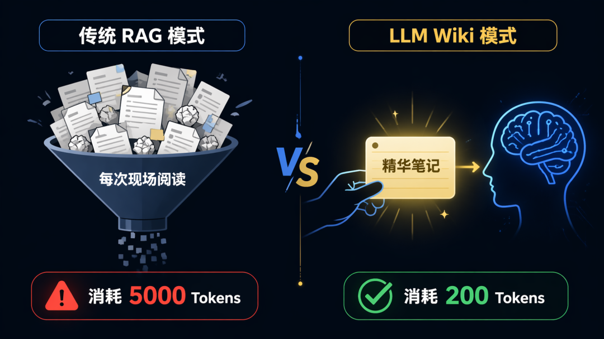
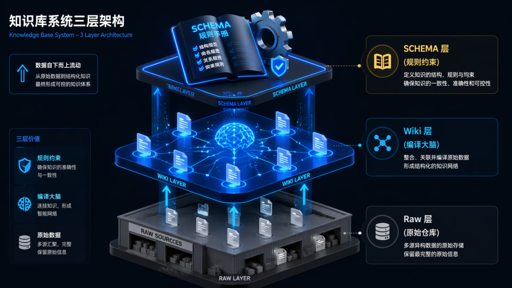

> 📎 来源: [智客随笔](https://mp.weixin.qq.com/s?__biz=MjM5MjA2MDQxMg==&mid=2448720300&idx=1&sn=3c59598bcfbcf16869e88d5cbf5b675f&chksm=b3570549009caa6bbfc4fb87c7714c609c8f5a61b3253acef4aa14f0c88be1e88e3dfc3e5f10&mpshare=1&scene=1&srcid=04257QaofK5I2a9i1zUUfTBV&sharer_shareinfo=815101224c529d6a18e2b0ea4175f152&sharer_shareinfo_first=815101224c529d6a18e2b0ea4175f152) | 时间: 2026-04-25 13:20

---

> 摘要：还在每次对话都把几万字的文档塞给 AI ？不仅贵，它还记不住。真正的终局是让 AI 把知识“编译”下来。 LLM Wiki 模式，让你的 Token 消耗降维打击。

最近大家都在折腾给 LLM （大模型）挂“外挂大脑”。

最典型的用法就是 RAG （检索增强生成）：你把几百页的 PDF 、文档扔给 AI ，然后问它问题。 AI 去文档里找相关的段落，再回答你。

**这个思路是对的**。 它解决了“上下文太长”的问题。

但作为一个常年跟知识库死磕的博主，我得泼一盆冷水：

**传统的 RAG 方案，依然只是个“物理搬运工”。它只是在“省着用”，并没有真正“存下来”**。

每次你问问题， AI 都要重新把那几千字的原文片段读一遍。它就像一条只有 7 秒记忆的金鱼，永远在重复劳动。

今天我要讲一套真正的**降维打击**方案——**LLM Wiki （编译型知识库）**。

它不仅能把 Token 消耗砍掉 90%，还能让你的知识库像生物神经网一样，越用越聪明。

---

## 1. 为什么说现在的 AI 知识库是“金鱼”？

先给不熟悉原理的朋友补个课，现在大多数人的做法通常是这样的：

假设你要调研一个项目，手头有 50 页的 PDF 、 3 篇公众号长文、 2 个 Github Readme ，加起来大概 **3 万字**。

你把这 3 万字一股脑塞进对话框（或者扔进知识库），然后开始提问：

•“这个项目的技术栈是什么？”（ AI 读了一遍 3 万字）

•“它的核心商业模式是什么？”（ AI 又读了一遍 3 万字）

•“它的竞品有哪些优劣势？”（ AI 还是读了一遍 3 万字）

**这有什么问题**？

问题在于：**LLM 每次都在做重复的“阅读理解”**。

虽然现在的工具会自动检索相关段落，但它喂给 AI 的依然是**未经处理的原材料**（比如几千字的原文片段）。这些原材料里充满了废话、重复的修饰词、无关的客套话。

LLM 还是得耗费大量的算力（ Token ）去过滤噪音，提取逻辑。

**算一笔账**：
 假设你为了吃透这个项目，问了 **10 个**深度问题。
 AI 实际上读了 **10 遍**这 3 万字。
**Token 消耗**： 3 万字 × 10 次 = **30 万 Token**。

这意味着你花了 30 万 Token 的钱，让 AI 读了 10 遍同样的废话，只为了回答你那 10 个真正的问题。

这就像什么？
 这就好比你请个顾问，每次问个问题，都得先付他一笔“阅读资料费”。哪怕他昨天已经读过了，今天还得再收一次钱！

---

## 2. LLM Wiki ：让知识“编译”后再上桌

Andrej Karpathy 最近推崇的 **LLM Wiki** 模式，直接把游戏换成了“编译模式”。

这模式的核心区别在于：**知识不是在提问时才检索的，而是在摄入时就消化了**。

当你把一篇文章扔进 LLM Wiki 时， Agent 不是把它存进数据库就完事了。它会当场执行一次“编译”：
 1.  **阅读**全文。
 2.  **提取**核心实体、概念、数据。
 3.  **编译**成几百字的 Markdown 笔记（ Wiki 页面）。
 4.  **建立链接**：如果新内容跟旧内容有关联，自动更新旧页面。

**这意味着什么**？

意味着当你下次提问时， Agent 根本不需要去读那几万字的原文。
 它只需要读 Agent 之前写好的那几百字“精华笔记”。

还是刚才那个例子：
 你问书童：“这书里关于赚钱的看法是啥？”
 书童递给你一张**它早就写好的一页纸小抄**：“主人，书里说赚钱=信息差 + 执行力，具体在第 32 页。”

**你看书只需要花 10 秒，而不是翻 3 本书花 3 个小时**。
 这就是 **降维打击**。

---

## 3. 算一笔 Token 的账

咱们再用数据说话，看看这俩模式在钱上的区别。

假设你有一个 10 万字的资料库。

•

**传统 RAG**：
     每次检索，捞出来 5000 字的原文片段。
     LLM 需要读取 5000 字，处理噪音，提取逻辑。
**消耗：每问一次，烧掉 5000 input tokens**。

•

**LLM Wiki**：
     资料库已经被编译成了 2000 字的结构化笔记（概念页、实体页）。
     Agent 检索时，只读取相关的 200 字笔记。
**消耗：每问一次，烧掉 200 input tokens**。

**差距是 25 倍**。
 如果你是个重度使用者，一个月下来省下的 API 费，够你买好几个 ChatGPT Plus 了。

*(左：每次都要读原文；右：只读编译后的笔记)*

---

## 4. 架构揭秘：它是怎么做到的？

别被“编译”两个字吓到了，这套方案的架构其实非常性感。它把知识分成了三层：

1.**Raw 层（原始层）**：
     这是你的仓库（ Raw Sources ）。你扔进去的 PDF 、网页、笔记，**原封不动**地存在这里，绝对不修改。这是“事实的唯一源头”。

2.**Wiki 层（编译层）**：
     这是 AI 的大脑（ Wiki Layer ）。 Agent 读 Raw 层后生成的笔记。这里有实体页（人物/工具）、概念页（原理/套路）。

3.**SCHEMA 层（规则层）**：
     这是家规（ SCHEMA ）。告诉 AI 怎么存、怎么连、怎么更新。保证生出来的“知识宝宝”不畸形。

**最绝的是，它有一个“脐带”机制**。

每一条 Wiki 笔记里，都死死地绑着来源链接。当你需要严谨引用时，你只需要在笔记里点一下那个 `source`，**瞬间跳转回原文档**。

你要的精准定位、原文引用，一个都不少。但你在 99% 的日常快速问答中，享受的是“小抄”带来的极速快感。

---

## 5. 怎么搭建这套系统？

其实门槛比你想的要低得多。

这套方案不需要你买 Plus 会员，不需要你传文件给 Google ，它就是一堆躺在你硬盘里的 **Markdown 文件**。

我推荐用 **Hermes Agent 内置的 `llm-wiki` 技能**，一条命令就能搭起来：

1.**建目录**： Agent 会自动帮你建好 `raw/`、`entities/`、`concepts/`。

2.**定规矩**：它会写好 `SCHEMA.md`，告诉 AI 怎么存、怎么连、怎么更新。

3.**喂素材**：以后你看到好文章，直接丢链接给 Agent ，说一句"**存到 Wiki**"。

4.**自动长**： Agent 会自动抓取、提取、写笔记、更索引。

配合 **Obsidian** 使用，你能直观地看到整个知识网络是如何像神经网络一样，随着你丢进去的素材越来越多，自己慢慢长出来的。

---

## 写在最后

很多人做不好个人知识库，不是因为书读得少，而是因为**维护成本太高**。
 每次都要整理、打标签、建链接，人类是有惰性的。

**LLM Wiki 是第一个让我觉得，就算我不管它，它也能自己长大的系统**。

它把最苦最累的“记账”工作交给了不知疲倦的 AI ，你只需要做两件事：
 1.  **投喂**（把好东西扔给它）。
 2.  **提问**（调用它长出来的智慧）。

如果你也是那种收藏夹几千个、真正看过的不到几十个的人，别再让它们在数据库里吃灰了。

试试用 LLM Wiki ，把它们变成你肚子里的**知识脂肪**，随用随取，还不长肉。

---

*如果觉得有启发，**点赞、在看、转发**三连，咱们下期见。*
