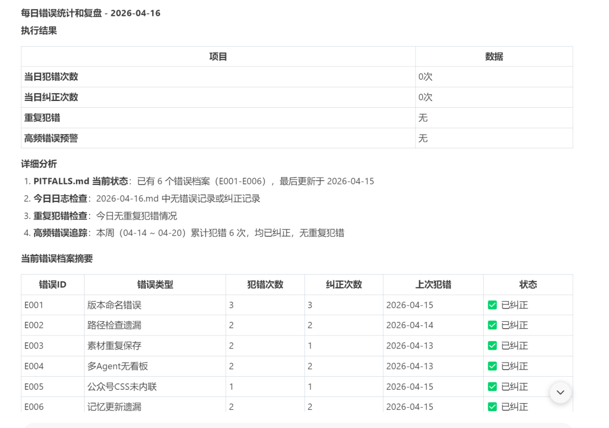

> 📎 来源: [可可Ai实战](https://mp.weixin.qq.com/s?__biz=Mzk1Nzc3NDg5OQ==&mid=2247484635&idx=1&sn=d6d812d0ee035c75d379ad45ac27d43f&chksm=c26db24a75cbb126fb9d3ba8958301602c7e5b8387174606754f0b1889d6d2be7467fe3314f2&mpshare=1&scene=1&srcid=04225cG5A9SmnNvuUjQr21Cu&sharer_shareinfo=dcc2cf0e52102276c093273cde2e46a3&sharer_shareinfo_first=dcc2cf0e52102276c093273cde2e46a3) | 时间: 2026-04-22 17:34

---

这周Hermes Agent火遍全网，GitHub 8万星，号称"进化版龙虾"。


说实话，看完那些"自动学习循环""技能自生成"的功能介绍，我狠狠心动了，

但研究了3天，最终我决定：**不迁移，**但从它身上"偷"走了一样东西——让Agent不再重复犯错的学习能力。

然后用两天时间，复刻在了在自己的龙虾上。

今天分享具体是怎么做的，你也可以复制。

### 我偷走了什么？

先搞清楚Hermes的"学习循环"到底是什么。

具体就三件事：

**观察** → 发现错误和成功模式

**沉淀** → 把经验变成可复用的规则

**复用** → 下次遇到直接调用

这三件事，我的龙虾原本都没有。现在都有了。

### 我是怎么"偷"的？

我不是技术大佬，不会写代码。但我发现：有想法**更重要**。

Hermes能自动做的事，我可以用"人工+规则"的方式复刻。关键是把它的每个机制拆解，对应到我的系统里。

#### Step 1：建立"每日复盘"习惯（对应观察）

**Hermes怎么做的：** 每15次工具调用后，系统自动暂停复盘。

**我怎么迁移的：** 建立"每日19:55复盘优化"的强制节点。不管当天用了多少次Agent，到点就复盘优化。

复盘内容很简单：

- 今天Agent犯了什么错？
- 我纠正了什么？
- 哪些错是重复的？

写入位置：

```
daily_YYYY-MM-DD.md
```

**关键改变：** 从"随机纠错" → "固定节奏沉淀"

#### Step 2：建立"错题本"系统（对应沉淀）

**Hermes怎么做的：** 自动把经验生成Skill文件。

**我怎么迁移的：** 设计了"三级记忆文件"，像错题本一样分类存放。

**第一层：SOUL.md（核心价值观）**

- 存什么：我是谁、风格是什么、不能碰的红线
- 多久更新：很少变，除非原则性调整

**第二层：MEMORY.md（运作规则）**

- 存什么：怎么做事、流程是什么、常见错误
- 多久更新：每周更新，发现重复问题就写入

**第三层：OPTIMIZATION\_LOG（具体纠正）**

- 存什么：今天改了什么、纠正了什么
- 多久更新：每天记录，实时更新

**对应关系：** Hermes的自动Skill = 我的三层文件系统

**关键改变：** 从"口头纠正" → "书面固化"

> **举个例子：**

> 以前Agent总是把素材存错位置，我口头说"纠正"。结果它下次还会犯。现在我写进MEMORY.md：

> ```
> ## ⚠️ 素材存储强制规则
> ```

> ```
> **触发场景**: 收到Coco发来的素材
> ```

> ```
> **正确做法**: 必须存入 shared/notion-system/📁素材库/
> ```

> ```
> **禁止行为**: 存入散文件、空模板
> ```

> ```
> **检查清单**:
> ```

> ```
> - [ ] 是否按表格格式追加
> ```

> ```
> - [ ] 编号是否连续
> ```

> 下次Agent启动，先读这个规则。犯错的概率大幅下降。

#### Step 3：建立"启动加载"习惯（对应复用）

**Hermes怎么做的：** 每次启动自动读取所有Skill文件。

**我怎么迁移的：** 建立"启动三件套"强制读取协议。每次对话开始必须：

1. 1. 读SOUL.md（了解我是谁）
2. 2. 读MEMORY.md（了解最新规则）
3. 3. 读今日优化记录（了解近期纠正）

**关键改变：** 从"每次都重新教" → "带着记忆开始"

#### Step 4：建立"3次触发"规则（对应自动优化）

**Hermes怎么做的：** 后台自动分析哪些Skill有效、哪些需要更新。

**我怎么迁移的：** 建立"高频错误追踪表"，用人工统计代替自动分析。

这是我上周的真实数据：

| 错误类型 | 出现次数 | 触发动作 |
| --- | --- | --- |
| 文件存储路径错误 | 5+次 | ✅ 超过3次，固化成规则 |
| 同一问题反复纠正 | 5类 | ✅ 超过3次，固化成规则 |
| AI太被动/等我提醒 | 3+次 | ⏳ 刚好3次，观察中 |

**我的规则：同一个错误出现超过3次，必须写入规则文件。** 不是简单记录，而是提炼成"执行清单"。

**关键改变：** 从"被动发现问题" → "主动追踪模式"

### 迁移后的真实改变

不是质变，是渐进的优化完善。



**迁移前（上周）：**

- 文件存错路径：5+次
- 同一问题反复教：5类
- AI太被动等我提醒：3+次

**迁移中（本周）：**

- 开始每日19:55复盘，发现重复模式
- 把"素材存储规则"写入MEMORY.md
- 建立看板强制验收

**预期改变（下周目标）：**

- 同一问题不再出现

### 你怎么复制？

不需要懂技术，按这4步做：

**step 1：开始记录（观察）**
每天固定一个时间复盘。记录当天所有纠正，格式：

```
时间 | 错误 | 纠正 | 类型
```

**step 2：建立错题本（沉淀）**
创建三个文件：

- SOUL.md（核心价值观）
- MEMORY.md（运作规则）
- OPTIMIZATION\_LOG.md（具体纠正）

找出重复3次以上的错误，写入MEMORY.md。

格式：

```
## ⚠️ [错误类型]**触发场景**: [什么时候会犯]**正确做法**: [应该怎么做]**检查清单**: [验证是否做对的标准]
```

**step 3：建立加载习惯（复用）**
每次启动Agent，强制读取三个文件。制作自己的"启动检查清单"。

**step 4：建立触发机制（优化）**
创建"高频错误追踪表"。每周统计：哪些错误出现超过3次？出现3次以上 → 必须固化成规则。

### 选哪个方案？

看完上面的步骤，你可能会问：既然Hermes能自动做这些事，我干嘛还要自己建？

我的答案是：**看你要控制权，还是要全自动。**

**Hermes适合这样的人：**

- 喜欢折腾新技术
- 愿意花时间迁移、配置、调试
- 不介意让系统自动决定"什么时候学、学什么"

**我的方案适合这样的人：**

- 已经有龙虾工作流，不想推倒重来
- 想要掌控感——我自己决定沉淀什么规则
- 愿意每天花5分钟做复盘，换取可控的进化

我自己是第二种。我不是技术牛人，不想折腾。我想要的是：**在现有系统上，慢慢让它变聪明。**

### 写在最后

如果你也不想折腾，那完全不需要换工具。你只需要做一件事：**从今天开始，让龙虾记录你纠正它的每一个问题。**

这也是真正"进化"的本质：

> 不是系统自动变聪明，
> 是你带着它，一步步变聪明。

### 📎 资料包

《Agent错题本模板》

- 高频错误分类表
- 3个真实案例（可直接参考）
- 每周复盘检查清单

**评论区回复「错题本」，我发你模板。**
