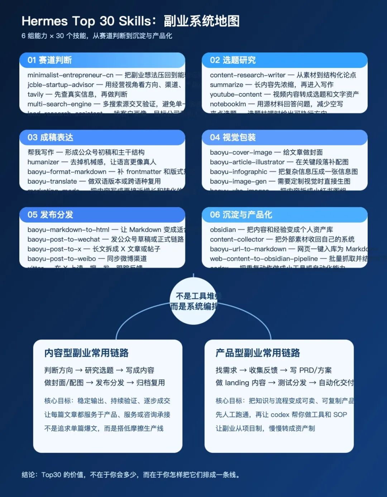
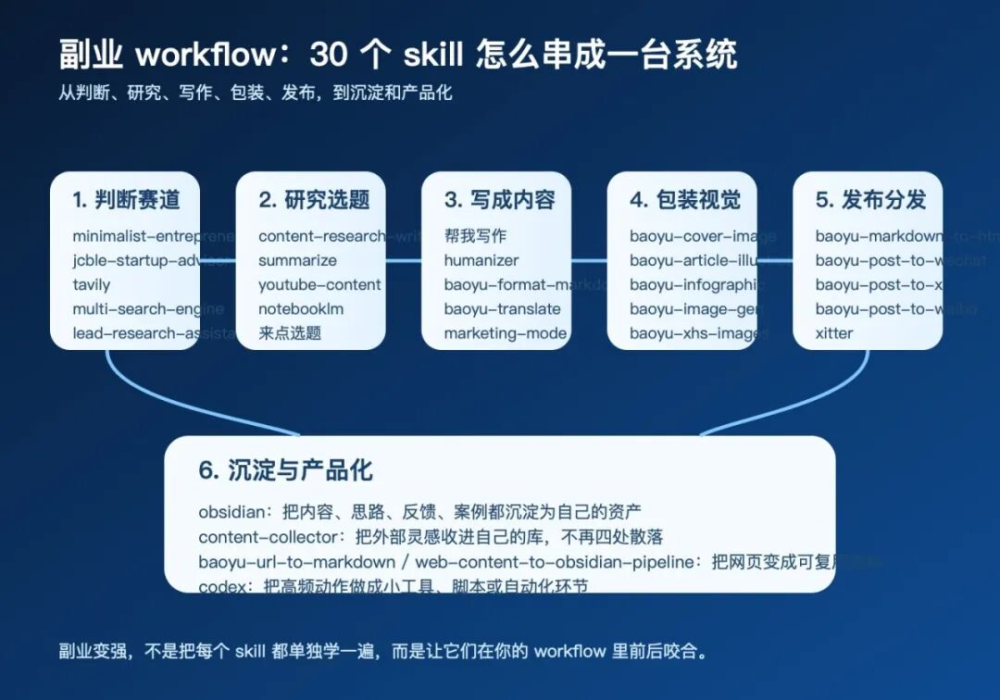

> 📎 来源: [甲虫傅里叶](https://mp.weixin.qq.com/s?__biz=MzYzODc5ODgzOQ==&mid=2247483819&idx=1&sn=96630dc21a90255fd9cae26671e60f18&chksm=f1595f74524649c2291af4631afaddc9b80a1a75ffd248609b2a35c089880ae517260dd76c91&mpshare=1&scene=1&srcid=0429b0XlVGw4OpQtDDDhPO6B&sharer_shareinfo=ef42314b0be9c0d75ad300e41a198855&sharer_shareinfo_first=ef42314b0be9c0d75ad300e41a198855) | 时间: 2026-04-29 03:50

---

你说得对。

上一篇最大的问题，不是文字不顺。

而是题目写了 Top 30，正文却没有把 Top 30 讲清楚。

这在公众号里是硬伤。

因为用户点进来，看的不是“你有多少感悟”。

而是你到底能不能把这 30 个 skill 说具体，说明白，说到能拿去用。

所以这次我不再空谈。

直接把我认为最适合个人副业的 30 个 Hermes skill，按 6 组拆开讲。

每组 5 个。

每个都说它到底适合什么场景，解决什么问题。

先把图放出来，你会更容易看懂这套系统的全貌。



## 一、Top30 不是“工具展厅”，而是一条副业价值链

很多人做副业，最大的问题不是不会用 AI。

而是不会编排 AI。

会搜一点。
会写一点。
会做图一点。
会发平台一点。

但这些能力彼此不接。

于是结果就是：

今天在找资料。
明天在改标题。
后天在做封面。
下周又重新找一遍同样的资料。

看起来每天都很忙。

其实一直在原地打转。

我现在越来越明确一个判断：

个人副业真正的分水岭，不是谁会更多工具，而是谁能把一组关键能力排成一条线。

这条线至少要经过 6 个环节：

1. 1. 判断这个方向值不值得做。
2. 2. 研究这个选题有没有内容和需求支撑。
3. 3. 把想法写成别人看得懂、愿意转发的内容。
4. 4. 用视觉包装提升打开率和传播效率。
5. 5. 把内容稳定发出去，而不是停在草稿里。
6. 6. 最后把经验沉淀成资产，甚至慢慢做成产品。

所以这篇文章要讲的，不是“30 个 skill 名单”。

而是 30 个 skill 在副业系统里各自扮演什么角色。

## 二、6 组 × 5 个：这 30 个 skill 分别解决什么问题

### 第一组：赛道判断组

这组 skill 决定一件事：你是不是在正确的方向上发力。

1. 1. 

   ```
   minimalist-entrepreneur-cn
   ```


   适合你手里有一个副业想法，但还不知道该不该做的时候。它的价值，是逼你把想法压回到最小、最可验证的版本，而不是一上来就做大。
2. 2. 

   ```
   jcble-startup-advisor
   ```


   适合你在判断商业方向、行业方案、渠道打法、产品边界时使用。它更像一个中文创业顾问，帮你从经营视角看问题，而不是只从“会不会火”来看。
3. 3. 

   ```
   tavily
   ```


   适合快速做高质量信息搜集。它解决的是“先查清楚，再下判断”，避免副业方向建立在模糊印象和二手转述上。
4. 4. 

   ```
   multi-search-engine
   ```


   适合需要交叉验证的时候。单一搜索源很容易有偏差，这个 skill 的意义是让你从多个搜索入口看同一问题，减少误判。
5. 5. 

   ```
   lead-research-assistant
   ```


   适合你已经有大致方向，想进一步看目标客户是谁、行业里哪些公司或人群更可能买单。它解决的是“方向对了，但客户还很模糊”的问题。

这一组的核心，不是帮你变得更兴奋。

而是帮你少走弯路。

很多副业不是做不起来。

而是一开始就选错了战场。

### 第二组：选题研究组

这组 skill 决定一件事：你能不能把模糊主题，变成有价值的内容切口。

1. 6. 

   ```
   content-research-writer
   ```


   适合把一堆资料、链接、观点，整理成一条清晰的论证链。它解决的是“有材料，但没结构”的问题。
2. 7. 

   ```
   summarize
   ```


   适合面对长文章、PDF、网页、视频、音频时，先快速抓重点。它能帮你在正式写作前，先把信息压缩成可处理的提纲。
3. 8. 

   ```
   youtube-content
   ```


   适合把 YouTube 视频里的内容转成文字素材、章节重点、可写成文章的主题。它解决的是“视频看完就过去了，没有转成资产”的问题。
4. 9. 

   ```
   notebooklm
   ```


   适合你已经有一批源材料，希望围绕材料直接问问题、抽重点、找证据。它的价值是让内容建立在已有资料上，而不是空想。
5. 10. 

   ```
   来点选题
   ```


   适合你进入“知道要做内容，但一时没有切口”的阶段。它不是帮你瞎发散，而是帮你把选题从空白推进到可执行。

这一组解决的是选题阶段最常见的卡点：

不是没话说。

而是材料散、重点乱、角度不准。

### 第三组：成稿表达组

这组 skill 决定一件事：你能不能把研究结果写成别人愿意看完的内容。

1. 11. 

   ```
   帮我写作
   ```


   适合先把一篇文章的主体搭出来。它解决的是“我脑子里有东西，但迟迟下不了第一段”的问题。
2. 12. 

   ```
   humanizer
   ```


   适合在初稿已经出来之后，把过于机械、模板化、AI 味太重的表达往回拉。它解决的是“信息对了，但语感不对”的问题。
3. 13. 

   ```
   baoyu-format-markdown
   ```


   适合整理 Markdown 结构、标题、frontmatter、分节和排版规范。它解决的是“内容有了，但文件还是毛坯”的问题。
4. 14. 

   ```
   baoyu-translate
   ```


   适合你要做中英双语版本，或者把一篇文章切到另一个语言市场。它解决的是“内容能不能跨语言复用”的问题。
5. 15. 

   ```
   marketing-mode
   ```


   适合你希望文章不只讲清楚，还能更接近增长、转化、传播。它解决的是“内容写完了，但业务目标还没进来”的问题。

这一组的关键，不是把文章写得很华丽。

而是让内容既能读，又能传，还能承接业务。

### 第四组：视觉包装组

这组 skill 决定一件事：你的内容能不能在第一眼就被看见。

1. 16. 

   ```
   baoyu-cover-image
   ```


   适合给公众号文章、专题文档、长文内容做封面。它解决的是“标题不错，但封面撑不住点击”的问题。
2. 17. 

   ```
   baoyu-article-illustrator
   ```


   适合在正文关键段落补图，尤其是方法论、流程型、结构型内容。它解决的是“文章太密，读者看着累”的问题。
3. 18. 

   ```
   baoyu-infographic
   ```


   适合把复杂信息压成一张信息图。它解决的是“讲清楚这件事要花很多字，但用户未必愿意看那么久”的问题。
4. 19. 

   ```
   baoyu-image-gen
   ```


   适合你需要更自由的视觉创作时使用。它解决的是“现成图不合适，但又想快速得到定制图”的问题。
5. 20. 

   ```
   baoyu-xhs-images
   ```


   适合把同一套内容拆成适合小红书传播的图组。它解决的是“内容本身不错，但平台形式不匹配”的问题。

这一组的价值很现实。

不是让文章变花哨。

而是让表达密度和阅读体验更平衡。

### 第五组：发布分发组

这组 skill 决定一件事：内容能不能真正离开你的本地文件夹，进入流量场。

1. 21. 

   ```
   baoyu-markdown-to-html
   ```


   适合把 Markdown 转成更适合微信等平台发布的 HTML 成品。它解决的是“本地写得好，不代表平台显示得好”的问题。
2. 22. 

   ```
   baoyu-post-to-wechat
   ```


   适合把文章送到公众号草稿箱，或者进入正式发布链路。它解决的是“写完了，但发布流程还很重”的问题。
3. 23. 

   ```
   baoyu-post-to-x
   ```


   适合把文章拆成 X/Twitter 的发布内容，或者直接做 X 文章。它解决的是“同一内容如何跨平台复用”的问题。
4. 24. 

   ```
   baoyu-post-to-weibo
   ```


   适合把长文观点压缩后分发到微博。它解决的是“内容已经有了，但在不同平台没有对应出口”的问题。
5. 25. 

   ```
   xitter
   ```


   适合在 X 上读时间线、搜话题、跟踪反馈、发布内容。它解决的是“分发之后，怎么继续观察受众反应”的问题。

这一组的重点不是“多发平台”。

而是让你的内容从生产线，顺利进入反馈线。

### 第六组：沉淀与产品化组

这组 skill 决定一件事：你做过的工作，会不会在下次继续帮你赚钱、帮你省时间。

1. 26. 

   ```
   obsidian
   ```


   适合把文章、思路、案例、问题、复盘，全部沉淀成自己的知识资产。它解决的是“做完即消失”的问题。
2. 27. 

   ```
   content-collector
   ```


   适合把外部看到的好内容、好案例、好素材收回自己的系统。它解决的是“灵感很多，但都散在平台里”的问题。
3. 28. 

   ```
   baoyu-url-to-markdown
   ```


   适合把网页内容直接抓成 Markdown。它解决的是“看到一篇好文章，但没法稳定归档和后续处理”的问题。
4. 29. 

   ```
   web-content-to-obsidian-pipeline
   ```


   适合批量抓取网页内容并结构化进入 Obsidian。它解决的是“零散收藏能做，但一多就乱”的问题。
5. 30. 

   ```
   codex
   ```


   适合把你已经验证过的重复动作，进一步做成工具、脚本、自动化流程。它解决的是“副业还是太手工，规模一上来就顶不住”的问题。

这一组最关键。

因为副业能不能越做越轻，最后拼的不是热情。

而是资产和流程。

## 三、这 30 个 skill，真正厉害的地方是能排成一条 workflow

单看每个 skill，都不神奇。

真正厉害的是把它们接起来。

比如一条很典型的个人副业内容链路，可以这样跑：

先用 

```
minimalist-entrepreneur-cn
```

、

```
jcble-startup-advisor
```

、

```
tavily
```

 判断一个方向是否值得长期做。

再用 

```
content-research-writer
```

、

```
summarize
```

、

```
notebooklm
```

 把主题研究透，把论点找稳。

接着用 

```
帮我写作
```

 起稿，用 

```
humanizer
```

 调语感，用 

```
baoyu-format-markdown
```

 整结构。

然后用 

```
baoyu-cover-image
```

、

```
baoyu-article-illustrator
```

、

```
baoyu-infographic
```

 做视觉包装。

成稿之后，用 

```
baoyu-markdown-to-html
```

 和 

```
baoyu-post-to-wechat
```

 发布到公众号，再用 

```
baoyu-post-to-x
```

、

```
baoyu-post-to-weibo
```

 做跨平台分发。

最后，把这篇文章的素材、结构、反馈、配图方案、用户评论，全都回收进 

```
obsidian
```

，并配合 

```
content-collector
```

、

```
baoyu-url-to-markdown
```

、

```
web-content-to-obsidian-pipeline
```

 变成自己的长期知识资产。

如果某些动作已经反复做了很多次，就再把它们交给 

```
codex
```

，做成小工具和自动化环节。

这时候，副业就不再只是“写一篇内容”。

而是在搭一台会持续运转的系统。

下面这张图，讲的就是这件事。



## 四、真正的分水岭，不是你会多少 skill，而是你有没有自己的 operating system

到这里，其实结论已经很清楚了。

Hermes Top 30 skills 的价值，不在于你背下了 30 个名字。

而在于你终于能把副业拆成明确环节，然后知道每一段该调用什么能力。

所以我现在更少问“哪个工具最好”。

我更常问的是：

- 我现在卡在这条链路的哪一段？
- 我缺的是判断，还是研究？
- 我缺的是表达，还是包装？
- 我缺的是分发，还是沉淀？
- 我缺的是执行，还是自动化？

一旦这个视角建立起来，很多焦虑会自动下降。

你不会再因为别人又推荐了一个新工具，就立刻心痒。

你也不会因为别人一天发十条内容，就怀疑自己太慢。

因为你会知道，真正决定副业能不能长期跑起来的，不是工具数量。

而是系统质量。

对个人副业来说，最值得追求的状态，不是“我会很多招”。

而是“我有一套能持续产出、持续验证、持续沉淀、持续放大的 operating system”。

而这，才是我理解的 Hermes Top 30 skills 的真正意义。

不是工具堆叠。

而是系统编排。

不是一次性灵感。

而是可重复的增长链路。

如果你最近也在整理自己的副业方法，不妨先别急着继续装更多工具。

先把你现在做的事情画成一条线。

从赛道判断，到选题研究，到成稿表达，到视觉包装，到发布分发，再到沉淀与产品化。

当你把这条线画出来之后，你会很快看到：

自己真正缺的，不是更多工具。

而是一套真正能跑起来的系统。
