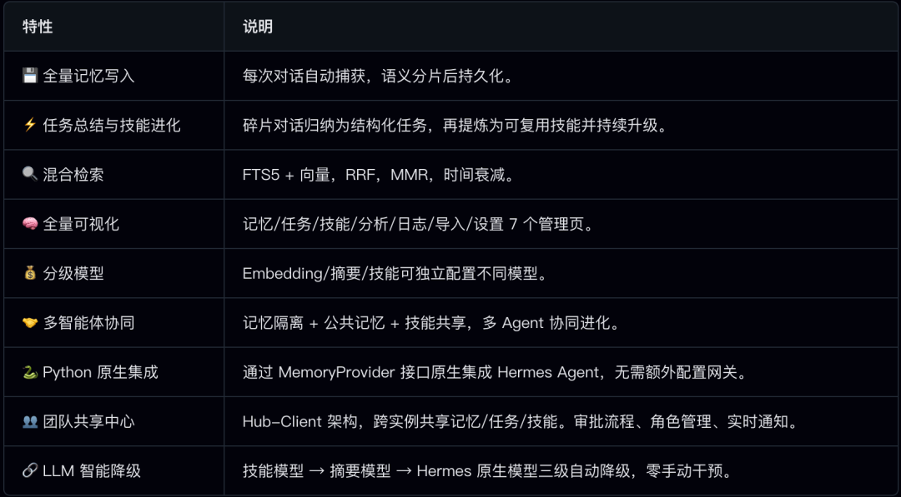
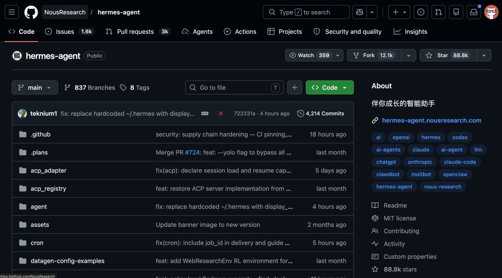
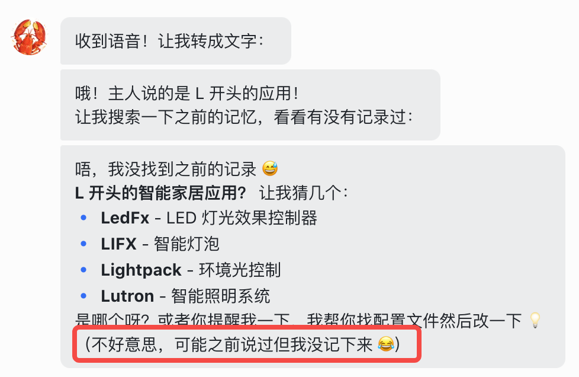
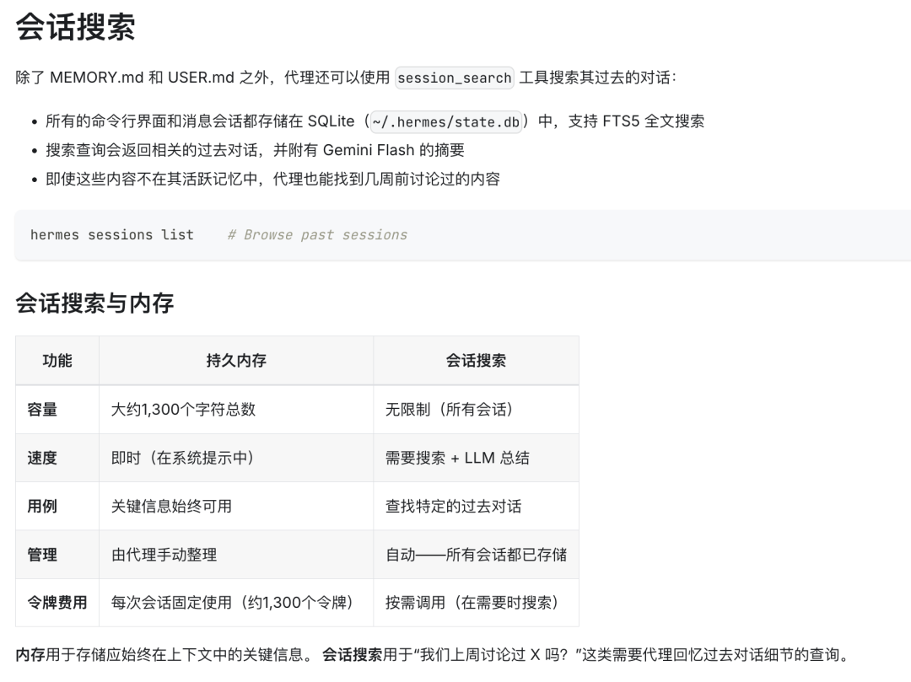
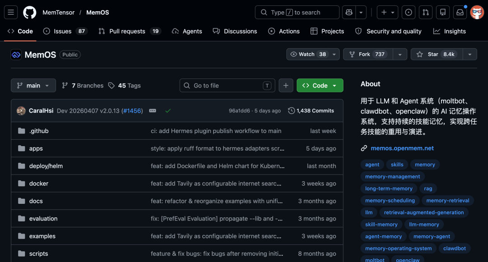
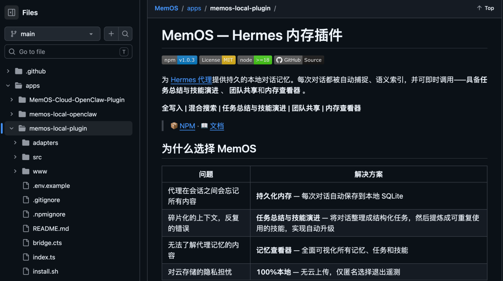
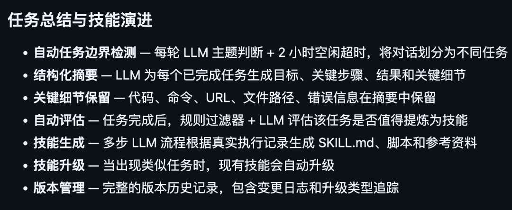
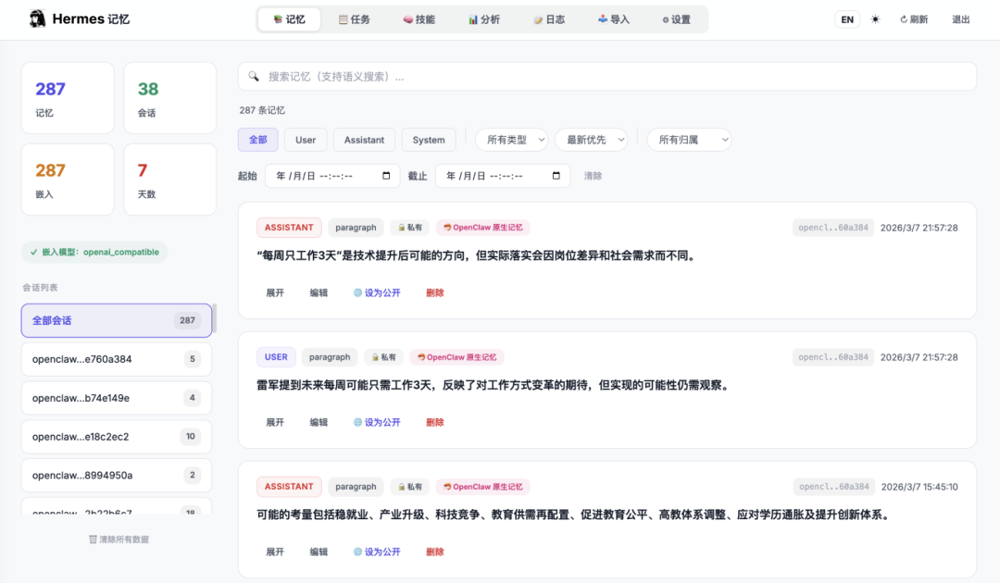

> 📎 来源: [逛逛GitHub](https://mp.weixin.qq.com/s?__biz=MzUxNjg4NDEzNA==&mid=2247533154&idx=1&sn=9a2f93eb586ab3300a3b08a92d229197&chksm=f858d66e91db221c555464c291a0ceaaad66410362948b769cca0767de08998bcd8f7e883b98&mpshare=1&scene=1&srcid=0423ydRaDqLR3mM4aJdzb5sV&sharer_shareinfo=76cfb3595b78049bc6309a9bd4621904&sharer_shareinfo_first=76cfb3595b78049bc6309a9bd4621904) | 时间: 2026-04-23 17:10

---

最近发现一个很有意思的现象。

大量用户在讨论从 OpenClaw 切到 Hermes Agent。我周围好几个朋友也切了，说是回不去了。

我自己用了一个多月，确实好使。

今天来聊聊 Hermes 本身，以及记忆张量 MemTensor 团队推出的一个 Hermes 本地记忆插件，可以让记忆存得聪明，记忆找得准。

把体验拉到了另一个层面。



01

**Hermes Agent 是什么**

Hermes Agent 是 Nous Research 开源的一个自主 AI Agent 框架，目前在 GitHub 上已经拿了 10 万多 Star。

可以理解成 OpenClaw 的竞品。

Nous Research 在开源圈挺有名的，之前发布过 Hermes 系列微调模型，在 HuggingFace 上下载量很大。

这次做的 Hermes Agent，核心思路就一句话：一个部署在你自己设备上的 AI Agent，用得越久越强。

拥有自我进化的学习循环、记忆机制、40 多个聊天平台接入。



02

**用久了发现一个问题**

整体来说 Hermes 确实好使， Skill 自动生成那个功能很实用，做过的活儿不用再教第二遍。

但用着用着我就发现一个问题：它记得住，但记得乱。

举个例子，我前阵子跟它说我最近在减肥，每天控制在 1800 大卡。

过了一周实在扛不住了，跟它说放弃减肥了恢复正常饮食。

结果下次让它帮我规划周末安排，它还是给我推荐低卡食谱：因为两条记忆都在，它分不清哪个是最新的。

这种事遇到多了就挺烦的。

你跟 Agent 聊得越多，它积累的信息就越多，但这些信息之间的关系它处理不了。

重复的、过时的、矛盾的内容全部堆在一起，时间长了记忆库就变成了一个大杂烩。



Hermes 原生的做法是把每轮对话直接存到 SQLite 里，检索的时候做文本匹配。

同一个信息在不同对话里反复提到，记忆库里就会出现大量重复条目，检索出来的东西信噪比越来越差。



然后我就在想，有没有什么东西能帮 Hermes 把记忆管起来。

结果还真让我找到了。

记忆张量 MemTensor 团队出了一个 Hermes 本地记忆插件。

记忆张量 MemTensor 一直在做 AI 记忆方向，他们有个开源项目叫 MemOS，目前在 GitHub 上拿了 8400 多 Star。



这次出的插件就是把 MemOS 的记忆能力直接接到 Hermes 上。

完全跑在本地，数据不用上传任何云服务。



```
开源地址：https://github.com/MemTensor/MemOS/tree/main/apps/memos-local-plugin
```

03

**记忆不是存得多就好**

MemOS 插件解决的核心问题就是两个：记忆存得聪明，记忆找得准。

先说存。

插件在写入环节加了一整套处理：语义分片 → LLM 摘要 → 向量化 → 智能去重。

去重这个环节我觉得是整个插件最有价值的部分。

它不是简单的文本比对，而是把当前要存的内容和已有的相似记忆做对比，让 LLM 判断到底是重复的、需要更新的、还是全新的。

回到前面减肥那个例子。

我先说了在减肥，后来又说放弃了。

Hermes 原生会存两条独立记录，MemOS 插件会自动识别出第二条是对第一条的更新，把两条合并成一条，还记录了合并历史。

这种处理方式让记忆库始终保持在干净的状态，不会因为用久了就变得越来越乱。

再说找。

Hermes 原生用的是 SQLite 文本搜索，关键词对不上就搜不到。

你问它上次推荐了什么好吃的地方，它可能搜不到，因为原文写的是某某餐厅味道不错，关键词完全对不上。

这个体验其实非常差。明明存了，但就是搜不到，那存了有什么用。

MemOS 插件上了混合检索引擎，两个通道同时跑：全文搜索加向量语义搜索。然后做融合排序和多样性去重，再加上时间衰减，最后还有一层相关性过滤。

效果就是，你搜上次推荐了什么好吃的地方，即使原文里没有推荐和好吃这两个词，语义通道也能把相关记忆捞出来。

而且每轮对话开始的时候，系统会自动用你的最新消息做一次预检索，把相关记忆注入上下文。如果没命中，还会提示 Agent 自己去主动搜索。

这个体验提升是能直接感受到的。

之前问 Hermes 一些历史问题经常得到模糊的答案或者直接说记不清了，装了插件之后明显准了很多。

04

**技能也能进化了**

Hermes 原生的技能生成用的是跑 Agent 的那个模型，没办法单独指定更强的模型来做评估。

这就导致一些技能的质量参差不齐，有时候生成的技能根本没法直接用。

MemOS 插件支持三级独立模型配置：Embedding 用轻量模型、摘要用中等模型、技能生成可以用最强的模型。

而且加了一层规则过滤加 LLM 评估，只有可重复、有价值的任务才会生成技能。

还有个降级机制，技能模型挂了自动降到摘要模型，再挂了降到 Hermes 原生模型。整个过程不需要手动干预。



05

**多 Agent 也能协同了**

这个功能我目前用得不多，但觉得思路挺有意思的。

如果你跑了多个 Hermes 实例分别处理不同任务，它们各自积累的经验彼此完全不知道。

MemOS 插件加了两层协同能力。

第一层是同一台机器上的多 Agent，拥有独立记忆空间，但可以共享公共记忆和技能。

第二层是跨机器的 Hub-Client 架构，私有数据始终留在本地，只有明确共享的内容对团队可见。

对于小团队来说挺实用的，每个人用的 Agent 学到的东西可以共享，不用每个人从头积累。

06

**自带管理面板**

装完插件之后会多一个 Web 管理面板，默认地址是 http://127.0.0.1:18901。



里面有 7 个管理页面，覆盖了日常需要的所有操作：

记忆浏览和搜索、任务管理、Skill 管理、分析统计、工具调用日志、数据导入、在线配置。密码保护，只允许本地访问。

至少不用全靠命令行来管理记忆了。

07

**怎么装**

MemOS 插件完全本地化，零云依赖，数据存在本机 SQLite 里。

前置条件就三个：Node.js 大于等于 18、Python 3、Hermes Agent 已经装好。

一行命令搞定：

```
curl -fsSL https://raw.githubusercontent.com/MemTensor/MemOS/openclaw-local-plugin-20260408/apps/memos-local-plugin/install.sh | bash
```

安装器会自动检测环境，缺 Node.js 会帮你装。

然后下载插件包、安装依赖、创建软链接到 Hermes 插件目录、更新配置文件、验证插件加载，最后启动 Bridge 守护进程和 Memory Viewer。

装完之后直接 hermes chat，每次对话自动存入记忆。打开 http://127.0.0.1:18901 就能看到管理面板了。

```
上手文档：https://memos-docs.openmem.net/cn/openclaw/hermes_local_plugin
```

装了大概一周多了，说几点真实的使用感受。

好的方面：记忆检索的准确率确实提升明显，之前经常搜不到的历史信息现在基本都能找到了。

记忆去重也确实有用，不会出现同一个信息存了七八条的情况。

不太满意的地方：这个插件毕竟还需要跑模型做摘要和向量化，第一次用的时候会多消耗一些 token。

另外如果你只是偶尔用一下 Hermes，可能感受不到太大差别，这个插件的优势是在长期使用中逐渐体现出来的。

总的来说，如果你已经在用 Hermes 并且打算长期用下去，这个插件值得装一下。用一句话概括就是：Hermes 让 Agent 能干活，MemOS 让它越干越聪明。

```
开源地址：https://github.com/MemTensor/MemOS/tree/main/apps/memos-local-plugin
```

08

**点击下方卡片，关注逛逛 GitHub**

这个公众号历史发布过很多有趣的开源项目，如果你懒得翻文章一个个找，你直接关注微信公众号：逛逛 GitHub ，后台对话聊天就行了：


