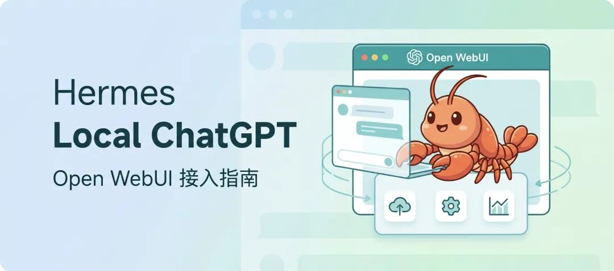
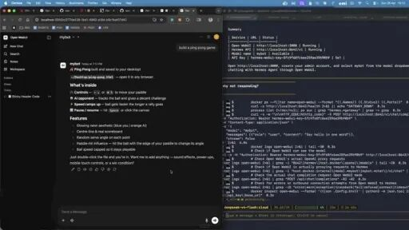

> 📎 来源: [i龙虾](https://mp.weixin.qq.com/s?__biz=MzI3MTk5OTc3Ng==&mid=2247484477&idx=1&sn=e6fa49dd8a9f3dbc93812b7b09c2b977&chksm=ea9f16b3e92f45cf4dcb3455db6e8c6f0a7bda7cbb87281793a4338b384afc3f0b1d109fdbb4&mpshare=1&scene=1&srcid=0428FJFM0pxxJ4opy0UzCile&sharer_shareinfo=e51e8cb8489d03466901985958960b60&sharer_shareinfo_first=e51e8cb8489d03466901985958960b60) | 时间: 2026-04-28 16:01

---



昨天看到一个视频，以 Open WebUI的界面使用Hermes ，看起来效果还不错，然后我就去折腾了一下 Open WebUI。

**接入之后，Hermes 直接变成了一个本地版 ChatGPT**。界面干净，对话记录自动存，代码能直接预览，文件拖上去就能用。而且是开源项目，可以免费部署。

---

## 整体思路

Open WebUI 本质上是个前端壳，它本来是用来连 Ollama 的，但因为走的是 OpenAI 兼容协议，所以只要后端能吐

```
/v1/chat/completions
```

 格式的接口，它都能连。

Hermes 从 v0.4.0 起就内置了 API 服务器，完整兼容这个格式。所以整个流程就是：

1. 在 Hermes 的

```
.env
```

 里开启 API 服务器

2. 用

```
hermes gateway
```

 把它跑起来

3. Docker 启动 Open WebUI，把接口地址指向 Hermes

4. 打开浏览器，开聊

---

## 第一步：启动 Hermes API 服务器

编辑

```
~/.hermes/.env
```

，加上这两行：

```
API_SERVER_ENABLED=true
API_SERVER_KEY=随便取一个密钥字符串
```

```
API_SERVER_KEY
```

 就是个访问令牌，Open WebUI 连接时要带上它。随便写，比如

```
hermes-local-2026
```

，记住就行。

然后启动网关：

```
hermes gateway
```

看到这行就说明 API 服务器起来了：

```
[API Server] API server listening on http://127.0.0.1:8642
```

默认端口是 **8642**，只监听本机（

```
127.0.0.1
```

），不对外暴露。这个设计很合理，本地用完全够。

想验证一下有没有跑起来，可以 curl 一下：

```
curl http://localhost:8642/v1/chat/completions \
  -H "Authorization: Bearer 你的密钥" \
  -H "Content-Type: application/json" \
  -d '{"model": "hermes-agent", "messages": [{"role": "user", "content": "你好"}]}'
```

有 JSON 回来就没问题。

---

## 第二步：Docker 部署 Open WebUI

确保本机装了 Docker，然后跑这条命令：

```
docker run -d -p 3000:8080 \
  -e OPENAI_API_BASE_URL=http://host.docker.internal:8642/v1 \
  -e OPENAI_API_KEY=你的密钥 \
  --add-host=host.docker.internal:host-gateway \
  -v open-webui:/app/backend/data \
  --name open-webui \
  --restart always \
  ghcr.io/open-webui/open-webui:main
```

几个地方说明一下：

•

```
host.docker.internal
```

 是 Docker 容器访问宿主机的特殊地址。Hermes 跑在宿主机上，Open WebUI 跑在容器里，用这个地址才能互通。

```
--add-host=host.docker.internal:host-gateway
```

 这行就是在 Linux 上手动建这个映射（macOS/Windows 的 Docker Desktop 自带，不用加）。

•

```
-v open-webui:/app/backend/data
```

 是把数据挂出来，这样对话记录、账户信息重启不会丢。

•

```
--restart always
```

 保证开机自启。

• 端口映射

```
3000:8080
```

，访问

```
http://localhost:3000
```

 就能打开界面。

镜像从 GitHub Container Registry 拉，国内有时候慢，耐心等一下或者挂代理。

拉完镜像启动后，浏览器打开

```
http://localhost:3000
```

，第一次会让你注册账号，第一个注册的账号自动成为管理员。

---

## 如果想用 Docker Compose

长期跑的话，建议用

```
docker-compose.yml
```

 管理，写好配置文件以后一条命令搞定：

```
services:
  open-webui:
    image: ghcr.io/open-webui/open-webui:main
    ports:
      - "3000:8080"
    volumes:
      - open-webui:/app/backend/data
    environment:
      - OPENAI_API_BASE_URL=http://host.docker.internal:8642/v1
      - OPENAI_API_KEY=你的密钥
    extra_hosts:
      - "host.docker.internal:host-gateway"
    restart: always

volumes:
  open-webui:
```

然后：

```
docker compose up -d
```

---

## 第三步：在界面里确认连接

打开

```
http://localhost:3000
```

，登录之后，点右上角头像 -> **管理员设置** -> **连接**，在 OpenAI API 那一栏能看到当前配置的接口地址。如果启动容器时已经通过环境变量传进去了，这里应该直接显示 Hermes 的地址。

> **注意**：环境变量只在容器**第一次启动**时生效。如果你之前跑过 Open WebUI 但没配 Hermes，后来想改，需要在管理面板里手动更新，或者删掉旧的 volume 重新建。

手动配置方法：管理员设置 -> 连接 -> OpenAI API -> 点扳手图标 -> 添加新连接：

• 接口地址填：

```
http://host.docker.internal:8642/v1
```

• API 密钥填你之前设置的那个

点对勾验证，通了保存。然后去对话页面，模型下拉列表里应该能看到

```
hermes-agent
```

，选上就能聊了。

---

## 能干什么



接上之后，Hermes 的能力一点没少——终端执行、文件操作、联网搜索、记忆系统，全都还在。只是多了个好看的前端。

几个平时用得比较多的场景：

**代码预览**：让 Hermes 写个网页或者 Python 脚本，Open WebUI 里可以直接预览渲染效果，不用自己手动保存再开浏览器。

**文件上传**：在对话框里直接拖文件进去，Hermes 能读 PDF、看图片。

**多对话管理**：左边栏会自动存所有对话，按时间排列，随时翻回来继续。终端和飞书等聊天工具做不到这个。

**自定义模型配置**：在"工作区"里可以新建"模型"——本质上是给 Hermes 预设不同的系统提示词和工具组合。比如一个专门写代码的版本，一个专门搜资料的版本，切换起来很方便。

**多账号隔离**：如果想给不同场景或不同人用独立的 Hermes 实例，可以用 Hermes 的 profile 功能开多个实例跑在不同端口，然后在 Open WebUI 里分别添加连接，模型下拉里会显示成不同的名字。

---

## 工具调用时的状态显示

开了流式输出（默认就是开的）之后，Hermes 调用工具时，响应流里会实时插入进度提示，类似这样：

```
💻 ls -la
🔍 Python asyncio docs
```

能看到它正在干什么，不用盲等。

---

## 几个小坑

**Linux 下

```
host.docker.internal
```

 不通**：必须加

```
--add-host=host.docker.internal:host-gateway
```

 这个参数，不然容器访问不到宿主机上的 Hermes。macOS 和 Windows 的 Docker Desktop 自动处理了，不需要。

**Hermes 没在跑**：Open WebUI 请求进来，Hermes 那边没在监听，连接就会超时。每次用之前确认

```
hermes gateway
```

 还跑着。

**密钥对不上**：

```
.env
```

 里的

```
API_SERVER_KEY
```

 和 Docker 命令里的

```
OPENAI_API_KEY
```

 要完全一致，否则请求会被拒掉（401 错误）。

---

这套组合还意思，比如在工作区点击“新建模型”，你可以选择不同的模型、添加标签、设置系统提示词。这相当于设置一个完全不同的 Hermes 版本。你可以为这个智能体赋予不同的工具，比如网络搜索、图片生成等。

听说还可以使用语音和视频通话功能，更多玩儿法有待虾友们发现。
