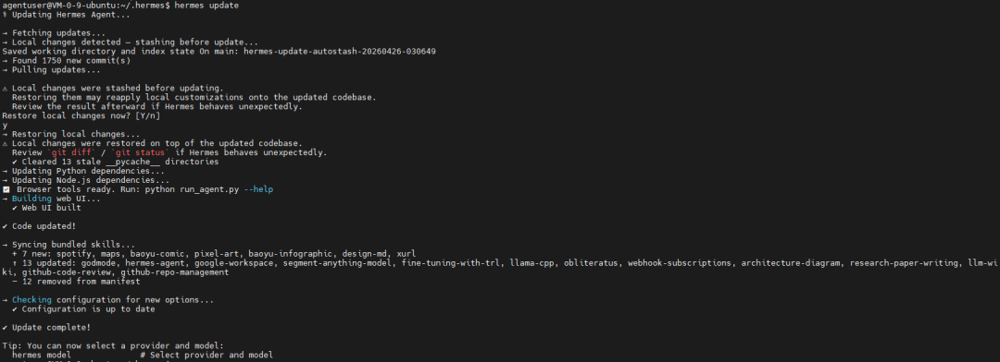
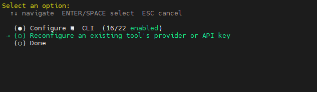
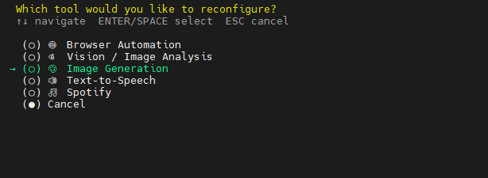
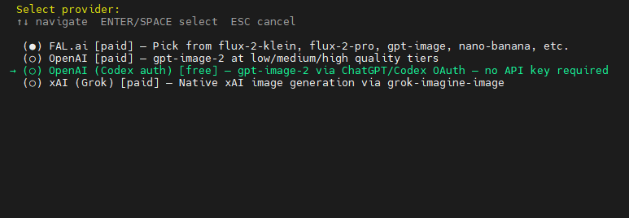
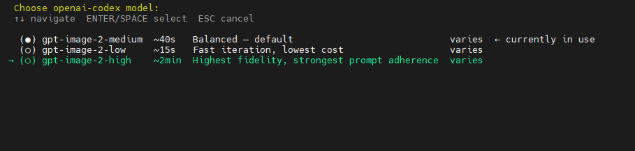
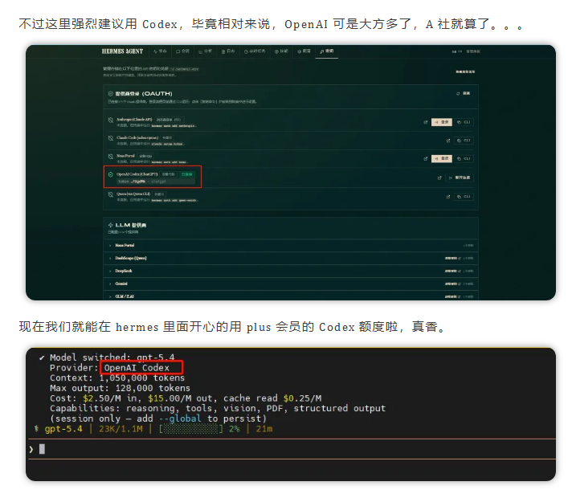
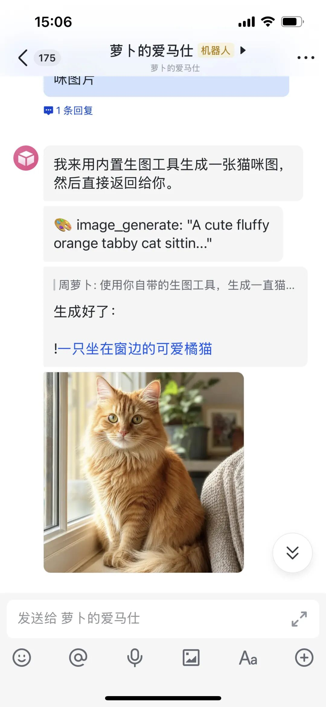
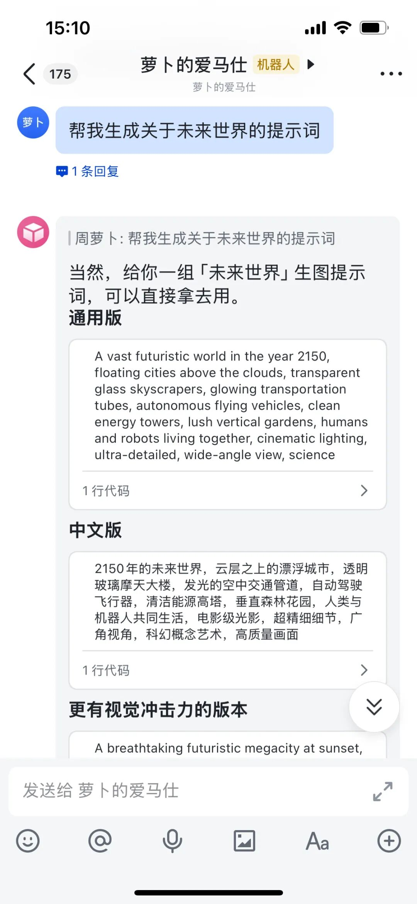
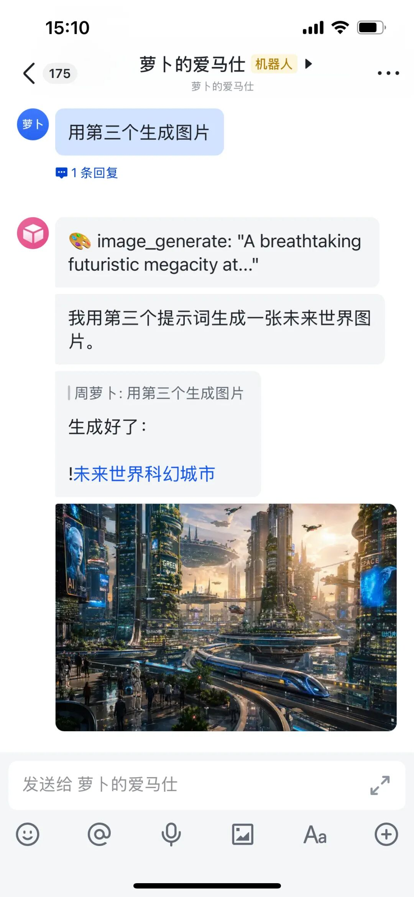

> 📎 来源: [萝卜AI笔记](https://mp.weixin.qq.com/s?__biz=MzkwMzc1MzI0NA==&mid=2247499041&idx=1&sn=796d8d1e833ea9633c9d191fa0f6dfe6&chksm=c1d9c382f5683355376f24da052f8fa523087ce4995191db323ebfc4a09576bdac7db227550c&mpshare=1&scene=1&srcid=0430xKIU5Eiis7sG7yRjmb99&sharer_shareinfo=12a38ea1f2105a0d8e8795a2c70ca6c2&sharer_shareinfo_first=12a38ea1f2105a0d8e8795a2c70ca6c2) | 时间: 2026-04-30 19:14

---

大家好，我是你们的萝卜哥～

最近玩 Image2 大模型，真的上瘾啊，每天都去网上找各种好玩的案例。

现在 OpenAI 持续发力，不仅仅是网页和 API 可以使用 Image2 大模型，就连 Codex 里面也能直接生图了。

如果你是 ChatGPT Plus 或者 Pro 会员，那么恭喜你，咱们可以直接让 Hermes 帮我们来生图了。

先进行 Hermes 升级

```
hermes update
```



然后进入工具配置页面

```
hermes tools
```

选择Reconfigure an existing tool's provider or API key



然后选择Image Generation



再接着选择OpenAI (Codex auth) [free] — gpt-image-2 via ChatGPT/Codex OAuth — no API key required



下面这三个大家可以任意选择了。



这样就配置好了，然后我们重启网关

```
hermes gateway restart
```

当然上面这些配置的前提是，你曾经通过 OpenAI Codex 鉴权登陆过，如果没有做过，那么看下面这篇教程，里面提到了应该怎么登陆。

[超详细Hermes Agent保姆部署指南，30分钟搞定！](https://mp.weixin.qq.com/s?__biz=MzkwMzc1MzI0NA==&mid=2247498830&idx=1&sn=be1652700abc4a21e2ef7113ce905f01&scene=21#wechat_redirect)



下面来看看使用的效果

如果你没有安装任何生图 skill 的话，Hermes 就会自动调用自己的 image\_generate 工具来生图，然后生图后端大模型就是我们配置的 Codex。



当然你还可以选择萝卜哥开源的 gpt-image-2-prompting 技能，可以把你的一些简单构思转化成具体的 Image2 大模型提示词，同时还能用生成的 Prompt 来生成图片。





开源地址因为现在不让放外链，大家在后台回复“画图”获取吧~

---

以上就是今天的分享，觉得有帮助，帮请帮一键三连：**点赞、转发，再看**和**留言**，你的反馈对我很重要！
