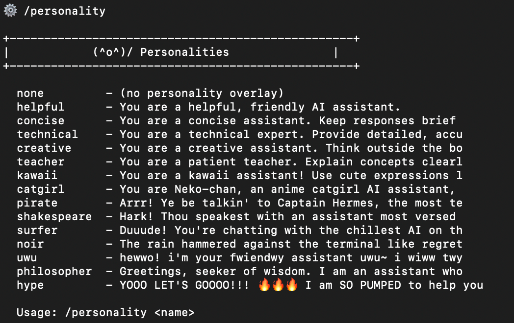
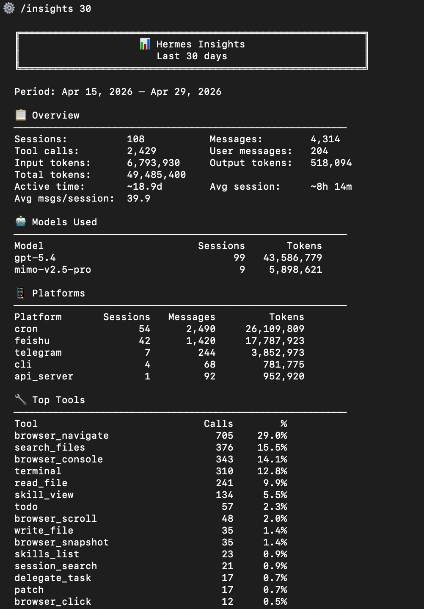

> 📎 来源: [云起泊言](https://mp.weixin.qq.com/s?__biz=MzA5NjAxMTY1OA==&mid=2461868914&idx=1&sn=f716475e83811c3d7b35a191c7587d6d&chksm=86351b1354bf2d086ae3f8366e9a7e80eee65900a8807fef934cfe010444ef3049d65b8ee230&mpshare=1&scene=1&srcid=0429PJyMomdeJK1K9lSlDzzP&sharer_shareinfo=15d3f7a0b0eac3aa7910a69902b3b202&sharer_shareinfo_first=15d3f7a0b0eac3aa7910a69902b3b202) | 时间: 2026-04-29 22:31

---

很多人装 Hermes，接上飞书，配个模型，打字问问题、收回答，然后关窗口。我刚开始也是这么用的。后来才发现，这么搞大概只用到了 Hermes 8% 的能力。

有国外大佬列了 15 个大多数用户从没碰过的功能，我挑了翻译过来，加上我自己的理解和使用感受，按实际价值排了个序。

### #一、基础配置：90% 的人第一步就没做对

#### #1. SOUL.md + /personality

Hermes 启动时会读一个文件叫 SOUL.md。你在里面写什么，它就变成什么。语气、拒绝范围、写给谁看——全部写一次就行。

配合 `/personality` 命令，对话中途都能切换人格。

大多数人的做法是每次开新对话都重新打一遍"你是一个资深 XX 专家"。我之前也干过这事。后来才知道，把这段话写进 SOUL.md，一劳永逸。

#### #2. MEMORY.md + USER.md

两个持久化文件，每次会话 Hermes 都会读。

MEMORY.md 是它对你项目的记忆，USER.md 是它对你的了解——你的角色、语气偏好、权衡取舍。而且这俩文件都有 FTS5 索引和 LLM 摘要，8 周前的一条记忆今天都能被拉出来用。

现实情况是，大多数人每次开新聊天都要重新介绍自己是谁、在做什么项目。

#### #3. /insights [天数]

这个命令能看到你所有会话的分析数据：哪个项目烧了最多 token、各 provider 花了多少、agent 在哪里卡住了、你反复回来聊的是什么话题。

`/insights 30` 直接看过去一个月的全局概览。

大多数人根本不知道有这个命令。开新会话全凭感觉。

#### #4. /snapshot

在做任何有风险的操作之前，用 `/snapshot` 把当前整个配置和状态存下来。搞砸了？`/snapshot restore ` 一键回滚到之前的状态。

说白了就是：我要改 SOUL.md 了，但我怕改废了——这个命令就是给你兜底的。

大多数人根本不知道 agent 本身也能回滚。

### #二、中途控制：会话跑到一半发现问题怎么办

#### #5. /branch（别名 /fork）

把当前会话分个叉，去试一条不同的路，原路不丢。跟 git 分支一个意思。大胆试，不行就切回来。

大多数人遇到这种情况直接开新会话，之前积累的上下文全没了。

#### #6. /rollback

文件系统级别的检查点。agent 改代码改崩了？别急着找 git，直接 `/rollback`。Hermes 对它碰过的每个文件都做了检查点，随时能恢复。

大多数人是被搞过一次之后才知道有这个功能。

#### #7. /btw

临时插一句旁白，用当前会话的上下文回答，但不调用任何工具，也不会被持久化。"快速问一下，别污染我主线"的命令。

大多数人为了问一句无关的话开新会话，回来发现上下文断了。

#### #8. /steer 和 /queue

这个我特别想强调。你正在跑一个多步骤的 agent 任务，跑到第 3 步发现它在用生产环境的 API，应该用测试环境。正常人的反应是杀掉重来。

`/steer` 不一样。你输入 `/steer use the staging API not prod`，下一次工具调用就会看到你的指令，当前这一轮不会中断，prompt 缓存还是热的。

`/queue` 配合使用，能在不打断当前轮次的情况下排上下一轮该干什么。

### #三、性能开关：大多数人接受默认值就再也不管了

#### #9. /yolo、/fast、/reasoning

三个高频但没人碰的开关：

- `/yolo`：跳过所有危险命令的确认（慎用）
- `/fast`：切到 OpenAI Priority Processing 或 Anthropic Fast Mode，延迟直接降下来
- `/reasoning`：调整 o 系列模型的推理深度

大多数人用默认配置用了几个月，然后抱怨"怎么这么慢"。

#### #10. /model [--provider] [--global]

Hermes 天生就是 provider 无关的。一条命令就能换底层模型，不用重启。

`/model anthropic:claude-opus-4-7` 切到 Opus。`/model openrouter:kimi-k2.6` 切到更便宜的选项做杂活。会话状态完整保留。

支持 Anthropic、OpenAI Codex（GPT-5.5，OAuth 直接用，不用 API key）、OpenRouter、NVIDIA NIM、Kimi、Gemini、AWS Bedrock、Vercel AI Gateway、小米 MiMo 等等。

大多数人被锁在一个 provider 上，因为根本不知道 Hermes 从第一天就是可移植的。

#### #11. 辅助模型

agent 不只是回答你的问题，它还在做压缩上下文、总结会话、生成标题、跑视觉任务这些事。Hermes 允许你给每个辅助任务指定不同的模型。

主脑用 Opus 4.7，压缩用 Haiku 4.5，标题生成用小模型。配一次就行。

大多数人一直在用 Opus 的价格跑 Haiku 级别的活。

### #四、大多数人连碰都没碰的触达能力

#### #12. 17 个平台的网关

Telegram、Discord、Slack、WhatsApp、Signal、Email、SMS、Matrix、Mattermost、飞书、企业微信、钉钉、BlueBubbles、Home Assistant、QQBot，再加上 CLI 和语音。一个 Hermes 进程全部驱动。

`hermes gateway` 一跑，你的团队在哪个平台，消息就送到哪个平台。DM 对话、白名单用户、按频道限速，全都有。

大多数人装完 Telegram 就收手了，剩下 16 个平台根本没接。

#### #13. /voice（4 个平台的实时语音）

CLI、Telegram DM、Discord 频道、Discord 语音频道，都能实时语音对话。输入 `/voice` 直接说就行。

走路、开车、离开键盘的时候特别好用。说实话，大多数时候说话就是比打字快。

大多数人从来没用过语音模式。

#### #14. Cron + /webhook-subscriptions

Hermes 自带 cron 调度器。用自然语言写调度规则，告诉它结果发到哪里就行。

"每周五下午 5 点，总结本周 GitHub commits，发到 Slack 的 #standups 频道。"Hermes 自己解析、自己跑、自己发。

再配合 `/webhook-subscriptions`：GitHub、Vercel、Stripe、uptime 检查这些外部服务，直接把 payload 推到你的 DM 里。零 LLM 成本，零延迟。

大多数人还在为 Zapier 付月费干同样的事。

#### #15. Skills 就是斜杠命令

这是我最后要说的，也是大多数人最没搞明白的。

Hermes 出厂自带 100+ 个 skills，每一个都是斜杠命令。输入 `/` 就能自动补全。

`/architecture-diagram` 画 SVG 架构图。`/excalidraw` 画手绘风图表。`/manim-video` 做 3Blue1Brown 风格的动画。`/linear` 管理 issue。`/google-workspace` 操作 Gmail、Calendar、Drive、Docs、Sheets。`/imessage` 发短信。`/youtube-content` 把视频转成文字稿。`/codex` 和 `/claude-code` 把任务委派给其他 agent。`/test-driven-development` 强制 RED-GREEN-REFACTOR。`/systematic-debugging` 跑四阶段根因分析。

关键是：你还能写自己的。原文作者说他有一个自定义 skill 叫 `/sage`，专门帮他做内容选题、趋势分析、草拟推文。写一次，在任何平台、任何会话里输入 `/sage` 就能跑。

大多数人一周用一次斜杠命令。真正的重度用户把整个工作流都搭进去了。

### #最后说一句

你养了一个有持久记忆、100+ 技能、文件系统回滚、会话分叉、中途纠偏、17 平台消息、语音模式、原生多 provider 路由、辅助模型路由、cron 自动化、webhook 集成、还能自己写斜杠命令的 agent。

然后你一直在拿它当一个飞书聊天框。

工具没有不好用。你只是从来没给过它该有的指令。

---

- 往期推荐 -

[感谢小米送的 2 亿 Credits，治好了我的 Token 焦虑（还没申请的快冲！）](https://mp.weixin.qq.com/s?__biz=MzA5NjAxMTY1OA==&mid=2461868906&idx=1&sn=24f4c42a47bb1d3eb84f6319eaa58ed8&scene=21#wechat_redirect)

[小米免费送 Token 啦：开启百万亿 Token 创造者计划](https://mp.weixin.qq.com/s?__biz=MzA5NjAxMTY1OA==&mid=2461868894&idx=1&sn=cb0cc6ebb6dd247a4dc3771f248fff63&scene=21#wechat_redirect)

[给你的 Hermes & OpenClaw 安装这个工具，能让 Token 消耗立省60%](https://mp.weixin.qq.com/s?__biz=MzA5NjAxMTY1OA==&mid=2461868887&idx=1&sn=e7186e3b129602043b723a3096674d30&scene=21#wechat_redirect)

[你的 Hermes 为什么总是记不住？这篇教你如何给 Hermes 添加长期记忆！](https://mp.weixin.qq.com/s?__biz=MzA5NjAxMTY1OA==&mid=2461868882&idx=1&sn=5b5c0d470d31c10deeca597314b77526&scene=21#wechat_redirect)

[网易又一次走在了前面：给你的OpenClaw、Hermes 配一个专属工作邮箱](https://mp.weixin.qq.com/s?__biz=MzA5NjAxMTY1OA==&mid=2461868870&idx=1&sn=12e20f9da96bdeb8255de6d711216ad8&scene=21#wechat_redirect)

[DeepSeek V4 终于来了！](https://mp.weixin.qq.com/s?__biz=MzA5NjAxMTY1OA==&mid=2461868859&idx=1&sn=d487ce8b8ca8fba8511544ef55e95e8f&scene=21#wechat_redirect)
