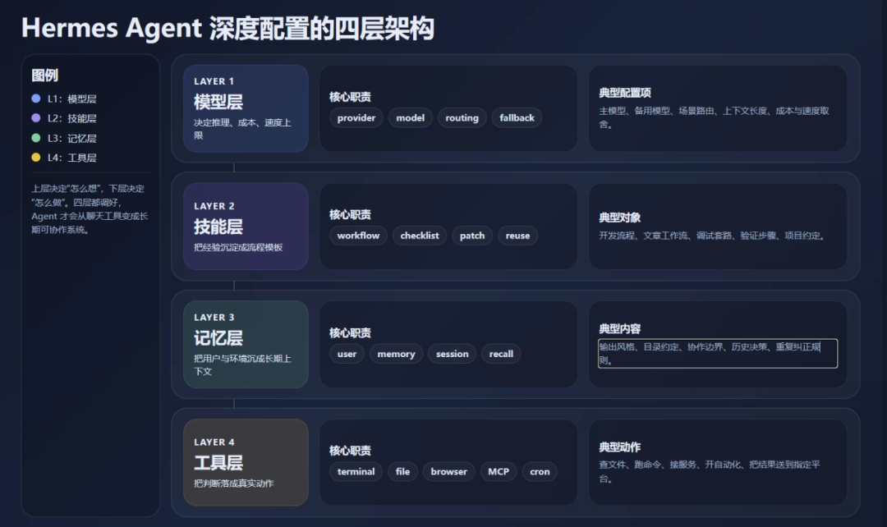
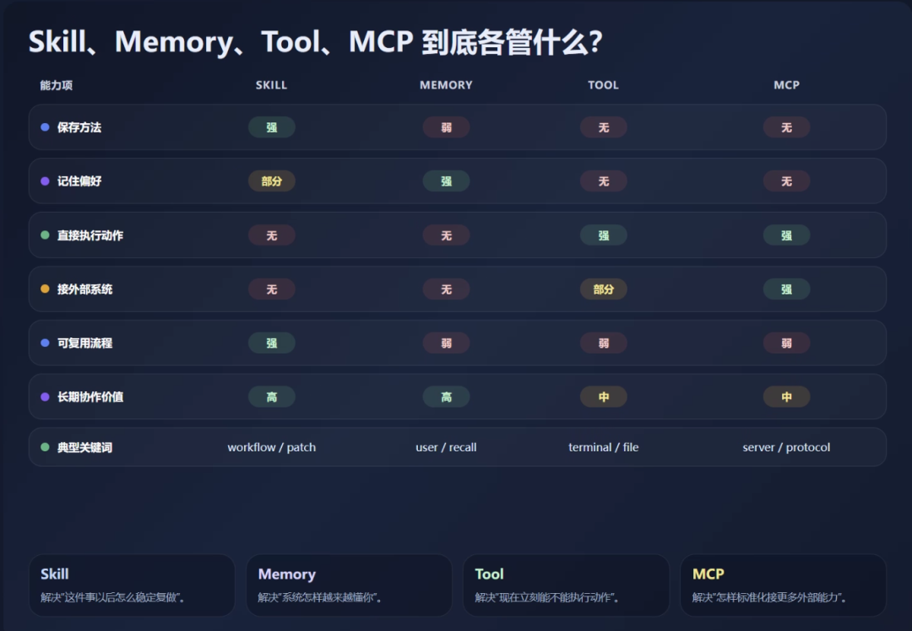
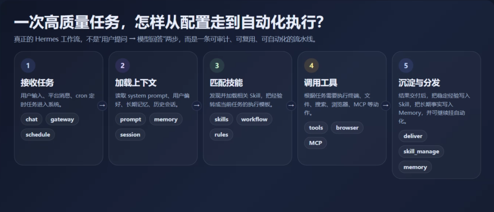

> 📎 来源: [技术传感器](https://mp.weixin.qq.com/s?__biz=Mzg4MDU1MTg0Ng==&mid=2247484303&idx=1&sn=dfbd9d961ad6a870c050c459917f3a83&chksm=ce79a1f52592b636525546698c09f412e2acf83623891640f7aafeb4b45e79a126a74a7acef4&mpshare=1&scene=1&srcid=04201evVakmKEkdo5OsrjufM&sharer_shareinfo=c43ebebd9322a1383842d18f4b6eb505&sharer_shareinfo_first=c43ebebd9322a1383842d18f4b6eb505) | 时间: 2026-04-20 00:06

---

# Hermes Agent 深度配置指南：从“装好了”到“超好用”，四步调教你的自进化 AI

很多人装完 Hermes Agent 的第一反应都差不多：能跑，能聊，也能调几个工具，看起来已经挺强。

但说实话，这还只是“装上了”。离“好用”，甚至离“离不开”，中间还隔着一整套配置工作。

因为 Agent 真正的门槛，从来不是安装，而是配置。

你不配模型，它就不知道什么时候该更聪明，什么时候该更省钱。你不配技能，它每次都像第一天上岗。你不配记忆，它聊完就忘。你不配工具，它再会说，也很难真正把事情做下去。

所以我只讲一个核心问题：**怎么把 Hermes 从“装好了”调成“超好用”。**

我们拆四步：模型配置、技能优化、记忆强化、工具扩展。你把这四步调顺了，Hermes 才会开始真正“长脑子”。



---

## 一、喂对“大脑”：模型配置决定它的上限

很多人刚装完 Hermes，就随便接一个模型先用。这样不是不行，但通常也意味着：你从第一天起，就把它限制在一个不太合适的工作状态里。

原因很简单。Hermes 是 Agent，背后接什么模型，直接决定它的思考质量、执行风格和成本曲线。

有的模型适合代码和复杂推理，有的模型更适合日常对话和写作，有的便宜但不够稳，有的贵一些，但能在关键任务里帮你省掉大量返工时间。

所以第一步不是问“最强模型是谁”，而是问：**什么任务，应该喂什么大脑。**

### 1. 新手先跑 `hermes setup`

如果你是第一次上手，最省事的入口还是：

```
hermes setup
```

它会帮你把常用模型、provider、密钥等基础项过一遍。它的价值不是“神奇优化体验”，而是先把容易踩坑的配置项拉平。对刚安装的人来说，这一步足够把 Hermes 从“能启动”推进到“能正常工作”。

### 2. 想真正用顺手，就改 `config.yaml`

等你开始认真用 Hermes，就不能只靠向导了。真正决定长期体验的是：

```
~/.hermes/config.yaml
```

这里是 Hermes 的控制中枢。你可以在里面配置默认模型、默认 provider、平台行为、工具开关、展示风格，以及不同工作场景下的偏好策略。

很多人觉得自己在“用 Agent”，其实只是一直在吃默认配置。结果就是工具不少，体验却始终不够贴手。

问题不是 Hermes 不够强，而是你根本没给它匹配工作模式。

### 3. 密钥统一放进 `~/.hermes/.env`

这条是硬建议：**密钥别写进 

```
config.yaml
```

。**

所有敏感配置尽量放进：

```
~/.hermes/.env
```

这么做有四个直接好处：

- 更安全
- 更容易迁移
- 不容易误提交到仓库
- 多 provider 管理更清楚

```
config.yaml
```

 负责行为，

```
.env
```

 负责凭证。边界越清晰，后面接更多能力时越省事。

### 4. 别死守一个模型，要学会按任务切换

真正把 Hermes 用顺的人，通常不会绑定单一模型。

常见搭配思路其实很朴素：

- **代码、排错、长链任务**

  ：上强推理模型
- **日常对话、一般写作**

  ：上通用模型
- **成本敏感、批量任务**

  ：上便宜模型或国产聚合

如果 CLI 已经支持模型切换，那就应该把它变成日常动作，而不是一次性决定。

```
hermes model
```

这一步的本质，不是折腾参数，而是让 Hermes 具备“按任务换脑子”的能力。

**模型配置决定的不是小体验，而是智商上限。**

---

## 二、养好“技能库”：让 Agent 不只是会聊，还会干活

如果说模型是大脑，那 Skill 更像经验。

很多人第一次看到 Skill，会把它理解成“提示词模板”。这理解太浅了。一个好的 Skill，本质上更像是一份沉淀下来的工作方法：它知道什么情况下该触发，按什么步骤做，哪些坑要避开，最后怎么验证结果。

换句话说，**Skill 是 Hermes 从“临场发挥”走向“形成套路”的关键。**

### 1. 为什么 Skill 比你想象中更重要

没有 Skill 的 Agent，每次都像在重新做入职培训。

它也许能答对，但它不一定知道你习惯怎么做，不一定知道哪条路径踩过坑，也不一定知道哪些步骤其实早就验证过。

一旦有了 Skill，情况就不一样了。以前跑通过的方法，可以直接复用。以前踩明白的坑，可以直接绕开。以前用户纠正过的口径，可以直接内化成默认规则。

这就是“越来越顺手”的来源。

### 2. 哪些任务最值得沉淀成 Skill

一般来说，这几类任务特别值得沉淀：

- 复杂任务，调用了很多工具
- 从错误里恢复出来的任务
- 用户纠正过路径或标准的任务
- 非标准流程但最终跑通的任务

判断标准很简单：**如果你不想下次再解释一遍，这件事就值得沉淀。**

### 3. 手动补 Skill，才是真正的个性化调教

除了自动沉淀，你也可以主动给 Hermes 补一套专属技能。

比如你有固定的写稿流程、提测流程、代码评审口径、日报格式，完全可以手动建立 Skill，让 Agent 以后优先按你这套方法做。

这一步的价值很大。因为你不是只在“教它做一次”，而是在“设定它以后默认怎么做”。

### 4. Skill 不是静态说明书，它应该会被修

很多人担心 Skill 会过时。这个担心是对的。

但关键不在于会不会过时，而在于会不会维护。如果一个 Skill 里的命令已经变了、路径已经变了、工具行为已经变了，那它就应该被 patch。只有这样，技能库才不是越积越旧的文档堆，而是一套持续可用的方法资产。

### 5. 你的 Skill 库，本质上是私有工作方法库

本地技能一般都在：

```
~/.hermes/skills/
```

这里真正存下来的，不是“花哨功能”，而是你一点点喂给 Hermes 的经验。

聊天记录会翻过去，但技能库会留下来。**你以后越依赖 Hermes，越会发现真正值钱的是这套方法沉淀，而不是某一轮漂亮回答。**



---

## 三、强化“记忆力”：让对话不再反复重来

再强的模型，如果每次聊天都像第一次见面，体验一定打折。

这也是很多 Agent 产品最容易让人出戏的地方：昨天刚教过，今天又忘；上周才定过规则，这周还得重新说。

如果一个助手不能积累对你的理解，它最多只能做到“这一轮回答还不错”，做不到“长期协作越来越懂你”。

Hermes 值得深配的一点，就在于它不只做会话上下文，还在往长期记忆体系走。

### 1. 记忆不是一个桶，而是分层系统

把 Hermes 的记忆粗略拆开，可以理解成五层：

- **会话内记忆**

  ：当前任务上下文
- **技能记忆**

  ：复杂任务沉淀出的复用方案
- **检索索引**

  ：知道什么时候去找已有 Skill 和规则
- **用户画像**

  ：知道你是谁、喜欢什么、忌讳什么
- **全文检索**

  ：能从历史对话里把相关上下文翻出来

这五层叠起来，Hermes 才不像普通聊天机器人。否则它永远只能做到“当前这一轮看起来挺聪明”。

### 2. 装长期记忆插件，是让它跨天可用的关键一步

如果你想让 Hermes 真正变成跨天、跨设备、跨任务的助手，只靠短期上下文通常不够。这时候可以考虑补上长期记忆能力，比如安装相关插件：

```
pip install plur-hermes
```

这一步的价值，不是多几个命令，而是把“记忆”从模糊体验，变成可操作、可维护、可检索的资产。

### 3. 记忆系统一定要能增删查

一个能长期用的记忆系统，至少得解决三件事：

- 该记住什么
- 需要时怎么找回来
- 过时内容怎么删掉

对应常见能力就是：

- ```
  plur_learn
  ```

  ：存偏好、规则、经验
- ```
  plur_recall
  ```

  ：按需搜索
- ```
  plur_forget
  ```

  ：删除过时内容

注意重点不是“存得越多越好”，而是“存得够准”。

比如这些内容就特别关键：

- 你偏好短句还是长句
- 你默认用中文还是英文
- 你有哪些高风险动作必须先确认
- 你的项目目录习惯是什么
- 你对文章、代码、自动化分别有哪些硬要求

这些一旦记准，Hermes 的手感会明显不一样。因为它不再靠猜，而是靠已知偏好给答案。

### 4. 长期记忆的真正价值，是少解释、少返工、少重教

周一教过的事，周二还记得；换个设备，习惯还能延续；过一阵子重新开话题，它还能找回以前的约定。

这会带来一个很实在的变化：

**你和 Agent 的关系，不再是每次新开对话都重新 onboarding，而是进入持续协作。**

所谓“越用越聪明”，本质上不是模型自己进化，而是你把长期记忆体系搭起来了。

---

## 四、装好“工具箱”：别让 Hermes 停留在只会回答

很多 AI 助手看起来很聪明，但一碰到真活就露馅。

它能分析，能总结，能给建议，却不能真正把事做下去。原因也很简单：没有工具，或者工具没配好。

而 Hermes 跟普通聊天机器人的真正分野之一，就在这里。它不是只负责“生成文本”，而是可以通过工具直接介入任务。

**能调用工具的 AI，和只能聊天的 AI，本质上不是同一类产品。**

### 1. 先把内置工具按需打开

Hermes 通常带一批内置工具。不是所有都要全开，但你至少得知道哪些和你的工作相关。

常见方向包括：

- 文件读写
- 代码执行
- 终端命令
- 网页抓取
- 浏览器操作
- 搜索
- 定时任务
- 委派子代理
- 记忆管理

一般可以通过类似下面的方式集中管理：

```
hermes tools
```

别小看这一步。工具没开，很多你以为它“应该会”的能力，其实根本不可用。

### 2. Skill 和 Tool 怎么选

这是很多人最容易混的一点。

一个简单原则：

**能靠规则、流程、提示和命令组合解决的，优先做 Skill。**
**必须靠程序能力、API 能力、系统级能力解决的，再做 Tool。**

适合写 Skill 的场景：

- 主要是工作方法复用
- 不需要很深的程序接入
- 更强调步骤、规则和验证口径

适合加 Tool 的场景：

- 需要 Python 或系统级能力
- 需要稳定参数化调用
- 需要访问外部 API 或本地能力
- 需要让 Agent 真正多出一个“动作接口”

别一开始就急着造工具。很多事情其实先写 Skill 更划算。

### 3. 自定义 Tool 的意义，不是炫技，是打通工作流

真正值得做成 Tool 的，通常不是“看起来很酷”的功能，而是你今天已经在反复手动做的动作。

比如：

- 查询内部服务状态
- 拉固定格式的数据
- 调公司自有接口
- 触发某个自动化流程
- 处理某类固定格式文档

一旦这些动作被 Hermes 稳定接进来，它就不只是一个“会提建议”的助手，而是一个“能把流程往前推”的执行节点。

### 4. 别忽视 MCP，它是能力外延的关键口子

如果你不想从零造一堆 Tool，更现实的路线通常是接 MCP。

MCP 可以理解成一套让 Agent 连接第三方能力的标准接口。它最大的价值，不是又多一个协议，而是把“接更多工具”这件事标准化了。

常见入口类似：

```
hermes mcp add
```

一旦这条链路打开，Hermes 的边界就不再只取决于它内置了什么，而取决于你愿不愿意把更多外部能力接进来。



---

## 五、定制“人设”与自动化：让它懂规矩，也能自己干活

前面四步解决的是能力。真正把 Hermes 调到“像你的人”，还差最后两件事：

- 说话有边界
- 工作有节奏

也就是：**人设**和**自动化**。

### 1. 人设文件不是装性格，而是统一行为风格

很多人一提到人格文件，就以为是在做花活。其实不是。

像 

```
SOUL.md
```

 这类文件，真正的价值不是让 Agent 变得更会表演，而是让它长期保持一致的行为方式。

你完全可以在里面规定：

- 默认说话风格
- 回答长度偏好
- 角色定位
- 哪些语气和表达要避免
- 哪些行为属于高风险，必须先提醒

它本质上不是文学设定，而是**长期协作规则文件**。

一旦这层稳定下来，Hermes 的输出就不会今天一套、明天一套。对于内容创作、代码协作、跨设备使用，这一点都很重要。

### 2. 定时任务，是 Agent 从“被动响应”走向“主动工作”的分界线

如果一个 Agent 只能等你来问，它仍然只是个被动工具。只有当它开始定时执行任务，它才算真正进入“替你工作”的状态。

比如：

- 每天早上发技术晨报
- 每周生成项目周报
- 定时抓行业新闻
- 周期性拉接口数据
- 固定时间提醒关键动作

这些一旦跑顺，你对 Hermes 的感受会明显变化：它不只是一个能聊天的程序，而是一个真正参与日常工作节奏的助手。

### 3. 网关接入，决定它是不是“随时随到”

最后一步，是把 Hermes 从本地终端里放出来。

如果它只能在某台电脑、某个命令行里用，那它的使用频率天然受限。把它接进微信、飞书、Telegram 这类网关之后，它才会从“开发环境工具”变成“随时可调度的助手”。

这个变化非常现实：

- 你想到事，就能立刻发给它
- 你不在电脑前，也能让它查、写、跑
- 自动化结果可以直接推送到常用渠道
- 你不需要回到终端，才能把任务交给它

到这里，Hermes 才算真正融入你的工作流。

---

## 结语：Hermes 最值钱的，不是聪明，而是可进化

Hermes 最吸引人的地方，其实不是它接了多少模型，也不是它带了多少工具。

真正值得投入的，是它的可进化性。

你今天调好的模型，会决定它以后遇到不同任务时怎么切脑子。你今天沉淀下来的 Skill，会决定它以后少走多少弯路。你今天补起来的记忆系统，会决定它未来到底懂不懂你。你今天接通的工具和自动化，会决定它是不是只能“会说”，还是已经开始“会做”。

所以 Hermes 最该花时间的，从来不是安装，而是调教。

你调得越细，它越像你的助手。它越像你的助手，你就越难回到那个“每次都得重新解释一遍”的阶段。

**安装，只是出生。配置，才是真正让它长脑子的过程。**

你现在的 Hermes，停留在“装好了”，还是已经开始“超好用”了？
