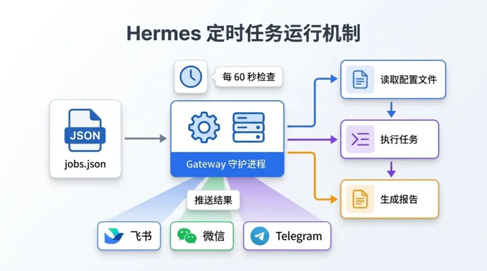
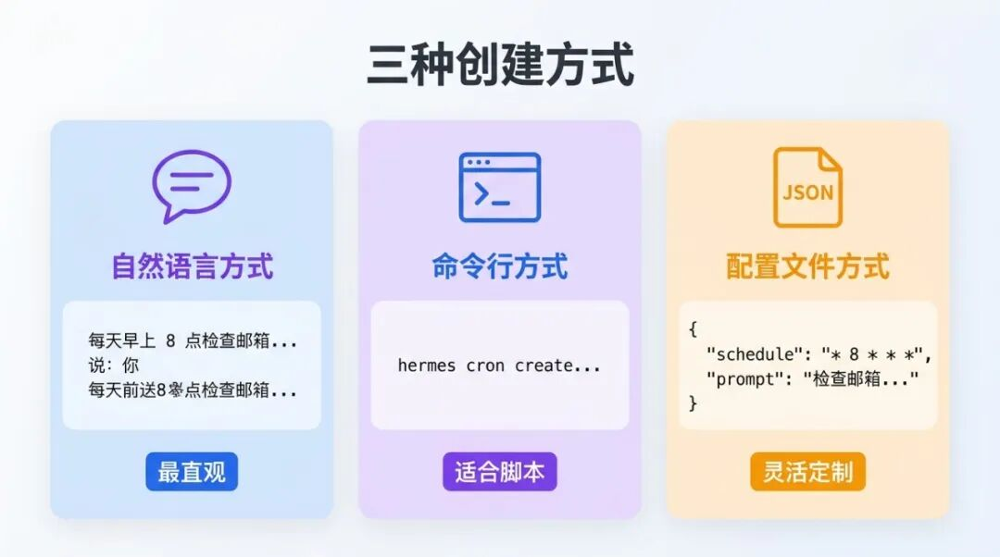
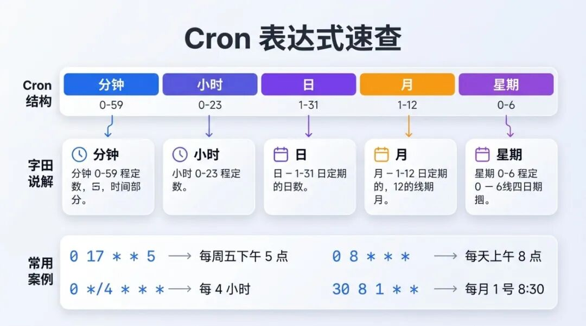
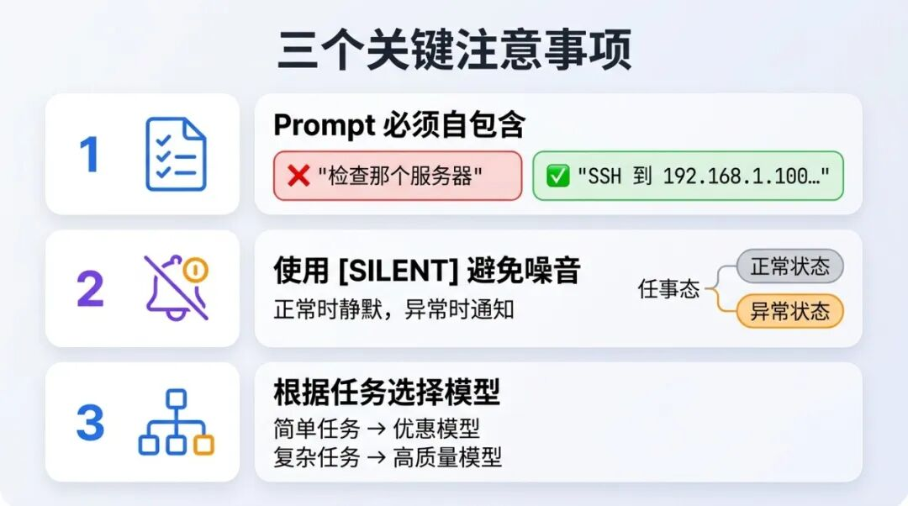

> 📎 来源: [Colin的AI指南](https://mp.weixin.qq.com/s?__biz=MzUxNzE2NTU5MQ==&mid=2247483758&idx=1&sn=d2d6cedd9a313432edec2114e891722d&chksm=f86a07068b4e06a6f81ec8fc4dcf8891c4202567d6d4b0e0bcddc883f047d9c6258401855e90&mpshare=1&scene=1&srcid=0423t5gn9IwbkO6FmZUpFBL6&sharer_shareinfo=b28cfd269719481091449da5fb0d2c27&sharer_shareinfo_first=b28cfd269719481091449da5fb0d2c27) | 时间: 2026-04-23 22:37

---

在上一篇文章中，我们讨论了如何在本地安装部署 Hermes Agent，今天我们继续讨论下：怎么更好地使用 Hermes。

相信很多人跟我一样，使用 Hermes 或者 OpenClaw 的时候，经常会用到的一个场景就是：设置定时任务，让 Hermes 或者 OpenClaw 定时的处理一些工作内容或者任务，完成任务之后再通知我们，这就是定时任务。

这篇文章，我们一起来看看，什么是 Hermes 定时任务的正确打开方式。

## Hermes 的定时任务是怎么运行的？

在开始实际的使用前，我们先来了解一下 Hermes 的定时任务是怎么运作的：

Hermes 提供了一个内置的 Cron 调度器，允许 Agent 在后台"无人值守"地运行任务，并将结果推送到任何集成的通讯平台（如 飞书、微信、Telegram、Discord 等），支持我们通过自然对话或者修改配置文件来设定及处理定时任务。

定时任务的执行由网关（Gateway）守护进程处理，每 60s 会触发一次检查，判断定时任务是否需要执行，如果有需要执行的定时任务，就进行处理。 

所有的定时任务都保存在 ~/.hermes/cron/jobs.json 文件下，你也可以在 Hermes 最新的 web UI 中查看。



## 三种使用方式

介绍完了运行机制，那具体怎么使用定时任务呢？

Hermes 的定时任务，支持三种创建方式，适合不同的人群和使用场景：

### 1. 自然语言（最直观）

使用自然语言和 Hermes 对话，是最为简单也是最为直观的创建方式，你可以直接跟 Hermes 说：

"每天早上 8点检查一下邮箱中最新的邮件，并且筛选出有价值的邮件，汇总结果发送到我的飞书"

Hermes 会自动理解并创建对应的定时任务。

### 2. 终端命令行（CLI）对话

如果你更习惯使用终端命令行设置任务，也可以试着在终端中执行这些命令：

```
hermes cron pause <job_id
```

这时候你会发现，在这个命令中，出现了 Skill 的字样：这是因为，Hermes 的定时任务中，支持添加不同的 Skill，如果有多个 Skill ，还可以按顺序执行。

也就是说，如果我们有一个"整理每日会议纪要"的 Skill ，同时有一个"将整理结果输出为 PPT"的 Skill , 我们可以在一个定时任务中同时添加这两个 Skill，实现"先整理 - 后输出为 PPT"的整个业务流程，不用拆分等待第一个任务完成后再开始执行第二个任务。

### 3. 修改 ~/.hermes/cron/jobs.json 文件

当然，你也可以像修改 Hermes 的模型配置一样，直接修改定时任务的配置文件进行修改，比如我们可以添加这样的代码实现收集 AI 新闻并整理的任务：

```
{
```



这里又有几个小Tips：

1. 这个 .JSON 文件中的 schedule 格式很奇怪，代表什么意思呢，其实这个是 Cron 中关于时间的表达式，一共由 5 个部分组成，使用空格分隔，分别代表分钟（值 0-59）、小时（值 0-23）、日（值 1-31）、月（值 1-12）、星期 （值 0-6，0代表周日）。

如果想要描述： 

- 每周五下午5点，Cron 表达式就是 ：0 17 \* \* 5

- 每4小时，Cron 表达式就是：0 \*/4 \* \* \*

- 每天上午8点，Cron 表达式就是： 0 8 \* \* \*

- 每月 1 号 8:30，Cron 表达式就是：30 8 1 \* \*

所以，每个工作日 9:00 以及 每半小时，你知道怎么使用 Cron表达式 书写么？



2. 第二个小技巧就是，Hermes 的定时任务可以指定完成的模型，比如这个任务很简单，你可以指定费用比较低的模型完成，如果任务复杂度比较高，可以指定更为高级的模型进行处理，避免无效的 Token 消耗。

3. 可以指定消息发送的平台，可以给已经对接的所有消息平台都可以进行结果发送。

## 使用注意点

通过上边的总结，你大概已经了解了 Hermes 的定时任务，在实际使用的过程中，我们还需要注意几个细节：

### 1. 定时任务的 Prompt 中必须自包含

定时任务是在全新的会话中进行的，不能引用之前的对话：

就比如，你不能这么设置定时任务："帮我定时检查那个文件"，虽然在前面的对话中我们讨论了这个文件，但定时任务不知道如何处理；

正确的用法是：“检查 C:\Users\admin\Desktop\001.xlsx 文件，在今晚20点汇总一份结果给我 。”

### 2.灵活使用[SILENT]避免噪音

如果涉及到监控类的任务，可以使用 SILENT，只有出现异常时才通知：

```
如果一切正常，只回复 [SILENT]。
```

```

```

### 3. 根据任务选择模型

简单任务用优惠模型，复杂任务用高质量模型，这才是使用的正确方式。



## 还有一些，你可能会用到

1.所有定时任务的输出，都会保存在这个路径下，就算任务交付失败，也能在本地找到完整输出：~/.hermes/cron/output/{job\_id}/{timestamp}.md。

2. 使用 hermes cron list ，可以查看所有任务状态。

如果你想让 AI 真正成为你的"数字助理"，而不只是一个聊天工具，Hermes Agent 的定时任务是一个很好的起点，不妨尝试一下。

如果觉得文章有用，欢迎点个"关注"和“分享”，我们下篇文章再见 。
