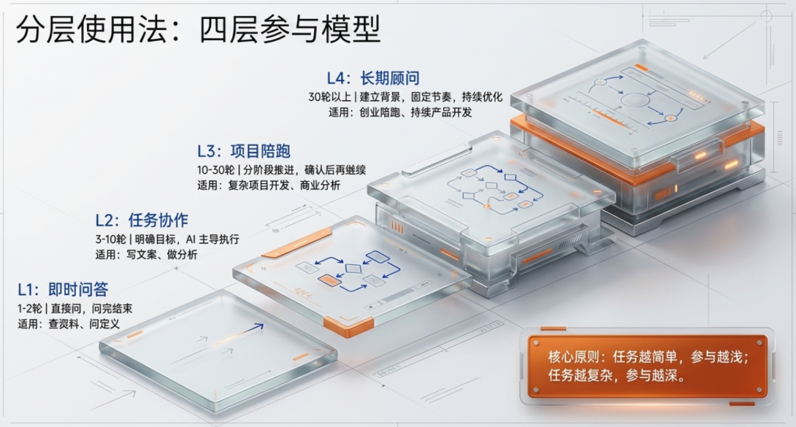
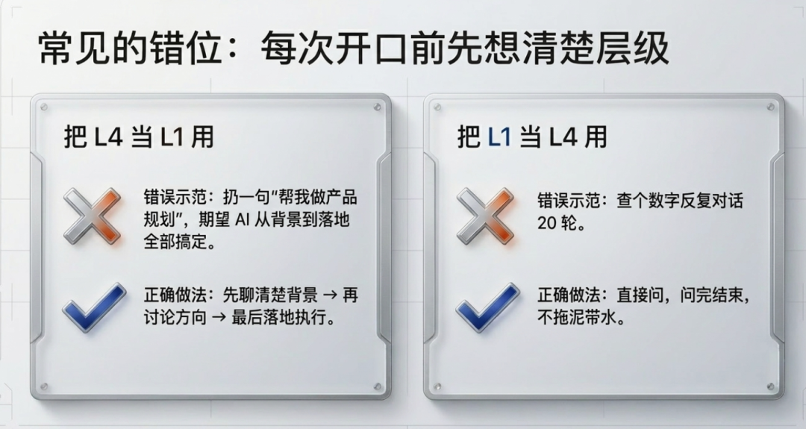
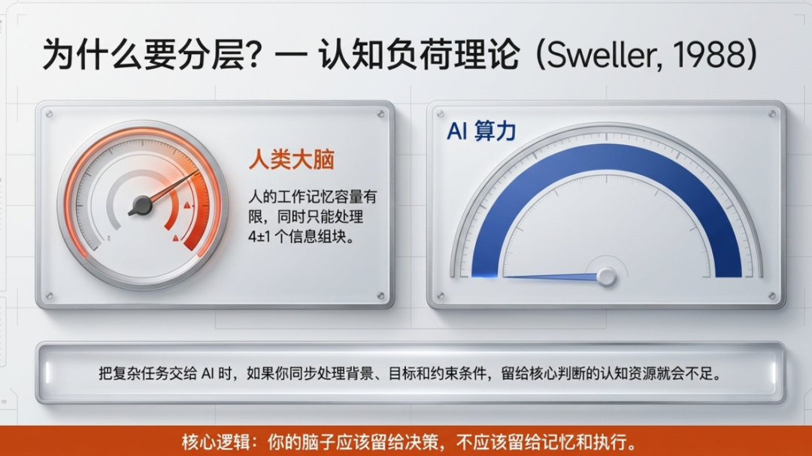
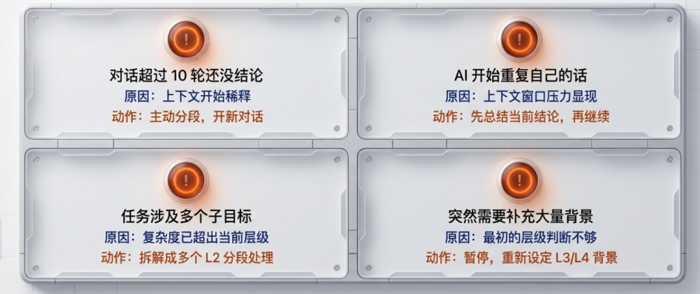
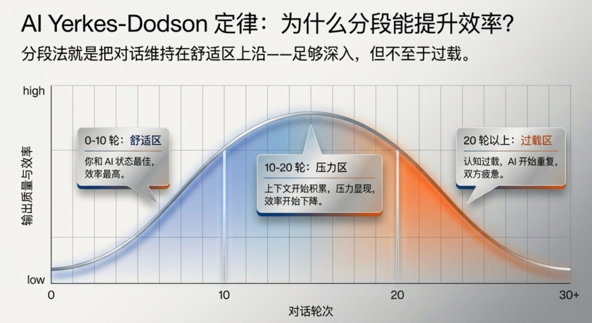
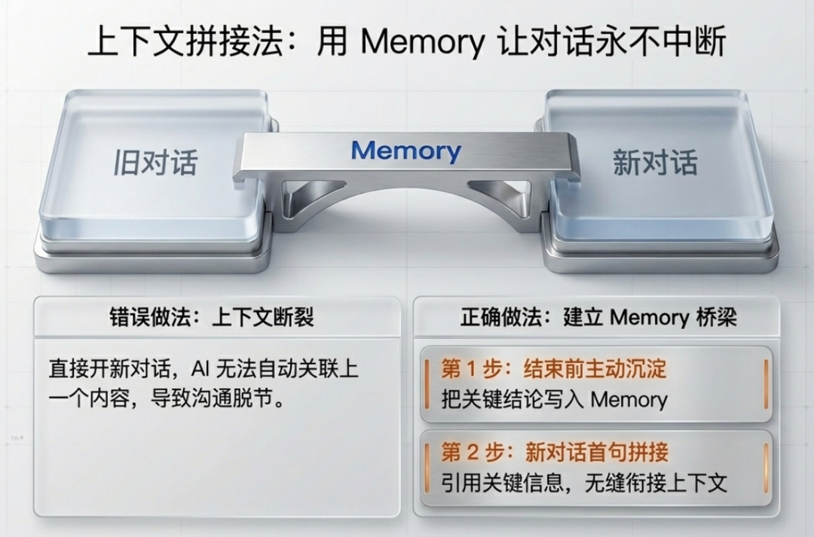
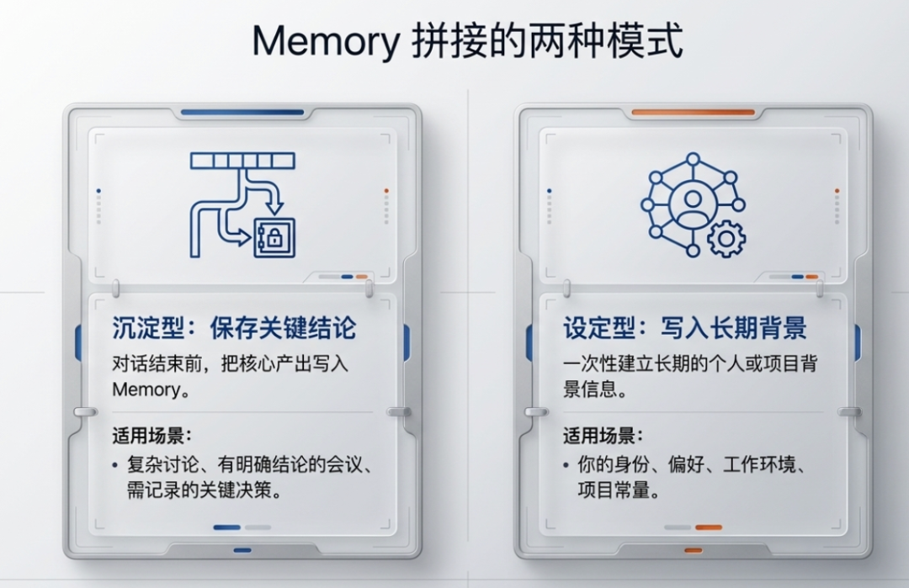
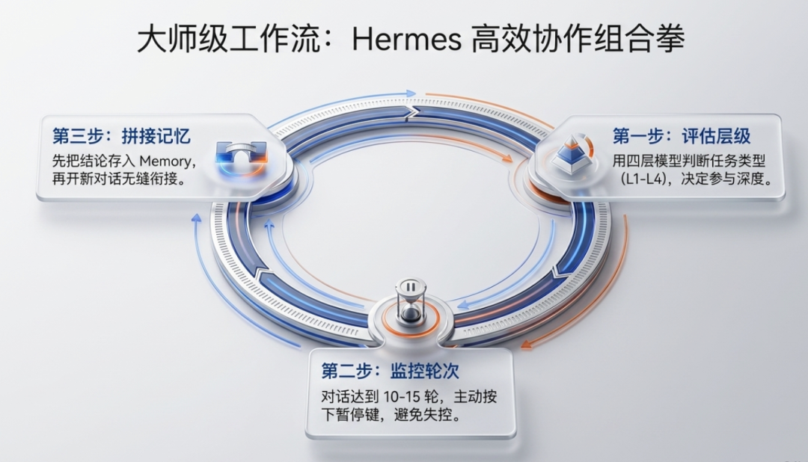

> 📎 来源: [斐哥讲AI](https://mp.weixin.qq.com/s?__biz=MzYzNTg3NTM2NA==&mid=2247483795&idx=1&sn=e5bd3fc3ab8707644bab3f29a7d6812e&chksm=f122f04e688870d980ab180ad2c6f52d43bae990289aa5baebf9045c3dba2288c27e438043cb&mpshare=1&scene=1&srcid=042422dgkeJm6y4rFeUfIQpF&sharer_shareinfo=a2c136e51aec37d1307840381eaec821&sharer_shareinfo_first=a2c136e51aec37d1307840381eaec821) | 时间: 2026-04-24 21:29

---

> 嗨，我是斐哥（斐·AI）。用了很久 Hermes，为什么效率还是提不上去？很多时候不是你不够聪明，而是没有掌握正确的方法。

## 一、分层使用法 — 按任务复杂度选择合适的参与深度

Hermes 能做的事情很多，但不同任务需要的参与方式不同。用错方式，效率大打折扣。核心原则：任务越简单，参与越浅；任务越复杂，参与越深。

### 四层参与模型

L1：即时问答（1-2轮）→ 适用：查资料、问定义、简单计算→ 方式：直接问，问完结束，不拖泥带水

L2：任务协作（3-10轮）→ 适用：写文案、做分析、方案讨论→ 方式：明确任务目标，过程中修正方向，AI 主导执行

L3：项目陪跑（10-30轮）→ 适用：复杂项目开发、商业分析、论文写作→ 方式：分阶段推进，每阶段确认方向后再继续

L4：长期顾问（30轮以上）→ 适用：创业陪跑、持续性产品开发、跨部门长期项目→ 方式：建立 Memory 背景，固定节奏同步进度，持续优化

### 常见的错位

❌ 把 L4 当 L1 用：扔一句"帮我做产品规划"，期望 AI 从背景到落地全部搞定✅ 正确做法：先聊清楚背景 → 再讨论方向 → 再落地执行

❌ 把 L1 当 L4 用：查个数字反复对话 20 轮✅ 正确做法：直接问，问完结束，不拖泥带水

实操建议：每次开口前先想清楚——这件事属于哪个层级？然后按对应的方式处理。

---

### 为什么要分层？— 认知负荷理论

这里有一个底层原理值得了解：认知负荷理论。

人的工作记忆容量有限，同时只能处理 4±1 个信息组块。把复杂任务交给 AI 时，如果你自己也在同步处理"背景是什么、目标是什么、约束条件是什么"，留给核心判断的认知资源就会不足。

分层使用法本质上是在帮你降低主观认知负荷：

- L1 任务：你和 AI 的认知资源都几乎为零，各自轻松
- L4 任务：你负责高阶判断，AI 负责执行和信息整理，双方各发挥所长

核心逻辑：你的脑子应该留给决策，不应该留给记忆和执行。

---

### 层级切换判断：什么时候该升级？

任务进行中，复杂度可能上升。以下信号出现时，说明应该从 L2 切换到 L3（或从 L3 切换到 L4）：

|  |  |  |
| --- | --- | --- |
| 信号 | 说明 | 建议动作 |
| 对话超过 10 轮还没结论 | 上下文开始稀释 | 主动分段，开新对话 |
| AI 开始重复自己的话 | 上下文窗口压力显现 | 先总结当前结论，再继续 |
| 任务涉及多个子目标 | 复杂度已超出当前层级 | 拆解成多个 L2 分段处理 |
| 突然需要补充大量背景 | 最初的层级判断不够 | 暂停，重新设定 L3/L4 背景 |

原则：层级不是一成不变的。任务演进时，及时升级你的参与方式。

---

## 二、对话分段法 — 避免长程对话失控

一个对话的理想长度是 10-20 轮。超过这个长度，AI 的上下文窗口开始稀释，早期的关键信息会被"挤压"到边缘。

### 长对话的三个隐患

隐患一：早期信息被稀释对话超过 20 轮后，开头说的关键背景、约束条件、核心目标，会被后进来的内容挤到上下文边缘。AI 在生成答案时，参考的是近期内容而非最初意图，导致输出偏移。

隐患二：对话方向漂移每多一轮对话，就多一个可能的拐点。聊着聊着偏离了原目标，从"怎么做"变成了"为什么"，从"分析问题"变成了"讨论概念"。没有分段，对话会无限生长。

隐患三：双方都疲惫人会觉得"说了好多，AI 还是不太对"，AI 的上下文里堆满了未被纠偏的历史内容。越到后面，沟通成本越高，效率反而下降。

### 解决方案：主动分段 + 上下文拼接

每 10-15 轮主动开新对话，上下文用 Memory 拼接。具体做法：

> 对话进行到第 10 轮左右，先暂停："目前结论是 A、B、C，我先把关键信息存一下，接下来我们继续聊 C 这个点。"

用 Memory 沉淀后，新对话开头说：

> "继续上次讨论的 C 部分，上次结论是……现在要解决的是……"

这样每段对话都保持清晰的上下文，AI 输出质量不会随轮次衰减。

---

### 分段时机判断表：什么信号出现就该分段了？

以下 5 个信号出现任意一个，就是分段的时机：

|  |  |  |
| --- | --- | --- |
| 信号 | 具体表现 | 优先级 |
| 🔴 对话达到 10 轮 | 经验法则，不必等出问题 | 立即 |
| 🔴 AI 开始"迷路" | 重复之前说过的话，或明显跑题 | 立即 |
| 🔴 任务方向发生转折 | 从讨论变成执行，从分析变成写作 | 立即 |
| 🟡 输出了关键结论 | 趁机存档，下一段从结论继续 | 建议 |
| 🟡 需要换人处理 | 你要开会/下班，让别人接手 | 必须 |

主动分段的关键：不是在出问题之后分段，而是在感觉到"这段对话开始变重"的时候就分段。

---

### Yerkes-Dodson 定律：为什么分段让效率提升

在心理学中，有一个经典的 Yerkes-Dodson 定律：表现（performance）和唤醒水平（arousal）之间的关系是一个倒 U 型曲线——

- 唤醒水平过低（无聊、懈怠）：表现差
- 唤醒水平适中：表现最佳
- 唤醒水平过高（焦虑、压力过大）：表现也差

在长程对话中：

- 0-10 轮：你和 AI 都处于舒适区，效率高
- 10-20 轮：上下文积累，开始有压力，效率开始下降
- 20 轮以上：认知过载，AI 开始重复你说过的话，双方都疲惫

分段法就是在把对话维持在"舒适区上沿"——足够深入，但不至于过载。

---

## 三、上下文拼接法 — Memory 让对话永不中断

很多人不敢开新对话，因为怕"丢失上下文"。其实 Hermes 已经帮你解决了这个问题——Memory 就是上下文拼接的桥梁。

### 错误做法

> 用户：继续上次说的……Hermes：抱歉，我不知道你上次说的是什么。

原因：开新对话时没有主动提供上下文，AI 无法自动关联上一个对话的内容。

### 正确做法

第一步：在结束上一个对话前，主动沉淀关键信息

> "记住，我们这个项目目前的进展是：第一阶段需求分析完成，第二阶段技术方案已经确认，第三阶段开发预计下周一启动。"

第二步：开新对话后，第一句话就拼接上下文

> "继续我们上次讨论的项目。上周五完成了需求分析和技术方案评审，现在进入第三阶段开发。请先帮我创建项目结构。"

效果：新 AI 和旧 AI 看到的是完全相同的上下文，无缝衔接。

### Memory 拼接的两种模式

模式一：沉淀型 — 对话结束前，把关键结论写入 Memory适用场景：复杂讨论、有明确结论的会议、需要记录的关键决策

模式二：设定型 — 一次性写入长期背景信息适用场景：你的身份、偏好、工作环境、项目常量

> "记住，我是市场部负责品牌运营的，主要做线下活动策划。我们部门有 5 个人，预算审批流程需要总监签字。"

---

## 三个方法的关系

这 3 个方法不是独立的，而是一套组合拳：

第一步：用四层参与模型判断任务类型开口前先判断：这件事是 L1 即时问答、L2 任务协作、L3 项目陪跑、还是 L4 长期顾问？不同类型，处理方式不同。

第二步：超过 10 轮就用分段法对话到了 10 轮还没结束，主动分段。不是说"我们先聊到这儿"，而是先把结论存好，再开新对话衔接。

第三步：新对话第一句话就拼接上下文段前把关键信息写入 Memory，新对话开头引用。AI 不是神仙，你不给上下文，它不会自动关联。

效果：

- 每个对话都短而精，AI 质量高
- 跨对话的上下文不丢失
- 长期项目有 Memory 支撑，越用越懂你

  关注斐·AI

  日常折腾 AI 工具，琢磨 Agent 与 Skill 开发，偶尔写点 SOP 和AI安全研究。有问题或想看什么主题，留言告诉我。
