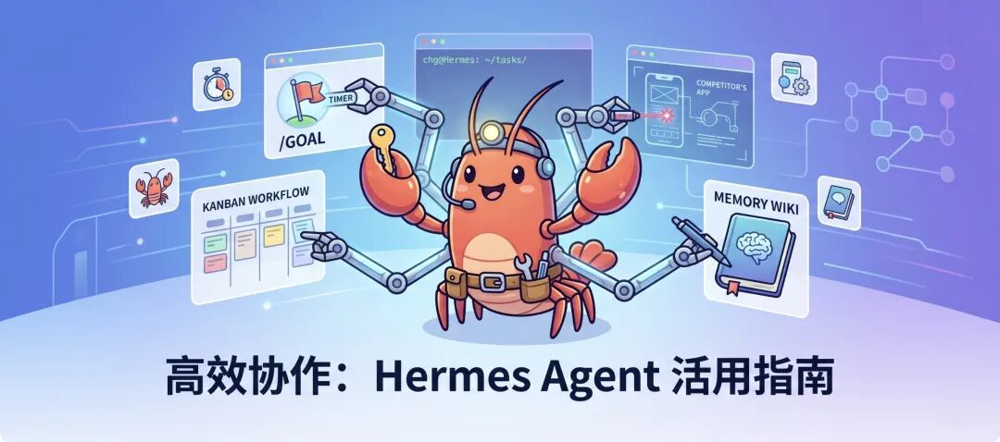

> 📎 来源: [i龙虾](https://mp.weixin.qq.com/s?__biz=MzI3MTk5OTc3Ng==&mid=2247484738&idx=1&sn=c4a6b31394f1c3ca7a11e679e843a7b6&chksm=ea395c910ff6b12d522ecc37aa9862560acbd3fc861ca1edbed446de23442e9201e897a43767&mpshare=1&scene=1&srcid=0526CoEvAjIjgcbqyZ1ZauKG&sharer_shareinfo=c9b038bb24e4f3271dcb7b89433ebea6&sharer_shareinfo_first=c9b038bb24e4f3271dcb7b89433ebea6) | 时间: 2026-05-26 12:41

---



我有个朋友，装上 Hermes Agent 之后问我：「这东西到底能干什么？」

今天介绍五个真正让它发挥价值的用法。

## 一、/goal 命令

先说最容易被用错的功能：

```
/goal
```

。

很多人知道这个命令，但很多数人的用法是：

```
/goal 帮我写一个 App
```

然后发现效果比普通对话好不了多少。

问题不在

```
/goal
```

 本身，问题在于你给的提示太烂了。

```
/goal
```

 的设计逻辑是让 Agent 执行一个**长时间运行的任务**——我跑过一次超过 10 小时没停的

```
/goal
```

，它在那段时间里持续构建、调整、迭代，最后交出来的东西完全不是普通对话能比的。但前提是你给它一个足够好的目标描述。

那问题来了：大多数人写不出足够好的提示。

解法很简单：**让 AI 替你写提示**。这就是「元提示」。

具体操作流程：

1. 先开一个普通对话，把你想做的事情描述给 AI 听

2. 告诉它：「我接下来要用

```
/goal
```

 命令，请帮我生成一个适合

```
/goal
```

 使用的详细提示词」

3. 拿到生成的提示，复制，粘贴进

```
/goal
```

以「用 Godot 做一个第三人称射击游戏」为例——我直接输入这句话和

```
/goal
```

 一起用，跟让 AI 先帮我生成一个包含游戏机制、操控逻辑、场景结构、资产需求的完整

```
/goal
```

 提示词再执行，结果差距是天壤之别。

后者在跑完之后，给了我一个可以在游戏里移动、射击、翻找尸体拾取弹药和绷带的游戏原型。不是最终产品，但框架是真实的，可以继续迭代的。

```
/goal
```

 的正确姿势：**不要自己写提示，让 AI 帮你优化提示，再给

```
/goal
```

。**

这一步很多人跳过了，结果用了半天觉得

```
/goal
```

 没用。其实/goal在Codex中可以发挥很大的作用。

## 二、看板

Hermes 之前上线的看板功能，我觉得它被严重低估了。

为了更直观，我通过仪表盘进入：在终端里输入

```
hermes dashboard
```

，回车，它会给你一个 URL，打开，点进 Kanban，就进去了。

功能本身不复杂：你往里面放任务，它会自动分配给 Agent 和子 Agent 执行。任务从「Triage（待分类）」添加（点击后面的+），被接手之后移到「To-do（待办）」，执行完成后归档。

但真正让这个功能发挥价值的，是我摸索出来的一套**晨间工作流**。

每天早上，我做的第一件事不是刷手机，是拿出纸，把今天要做的事全部列出来。然后我坐下来，打开看板，把所有「Hermes 能做的事」全部丢进看板。

比如：

- 搜集最近三天 AI 领域的新工具，整理成报告

- 起草三条关于 Hermes 用法的文章内容

这些事我全部扔进看板，然后去做我自己必须人工处理的事——打电话、付账单。

等我回来的时候，看板里那几个任务已经在跑了，有的甚至已经完成了。

这不是什么炫技，这就是真正意义上的「AI 员工」。你给任务，它执行，你不用盯着它。

你可能会说：「这不就是任务管理软件吗？」不一样。普通任务管理软件是提醒你自己去做，这个看板是真的把任务给做了。

## 三、竞品技术拆解

如果你在做产品，这个用法你一定要学会。

我想了解一个竞品是怎么搭建的，以前的做法是：打开 Chrome，开 DevTools，逐个看网络请求，翻 Console，猜它用了什么框架，手动记录……这一套下来，半天就没了，而且还不一定能看清楚。

现在我的做法是让Hermes来做，把下面提示词发给Hermes：

```
对该网站进行完整的技术调研和拆解：- 使用了哪些技术栈？- 有哪些核心功能？- 前端框架是什么？- 使用了哪些第三方服务和 API？- 付费功能的定价逻辑是什么？- 哪些功能值得参考？最后整理成 Markdown 报告。
```

Hermes 会自己打开一个浏览器，去那个网站点来点去，看控制台，分析网络请求，然后给我一份完整报告。包括：技术概览、具体用到的库和框架、Analytics 收集了哪些事件、支付用的什么系统、定价逻辑……

整个过程我不用动，它自己在那边翻，我继续做别的事。

拿到报告之后，我可以直接扔给另一个 Agent，让它在我自己的项目里参考实现。

这个用法的核心不是「抄」，而是「拆解学习」。把行业里做得好的产品，系统性地研究清楚，比你自己随便翻要高效得多。

## 四、记忆 Wiki

用 Hermes 时间长了，你会发现一个问题：你很难直观的看到你们以前聊过什么。

这个问题有个很好的方法，叫「记忆 Wiki」。

本质是：让 Hermes 帮你搭一个本地网站，把你们每次对话的主题、做过的工作、讨论过的想法，全部分类整理进去。你随时可以访问这个站点，翻看过去的记录。

搭建提示词：

```
这个网站应该包含：1. 我们讨论过的所有主题列表，可以点击查看详情2. 每日工作日志，记录每天我们一起完成了什么3. 每个条目都应该有对话记录和工作摘要请帮我把这个站点构建出来。
```

扔进去，Hermes 会直接给你建好整个站。

这个东西有两个价值。第一个是对你自己：相当于一本自动维护的工作日记，你随时能回来查「上次我搞那个 RAG 系统的时候遇到了什么问题」「那个 Python 批处理脚本的逻辑我当时是怎么写的」。

第二个是对 Agent 本身：你告诉 Hermes 每次工作前先查一下记忆 Wiki，它就能带着上下文来工作，而不是每次从零开始。这对长期使用效果的提升是很明显的。

你可以设定一个定时任务每天更新这个记忆Wiki。

## 五、让 Agent 每天主动学习你

前四个都是「你主动去用 Hermes」，最后这个是让 Hermes 主动来找你。

做法：给 Hermes 设置一条定时任务——每天早上 9 点，主动问你一个问题：「你今天最重要的一件事是什么？」

提示词：

```
然后根据我的回答：1. 列出你能帮我做的相关任务2. 更新你对我的记忆，包括我目前在做什么、我关注什么
```

这个习惯的价值在于积累效应。

你第一周回答它的时候，它对你的了解很浅。但到了第三个月，它已经知道你在做什么项目、你的工作节奏是怎样的、你什么时候在做产品什么时候在写内容、你最近遇到的瓶颈是什么。

这些信息在记忆里积累，会让它的工作建议越来越贴合你实际的情况，而不是泛泛的「我可以帮你完成任何任务」。

举个实际例子：如果你连续两周都把「写文章」放在第一优先级，它会开始主动在看板里给你预留这类任务的模板，甚至会主动问你「上次那篇文章还在进行中吗」。

这不是魔法，这是记忆+上下文在实际工作中的累积效果。

## 写在最后

回到开头那个朋友问我的问题：「这东西到底能干什么？」

装上去然后用一用，是一种答案。但那种用法很快就会遇到天花板，然后开始觉得「AI 也不过如此」。

真正的用法是：**设计一套让 Agent 持续工作的流程**，而不是把它当成一个高级搜索框。

这五个用法都不复杂，但可以感受到AI Agent给你带来不一样的体验：

• 用元提示让

```
/goal
```

 发挥真实潜力

• 用看板把每天的任务真正分配出去

• 用竞品拆解加速产品研究

• 用记忆 Wiki 让 Agent 有上下文可用

• 用晨间对话让 Agent 随时间变得更了解你

这五件事加在一起，不是「用了很多 AI 功能」，而是真正意义上建了一套 AI 协作系统。

你可以不全部用，但如果你只是偶尔开一个对话问几个问题，你大概率还没开始真正用 Hermes。

*如果你正在搭 Hermes Agent 的工作流，或者在试其中某个功能，欢迎在评论区聊聊你的实际体验——尤其是那些踩坑的部分，比单纯的「好用」更有参考价值。*
