> 📎 来源: [AI赋能说](https://mp.weixin.qq.com/s?__biz=MzI3NjE4OTAyMg==&mid=2247488938&idx=1&sn=4c6f61ef2571166e1762681e3cce56e0&chksm=ea63ae47f22283239684d36f160f1b61b4ffef41a651e3932a9d62faa8aa08c34af7e3b5f3fd&mpshare=1&scene=1&srcid=05179Cm4zLuof9clMoN7W24N&sharer_shareinfo=70c5a13fa3f127ce6c847bb49c9c718d&sharer_shareinfo_first=70c5a13fa3f127ce6c847bb49c9c718d) | 时间: 2026-05-17 16:20

---

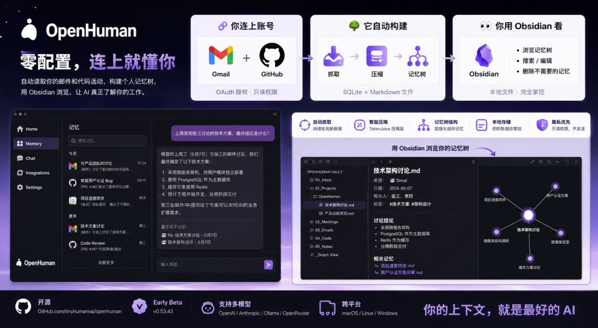

一篇教程。读完跟着做，你会有一个能自动读取你邮件和代码活动、构建个人记忆树、用 Obsidian 浏览的 AI 助手。

不需要写 prompt。不需要配工作流。连上账号，它自己学。

## 先看完成后的样子

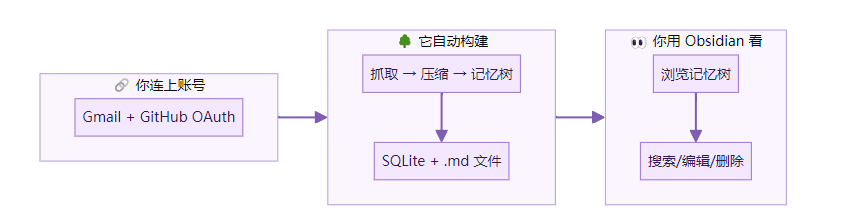

你授权两个账号。OpenHuman 在后台自动抓取、压缩、组织。你打开 Obsidian 就能看到它学到了什么。

## 前提条件

- macOS 或 Linux（Windows 也支持但桌面体验更适合 Mac/Linux）
- 一个 Gmail 账号
- 一个 GitHub 账号
- Obsidian（可选，用来浏览记忆树）

当前版本是 Early Beta（v0.53.43）。会有粗糙的地方。做好心理准备。

---

## 阶段一：安装 OpenHuman

### 第 1 步：下载安装

macOS / Linux：

```
curl -fsSL https://raw.githubusercontent.com/tinyhumansai/openhuman/main/scripts/install.sh | bash
```

Windows：

```
irm https://raw.githubusercontent.com/tinyhumansai/openhuman/main/scripts/install.ps1 | iex
```

或者去官网 tinyhumans.ai/openhuman[1] 下载桌面安装包。

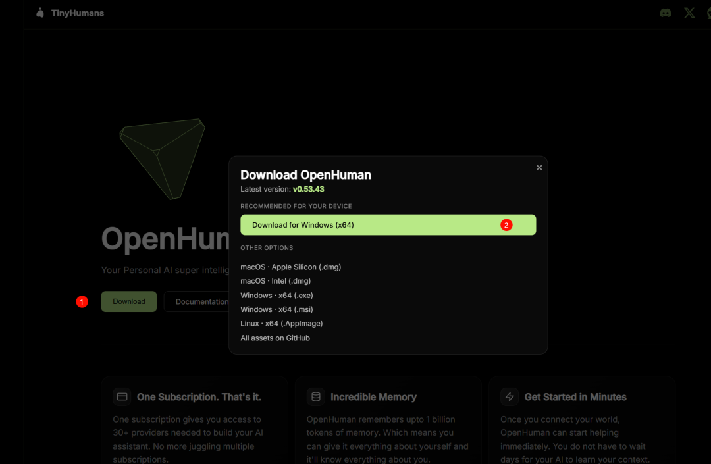

> ❝

> 这个工具会连接你的邮件、代码仓库、日历。建议先看一眼安装脚本内容再执行，或者用官网安装包。

完成标志：桌面上出现 OpenHuman 应用图标，能正常打开。

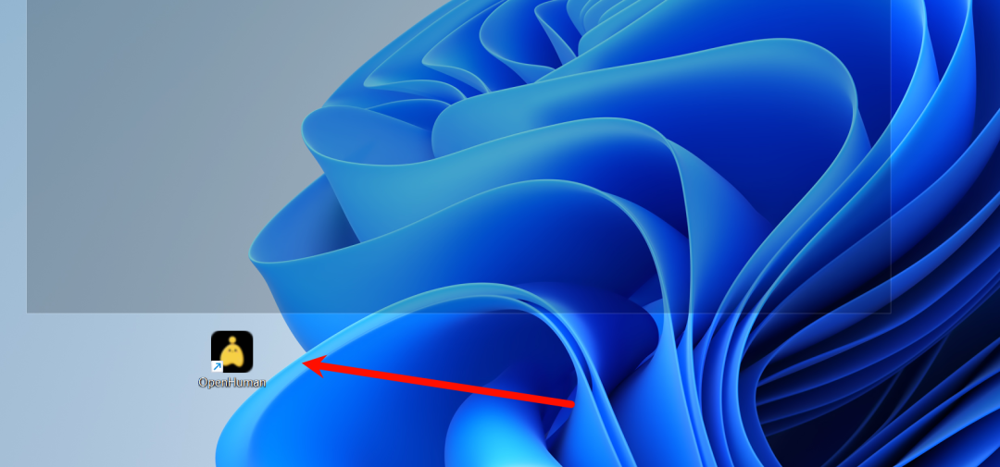

### 第 2 步：首次启动 + 配置模型

打开 OpenHuman。它会引导你选择 AI 模型提供商。

选项包括 OpenAI、Anthropic、Google、OpenRouter，或本地 Ollama。

如果你只是试用，选 OpenRouter（有免费额度）。如果你在意隐私，选 Ollama 本地模型。

完成标志：能在 OpenHuman 里正常对话。

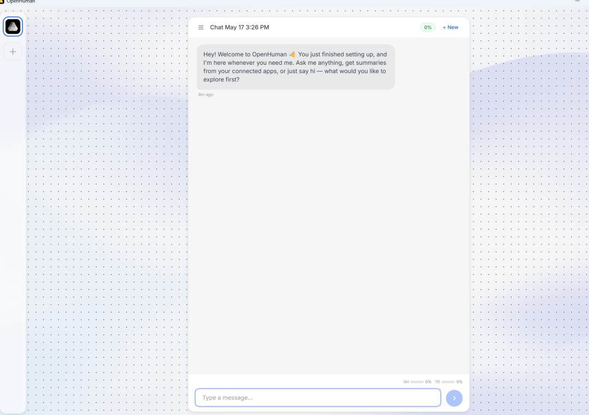

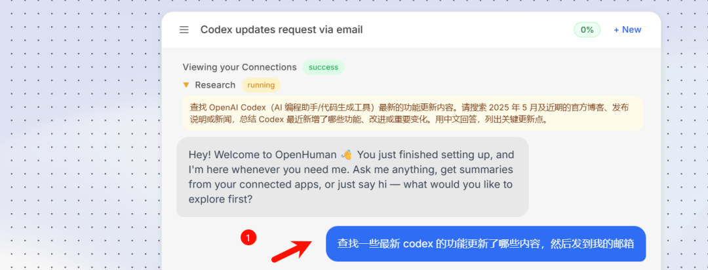

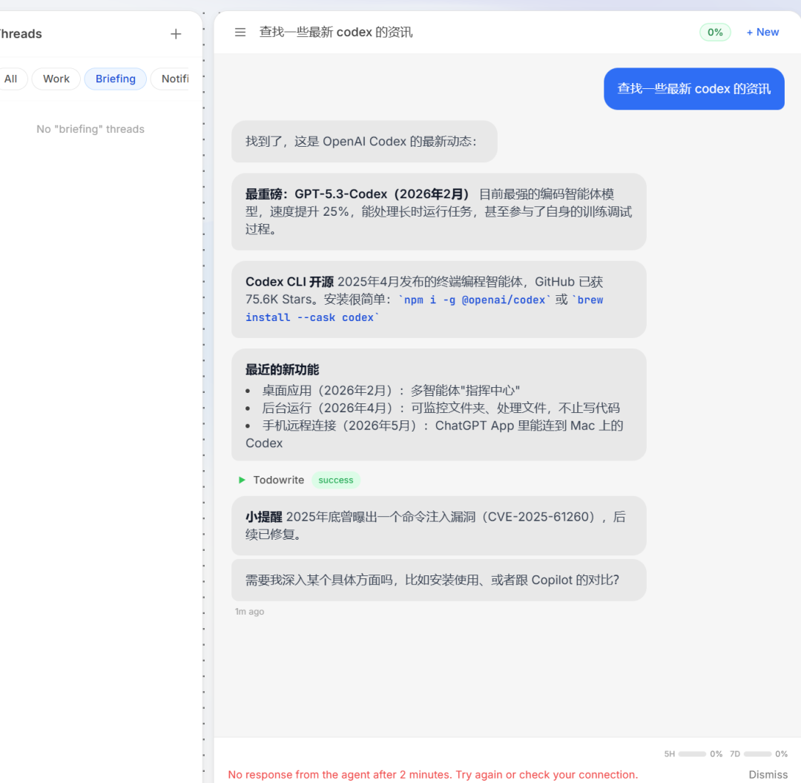

### 验证阶段一

- ✅ OpenHuman 桌面应用能打开
- ✅ 模型配置完成，能正常对话

---

## 阶段二：连接数据源

### 第 3 步：连接 Gmail

在 OpenHuman 的设置里找到"Integrations"或"Connections"。

点击 Gmail → 跳转到 Google OAuth 授权页面 → 点击"允许"。

它只申请**只读权限**。不会代你发邮件。

完成标志：连接状态显示 Gmail 已连接。

### 第 4 步：连接 GitHub

同样在 Integrations 里，点击 GitHub → OAuth 授权。

它会读取你的仓库列表、PR、Issue、代码评审。同样是只读。

完成标志：连接状态显示 GitHub 已连接。

### 第 5 步：等待首次数据抓取

连接完成后，OpenHuman 会在后台开始首次数据抓取。

这个过程可能需要几分钟到十几分钟，取决于你的邮件和仓库数量。

之后它会按固定间隔自动轮询新数据。你不需要手动触发。

完成标志：在 OpenHuman 的记忆面板里能看到开始出现内容条目。

### 验证阶段二

- ✅ Gmail 和 GitHub 都显示已连接
- ✅ 记忆面板里有数据条目出现

---

## 阶段三：浏览和验证记忆树

### 第 6 步：找到本地记忆文件

OpenHuman 会把记忆树同时写成 

```
.md
```

 文件。默认路径通常在：

```
~/.openhuman/users\xxx\workspace\memory_tree\content\raw\xxx
```

或者在应用设置里查看"Vault Path"。

完成标志：能在文件系统里找到 

```
.md
```

 文件。

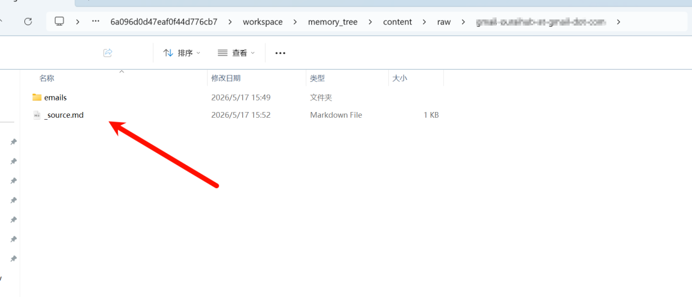

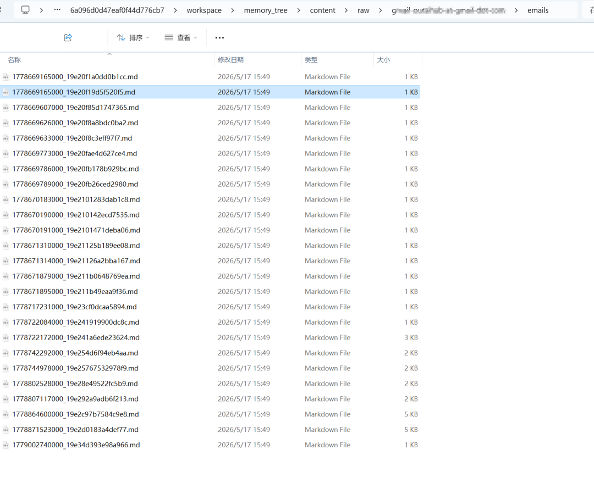

### 第 7 步：用 Obsidian 打开记忆树

打开 Obsidian → "Open folder as vault" → 选择 OpenHuman 的 vault 目录。

你会看到按主题、时间、来源组织的 Markdown 文件。每个文件是一个记忆节点——可能是一封重要邮件的摘要，可能是一个 PR 的技术决策，可能是一次会议的关键结论。

你可以：

- 搜索任何关键词
- 编辑或删除不想保留的记忆
- 用 Obsidian 的图谱视图看记忆之间的关联

完成标志：Obsidian 里能正常浏览记忆树内容。

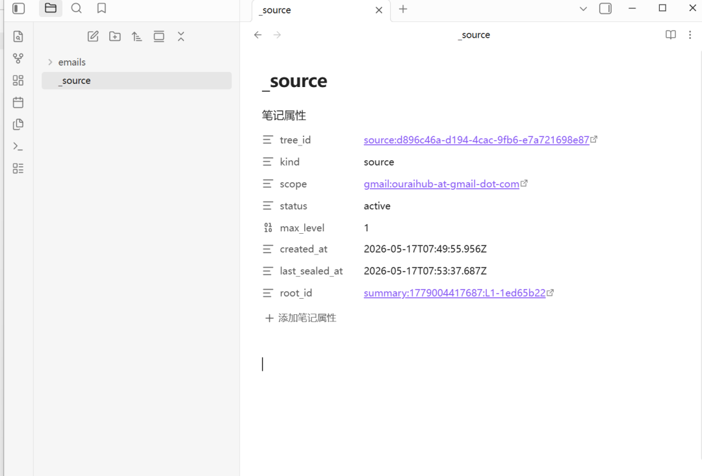

### 第 8 步：验证记忆质量

跟 OpenHuman 对话，问它一个只有读过你邮件才能回答的问题。比如：

```
上周我和 [同事名字] 讨论的那个技术方案，最终结论是什么？
```

如果它能准确回答，说明记忆树在工作。

完成标志：OpenHuman 能基于你的真实数据回答问题。

### 验证阶段三

- ✅ Obsidian 能打开记忆树
- ✅ 对话中能调用记忆回答问题

---

## 完整流程一览

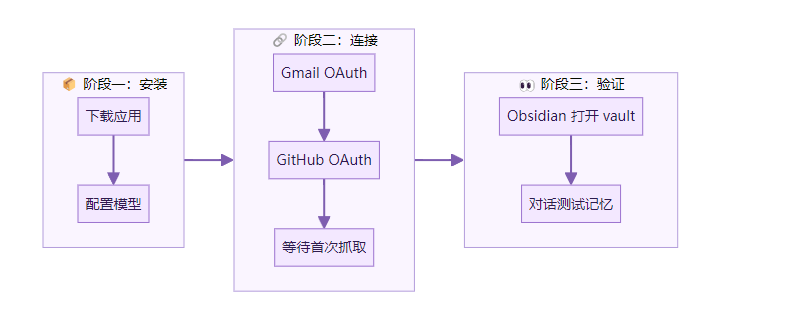

---

## 第一次做的建议

**先只连两个数据源。** Gmail + GitHub 足够验证整个流程。确认记忆树在正常工作后，再逐步加 Slack、Notion、Calendar。

**用 Obsidian 检查记忆质量。** 不要盲信。打开 vault 看看它到底记住了什么。如果有错误或不想保留的内容，直接删除 .md 文件。

**第一次对话测试要问具体的事。** 不要问"你了解我吗"这种模糊问题。问"上周三我收到的那封关于 XX 项目的邮件，对方提了什么要求"——越具体越能验证记忆是否真的在工作。

---

## 容易踩的坑

**坑 1：OAuth 授权后数据迟迟不出现**

为什么：首次抓取需要时间，尤其是邮件量大的账号。

怎么办：等 10-15 分钟。如果超过 30 分钟还没数据，检查应用日志或重启应用。

**坑 2：记忆树里的摘要丢失了关键细节**

为什么：压缩层（TokenJuice）在缩减 token 时可能砍掉了你觉得重要的信息。

怎么办：这是当前版本的已知局限。对于关键信息，建议在 Obsidian 里手动补充或标注。

**坑 3：Obsidian 打开 vault 后文件很多很乱**

为什么：记忆树按层级组织，但文件数量多了之后视觉上会复杂。

怎么办：用 Obsidian 的搜索功能而不是手动翻文件夹。或者用图谱视图看整体结构。

**坑 4：想删除某条记忆但不确定会不会影响其他**

为什么：记忆树有层级关系，删除父节点可能影响子节点的上下文。

怎么办：先在 Obsidian 里看这个文件被哪些其他文件引用。如果是叶子节点，直接删没问题。

---

## 收尾

8 步。三个阶段。一个能自动学习你工作节奏的 AI 助手。

你做的事：装应用、点两次 OAuth 授权、打开 Obsidian 看看。

它做的事：持续抓取、压缩、组织、构建记忆树。

关于 OpenHuman 为什么选择"上下文深度"而不是"能力广度"作为竞争维度——见上一篇解读。

---

## 参考资料

- tinyhumansai/openhuman - GitHub[2]
- OpenHuman 官网[3]
- knightli.com：OpenHuman — The Desktop Route for an Open-Source Personal AI Agent[4]
- Product Hunt：OpenHuman[5]

Reference

[1] 

tinyhumans.ai/openhuman: *https://tinyhumans.ai/openhuman*

[2] 

tinyhumansai/openhuman - GitHub: *https://github.com/tinyhumansai/openhuman*

[3] 

OpenHuman 官网: *https://tinyhumans.ai/openhuman*

[4] 

knightli.com：OpenHuman — The Desktop Route for an Open-Source Personal AI Agent: *https://www.knightli.com/en/2026/05/15/openhuman-open-source-personal-ai-agent/*

[5] 

Product Hunt：OpenHuman: *https://www.producthunt.com/products/openhuman*

**下方是赋能君的AI学习交流永久免费星球，想学习更多内容，欢迎扫码加入。**


🙌 如果你阅读到这里，说明我们对信息的认可区域是有一定交集的，可以说我们是同道中人，所以如果你有自认为不错的信息获取渠道，欢迎留言或者私聊我，谢谢。

都看到这里了，就给个关注吧👀：

喜欢我的文章，可以请你右下角顺手来一波点赞&在看&分享三连么👉
