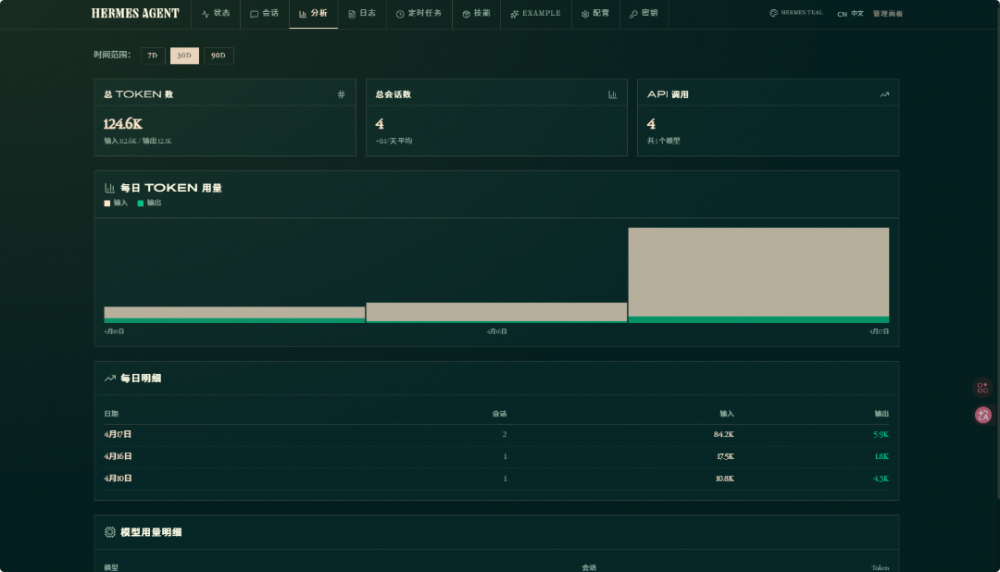
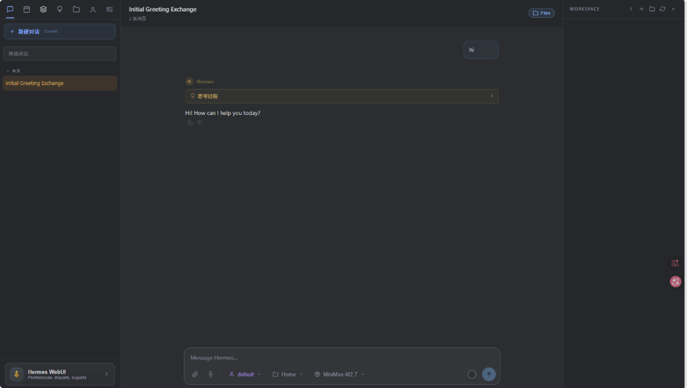
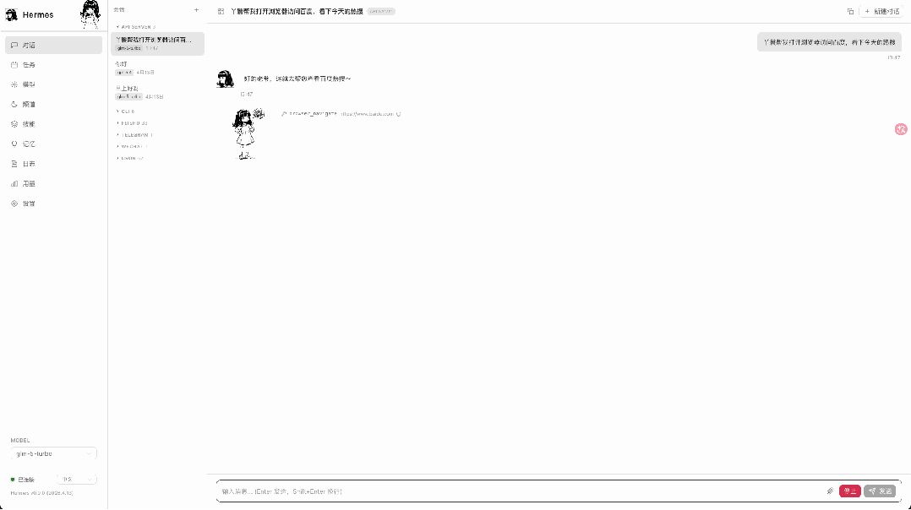
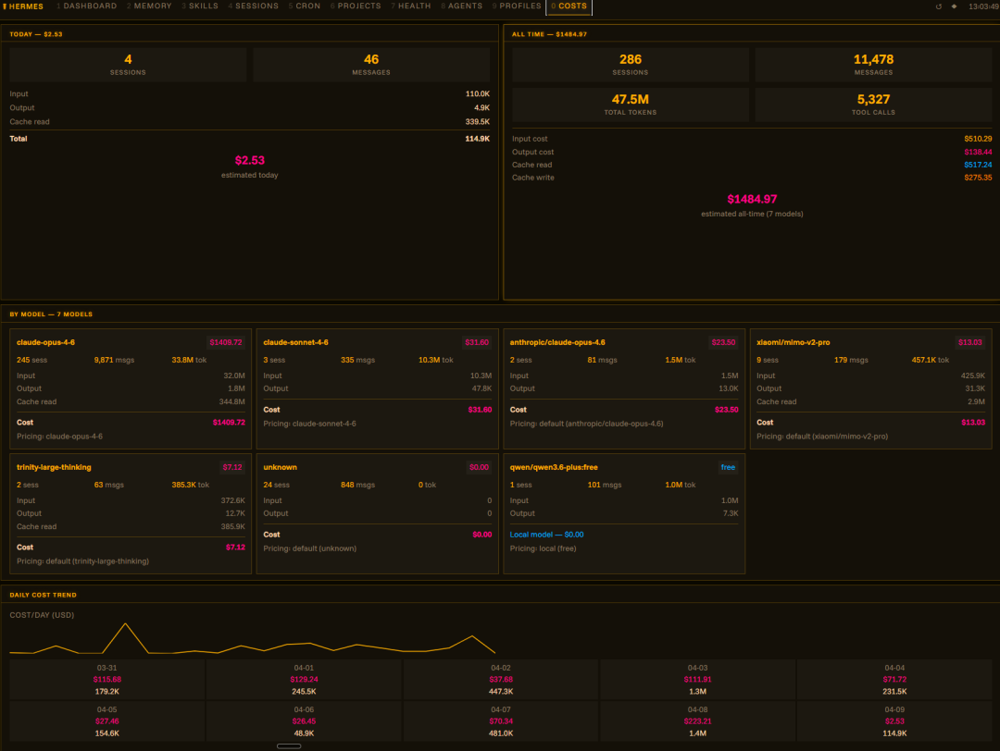

> 📎 来源: [智械日志](https://mp.weixin.qq.com/s?__biz=MzI0NzgwNDQwMg==&mid=2247484914&idx=1&sn=edaac25ce44a14b3a034c3e5fa71e06e&chksm=e877facd82d265645d053778227776a217164babd3ec948febcfbd763d4faa5428bbc60ce758&mpshare=1&scene=1&srcid=0429wmhzAZ0QWR0JWprrH0fm&sharer_shareinfo=aee425ece075b43156fc1e29fe68cb05&sharer_shareinfo_first=aee425ece075b43156fc1e29fe68cb05) | 时间: 2026-04-29 11:53

---


Hermes Agent大家养了吗？好用是好用，可惜之前只有命令行。上次小龙虾的可视化界面大家都很喜欢，这次推荐Hermes Agent可视化界面，帮大家可视化养马！

**官方web-dashboard**



### **1.前期准备**

使用**hermes update**  升级hermes版本。

使用Web Dashboard 需要 FastAPI 和 Uvicorn 支持，通过以下命令安装：

```
1.仅安装 Web 相关依赖：
```

**2. 启动 Dashboard**

在终端中输入以下命令即可启动：

```
hermes dashboard
```

执行后，程序会自动在默认浏览器中打开

http://127.0.0.1:9119。

常用启动选项：

- 更改端口： hermes dashboard --port 8080
- 手动打开： 如果不想让浏览器自动弹出，可以使用 hermes dashboard --no-open。
- 远程访问（需谨慎）： 使用 --host 0.0.0.0 可以让局域网内的其他设备访问，但由于该面板没有内置身份验证，请仅在受信任的网络环境中使用。

**hermes-webui**



Hermes WebUI是一个轻量级Web应用界面，与CLI体验完全一致——在终端中能做的一切，都可以在这个UI中完成。

```
项目地址：
```

**Hermes Web UI**



非常简洁，好用，能够管理 AI 聊天会话、监控用量与成本、配置平台渠道、管理定时任务、浏览技能。

```
项目地址：
```

**Hermes HUD**



```
项目地址：
```
