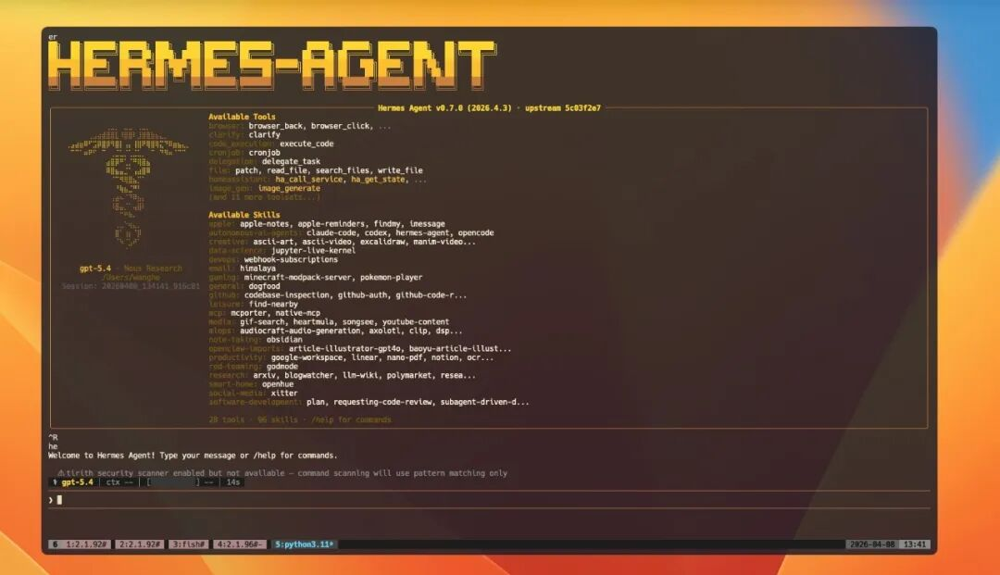

> 📎 来源: [楮墨的AGI世界](https://mp.weixin.qq.com/s?__biz=MzY4MzEzODI2MQ==&mid=2247483973&idx=1&sn=d7a7a15c3843197c734672241586ffb8&chksm=f2d8e1bf55545154a805130b24142418eb7a42f390f2892d56463e135b933df559f1fb390948&mpshare=1&scene=1&srcid=0420k7ikJHWqdO0YM4KssMJc&sharer_shareinfo=e8851edd23ad0b347bdfc593ca0688d1&sharer_shareinfo_first=e8851edd23ad0b347bdfc593ca0688d1) | 时间: 2026-04-20 15:48

---

昨天写了一篇关于Open Claw与Hermes Agent对比的文章，好多朋友看完后，私下跟我说，Hermes Agent大概看懂了是个什么东西，但如何安装和使用呢，我突然意识到，最近GitHub上非常火爆的开源Agent原来还有好多人不知道，那我们今天就来讲讲它的安装和使用。

如果你也是刚听说这个工具，或者试过但装不上，这篇指南就是为你写的。我们从零开始，手把手，保证你能跑起来。


---

## 先搞清楚：Hermes Agent 到底是什么？

在说安装之前，先简单介绍一下这是个什么东西，方便你判断"这玩意儿值不值得装"。

Hermes Agent 是由 **Nous Research**（就是那个做羊驼系列模型的研究机构）开源的一个 AI Agent 命令行工具。简单来说，它就是一个跑在终端里的 AI 助手，但你可以通过它真正操控你的电脑——搜索网页、读写文件、执行命令行操作、接入 Telegram 或 Discord 聊天、设置定时任务。

**它能做的事**（举几个例子）：

- "帮我查一下今天 Hacker News 上 AI 相关的新闻，整理成摘要"
- "把我桌面上的所有 PDF 文件按时间排序"
- "帮我写一个部署脚本，然后执行它"
- "每天早上 9 点把今天的天气发到我的 Telegram"
- "帮我分析这个项目的代码结构"
- "用语音问我问题，我用语音回答你"

**支持的系统**：

| 系统 | 支持情况 | 安装难度 |
| --- | --- | --- |
| Linux（Ubuntu/Debian/Fedora等） | ✅ 完全支持 | 简单 |
| macOS | ✅ 完全支持 | 简单 |
| Windows WSL2 | ✅ 完全支持 | 需先装WSL2 |
| Android（Termux） | ✅ 支持，但功能有缩减 | 中等 |
| 原生 Windows | ❌ 不支持 | — |

**不支持**：原生 Windows 必须装 WSL2，官方明确说了不会开发 Windows 原生版本。

---

## 安装方式总览

Hermes Agent 提供了三种安装路径：

| 方式 | 适用人群 | 安装时间 | 难度 |
| --- | --- | --- | --- |
| **一键安装** | Linux/macOS/WSL2 用户 | 2-5 分钟 | 零难度 |
| **Termux 安装** | 安卓手机用户 | 10-15 分钟 | 中等 |
| **手动安装** | 想深度定制 / 遇到奇怪问题的用户 | 15-30 分钟 | 需要耐心 |

**推荐新手用一键安装**，自动处理 99% 的情况。如果你用的是安卓手机，或者一键安装出了问题，再来看后面两种方式。

---

## 方式一：一键安装（2分钟搞定，推荐）

适用系统：Linux、macOS、Windows WSL2。

### 第一步：打开终端

**macOS**：按 

```
Command + Space
```

，搜索"终端"，回车。

**Linux**：按 

```
Ctrl + Alt + T
```

，大多数发行版会直接打开终端。

**Windows WSL2**：在开始菜单里找"Ubuntu"或"WSL"，或者在 PowerShell 里输入 

```
wsl
```

 回车。

### 第二步：运行安装命令

在终端里粘贴这一行命令，回车：

```
curl -fsSL https://raw.githubusercontent.com/NousResearch/hermes-agent/main/scripts/install.sh | bash
```

然后就是等待。安装脚本会自动检测你的系统缺少什么，然后一一补上。

**安装程序会帮你自动安装以下内容**（你不需要提前装任何东西）：

1. **uv** — 一个超快的 Python 包管理器，比 pip 快 10 倍以上。Hermes 用它来管理 Python 依赖。
2. **Python 3.11** — Hermes 的运行环境。uv 会自动下载合适版本，不需要你手动去 python.org 下载。
3. **Node.js v22** — 用于浏览器自动化和 WhatsApp 桥接功能。
4. **ripgrep** — 一个比 

   ```
   grep
   ```

    快 5-10 倍的文件搜索工具，Hermes 的文件搜索功能依赖它。
5. **ffmpeg** — 音频/视频处理工具，语音合成（TTS）功能需要它。
6. **Git** — 代码版本管理（如果你的系统没有的话）。
7. **Hermes 本身** — 克隆代码仓库，配置虚拟环境，设置全局命令。

### 第三步：重新加载 Shell

安装完成后，关闭当前终端，新开一个窗口。

或者直接运行：

```
source ~/.bashrc   # 如果你用 bash shellsource ~/.zshrc    # 如果你用 zsh
```

### 第四步：验证安装

```
hermes version
```

如果看到类似 

```
hermes version 1.x.x
```

 的输出，恭喜，安装成功。

还可以运行诊断命令，检查配置有没有问题：

```
hermes doctor
```

这个命令会检查：

- Python 版本是否正确
- 必要的系统工具是否存在
- API 密钥是否配置
- 各个功能模块是否正常

---

## 一键安装后：配置你的 AI 模型

安装完之后，你需要告诉 Hermes 用哪个 AI 模型。

运行配置向导：

```
hermes model
```

这会启动一个交互式界面，让你选择：

1. **选择 AI 提供者**（OpenRouter、Anthropic、OpenAI、DeepSeek 等）
2. **输入 API 密钥**
3. **选择具体模型**

### 推荐新手用 OpenRouter

OpenRouter 是一个聚合平台，可以用一个 API key 访问几十种不同的 AI 模型。它有免费额度，适合新手试用。

注册地址：https://openrouter.ai

注册后复制你的 API key，填入 

```
hermes model
```

 的向导里就行了。

### 关于模型选择

**一个关键要求**：Hermes Agent 要求模型至少有 **64,000 token** 的上下文窗口。这个数字是什么意思呢？大概相当于 4-5 万个中文字符，也就是说 Hermes 会在一次对话里维护一个很大的"记忆窗口"，如果模型上下文太小，它没法有效工作。

以下模型都满足这个要求，可以直接用：

- Anthropic Claude 3.5 Sonnet / Opus
- OpenAI GPT-4o / GPT-4 Turbo
- Google Gemini 1.5 Pro
- DeepSeek Chat V3
- Qwen（通义千问）系列
- Llama 3 70B 及以上

如果你用 **本地模型（Ollama）**，需要在启动时设置 context size：

```
# Ollama 启动时加上这个参数ollama serve --ctx-size 65536
```

否则 Hermes 会报错拒绝启动。

### 配置完成后：第一次聊天

```
hermes
```



你应该会看到一个欢迎界面，上面显示了你的模型名称、可用的工具列表。输入一个问题试试：

```
What can you help me with?
```

随便问点什么，比如"帮我总结一下当前目录里有哪些文件"。 Hermes 会真正去执行命令，而不是只回复文字。

---

## 方式二：安卓手机安装（Termux）

什么？手机上也能跑 AI Agent？

对，用 Termux。Termux 是一个在安卓上模拟 Linux 环境的 App，装上它之后，你的手机就像有了一台小型 Linux 服务器。Hermes 官方专门测试了 Termux 安装路径，手机上能完整使用核心功能。

### 重要说明：安卓安装的已知限制

在开始之前，先说清楚安卓版本的功能限制，免得装完发现少东西失望：

**能用的**：

- Hermes CLI 核心功能
- 定时任务（cron）
- 终端后台运行
- MCP（Model Context Protocol）
- AI 记忆功能（Honcho）
- ACP 编辑器集成

**不能用的**：

- ```
  .[all]
  ```

   全量包（某些依赖没有安卓版）
- 语音输入/输出（faster-whisper 在安卓上跑不了）
- 浏览器自动化
- Docker 容器隔离

说白了，手机上主要是一个**命令行 AI 助手**，语音和浏览器相关的功能暂时没有。但核心的对话、搜索、文件操作、定时任务都能用。

### 第一步：安装 Termux

Termux 不能从 Google Play 装（版本太旧），要去 GitHub 下载最新版：

**下载地址**：https://github.com/termux/termux-app/releases

找到最新的 

```
termux-app
```

 APK 文件下载到手机，然后安装。

> 注意：如果你的手机是 ARM64 架构（大多数现代手机都是），直接下最新版的通用 APK 就行。

### 第二步：初始设置

打开 Termux，会看到一个黑色的终端界面。首先更新包列表：

```
pkg update && pkg upgrade -y
```

这行命令会连接 Termux 的包服务器，下载最新的软件包列表。

### 第三步：安装系统依赖

接下来安装编译工具链和运行依赖：

```
pkg install -y git python clang rust make pkg-config libffi openssl nodejs ripgrep ffmpeg
```

逐个说明每个包的作用：

| 包名 | 作用 |
| --- | --- |
| ``` git ``` | 克隆 Hermes 代码仓库，必装 |
| ``` python ``` | Hermes 运行在 Python 上，必装 |
| ``` clang ``` | C 语言编译器，某些 Python 扩展需要编译 |
| ``` rust ``` | Rust 编译器，某些高性能 Python 扩展（如 jiter）用 Rust 写 |
| ``` make ``` | 构建工具，配合 clang 使用 |
| ``` pkg-config ``` | 包配置工具，编译时查找库文件 |
| ``` libffi ``` | 外国函数接口，Python C 扩展需要 |
| ``` openssl ``` | SSL/TLS 加密库，网络请求需要 |
| ``` nodejs ``` | Node.js 运行时，可选（用于高级实验功能） |
| ``` ripgrep ``` | 超快文件搜索，Hermes 文件操作需要 |
| ``` ffmpeg ``` | 音视频处理，语音合成需要 |

安装过程会提示你确认，输入 

```
y
```

 回车就行。这个过程大概需要 5-10 分钟，取决于你的网速。

### 第四步：克隆 Hermes 代码

```
git clone --recurse-submodules https://github.com/NousResearch/hermes-agent.gitcd hermes-agent
```

如果你之前克隆过 Hermes 但没加 

```
--recurse-submodules
```

，需要补一下子模块：

```
git submodule update --init --recursive
```

### 第五步：创建虚拟环境

Termux 上不用 uv，直接用 Python 自带的 venv：

```
python -m venv venvsource venv/bin/activateexport ANDROID_API_LEVEL="$(getprop ro.build.version.sdk)"python -m pip install --upgrade pip setuptools wheel
```

**重点解释一下**：

- ```
  python -m venv venv
  ```

  ：创建一个叫 

  ```
  venv
  ```

   的虚拟环境，隔离 Hermes 的 Python 依赖
- ```
  source venv/bin/activate
  ```

  ：激活虚拟环境，之后 pip 安装的包都会装到这个 venv 里
- ```
  export ANDROID_API_LEVEL="$(getprop ro.build.version.sdk)"
  ```

  ：这是给某些 Rust 写的扩展包用的，告诉它们运行在哪个安卓 API 级别上。**这行必须写**，不然某些包会编译失败。

### 第六步：安装 Hermes

```
python -m pip install -e '.[termux]' -c constraints-termux.txt
```

这里用的是 

```
.[termux]
```

 专用包，不是 

```
.[all]
```

。区别在于：

- ```
  .[all]
  ```

   会尝试装 

  ```
  voice
  ```

   extra，而 voice 依赖 

  ```
  faster-whisper
  ```
- ```
  faster-whisper
  ```

   依赖 

  ```
  ctranslate2
  ```
- ```
  ctranslate2
  ```

   没有发布安卓的预编译版本，所以装不了

所以用 

```
.[termux]
```

，这是一个经过官方测试的功能集，包含了在安卓上能正常工作的所有模块。

constraints-termux.txt 是一个版本约束文件，确保每个依赖的版本都和安卓兼容。

### 第七步：添加到 PATH

```
ln -sf "$PWD/venv/bin/hermes" "$PREFIX/bin/hermes"
```

```
$PREFIX/bin
```

 是 Termux 的系统 bin 目录，已经在 PATH 里了。这样每次新开 Termux 窗口，直接输入 

```
hermes
```

 就能用，不用每次都激活虚拟环境。

### 第八步：验证安装

```
hermes versionhermes doctor
```

```
doctor
```

 命令会输出一份详细的诊断报告，告诉你哪些功能正常、哪些有问题。

### 第九步：配置 API 密钥

和桌面端一样，你需要配置一个 AI 模型：

```
hermes model
```

或者直接编辑配置文件：

```
nano ~/.hermes/.env
```

在文件里添加：

```
OPENROUTER_API_KEY=sk-or-v1-your-key-here
```

保存后退出（Ctrl+X，然后按 Y 确认保存）。

### 第十步：开始使用

```
hermes
```

欢迎界面出现，输入问题，开始聊天。

---

## 方式三：手动安装（完全控制）

手动安装适合：想搞清楚每一步在干什么、或者遇到了奇怪 bug 需要定位问题的用户。

整个过程分 10 个步骤。

### Step 1：确认 Git 已安装

Git 是 Hermes 唯一的前置依赖，其他所有东西安装脚本会自动处理。

```
git --version
```

如果提示 

```
command not found
```

，去 https://git-scm.com 下载安装。

**macOS 用户注意**：macOS 自带 git，但如果很久没更新，可能版本太老。可以用 Homebrew 更新：

```
brew install git
```

### Step 2：克隆代码仓库

```
git clone --recurse-submodules https://github.com/NousResearch/hermes-agent.gitcd hermes-agent
```

```
--recurse-submodules
```

 参数会同时克隆主仓库和所有子模块。Hermes 用到了若干子模块（比如 

```
tinker-atropos
```

），不克隆的话某些功能用不了。

如果你是第一次克隆但忘了加参数：

```
git submodule update --init --recursive
```

这行命令会补下载所有子模块。

### Step 3：安装 uv

uv 是 Astral 公司出品的 Python 包管理器，比 pip 快很多，且能自动管理 Python 版本（不需要你手动下载 Python）。

```
curl -LsSf https://astral.sh/uv/install.sh | sh
```

安装完后，重新加载 shell：

```
source ~/.bashrc   # 或 source ~/.zshrc
```

验证安装：

```
uv --version
```

### Step 4：创建虚拟环境

```
uv venv venv --python 3.11export VIRTUAL_ENV="$(pwd)/venv"
```

解释一下：

- ```
  uv venv venv
  ```

  ：在当前目录创建一个叫 

  ```
  venv
  ```

   的虚拟环境
- ```
  --python 3.11
  ```

  ：指定使用 Python 3.11 版本。如果系统没有，uv 会自动下载
- ```
  export VIRTUAL_ENV="$(pwd)/venv"
  ```

  ：设置环境变量，让后续的 

  ```
  uv pip
  ```

   命令知道把包装到哪个 venv 里

### Step 5：安装 Python 依赖

**装全量包（含所有功能）**：

```
uv pip install -e ".[all]"
```

**只装核心功能（推荐配置低的机器）**：

```
uv pip install -e "."
```

**按需安装特定功能**：

```
uv pip install -e ".[messaging,cron]"# 消息平台 + 定时任务uv pip install -e ".[cli]"# 交互式设置向导界面uv pip install -e ".[voice]"# 语音输入输出uv pip install -e ".[mcp]"# MCP 协议支持uv pip install -e ".[honcho]"# AI 记忆uv pip install -e ".[homeassistant]"# Home Assistant 集成
```

**扩展包功能速查**：

| 扩展包 | 功能说明 | 适用场景 |
| --- | --- | --- |
| ``` all ``` | 全部功能 | 服务器、高配电脑 |
| ``` messaging ``` | Telegram、Discord 接入 | 需要 IM 机器人 |
| ``` cron ``` | 定时任务解析和执行 | 自动化工作流 |
| ``` cli ``` | 终端 UI 向导界面 | 新手不想改配置文件 |
| ``` voice ``` | 麦克风输入 + 语音播报 | 语音交互 |
| ``` termux ``` | 安卓专用包 | 手机 Termux |
| ``` mcp ``` | Model Context Protocol | 连接外部工具 |
| ``` honcho ``` | AI 原生记忆系统 | 长期记忆对话 |
| ``` homeassistant ``` | Home Assistant 控制 | 智能家居 |
| ``` slack ``` | Slack 消息 | 工作流集成 |
| ``` dev ``` | 测试和开发工具 | 贡献代码 |
| ``` pty ``` | PTY 终端支持 | 高级终端功能 |

可以自由组合：

```
uv pip install -e ".[messaging,cron,voice]"
```

### Step 6：安装可选的子模块

Hermes 有一个可选的子模块叫 

```
tinker-atropos
```

，是一个 RL 训练后端。如果你想实验 AI Agent 的强化学习训练能力：

```
uv pip install -e "./tinker-atropos"
```

这个是可选的，不装的话对应的训练功能就没有，但不影响日常使用。

### Step 7：安装 Node.js 依赖（可选）

只有当你想用**浏览器自动化**或 **WhatsApp 桥接**功能时才需要装：

```
npm install
```

其他情况可以跳过。

### Step 8：创建配置目录

```
mkdir -p ~/.hermes/{cron,sessions,logs,memories,skills,pairing,hooks,image_cache,audio_cache,whatsapp/session}cp cli-config.yaml.example ~/.hermes/config.yamltouch ~/.hermes/.env
```

逐个解释这些目录：

| 目录 | 用途 |
| --- | --- |
| ``` cron ``` | 定时任务的配置文件 |
| ``` sessions ``` | 对话会话历史记录 |
| ``` logs ``` | 运行日志，排查问题时看这里 |
| ``` memories ``` | AI 的长期记忆数据 |
| ``` skills ``` | 安装的技能包 |
| ``` pairing ``` | 消息平台配对数据 |
| ``` hooks ``` | 自定义钩子脚本 |
| ``` image_cache ``` | 下载的图片缓存 |
| ``` audio_cache ``` | 音频文件缓存 |
| ``` whatsapp/session ``` | WhatsApp 桥接的会话数据 |

```
config.yaml
```

 是主配置文件，

```
.env
```

 是环境变量文件（存 API 密钥用）。

### Step 9：配置 API 密钥

用编辑器打开 

```
.env
```

 文件：

```
nano ~/.hermes/.env
```

或者如果你熟悉 vim：

```
vim ~/.hermes/.env
```

添加至少一个 LLM 提供者的 API 密钥：

```
# 必须至少有一个OPENROUTER_API_KEY=sk-or-v1-your-key-here# 以下是可选项，按需添加FIRECRAWL_API_KEY=fc-your-key        # 网页搜索和抓取FAL_KEY=your-fal-key                 # 图像生成（FLUX 模型）ANTHROPIC_API_KEY=your-key           # 直接用 ClaudeOPENAI_API_KEY=your-key             # 直接用 GPTDEEPSEEK_API_KEY=your-key            # 直接用 DeepSeek
```

也可以用命令设置：

```
hermes config set OPENROUTER_API_KEY sk-or-v1-your-key-here
```

### Step 10：添加到 PATH 并验证

把 Hermes 可执行文件链接到 PATH 里：

```
mkdir -p ~/.local/binln -sf "$(pwd)/venv/bin/hermes" ~/.local/bin/hermes
```

把 

```
~/.local/bin
```

 加入 shell 配置：

```
# Bashecho 'export PATH="$HOME/.local/bin:$PATH"' >> ~/.bashrcsource ~/.bashrc# Zshecho 'export PATH="$HOME/.local/bin:$PATH"' >> ~/.zshrcsource ~/.zshrc
```

验证安装：

```
hermes version      # 查看版本号hermes doctor       # 完整诊断hermes status       # 查看配置状态
```

全部正常？手动安装完成。

---

## 后续配置

### 配置 LLM 模型

```
hermes model
```

如果你的 API 密钥已经写在 

```
.env
```

 文件里了，直接选模型就行。如果还没配置密钥，向导会提示你输入。

### 完整配置向导

如果你想一次性配置所有内容（模型、工具、消息平台等）：

```
hermes setup
```

这是一个交互式向导，会依次引导你配置每个模块。

### 单独配置某个模块

```
hermes model          # 选择 LLM 提供者和模型hermes tools          # 配置启用的工具集hermes gateway setup   # 配置消息平台（Telegram/Discord等）hermes config set# 设置单个配置项
```

---

## 常见问题与解决方案

### Q1：Windows 用户，装不上？

**问题**：原生 Windows 不支持 Hermes，运行安装命令直接报错。

**解决方案**：必须安装 WSL2（Windows Subsystem for Linux 2）。步骤：

1. 以管理员身份打开 PowerShell，运行：

   ```
   wsl --install
   ```
2. 重启电脑
3. 重启后会自动打开 Ubuntu 终端，设置用户名和密码
4. 在 Ubuntu 终端里运行 Hermes 安装命令：

   ```
   curl -fsSL https://raw.githubusercontent.com/NousResearch/hermes-agent/main/scripts/install.sh | bash
   ```

详细教程参考微软官方文档：https://learn.microsoft.com/zh-cn/windows/wsl/install

---

### Q2：提示  ``` curl: command not found ```

**问题**：系统找不到 curl 命令。

**macOS**：curl 预装了，检查一下是不是被沙盒环境拦截了。试这个：

```
/bin/bash -c "$(curl -fsSL https://raw.githubusercontent.com/NousResearch/hermes-agent/main/scripts/install.sh)"
```

**Linux**：用包管理器安装：

```
sudo apt install curl    # Ubuntu/Debiansudo yum install curl     # Fedora/RHEL
```

---

### Q3：提示  ``` hermes: command not found ```

**问题**：安装成功了，但终端找不到 hermes 命令。

**原因**：PATH 没配好，或者 shell 没重新加载。

**解决方法**：

```
source ~/.bashrc   # 重新加载配置which hermes      # 检查 hermes 在哪里echo $PATH# 确认 ~/.local/bin 在 PATH 里
```

如果 

```
which hermes
```

 没输出，说明链接没建好，手动重建：

```
mkdir -p ~/.local/binln -sf "$(find ~/.hermes-agent -name hermes -type f 2>/dev/null | head -1)" ~/.local/bin/hermes
```

---

### Q4：提示  ``` API key not set ```

**问题**：运行 hermes 后报错，说没设置 API 密钥。

**解决方法**：

方法一，用向导配置：

```
hermes model
```

方法二，直接写入配置文件：

```
nano ~/.hermes/.env# 添加 OPENROUTER_API_KEY=你的key
```

方法三，用命令设置：

```
hermes config set OPENROUTER_API_KEY sk-or-v1-your-key-here
```

---

### Q5：模型报错  ``` context window too small ```

**问题**：Hermes 启动时报错，说模型上下文窗口太小。

**原因**：你用的模型上下文小于 64K token。

**解决方法**：

如果你用的是 **OpenRouter**，换一个模型（比如 Claude 3.5 Sonnet、GPT-4o 等，上下文都够大）。

如果你用的是 **本地 Ollama**：

```
# 停止当前的 Ollama# 用更大的 context size 启动ollama serve --ctx-size 65536
```

或者在 Ollama 的配置文件里设置默认 context 大小。

---

### Q6：安装  ``` .[all] ```  报错（尤其是安卓）

**问题**：在 Termux 上运行 

```
uv pip install -e ".[all]"
```

 报错，或者卡在 

```
faster-whisper
```

 / 

```
ctranslate2
```

 编译上。

**原因**：

```
.[all]
```

 包含 voice extra，而 voice 依赖 

```
faster-whisper
```

，后者依赖 

```
ctranslate2
```

，而 ctranslate2 没有发布安卓架构的预编译包。

**解决方案**：

```
# 用 Termux 专用包代替python -m pip install -e '.[termux]' -c constraints-termux.txt
```

---

### Q7： ``` uv pip install ```  在安卓上失败

**问题**：uv 在 Termux 上有兼容性问题。

**原因**：uv 在某些安卓环境下编译有问题，用 Python 自带的 venv 更稳定。

**解决方案**：

```
python -m venv venvsource venv/bin/activateexport ANDROID_API_LEVEL="$(getprop ro.build.version.sdk)"python -m pip install --upgrade pip setuptools wheelpython -m pip install -e '.[termux]' -c constraints-termux.txt
```

---

### Q8： ``` jiter ```  /  ``` maturin ```  编译失败（安卓）

**问题**：安装过程中 jiter 或其他 Rust 编译的包失败，报 ANDROID\_API\_LEVEL 错误。

**原因**：没有设置 

```
ANDROID_API_LEVEL
```

 环境变量。

**解决方案**：

```
export ANDROID_API_LEVEL="$(getprop ro.build.version.sdk)"python -m pip install -e '.[termux]' -c constraints-termux.txt
```

这行要写在 pip install 命令之前。

---

### Q9： ``` hermes doctor ```  报缺 ripgrep

**问题**：诊断命令说找不到 ripgrep 或 Node.js。

**解决**：

| 系统 | 安装命令 |
| --- | --- |
| macOS | ``` brew install ripgrep nodejs ``` |
| Ubuntu/Debian | ``` sudo apt install ripgrep nodejs ``` |
| Fedora | ``` sudo dnf install ripgrep nodejs ``` |
| Termux | ``` pkg install ripgrep nodejs ``` |

---

### Q10：Python 包编译失败（缺编译器）

**问题**：安装 Python 包时报错，提到 "clang"、"gcc"、"build failed" 等。

**原因**：系统缺少 C/C++ 编译工具链。

**解决**：

**Ubuntu/Debian**：

```
sudo apt install build-essential python3-dev rustc
```

**macOS**：

```
xcode-select --install   # 安装 Command Line Toolsbrew install rust        # Rust 编译器
```

**Termux**：

```
pkg install clang rust make pkg-config libffi openssl
```

---

### Q11：更新 Hermes 后配置丢失

**问题**：更新 Hermes 到新版本后，启动报错或配置异常。

**解决**：

```
hermes config check    # 检查配置完整性hermes config migrate  # 迁移配置到新格式
```

这会自动检测旧版本的配置文件格式并升级。

---

### Q12：网速太慢，安装中断

**问题**：Git 克隆或 pip 安装时网络超时。

**解决**：

Git 克隆加速（用国内镜像）：

```
git clone https://ghproxy.com/https://github.com/NousResearch/hermes-agent.git
```

pip 安装加速（用清华镜像）：

```
pip install xxx -i https://pypi.tuna.tsinghua.edu.cn/simple
```

或者用 uv，uv 默认自带镜像优化：

```
uv pip install xxx
```

---

## 下一步：开始玩转 Hermes

装好了？先熟悉一下基本操作。

### 第一次对话

```
hermes
```

试着问这些问题：

- "当前目录下有哪些文件？"
- "帮我查一下今天 AI 圈有什么新闻"
- "用中文介绍一下你自己"

### 试试工具调用

Hermes 不只是回答问题，它真的会执行操作：

```
帮我把桌面上的文件按大小排序，找出最大的5个
```

Hermes 会真的运行 

```
du
```

 和 

```
sort
```

 命令，然后给你结果。

### 用斜杠命令

在对话里输入 

```
/
```

 可以看到所有可用的斜杠命令：

| 命令 | 功能 |
| --- | --- |
| ``` /help ``` | 显示所有工具和命令 |
| ``` /tools ``` | 列出当前可用的工具 |
| ``` /model ``` | 切换模型 |
| ``` /personality ``` | 切换人格（可以选"海盗"、"诗人"等趣味人格） |
| ``` /save ``` | 保存当前会话 |

### 多行输入

写代码或长提示时，按 

```
Alt+Enter
```

 或 

```
Ctrl+J
```

 可以换行继续输入。

### 中断任务

如果 Hermes 在执行一个很长的任务，你不想等了，直接输入新问题回车就会中断当前任务。

```
Ctrl+C
```

 也可以。

### 恢复会话

退出 Hermes 时会显示恢复命令：

```
hermes --continue# 或简写：hermes -c
```

这会恢复最近一次会话，继续对话。

---

## 进阶功能

### 接入 Telegram

想让 Hermes 在 Telegram 里回复你？

```
hermes gateway setup
```

选择 Telegram，填入你的 Bot Token（去 @BotFather 申请）和你的 Telegram ID。

配置完成后，你在 Telegram 里给 Bot 发消息，Hermes 就会回复。

### 接入 Discord

类似 Telegram：

```
hermes gateway setup
```

选择 Discord，需要创建一个 Discord Application，拿到 bot token，然后邀请 bot 到你的服务器。

### 定时任务

想让 Hermes 每天早上自动给你汇总新闻？

```
hermes setup
```

然后配置 cron 表达式，比如 

```
0 9 * * *
```

 表示每天早上 9 点执行。

### 语音模式

给 Hermes 加个麦克风输入，或者让它朗读回复：

```
pip install "hermes-agent[voice]"
```

在 Hermes 里运行 

```
/voice on
```

 开启语音。按 

```
Ctrl+B
```

 开始录音，对着麦克风说话。

### 安装技能包

Hermes 支持扩展技能（Skills），类似于插件。可以从网上安装别人写好的技能：

```
hermes skills search kuberneteshermes skills install openai/skills/k8s
```

也可以从文档网站自动发现技能：

```
hermes skills search https://mintlify.com/docs --source well-known
```

---

## 参考资源

| 资源 | 地址 |
| --- | --- |
| 官方文档 | https://hermes-agent.nousresearch.com |
| GitHub 仓库 | https://github.com/NousResearch/hermes-agent |
| Discord 社区 | https://discord.gg/NousResearch |
| Skills Hub | https://agentskills.io |

遇到问题先去 GitHub 上搜一下，很可能已经有人遇到过并解决了。

---

## 最后

Hermes Agent 不是一个玩具，它是真正可以融入日常工作的 AI 助手。我现在用它来自动整理技术文档、监控服务器状态、甚至帮忙写代码审查意见。

上手门槛不高，但功能上限很高。装好之后，多用它，多试不同的命令，慢慢你就会发现这东西有多顺手。

感谢你看到了最后。如果今天的文章对你有帮助，就请用点赞、在看或转发，为我们的共鸣投上一票吧。也欢迎你点亮星标 ⭐，让每一次更新都不被错过。我们下次见。
