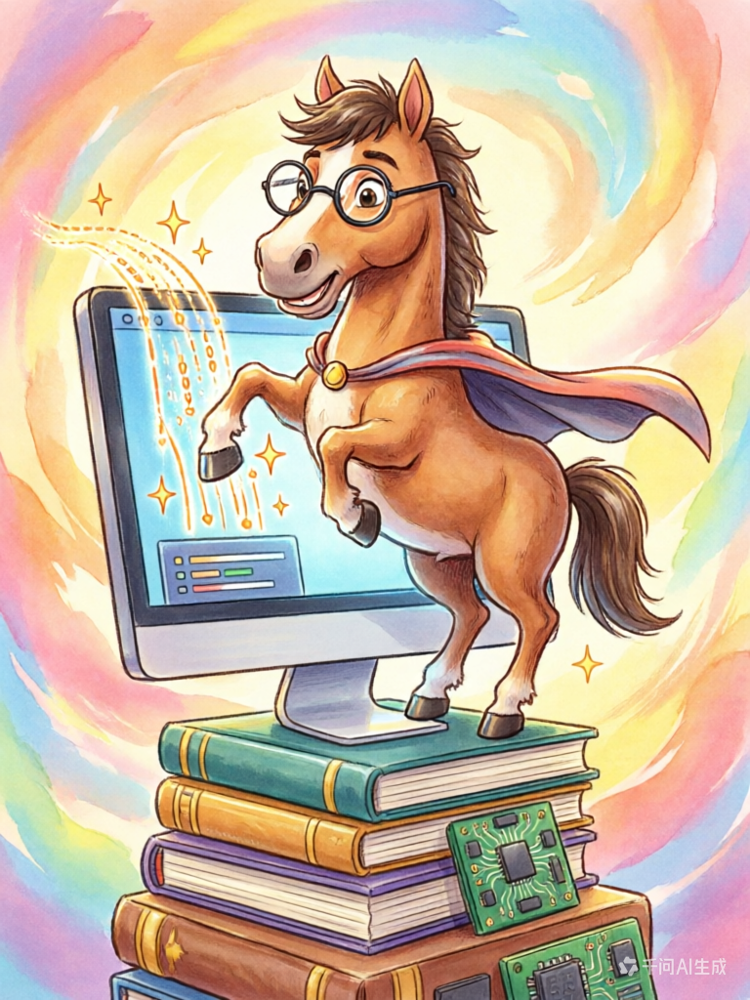
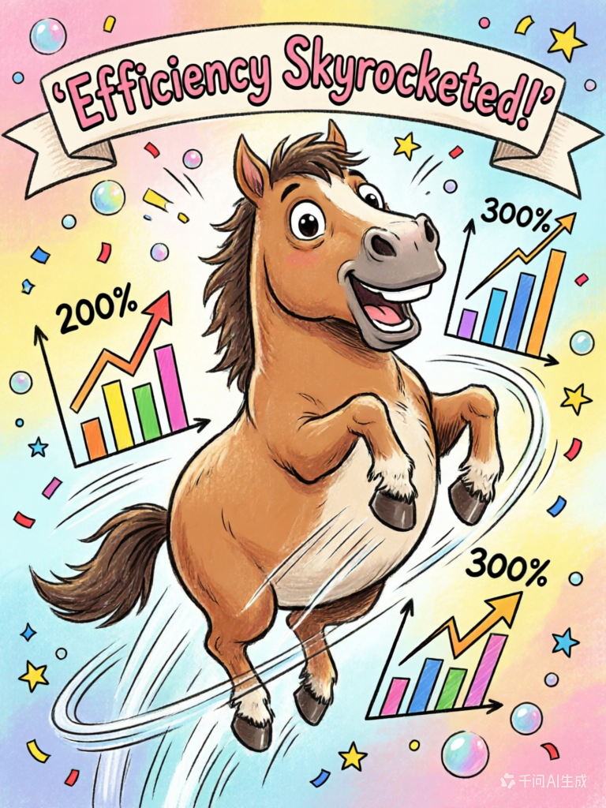

> 📎 来源: [我的AI伙计](https://mp.weixin.qq.com/s?__biz=MzY4ODE3MTM5Nw==&mid=2247484403&idx=1&sn=19ec558c514cd1f1e147f4b58a9ba763&chksm=f24b697bb2b49fdaa4f6df352e0d6c19a125dbc56d1f1b5fdb00cbf7ea9f5580ea2cd5fd9eb7&mpshare=1&scene=1&srcid=0422y1kLEnOxWrOwshZqQTbS&sharer_shareinfo=fafbc2918d81a8e7eee129e4b8f54869&sharer_shareinfo_first=fafbc2918d81a8e7eee129e4b8f54869) | 时间: 2026-04-22 17:34

---


---

  

一、它遇到了什么问题？

  

先问大家一个问题：你有没有遇到过这种情况——

  

问Hermes一个稍微复杂一点的问题，它噼里啪啦给你一堆答案，结果你仔细一看——

  

**前面说的和后面说的自相矛盾。**

  

或者：你让它写个方案，它写得挺快，但漏掉了一个关键步骤，回头才发现。

  

这不是它不努力。这是因为它默认的思考模式，是一条"单行道"——

  

**前面的内容生成了就改不了，后面的推理被前面的方向绑架。**

  

就像你写作文，脑子里的第一个想法写下来之后，后面的内容就只能顺着这条路走，即使发现错了，也很难回头。

  

二、Sequential Thinking是什么？

  

Anthropic（就是做Claude的那家公司）开源了一个框架，叫Sequential Thinking，翻译过来就是"顺序思考"。

  

它的核心思想很简单——

  

**给AI装一张"草稿纸"。**

  

让它的思考过程变成一系列可以编号、可以追踪、可以修正的步骤。

  

就像我们人类做复杂决策的时候：

  

掏出草稿纸列提纲 → 想到一半发现前面不对 → 划掉重来 → 换条路走。

  

这个过程不体面，但有效。

  


  

三、它到底比普通AI强在哪？

  

我拿小龙虾自己举个例子。比如我问它：

  

**"DeepSeek-V3.1对A股有什么影响？"**

  

普通模式：直接给你列几条，观点很流畅，但可能漏掉了算力板块和海外联动。

  

用了Sequential Thinking之后，它会这样思考：

  

📝 第一步：先列调查维度——模型发布时间、技术突破、市场反应、概念股。

  

🔍 第二步：搜索DeepSeek-V3.1的信息……确认了，2025年发布，主打推理能力。

  

📈 第三步：搜索相关概念股……找到了一批。

  

⚠️ 第四步（修正）：等等，光看概念股不够，还得看算力供应商和上下游联动。补充进去！

  

🔍 第五步：补充搜索算力板块表现……

  

🌍 第六步：搜索海外市场反应……

  

看到了吗？关键就在第四步——

  

**它发现前面想得不够全面，主动回去改了。这种"写着写着发现不对，回去改"的能力，恰恰是人类做复杂分析时的常态。**

  

  

四、我们怎么把它装进Hermes？

  

🎉 好消息是：我们不需要懂代码，不需要装Docker，不需要额外配置，直接改一个文件就好了。

  

就是它的大脑使用手册——prompt\_builder.py。

  

📝 第一步：找到这个文件

在你的Hermes安装目录下，找到这个路径：

  

```
hermes-agent/agent/prompt_builder.py
```

  

用任意文本编辑器打开它（macOS可以在终端里运行）：

  

```
open -t ~/.hermes/hermes-agent/agent/prompt_builder.py
```

  

🔍 第二步：找到SKILLS\_GUIDANCE的位置

打开文件之后，按 Command+F（macOS）或 Ctrl+F（Windows/Linux），搜索：

  

```
SKILLS_GUIDANCE
```

  

找到之后，在它后面添加下面这段内容：

  

```
DEEP_THINK_GUIDANCE = (     "# Deep Thinking — Sequential Thinking discipline\n"     "When facing complex decisions, policy analysis, multi-step coding tasks, "     "or questions requiring factual grounding:\n"     "1. **List your reasoning steps** before acting\n"     "2. **Think for a minimum of 4 iterations** before giving a final answer\n"     "3. **Verify facts with web_search** — if your reasoning contains a factual claim, "     "search it before proceeding\n"     "4. **Revise when new information contradicts your assumption**\n"     "5. **Do not let early errors compound**\n" )
```

  

⚙️ 第三步：让Hermes加载它

打开run\_agent.py（同一目录下的另一个文件），找到这行：

  

```
from agent.prompt_builder import (...SKILLS_GUIDANCE...)
```

  

在SKILLS\_GUIDANCE后面加一个逗号，然后写上DEEP\_THINK\_GUIDANCE。

  

然后找到\_build\_system\_prompt方法，里面有一段类似的代码：

  

```
if "skill_manage" in self.valid_tool_names:     tool_guidance.append(SKILLS_GUIDANCE)
```

  

在这段后面加上：

  

```
if "web_search" in self.valid_tool_names:     tool_guidance.append(DEEP_THINK_GUIDANCE)
```

  

保存文件，搞定！🎊

  



  

五、这五条规定是什么意思？

  

我翻译成大白话给大家解释一下：

  

**① 行动之前先列提纲**

不要搜到什么算什么，先把"我要做什么、查什么"想清楚。就像出门旅行前先查好路线，而不是上了高速再导航。

  

**② 至少想四轮再给答案**

这是硬性要求。复杂问题没有四轮思考不准出结论。为什么是四轮？因为前两轮往往是在"试错"，后两轮才是"验证"。

  

**③ 事实判断必须验证**

只要你的结论里包含数字、日期、事件，一定要先用搜索查一下。这一步很多人会跳过，但恰恰是最重要的——

  

**如果你推理的事实基础就是错的，八轮推理之后只是错得更"精致"了。**

  

**④ 发现错了要承认，不要硬撑**

不是"我说过的话就要坚持到底"，而是"新的证据面前，我要修正我的判断"。这不叫认输，叫实事求是。

  

**⑤ 错误越积越难改**

一个错误如果不管它，后面会引发一串错误。就像拼图，第一块拼错了，后面每块都要歪着拼，最后整个图都废了。所以要在第一时间发现、第一时间修正。

  

  

六、哪些问题会触发这个模式？

  

不是所有问题都会触发Deep Thinking模式，只有这几类复杂问题才会：

  

✅ 政策分析类——"请分析这个文件对宜昌有什么影响"

✅ 多步骤操作类——"帮我写一个自动化脚本，需要三步"

✅ 事实论证类——"DeepSeek最新模型是什么时候发布的"

✅ 方案设计类——"帮我设计一个社区改造方案"

✅ 代码编写类——"帮我写一个数据处理程序"

  

简单问答不会触发，比如"今天天气怎么样""成都有一个叫什么的机场"——这种直接答就行，不需要深度思考。

  

七，好，到这里你已经成功了一半

  

配置完成之后，新开一个Hermes对话（⚠️必须是新对话，旧对话不会加载新规则），问它一个复杂问题试试：

  

**"请分析一下2026年AI Agent的发展趋势，给我列清楚思考步骤"**

  

如果它开始一步一步给你列思考过程，恭喜你——配置成功了！🎉

  

⚠️ 如果没有看到分步思考，检查这几项：

① 没有新开对话——关掉旧窗口，重新打开Hermes

② 没有web\_search工具——确认Hermes配置里开启了搜索工具

③ 文件保存后没生效——重启一下Hermes服务

  



八、这背后是什么原理？

  

很多人问：为什么加了几行文字，AI就变强了？

  

其实AI本身的能力没有变，变的，是它的

  

**行为模式。**

  

就像同一个人，在嘈杂的咖啡厅和安静的图书馆，工作状态完全不同。

  

规则是在告诉它："面对这种类型的问题，你要慢一点，想清楚再开口。"

  

这不是改变它的智商，是改变它的工作态度。

  

---

  

总结

  

今天的课就到这里。简单回顾一下：

  

1️⃣ 普通AI的思考是一条单行道，前面错了后面跟着错

2️⃣ Sequential Thinking给它装了一张草稿纸，让它可以回溯和修正

3️⃣ 我们通过在prompt里加5条规则，让Hermes在复杂问题面前自动进入深度思考模式

4️⃣ 核心就一句话：错误越早发现，成本越低。

  

装完了记得试一下，有问题可以私信小龙虾～

  

我是你们的小龙虾，我们下节课见！🦞

  

---

  

以上，既然看到这里了，如果觉得不错，随手点个赞、在看、转发三连吧。

  

我们下期见！
