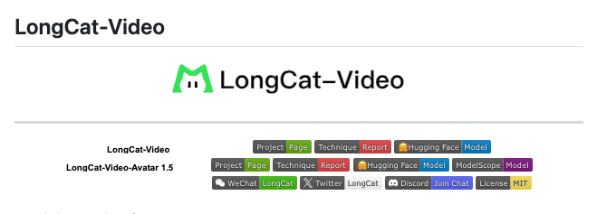
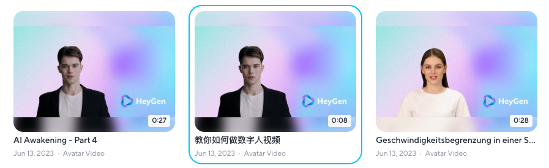
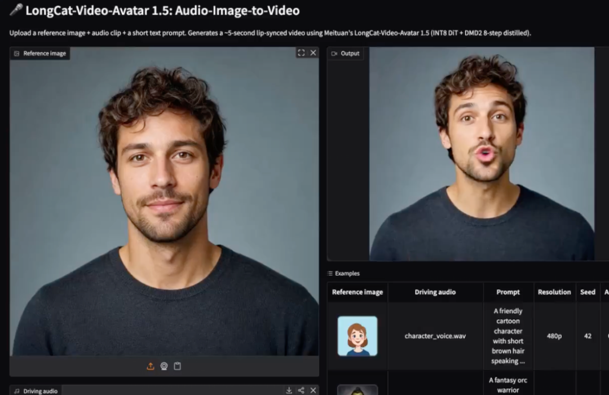
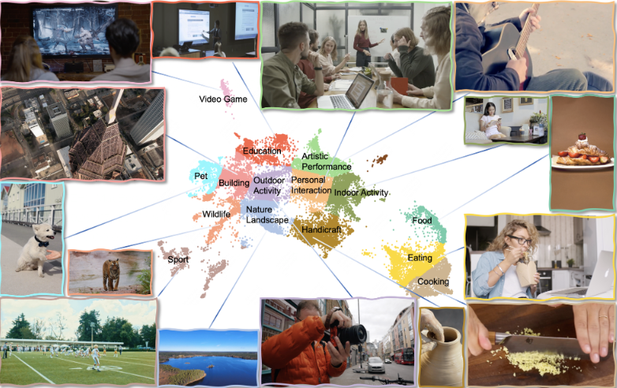
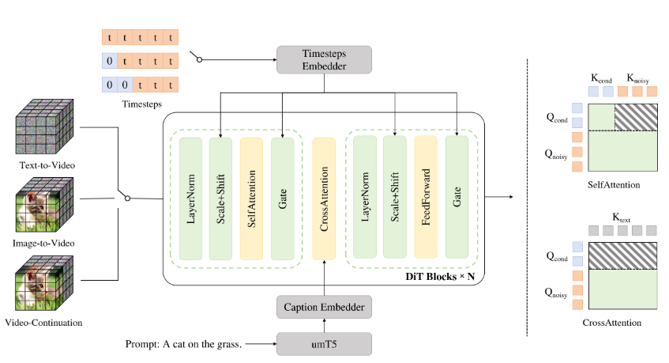
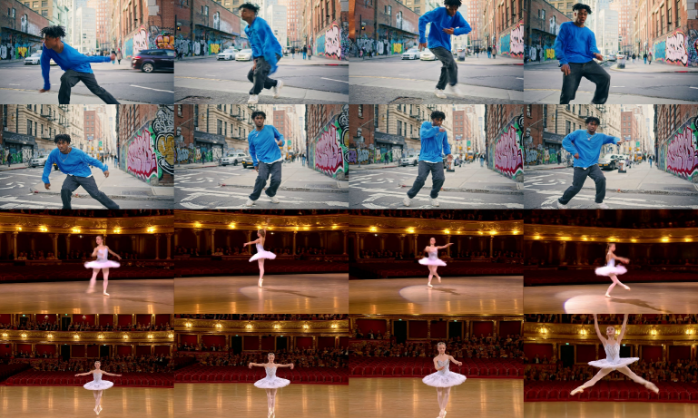

> 📎 来源: [Ai技能图谱](https://mp.weixin.qq.com/s?__biz=MzkwMjg3MDU1MQ==&mid=2247484783&idx=1&sn=4080aafe033c96f3da250fe16656cc5d&chksm=c119ddc97cdce898de12da824914862f0427bb718930ce43d1194e2bff61b23eaa2d98d0b6fe&mpshare=1&scene=1&srcid=0528gXIg30zCdG8AxgK9WK1v&sharer_shareinfo=3fa9e95126b6a9da0d8398ea5985f6de&sharer_shareinfo_first=3fa9e95126b6a9da0d8398ea5985f6de) | 时间: 2026-05-28 12:23

---

[阿里云硬刚字节跳动！万镜一刻全链路AI视频平台上线，Seedance迎来最强对手](https://mp.weixin.qq.com/s?__biz=MzkwMjg3MDU1MQ==&mid=2247484769&idx=1&sn=f085ab8edd6e7049b0b54c3184836bdd&scene=21#wechat_redirect)

[自媒体运营必存！AI生成图去水印最全方案，从开源工具到在线网站](https://mp.weixin.qq.com/s?__biz=MzkwMjg3MDU1MQ==&mid=2247484757&idx=1&sn=4bac944aadf1d1f03ec1c77d3266bce9&scene=21#wechat_redirect)

[语音Agent开发者的福音！Mega-ASR开源，远场混响识别率飙升](https://mp.weixin.qq.com/s?__biz=MzkwMjg3MDU1MQ==&mid=2247484746&idx=1&sn=887c843f889787ff69fed0be22054718&scene=21#wechat_redirect)

大家好，我是陶人，一个持续探索AI应用解决方案的探路者。

这一期我们来分享一下：**AI视频数字人"杀疯了"的应用赛道**

好家伙！就在前两天，美团LongCat团队直接甩了个王炸——

```
LongCat-Video-Avatar 1.5
```

，**MIT开源**，模型权重随便用，商业项目随便搞！



以前你要做个数字人带货视频，要么用**HeyGen按分钟付费，要么用Kling画脸飘嘴巴对不上，要么折腾半天只能用英语**。

现在？一张照片 + 一段录音 = 唇同步爆炸、自然眨眼、手势乱飞的说话视频。

而且支持**中文、英语、日语**，长视频脸不崩，多人对话各管各的，甚至唱歌跳舞动画真人全吃得下~

我用完的第一感受：**这波内容创作者血赚生产力！**

## 行业痛点

目前大家遇到的最大问题就是——市面上的数字人方案，**要么贵，要么烂，要么又贵又烂**。



- ```
  HeyGen
  ```

  ：收费按分钟算，长视频钱包受不了
- ```
  Kling
  ```

  ：嘴巴经常对不上，脸还会漂移
- ```
  Sonic
  ```

  、

  ```
  InfiniteTalk
  ```

  ：身份一致性不行，换个人脸就走样
- 其他闭源方案：基本绑定英文，中文支持稀烂

对于真正需要**批量产内容**的团队来说，这不光是烧钱的问题，是压根没法稳定复用。

**那么有没有一种既能免费本地跑、唇语又准、身份还不漂的方案呢？**

开源模型首先推荐LongCat-Video-Avatar 1.5，

```
MIT许可
```

 + 

```
Whisper-Large音频编码
```

，直接把数字人做到实用级！



LongCat-Video-Avatar 1.5 是美团基于自家13.6B参数的LongCat-Video基座模型搞出来的数字人专用版。



核心升级就三个：

**1️⃣ Whisper-Large音频编码器**

- 以前v1.0用的Wav2Vec2，现在直接上Whisper-Large-v3
- 唇型动态更丝滑，口型同步精度爆炸
- 支持100+语言，中文英语日语随便来

**2️⃣ DMD2 8步蒸馏推理**

- 正常跑50步，现在**8步搞定**
- 推理速度直接翻好几倍

**3️⃣ INT8量化**

- 显存占用大幅降低
- 消费级显卡也能跑



更重要的是，它在**6大场景**（新闻播报、知识教育、日常生活、娱乐、唱歌、商业推广）× **2种语言** × **2种风格**（真人/动漫）的508个测试对上，**超过了HeyGen、Kling Avatar 2.0、OmniHuman-1.5**这些商业闭源产品。

物理合理性、音画协调性、时间稳定性、身份一致性，四个维度全面领先~

## 效果展示

直接看几个能干啥：

**电商带货**

- 一张产品讲解人设图 + 一段不同语言录音
- 批量生成多个版本，测哪个开头和话术转化高
- 以前要真人出镜、录音、剪辑、反复改，现在一键批量跑

**AI虚拟讲师**

- 输入课件内容 + 一张照片
- 生成带表情讲PPT的视频

**多语言营销**

- 同一个人设，生成英语版、日语版、中文版
- 出海营销直接省掉重新拍摄的成本

**YouTuber不想露脸**

- 设个虚拟形象，录音就出视频
- 手势、眨眼、头部动作全自动

值得一提的是，它的**长视频续写**能力是真的顶。用

```
--num_segments
```

参数分段生成，视频拼接后**不会色漂、不会脸崩、不会身份走样**。

而且它还支持**多人对话**——双音频输入，可以是两人同时说话（合并模式），也可以是你一句我一句（拼接模式），用

```
run_demo_avatar_multi_audio_to_video.py
```

就行。

## 部署教程

话不多说，直接上手。需要一张NVIDIA显卡（显存8G+推荐）。

说一千道一万，不如动手跑一遍。

### 1、克隆项目

```
git clone --single-branch --branch main https://github.com/meituan-longcat/LongCat-Videocd LongCat-Video
```

### 2、创建环境

```
conda create -n longcat-video python=3.10conda activate longcat-video# 根据你的CUDA版本安装PyTorchpip install torch==2.6.0+cu124 torchvision==0.21.0+cu124 torchaudio==2.6.0 --index-url https://download.pytorch.org/whl/cu124# 安装flash-attnpip install ninja psutil packagingpip install flash_attn==2.7.4.post1# 安装依赖pip install -r requirements.txt# 安装Avatar专用依赖conda install -c conda-forge librosa ffmpegpip install -r requirements_avatar.txt
```

### 3、下载模型

```
pip install "huggingface_hub[cli]"huggingface-cli download meituan-longcat/LongCat-Video --local-dir ./weights/LongCat-Videohuggingface-cli download meituan-longcat/LongCat-Video-Avatar-1.5 --local-dir ./weights/LongCat-Video-Avatar-1.5
```

### 4、跑个Demo

单人音频→视频（AT2V）：

```
torchrun --nproc_per_node=2 run_demo_avatar_single_audio_to_video.py \  --context_parallel_size=2 \  --checkpoint_dir=./weights/LongCat-Video-Avatar-1.5 \  --stage_1=at2v \  --input_json=assets/avatar/single_example_1.json \  --use_distill --model_type avatar-v1.5 --use_int8
```

> 模型文件大约**13.6B参数**，首次加载稍慢，但加上

> ```
> --use_int8
> ```

> 后显存占用会友好很多。

### 5、进阶参数



> - • **口型精度**：调整

>   ```
>   --audio_cfg
>   ```

>   （默认3-5），越大越准
> - • **提示词优化**：描述越详细越好，比如"一个年轻女性，长发，白色衬衫，坐在咖啡店说话微笑"
> - • **重复动作**：设置

>   ```
>   --ref_img_index=30
>   ```

>   可减少重复动作
> - • **分辨率**：

>   ```
>   --resolution
>   ```

>   支持480P和720P
> - • **长视频**：加

>   ```
>   --num_segments=5 --ref_img_index=10 --mask_frame_range=3
>   ```

**显存不够？** 还有社区加速方案——

```
CacheDiT
```

可以提速约1.7倍，容器化UI封装也有：

```
github.com/AI-KSK/longcat-avatar15-container-ui
```

不想本地部署的，直接去Hugging Face Space在线体验：

```
https://huggingface.co/spaces/victor/LongCat-Video-Avatar-1.5
```

## 最后

现在大多数AI公司出模型，要么权重不公开，要么挂个非商业许可，创业公司想用还得提心吊胆。**LongCat直接上MIT许可**，意味着你可以：

- 拿去商用
- 随便修改
- 二次分发
- 甚至接进自己的产品

对于做内容的朋友来说，这套东西最大的价值不是炫技，而是快速迭代想法，然后批量**测素材**。

一张人设图，配不同语言、不同话术、不同开头，批量跑出几十个版本，**哪个转化高就投哪个**。
