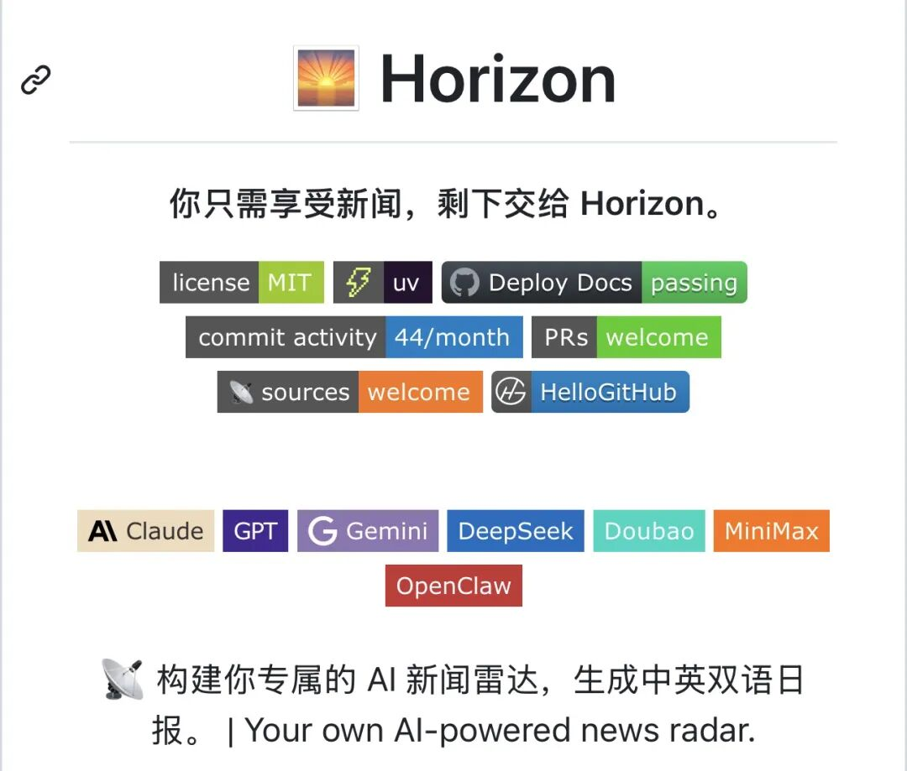
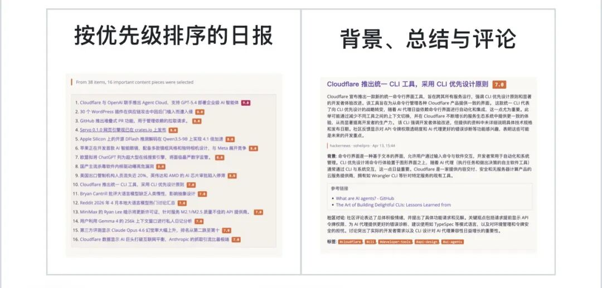

> 📎 来源: [科技Duang实验室](https://mp.weixin.qq.com/s?__biz=MzYzMTEwNDQ3OQ==&mid=2247483929&idx=1&sn=9a215ab3e42b854775cc3bd67a2a158c&chksm=f14af60ab3bc23c3f2d91a65067393de242b31c2cfc21b374ed16a14872b4819462dd02fc522&mpshare=1&scene=1&srcid=0511mJjhgWkHcz4MQ1BwFpAN&sharer_shareinfo=dbd75b26d27c14ca4ed863b1016d3dba&sharer_shareinfo_first=dbd75b26d27c14ca4ed863b1016d3dba) | 时间: 2026-05-10 17:50

---

## 📡 Horizon：打造你的专属 AI 新闻雷达

在信息爆炸的今天，好消息散落各处，坏消息却无穷无尽。每天刷 Hacker News、Reddit、RSS、GitHub... 你是否也感到信息过载？

今天给大家推荐一个开源项目 **Horizon** —— 一个由 AI 驱动的个人新闻雷达，帮你从海量信息中筛选出真正有价值的内容。

---

## ✨ Horizon 是什么？

Horizon 不是另一个简单的摘要工具。它是一个完整的新闻处理流水线，从多源采集到 AI 评分，从去重到内容丰富，最终生成双语每日简报。

### 核心特性

**📡 多源聚合**

- ●Hacker News 热门故事
- ●任意 RSS / Atom 订阅源
- ●Reddit 子版块和用户动态
- ●GitHub 用户活动和项目发布

**🤖 AI 智能筛选**

- ●使用 Claude、GPT、Gemini、DeepSeek、豆包、MiniMax 等大模型
- ●每条新闻 0-10 分智能评分
- ●自定义阈值过滤噪音

**🔗 智能去重**

- ●跨平台合并相同报道
- ●避免同一故事反复出现

**🔍 上下文丰富**

- ●自动搜索不熟悉的概念、公司、项目、技术术语
- ●补充背景知识，帮助理解

**💬 社区评论汇总**

- ●收集并摘要 Hacker News、Reddit 等平台的社区讨论
- ●不错过那些能改变你看法的精彩评论

**🌐 双语输出**

- ●同时生成中英文简报
- ●一份数据源，两份阅读体验
- 

---

## 🛠️ 工作原理

Horizon 的处理流程清晰而高效：

1. ●**获取 (Fetch)** —— 并发拉取所有配置源的最新内容
2. ●**去重 (Deduplicate)** —— 合并指向同一故事或 URL 的条目
3. ●**评分过滤 (Score & Filter)** —— AI 排名，只保留阈值以上的内容
4. ●**丰富 (Enrich)** —— 搜索背景信息，收集社区讨论
5. ●**摘要 (Summarize)** —— 生成结构化的 Markdown 简报
6. ●**交付 (Deliver)** —— 发布到 GitHub Pages、邮件、Webhook、本地文件

## 📤 多种交付方式

| 渠道 | 功能 |
| --- | --- |
| **GitHub Pages** | 自动生成每日更新的简报网站 |
| **邮件订阅** | SMTP/IMAP 新闻通讯，自动处理订阅/退订 |
| **Webhook 通知** | 推送到飞书、钉钉、Slack、Discord 或自定义端点 |
| **MCP 服务** | 将 Horizon 流水线暴露为工具，供 AI 助手调用 |

---

## ⚙️ GitHub Actions 自动化

最推荐的使用方式：配置为 GitHub Actions 定时任务，每天自动生成简报并发布到 GitHub Pages。

项目自带 完整的 workflow 示例，开箱即用。

---

## 🎯 为什么选择 Horizon？

**不是简单的摘要，而是真正的过滤**

- ●AI 擅长减少噪音，但新闻仍需要人的品味
- ●你信任的来源、能改变你看法的评论、只有人才能发现的隐藏宝藏
- ●Horizon 通过可自定义的来源、阈值、模型、语言、交付渠道，将人的判断保留在循环中

## 🎉 总结

在这个信息过载的时代，Horizon 给了你一个属于自己的新闻雷达。它不是替你做判断，而是帮你把 90% 的噪音过滤掉，让你只需要阅读那最有价值的 10%。

如果你也厌倦了在各个平台反复刷内容，不妨试试 Horizon。建立你的专属信息流，让 AI 帮你看门，你只需要阅读真正重要的。

**项目地址：** github.com/Thysrael/Horizon
