> 📎 来源: [纳思稻壳](https://mp.weixin.qq.com/s?__biz=MjM5MzY0NTk2MQ==&mid=2447977447&idx=1&sn=45059572fd3fffa8e29b5f7538582dd1&chksm=b3e4d2bf0015c10a18e3c53cffde2422e249fb9271bacdea2e289821bc7fa674993123ae0580&mpshare=1&scene=1&srcid=0529Sr1ruavSOV0XsCAFb9sk&sharer_shareinfo=1a8856f1d39c5d12b7db1503dd632608&sharer_shareinfo_first=1a8856f1d39c5d12b7db1503dd632608) | 时间: 2026-05-29 12:24

---

你有没有这种感觉——每天刷了半小时手机，看完什么都没记住，全是算法推给你的东西。

Horizon 是 GitHub 上一个开源项目，从 RSS、Hacker News、Reddit、Telegram 等地方抓内容，用 AI 打分过滤，把值得看的东西整理成一份日报，推到你邮件或者飞书。目前 2.6k star，还在活跃更新。

这篇文章说的是怎么在飞牛 NAS 上用 Docker 把它跑起来。全程在电脑和飞牛网页界面操作，不需要敲命令行。

---

## 你需要准备什么

**一个 AI 的 API Key。** Horizon 支持 DeepSeek、豆包、GPT、Claude 等，任选一个。国内推荐 DeepSeek，去 platform.deepseek.com 注册，充 5 块钱够跑很久。拿到 API Key 先存到记事本备用。

**飞牛 NAS 的 Docker 功能已开启。** 飞牛 OS 默认支持 Docker，在应用中心确认已安装即可。

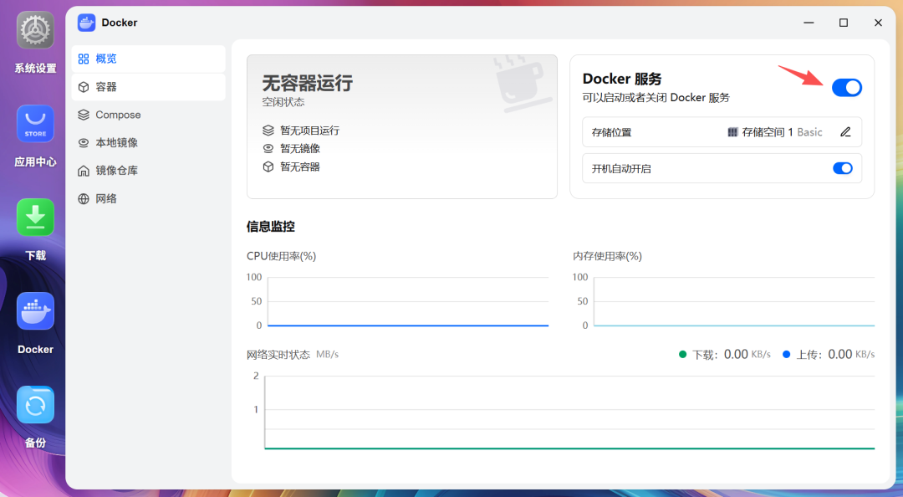

---

## 第一步：下载项目到电脑

打开浏览器，访问 github.com/Thysrael/Horizon。

点击页面右上角绿色的 Code 按钮，选择 Download ZIP，把文件下载到电脑。下载完成后解压，你会得到一个叫 `Horizon-main` 的文件夹。

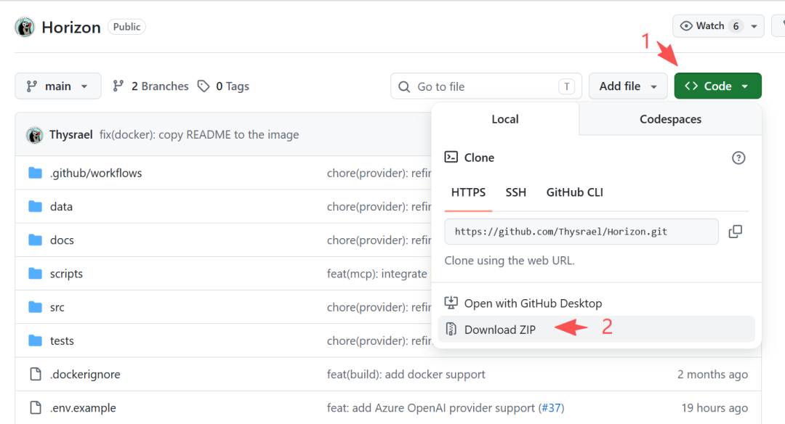

---

## 第二步：修改配置文件

这步在电脑上完成，用系统自带的文本编辑器就行（Windows 用记事本，Mac 用文本编辑）。

打开解压后的 `Horizon-main` 文件夹，你会看到一个 `.env.example` 文件和一个 `data` 子文件夹。

**处理 `.env` 文件**

把 `.env.example` 复制一份，重命名为 `.env`（去掉 `.example`）。

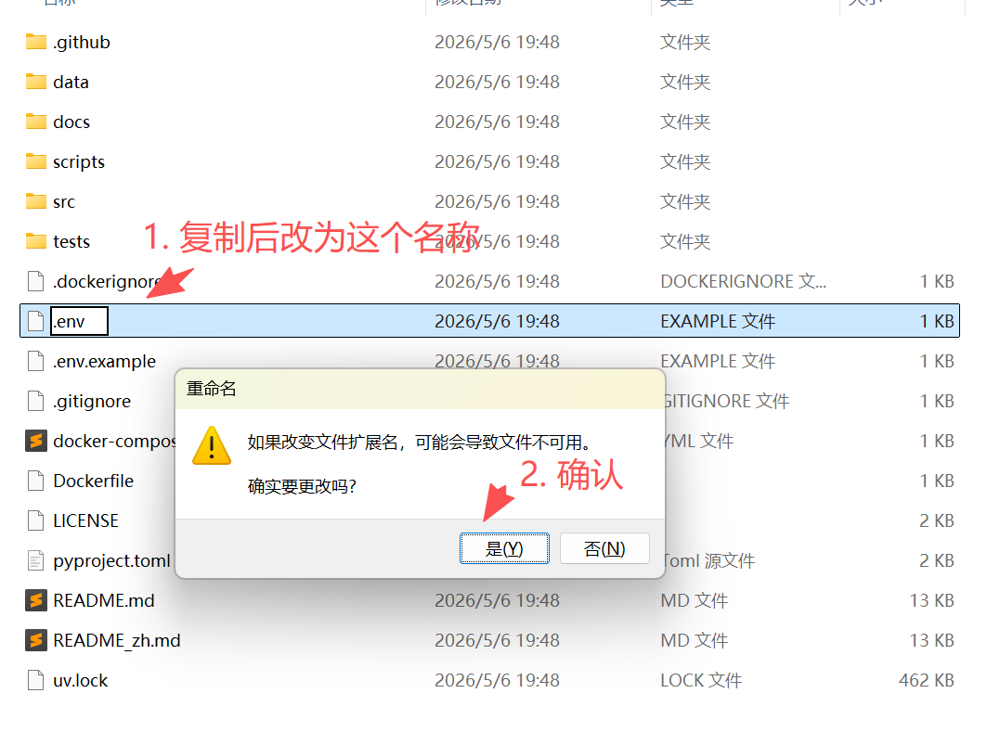

注意：Windows 默认不显示文件扩展名，重命名时可能看不到 `.example` 后缀。建议先在文件夹选项里勾选"显示文件扩展名"，再操作。

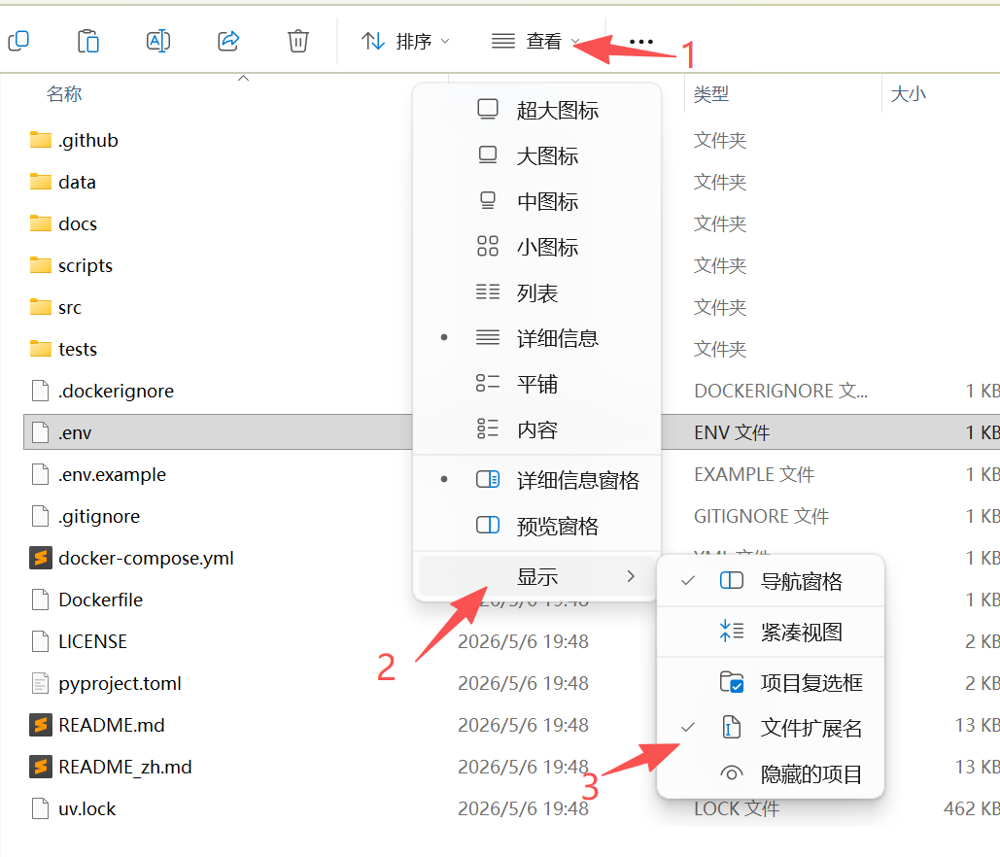

用文本编辑器打开 `.env`，找到类似这样的一行：

```
DEEPSEEK_API_KEY=sk-your_api_key_here
```

> 把 `your_api_key_here` 替换成你的 DeepSeek API Key，保存。

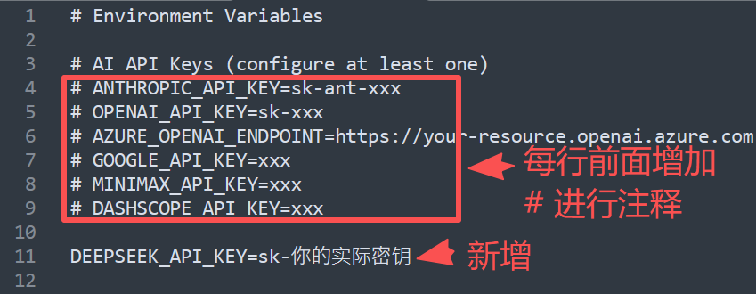

**处理 `config.json` 文件**

进入 `data` 子文件夹，用文本编辑器打开 `config.json`，把里面的内容全部替换成下面这段：

```
{  "ai":{    "provider":"openai",    "model":"deepseek-chat",    "api_key_env":"DEEPSEEK_API_KEY",    "base_url":"https://api.deepseek.com/v1",    "throttle_sec":0},"sources":{    "rss":[      {"name":"少数派","url":"https://sspai.com/feed"},      {"name":"36氪","url":"https://36kr.com/feed"}    ]},"filtering":{    "ai_score_threshold":6.0}}
```

`ai_score_threshold` 是 AI 打分门槛，0~10 分，设 6 表示只保留 6 分以上的内容。日报太少就调低，太多就调高。保存文件。

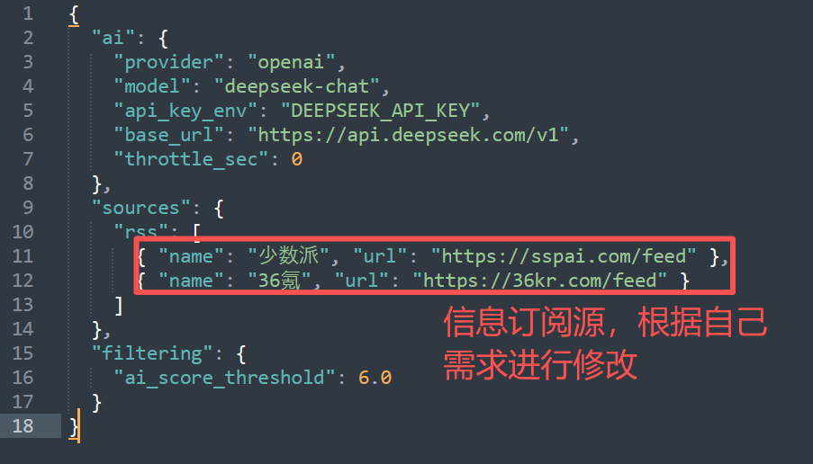

完整配置请查看配置指南。

---

## 第三步：把文件上传到飞牛

打开飞牛的网页管理界面，进入文件管理器。

在你常用的位置（比如 `/vol1/1000/docker/`）新建一个文件夹，命名为 `Horizon`。

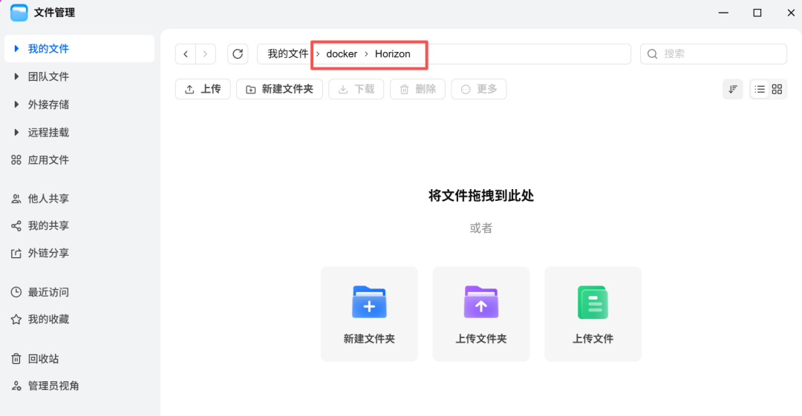

把电脑上 `Horizon-main` 文件夹里的所有内容上传进去。飞牛文件管理器支持直接拖拽上传，把文件夹里的所有文件和子文件夹拖进去就行。

上传完成后，确认飞牛里的 `Horizon` 文件夹结构和下面一致，特别是 `.env` 和 `data/config.json` 这两个文件要在：

```
Horizon/├── .env                    ← 你修改过的├── docker-compose.yml├── Dockerfile├── data/│   └── config.json         ← 你修改过的└── ...
```

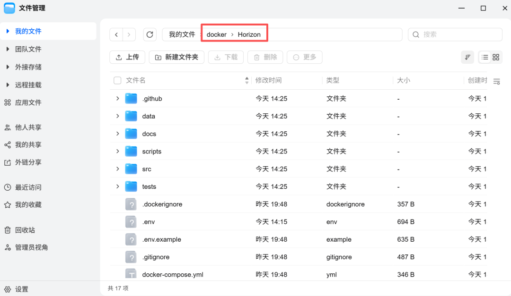

---

## 第四步：Compose 部署

打开飞牛的 Docker 应用，点击左侧菜单的 Compose，再点右上角的"新增项目"。

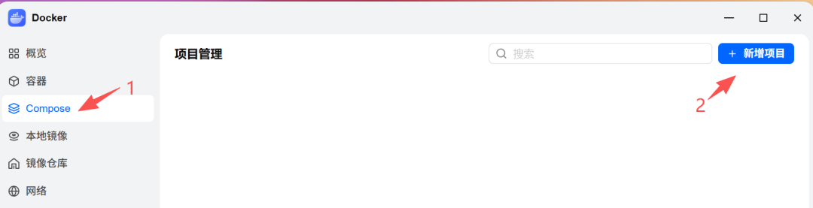

弹出"创建项目"对话框，按下面填写：

**项目名称** 随便填，比如 `horizon`。

**路径** 点击右侧文件夹图标，选择你在第三步上传 Horizon 文件的那个文件夹，比如 `/vol1/1000/docker/Horizon`。

**来源** 选"上传 docker-compose.yml"，然后在下方点击选择，把电脑上 `Horizon` 文件夹里的 `docker-compose.yml` 文件上传进来。

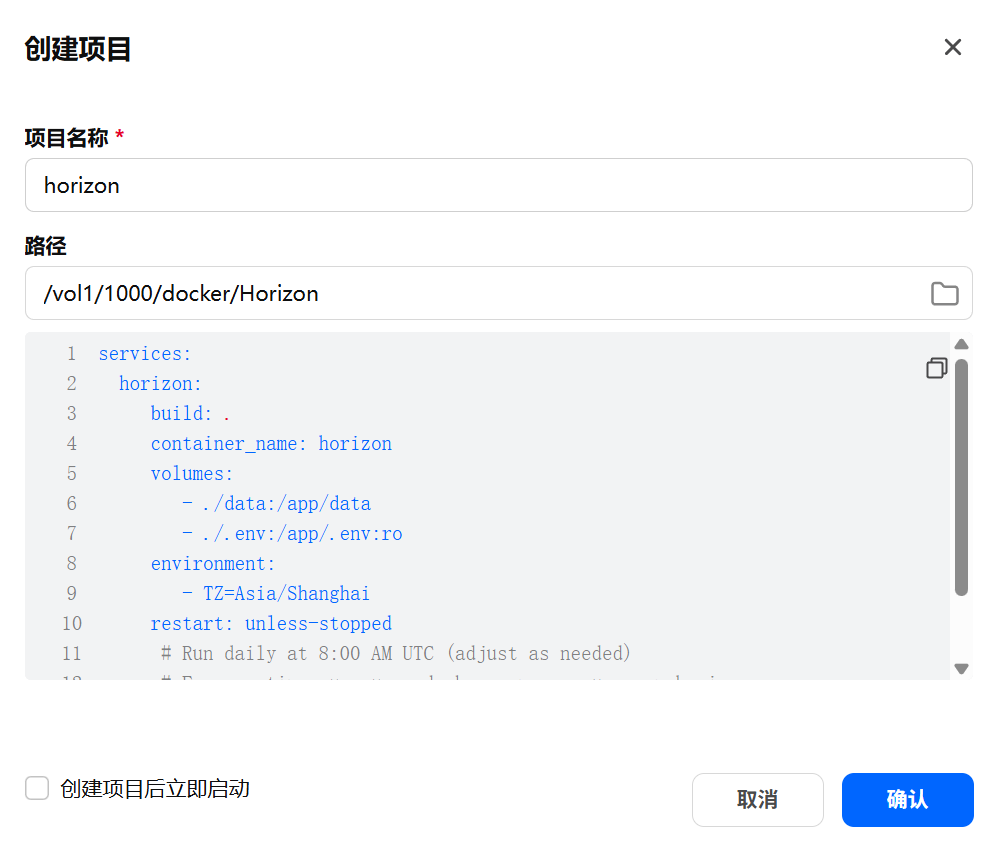

这里先不要勾选"创建项目后立即启动"，点确认。

项目创建好之后，在 Compose 列表里找到刚才建的 `horizon` 项目，点击页面右边启动按钮，手动点一次"启动"。Horizon 会开始拉取镜像，第一次大约几百 MB，等网速。拉完之后自动运行，抓新闻、AI 打分、生成日报。

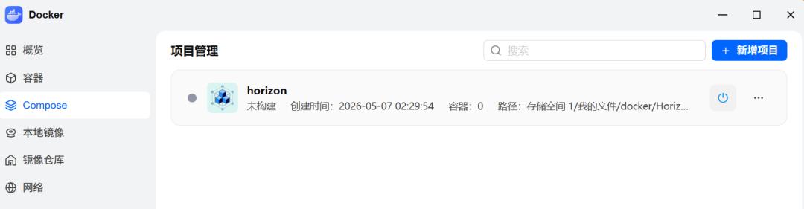

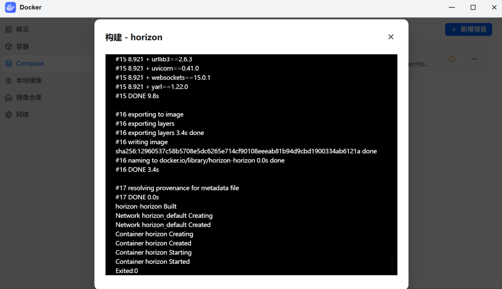

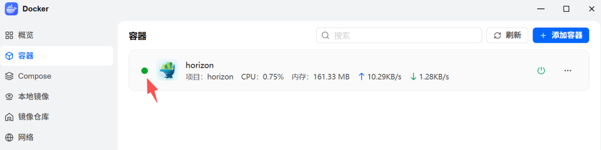

日报生成完成后，回到飞牛文件管理器，进入 `Horizon/data/summaries/` 文件夹，就能看到生成好的 Markdown 日报文件。后续如果想重新跑一次，回到 Compose 里把容器停掉再启动就行。

---

## 推送到手机（可选）

日报放在 NAS 文件夹里还是要专门去翻。更方便的做法是推送到飞书群。

先在飞书群里添加"自定义机器人"，拿到 Webhook 地址。然后在电脑上打开 `data/config.json`，在最外层加上：

```
"outputs": {  "webhook": {    "feishu": "https://open.feishu.cn/open-apis/bot/v2/hook/你的地址"  }}
```

改完再上传覆盖飞牛里的 `config.json`，下次 Horizon 跑完就会自动推到飞书。

---

## 跑不起来怎么办

**docker-compose 命令报错：** 飞牛的 Docker 版本可能叫 `docker compose`（没有横线），把命令里的 `docker-compose` 改成 `docker compose` 试试。

**日报是空的：** 大概率是 API Key 填错了，或者打分门槛太高。先把 `ai_score_threshold` 改成 `3.0`，重新上传 config.json 再跑一次。

**看不到 `.env` 文件：** 飞牛文件管理器默认隐藏点开头的文件，在设置里开启"显示隐藏文件"就能看到。

---

项目地址：github.com/Thysrael/Horizon，配置文档在里面写得很详细。飞牛用户遇到具体问题可以在评论区说。
