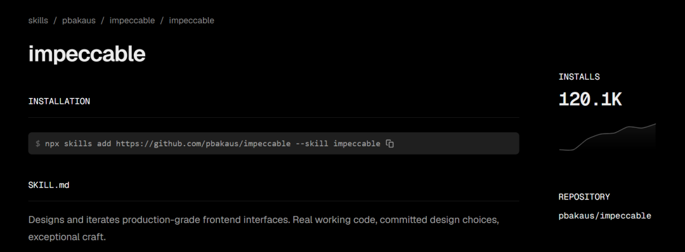
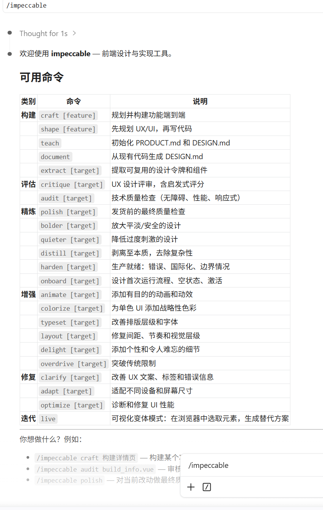

> 📎 来源: [考拉搞AI](https://mp.weixin.qq.com/s?__biz=MzUyODE4MjQxOQ==&mid=2247484482&idx=1&sn=242e188f18b312b3ec88d4b56af17c87&chksm=fb556d182641299fe8c1070edff8712ac44179049a1f28a0cd05b84c806921d63ed9e9dffb77&mpshare=1&scene=1&srcid=0527ZJ2zodZK1H3Nlw9yjGju&sharer_shareinfo=2cbfc2abe9b1e62a9d2e7cfd23ba83af&sharer_shareinfo_first=2cbfc2abe9b1e62a9d2e7cfd23ba83af) | 时间: 2026-05-27 00:07

---

> AI 生成的界面都长一个样，这不仅是审美疲劳，更是实实在在的商业损失。B2B 客户在首页停留不到 30 秒，如果界面看着像业余作品，整个产品的专业度都会被打上问号。

> ```
> Impeccable
> ```

>  正是为此而生——它不是组件库，不是 CSS 框架，而是一套给 AI 注入专业设计品味的技能框架。装上它，你团队里的前端代码将直接拥有专业的视觉系统。

## 一、Impeccable 是什么？为什么你需要它？

### 1.1 从“AI 塑料感”到“一眼专业”

如果你经常用 AI 生成前端代码，下面的描述你一定不陌生：Inter 字体、紫到蓝的渐变背景、卡片套卡片、灰色文字配彩色背景、正中间一个大数字下面一个小标签……社区给这种现象起了个名字——“AI 塑料感”（AI slop）。

问题不是大模型不懂设计。

```
Claude
```

 和 

```
GPT
```

 完全知道什么是 OKLCH 调色、什么是垂直排版节奏、什么是 8px 基线网格——但它们不会主动用，因为没人问。

```
Impeccable
```

 给 AI 装上了一套“专业审美大脑”。它不是告诉你“要做好的设计”，而是用具体的设计词汇、明确的反模式约束和结构化的命令体系，让 AI 在生成代码时自动应用专业的设计决策。

git 120K star 力荐：



### 1.2 谁创造了它？

```
Impeccable
```

 的创始人是 Paul Bakaus，他曾是 Google Chrome DevTools 的产品负责人，也是 jQuery UI 的创造者——这个界面库曾驱动了当时互联网约 20% 的网站。他的职业生涯有一个清晰的模式：每当时技术变革在工具和开发者之间制造鸿沟，他就去架一座桥。

```
Impeccable
```

 就是他架的新桥。项目上线后迅速在 GitHub 冲上 15,000+ 星，短短四个月便成为 

```
Claude Code
```

 生态中最受欢迎的设计类 Skill。

## 二、Impeccable 的核心优势：让设计成为 AI 的默认行为

### 2.1 三大支柱，彻底改变 AI 的设计输出

#### 第一支柱：七份领域级设计参考文件

Impeccable 内置了字体排印、色彩与对比度（使用 OKLCH 色彩空间）、空间与布局、动效与交互、响应式设计、UX 文案等七个设计领域的深度技术指南。

它的技术深度远超泛泛的教程——排版指南不仅会告诉你“用好字体”，还解释了垂直节奏的工作原理、FOUT（无样式文字闪烁）的发生机制和如何用 size-adjust 修复它，以及什么时候用 clamp() 做流式字体其实是错误选择。

#### 第二支柱：20 条设计命令，建立专业的设计词汇表

大多数人不会用“垂直节奏”“基线网格”“认知负荷”这类术语去指挥 AI——不是因为不想，而是因为词汇量不够。Impeccable 的 20 条命令填补了这个鸿沟：

| 命令 | 作用 |
| --- | --- |
| /teach-impeccable | 一次性建立设计上下文，保存到 .impeccable.md |
| /audit | 可访问性、性能、响应式全面检查 |
| /critique | UX 审查：视觉层次、信息架构、情感共鸣 |
| /polish | 交付前的像素级润色 |
| /bolder | 强化过于保守平庸的设计 |
| /overdrive | 实现高级技术野心：WebGL 着色器、弹簧物理动画等 |

#### 第三支柱：25 条确定性反模式检测

```
Impeccable
```

 明确告诉 AI 不该做什么：禁止默认使用 Inter 字体、禁止用纯黑而不加色调、禁止卡片套卡片、禁止使用对比度不足的配色……这些约束直接对抗大模型在训练数据中习得的不良模式，比单纯告诉 AI“生成更好的设计”效果显著更好。

### 2.2 真实的商业价值

对于 B2B SaaS 公司，界面质量直接影响转化率。UX 研究显示，专业设计能将用户感知的可信度提升 75%，将落地页的跳出率降低 38%。

一个潜在客户从你的营销邮件点击进来，看到的是一个带着“AI 塑料感”的界面——即便你的技术能力再强，第一印象已经输了。Impeccable 让没有设计预算的技术团队也能输出专业级界面，这对于早期创业公司尤其关键。

## 三、快速上手：30 秒安装，立即生效

### 3.1 三种安装方式，任选其一

方法 A：通用命令（推荐）

```
npx skills add https://github.com/pbakaus/impeccable --skill impeccable
```

这个命令会自动检测你的 AI 工具（Claude Code、Cursor、Gemini CLI、Codex CLI、VS Code Copilot 等），并将文件放到正确位置。

可以查看这个：

[一天一个SKILL——前端最佳自动化测试 webapp-testing](https://mp.weixin.qq.com/s?__biz=MzUyODE4MjQxOQ==&mid=2247484243&idx=1&sn=959174474c36059e6721680babd93eb3&scene=21#wechat_redirect)

 方法 B：插件市场安装

```
/plugin marketplace add pbakaus/impeccable
```

方法 C：手动部署

```
cp -r dist/claude-code/.claude your-project/
```

### 3.2 第一次使用：建立设计上下文

安装完成后，在 

```
Claude Code
```

 中执行 

```
/teach-impeccable
```

，

```
Claude
```

 会询问目标用户、使用场景、品牌调性等关键设计信息，生成一个 

```
Impeccable.md
```

 文件。在后续会话中，这些设计上下文会被自动加载。

这一步是关键——让 AI 知道你项目的设计上下文，比任何提示词都管用。AI 之所以生成平庸的输出，很大程度上是因为对项目背景一无所知，只能选择最“安全”但最乏味的方案。

### 3.3 vscode +claude code 使用习惯使用vscode➕Claude code的童鞋就更简单和丝滑了，打开项目，直接输入SKILL，按照提示来一步一步使用。



## 四、实战工作流：从零到产品级的完整路径

### 4.1 工作流 A：从零构建新功能

```
1. /teach-impeccable   # 建立设计上下文2. /audit wireframe    # 检查原型3. /arrange layout     # 修复布局4. /typeset            # 优化排版5. /colorize           # 建立色彩6. /animate            # 添加动效7. /polish             # 最终润色
```

### 4.2 工作流 B：优化现有页面

```
1. /audit header       # 检查头部问题2. /critique           # UX 层面评估3. /quieter            # 降低视觉噪音4. /polish checkout    # 针对支付流程优化
```

### 4.3 工作流 C：接入企业设计系统

```
1. /normalize          # 识别与设计系统的偏差2. /extract            # 提取可复用组件和 Design Token3. /polish             # 标准化润色
```

## 总结

六年前，前端开发者比谁会手写复杂的 CSS 动画；三年前，我们讨论 Tailwind 和组件化；现在，当 AI 能几秒生成整个界面时，真正的分水岭变成了——AI 生成的界面，像不像专业设计师的作品。

```
Impeccable
```

 不是“让 AI 写得更好”，而是 “让 AI 知道什么是好的设计，并且默认就去执行它”。

把专业设计品味注入 AI，这才是 2026 年前端开发者的核心竞争力。

想了解更多 

```
Impeccable
```

 的实战技巧？欢迎留言交流。
