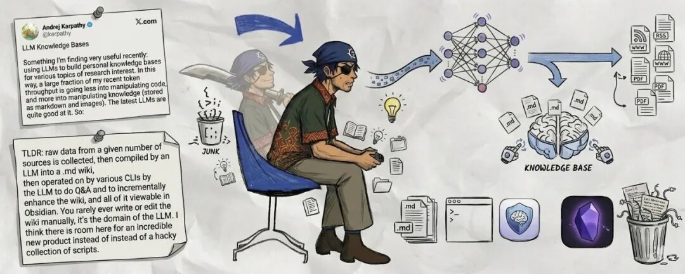
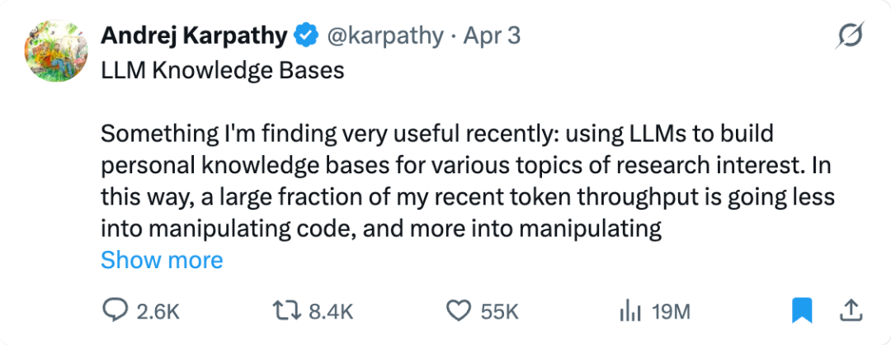
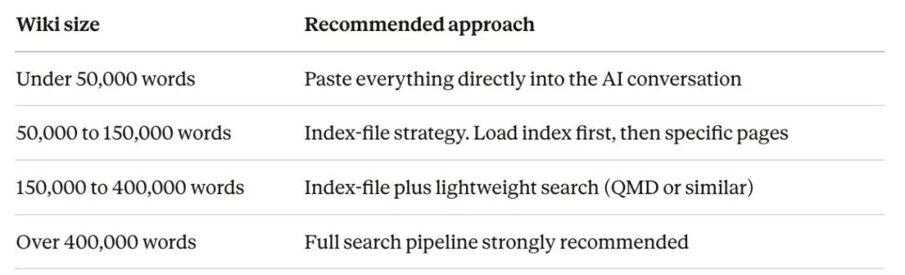
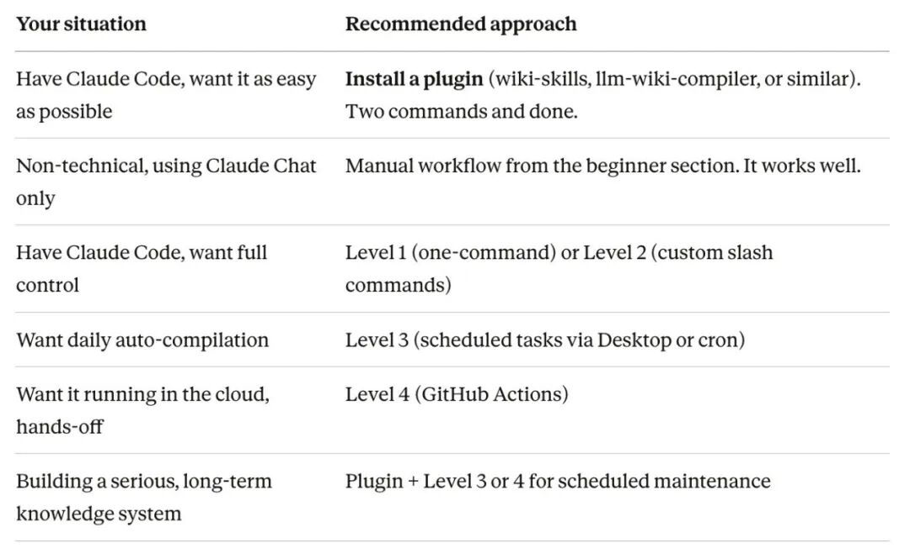

> 📎 来源: [石榴爸爸AI实战](https://mp.weixin.qq.com/s?__biz=MzE5ODQyNTE3Ng==&mid=2247484163&idx=1&sn=1c0d5e579aa20d5a7e94816d81fba5f0&chksm=97703b5cd7cd77b5ed6e6cbf9cdd0985b63f642bfa540a20d068554ea30c8fa1593903418f0c&mpshare=1&scene=1&srcid=0511td8BKNsaogO9A8mHzj2q&sharer_shareinfo=d24502b4a29059b52c0d690d068ecf13&sharer_shareinfo_first=d24502b4a29059b52c0d690d068ecf13) | 时间: 2026-05-11 00:07

---

哈喽，我是石榴爸爸

在推特上面看到一篇巨长，巨干货的文章，关于怎么用 claude+obsidian 构建自己的LLM知识库，我把文章翻译过来，并加上了我的理解

看不懂没关系，收藏起来慢慢看···

这一篇很适合拿来做知识库启蒙的长文。它真正有价值的地方，不是教你把 Obsidian 配得多复杂，而是把 

```
raw + wiki + CLAUDE.md
```

 这套最小结构讲清楚，让 AI 从“问完就忘的聊天工具”变成“会持续积累的知识基础设施”。

```
⚠️ 全文 15000 字，阅读需要 20 分钟；最小实操 2 小时
```

## 我的看法

1. 这篇最有价值的，不是插件和自动化层，而是它把“知识库”讲成了一个会复利的回填系统。
2. 对当前新手阶段的人来说，最该学的是 

   ```
   raw + wiki + CLAUDE.md
   ```

    这个最小闭环，而不是一开始就冲 Level 4、Level 5。
3. 它和 Karpathy 那条思路最关键的共识是：AI 不该只是“问完就忘”的聊天窗口，而要变成一个持续长大的知识基础设施。
4. 如果你已经在用 Obsidian，这篇最值得迁移的动作只有 3 个：固定原始资料入口、固定编译后的 wiki 区、固定每次问答都回填。
5. 原始链接：https://x.com/hooeem/status/2041196025906418094?s=46



如果你能学会怎么搭建一个 LLM 知识库，那本质上你就在给自己做一个“外脑”。而且这件事不只是帮你查资料这么简单，它可能会改变你经营业务、做内容、管理人脉，甚至组织生活的方式。你完全可以围绕不同主题，搭出多个“个性化外脑”，随时调用。说得更现实一点，如果你能把这套方法讲明白、做出来，甚至可能还能在你所在的本地市场里找到机会，帮周边商家搭他们自己的“业务外脑”。

**为什么最近这件事突然火起来了？**

因为 Andrej Karpathy 展示了他自己是怎么使用 LLM 知识库的，本质上就是把它当成外脑来用。



> 我最近发现一件非常有用的事：用 LLM 来构建某些研究主题的个人知识库。这样一来，我最近大量的 token 消耗，不再主要花在“折腾代码”上，而是更多花在“整理知识”上。

所以，我想把这套系统完整地拆开讲一遍，一步一步带你走。期间我还和我的老伙计 Claude 来回讨论了几轮，最后我们决定把它分成 3 个版本来讲，方便不同阶段的人直接挑适合自己的部分。

你可以这样选：

1. 完全新手：按 

   ```
   Ctrl + F
   ```

    搜索 

   ```
   你的第一个知识库
   ```
2. 已经比较熟悉 AI 工具：按 

   ```
   Ctrl + F
   ```

    搜索 

   ```
   完整系统
   ```

   ，先读到自动化那一段
3. 你本身就是构建者或开发者：同样搜 

   ```
   完整系统
   ```

   ，然后一路读到底

**不过在开始之前，你最好先问自己一个问题，也顺便把下面这段看完：**

大多数人现在用 AI 的方式，其实就像在用一个“失忆的搜索引擎”。

你问一个问题，拿到一个答案，关掉页面。第二天再来，又得从头开始。没有任何东西在积累，也没有任何东西在复利。你只是在不断烧 token，反复把同样的上下文重新找回来。

Karpathy 这套系统，刚好把这一点彻底翻了过来：

1. **你先收集原始材料。** 文章、论文、YouTube 逐字稿、PDF，任何和你关注主题相关的内容都行
2. **AI 把这些内容全部读完，然后写成结构化 wiki。** 包括摘要、概念解释、概念之间的联系，以及一张总索引
3. **你以后提问时，不是直接问杂乱的原始材料，而是对着这套 wiki 发问。** AI 会基于它自己已经整理好的知识做研究、综合、回答，并给出引用
4. **每一次回答，再反过来存回 wiki。** 所以下一次提问时，会站在之前所有工作的基础上继续往前
5. **AI 还会周期性给这套 wiki 做健康检查。** 找冲突、找缺口、找过期信息，然后能修的就修，不能修的就提醒你

最后得到的结果就是：一套你越用越聪明的个人知识库。

你只要持续喂它一个月，它就会变成一个深度互联的资源系统，不是 Google 搜索那种“给你一堆结果”，而是已经被真正综合、整理过的一套知识网络。

**而且这套方法真的几乎适用于任何主题。** 加密市场、医学研究、法律案例、竞品情报、学术学习、哲学研究……只要你想长期积累并连接知识，这套系统都能用。

## 1：你的第一个知识库

这里完全不需要什么“技术操作感”。如果你会安装 App、会复制粘贴，那你现在就能开始。

### 你需要什么

- **Obsidian**（免费）。一个基于纯文本文件的笔记工具。下载地址：obsidian.md[https://obsidian.md/]。支持 Mac、Windows、Linux、iOS、Android。
- **Claude 订阅**（每月 20 美元的 Pro 版，地址：claude.ai[https://claude.ai/]）。当然你也可以用别的 AI 对话工具，比如 ChatGPT、Gemini，都行。

就这两个。

### 第一步：创建你的 Vault（2 分钟）

打开 Obsidian。它会提示你新建一个 vault 或打开已有 vault。所谓 vault，本质上就是你电脑上的一个文件夹，里面放你的所有笔记。

1. 点击 **Create new vault**
2. 给它起个清楚的名字，比如 

   ```
   crypto-research
   ```

    或 

   ```
   health-knowledge
   ```
3. 选一个保存位置，放在 Documents 里就可以
4. 点击 **Create**

现在你就有一个空的 vault 了。Obsidian 会持续监控这个文件夹，所以只要你往里面放 Markdown 文件，它就会自动显示成笔记。

### 第二步：建两个文件夹（1 分钟）

在 Obsidian 左侧栏里右键，选 **New folder**，建这两个文件夹：

- ```
  raw
  ```

  ：用来放原始素材，比如文章、笔记、你收集来的任何东西
- ```
  wiki
  ```

  ：用来放 AI 编译后的知识库内容

这就是最小起步结构。

### 第三步：放进第一批原始资料（5 分钟）

先挑一个你真的感兴趣的主题。然后找 3 到 5 篇高质量文章。每一篇都这样处理：

1. 在 Obsidian 里右键 

   ```
   raw
   ```

    文件夹，点 **New note**
2. 给笔记起一个能看懂的名字，比如 

   ```
   bitcoin-halving-2024-explainer
   ```
3. 把文章正文复制粘贴进去
4. 在最上面加一行：

   ```
   Source: [把 URL 粘这里]
   ```

不要在一开始就纠结格式，不要想着一次就结构化。先把原始文字放进去最重要。

**一个小提速建议：** 你可以安装免费的 **Obsidian Web Clipper** 浏览器插件（Chrome / Firefox / Safari / Edge 都支持）。它可以一键把网页保存成格式化的 Markdown 笔记，直接进你的 vault。不过第一次试跑，手动复制粘贴完全够了。

### 第四步：让 AI 帮你编译 wiki（5 分钟）

打开 Claude（或者你习惯的其他 AI 工具），把下面这段中文提示词复制进去，把方括号里的内容替换成你自己的：

```
我正在搭建一个关于【你的主题】的个人知识库。我现在有【文章数量】篇原始资料，下面会把它们贴给你。请你针对每一篇资料完成下面这些事：1.写一段200字左右的摘要，提炼出最关键的信息2.列出文中提到的核心概念（直接列清单即可）3.找出这篇资料和其他资料之间的联系在你处理完所有资料之后，请继续完成：4.写一份“总索引”，列出所有概念，并给每个概念配一句简短说明5.从这些资料里选出最重要的一个概念，单独写一篇300-500字的概念文章请全部用markdown格式输出。凡是概念名称，请用[[双中括号]]包起来，这样我放进Obsidian后可以直接形成内部链接。下面是我的原始资料：[把原始笔记贴在这里，不同资料之间用--- 分隔]
```

Claude 会给你一份结构化输出。接下来你把这些内容分别保存进 

```
wiki
```

 文件夹：

- 每篇摘要单独存成一篇笔记，比如 

  ```
  wiki/summary-bitcoin-halving.md
  ```
- 把总索引存成 

  ```
  wiki/index.md
  ```
- 概念文章也存进 

  ```
  wiki/
  ```

  ，用清晰的名字命名

### 第五步：看见“魔法”

打开 Obsidian 的 **Graph View**（左侧点击图谱图标，或者按 

```
Ctrl/Cmd + G
```

）。

你会看到所有笔记变成一个个点，而 AI 在正文里生成的 

```
[[wikilinks]]
```

 会把这些点连起来。你的知识库就这样变成了一张“互相关联的知识网络”。

你点某个 

```
[[概念链接]]
```

：

- 如果这个页面已经存在，Obsidian 会直接打开它
- 如果还不存在，Obsidian 会提示你创建它

这就是为什么这套 wiki 会自然长大。

**到这里，你已经有了一套能运行的知识库。** 后面的一切，本质上都只是让它更大、更快、更强。

## 知识库怎么持续长大：日常习惯版

当你把最基础的结构跑起来以后，后面的日常流程其实非常简单。

### 添加新资料

每次你看到一篇值得留下来的内容：

1. 把它剪藏或粘贴到 

   ```
   raw
   ```

    文件夹
2. 打开 Claude，把下面这段中文提示词贴进去：

```
我正在给我的【主题】知识库补充一份新资料。下面是我当前的wiki索引，方便你先了解现在已经有哪些内容：[把wiki/index.md的内容贴在这里]下面是这次新增的资料：[把新文章贴在这里]请帮我完成：1.给这份新资料写一个摘要2.如果出现了新的概念，更新我的索引3.标出它和现有概念之间的联系（请用[[wikilinks]]标记）4.如果它和现有wiki内容有冲突，请用⚠️ 标出来
```

3. 把输出保存进 

   ```
   wiki
   ```

    文件夹，并用更新后的版本覆盖旧的 

   ```
   index
   ```

### 开始提问

这一步会真正开始变强。等你的知识库里有了 10 篇以上已经编译过的文章以后，你就可以开始这样问：

```
下面是我知识库当前的索引：[把wiki/index.md贴在这里]我现在的问题是：[把你的问题写在这里]请你基于我wiki里已有的概念和来源来研究这个问题。如果你需要查看某几篇具体文章，请直接告诉我，我再贴给你。请在回答里用[[wikilinks]]标注引用来源。回答完成后，请顺手把它整理成一份markdown文件，方便我直接存回 wiki。
```

**最关键的习惯就是：每次回答都要存回 wiki。** 把它作为一篇新 Markdown 文件放进 

```
wiki
```

 文件夹。这个动作就是复利循环的核心。你每问一个问题，知识库就会多一层沉淀，下一次再问时，AI 就能站在更高的位置继续往下推。

### 每周健康检查

每周一次，把完整的 

```
index
```

 贴给 Claude，然后用下面这个提示词：

```
下面是我当前的知识库索引：[把wiki/index.md贴在这里]请帮我做一次知识库健康检查：1.哪些概念已经被提到，但还没有自己的独立文章？这些就是我接下来该补的空白2.哪些摘要可能已经过时了？请把超过6个月的内容标出来3.基于当前资料，你觉得接下来最值得继续研究的3个问题是什么？4. 有没有一些“孤儿概念”？也就是它们和其他主题几乎没有连接
```

一周三次交互就足够：

- 加 1 到 2 次新资料
- 偶尔问一个问题
- 做一次健康检查

只靠这几个动作，知识库就会稳定长起来。

## 2：完整系统版

## 完整系统：架构与配置

前面那套，只靠 Obsidian + Claude Chat 就能跑起来。但如果你想更接近 Karpathy 描述的那种完整形态，也就是 AI 能自动创建文件、维护结构、更新索引，那就要看这一部分。

### 三层结构

**第一层：原始资料（

```
raw/
```

 文件夹）**
这是唯一的原始事实来源。AI 只读这里，不改这里。文章、论文、代码仓库、数据集、图片，全都放这。你可以把它理解成图书馆的“入库台”。

**第二层：编译后的 wiki（

```
wiki/
```

 文件夹）**
这里是 AI 写出来、也由 AI 维护的部分。摘要、概念文章、实体页面（人、组织、工具）、交叉链接、索引、查询输出，都放这里。你通常不太需要手动改这里，AI 才是主要写作者。

**第三层：Schema（

```
CLAUDE.md
```

 文件）**
这是告诉 AI “这套 wiki 是怎么组织的、命名规范是什么、允许做什么操作”的配置文档。你可以把它理解成：控制 AI 行为的程序说明书。这个文件放在 vault 根目录。

### 四个持续循环的操作

整个系统会不断重复下面四个循环，而且每跑一轮，它的价值都会继续累积：

**Ingest（摄入）**
你把新原始资料放进去，AI 读它，生成摘要、概念页和连接关系。

**Compile（编译）**
AI 更新和构建 wiki 页面、维护索引、把新资料编织进现有结构。

**Query（提问）**
你提出问题，AI 在 wiki 里做研究，输出带引用的答案，再把答案存回知识库。

**Lint（巡检）**
AI 给整套 wiki 做健康检查，找冲突、断链、过期内容、空缺页面，看能修的就修，不能修的就提示。

### 完整文件结构

在你的 Obsidian vault 里可以这样建：

```
my-knowledge-base/├──raw/│├──articles/←网页剪藏文章│├──papers/←学术论文、PDF│├──repos/←代码文档│├──datasets/←数据集说明│└──assets/←来源中的图片├──wiki/│├──index.md←总索引（AI维护）│├──log.md←操作日志（AI维护）│├──concepts/←每个概念一篇││└──_index.md  ←分类索引│├──entities/←人物、组织、工具││└── _index.md│├──sources/←每个原始来源一篇摘要││└──_index.md│├──syntheses/←跨主题综合分析││└── _index.md│├──outputs/←查询结果归档││└──attachments/││└──images/←AI生成的图表、示意图├──templates/←笔记模板└──CLAUDE.md←AIschema/ 指令文件
```

你不用第一天就把所有子目录都建全。先从 

```
raw/
```

、

```
wiki/
```

、

```
CLAUDE.md
```

 开始，够用就行。后面 wiki 长大了，再慢慢补。

### 文件命名规则

所有文件名统一用 **kebab-case**，也就是：

- 全小写
- 单词之间用连字符 

  ```
  -
  ```

例如：

- ```
  active-inference.md
  ```

   ✓
- ```
  Active Inference.md
  ```

   ✗
- ```
  active_inference.md
  ```

   ✗

来源摘要建议用 

```
author-year-short-title.md
```

 这种格式，比如 

```
friston-2010-free-energy.md
```

。概念页就直接用概念名，比如 

```
transformer-architecture.md
```

。

**为什么要这么干？**
因为 kebab-case 跨平台最稳，URL 友好，AI 也更容易稳定引用。等你的库里有 200 多个文件以后，你会非常感谢早期没乱命名。

## 怎么配置你的 AI 环境

不管你最后选哪种工具，底层逻辑其实都一样：

- AI 读取 Markdown 文件
- 处理它们
- 再输出 Markdown 文件

真正不同的，只是 AI 到底怎么接触你的文件。

### 方案 A：Claude Chat（最简单，零技术门槛）

**大多数人最适合从这里开始。**

在 claude.ai[https://claude.ai/] 里，Claude Chat 不能直接往你电脑里写文件。你的工作流是“复制粘贴循环”：

- 你上传或粘贴文件
- Claude 帮你处理
- 你把结果复制回 Obsidian

**配置方式：**

1. 打开 claude.ai[https://claude.ai/]，登录（建议用每月 20 美元的 Pro 版）
2. 创建一个 **Project**（左侧栏 > Projects > New Project）
3. 把你的 

   ```
   CLAUDE.md
   ```

    内容贴进 Project instructions
4. 把你的 raw 源文件和现有 wiki 文件上传进这个 Project

这样以后你在这个 Project 里的每次对话，Claude 都能记住你的 wiki 结构和约定。

**具体工作流：**

- 你贴新资料 > Claude 生成 wiki 页面 > 你复制进 Obsidian
- 你提问题 > Claude 输出带引用的答案 > 你保存成笔记
- 你要健康检查 > Claude 帮你找问题 > 你再决定怎么修

没错，这种方式是手动的。但它可靠，而且完全不需要会终端。

### 方案 B：Claude Code（最强，但需要一点终端基础）

Claude Code 是 Anthropic 的命令行工具，拥有完整的文件系统访问能力。它可以直接读写、创建、修改文件。所以它特别适合自动化维护 wiki。

**选它之前你要知道：**

- 你至少要对终端有一点点基本熟悉
- 最低需要 Pro 订阅，每月 20 美元；如果重度使用，Max 方案是 100 美元或 200 美元
- Claude Code 没有免费版

如果你想继续，就打开 Claude Code，启动一个会话。

在终端里切换到你的 vault 文件夹，然后输入 

```
claude
```

 开始。Claude Code 会自动读取放在 vault 根目录的 

```
CLAUDE.md
```

。

**为什么它厉害？**
因为 Claude Code 可以直接读你所有文件、创建新 wiki 页面、修改旧页面、运行搜索工具、执行脚本，整个过程都不用你复制粘贴。你只要一句提示：

```
process all new files in raw/
```

它就能自动跑完整个 ingest + compile 流程。

### 方案 C：其他 AI 工具

还有很多别的工具也能支持这套工作流。虽然我自己主要用 Claude Code，但 Codex 其实也行。因为底层要求就一个：

```
能读 Markdown，能产出 Markdown。
```

## 写 CLAUDE.md：控制整套系统的 Schema

```
CLAUDE.md
```

 是整套系统里最重要的文件。它负责告诉 AI：

- 你的 wiki 是怎么组织的
- 要遵守什么规则
- 它可以执行什么操作

你可以把它理解成：给 AI 研究助理写的一份岗位说明书。

如果你用的是 Claude Code，这个文件会在每次会话开头自动加载。
如果你用的是 Claude Chat，就把它贴进 Project instructions，或者在每次对话开头贴一次。

### 模板（直接复制，第一行按你的主题改）

```
# LLM 知识库工作规则## 总体说明这是一个关于【你的主题】的个人知识库。原始资料放在raw/里，编译后的wiki放在wiki/里。你（AI）负责维护wiki内容；我负责决定方向，你负责执行整理、编译、维护和问答。## 目录结构-raw/：原始资料区（只读，我负责往里加文件）-wiki/index.md：总索引，列出每一页并附一句话摘要-wiki/log.md：操作日志，只追加，不覆盖-wiki/concepts/：概念页面，每个概念一篇-wiki/entities/：人物、组织、工具等实体页面-wiki/sources/：原始来源摘要-wiki/syntheses/：跨主题综合分析-wiki/outputs/：问答结果归档## 文件规范-文件名统一使用kebab-case，全小写，例如：active-inference.md-来源摘要文件命名格式：{author}-{year}-{short-title}.md-每一页顶部都必须有YAMLfrontmatter：---title:"页面标题"date_created: YYYY-MM-DD  date_modified:YYYY-MM-DDsummary:"用一两句话说明这页讲什么"tags:[主题标签,领域标签]type:concept|entity|source|synthesis|outputstatus:draft|review|final----所有内部交叉引用都使用[[wikilinks]]-每一节里，同一个概念只在第一次出现时加链接-每篇文章里，关键术语第一次出现时加粗## 操作规则### INGEST（当我添加新原始资料时）1.读取新的原始资料2.在wiki/sources/中创建对应摘要3.识别文中提到的概念和实体4.如果相关页面还不存在，就新建5.如果页面已存在，就在原有内容基础上补充，不要整页重写6.用[[wikilinks]]把新内容和旧内容连起来7.更新wiki/index.md8.在wiki/log.md里追加本次操作记录### QUERY（当我提问时）1.先读wiki/index.md，了解当前有哪些内容2.再读取相关页面3.输出带引用的综合答案4.把答案保存到wiki/outputs/{question-slug}.md5.更新wiki/index.md和wiki/log.md### LINT（定期健康检查）1.找出页面之间的冲突2.找出没有入链的孤儿页面3.找出失效的[[wikilinks]]4.检查frontmatter是否缺字段5.标记过期内容（来源超过6个月且没更新）6.找出频繁被提到但还没独立成页的概念7.输出一份报告，并自动修复能自动修的部分## 什么时候该新建页面-当某个概念或实体在2篇及以上来源里出现时，创建完整页面-如果只出现过1次，就先创建一个stub页面（带frontmatter+一句定义+指回来源的链接）-不允许出现指向空白页面的[[wikilink]]，至少也要先建一个stub## 质量标准-摘要控制在200-500字，必须是综合提炼，不要照抄-概念文章控制在500-1500字，并且开头要有清晰导语-所有重要判断都要能追溯到具体来源页-遇到冲突内容，用⚠️标出来，并把两种说法都写清楚- 如果不同来源打架，优先相信更新、更近的资料
```

**记住：这个文件一定要短。**
每多写一行，都在吃 AI 的上下文预算。告诉 AI 怎么找信息，比把所有规则都硬塞进指令里更重要。上面这个模板故意控制在 80 行以内，就是为了好用。

## 用 Web Clipper 加速收集资料

手动复制文章当然能用，但 **Obsidian Web Clipper** 会让收集速度快非常多。你只要点一下，就能把网页存成一篇干净的 Markdown 笔记，直接进入 vault。

### 安装

去你浏览器的扩展商店安装这个免费开源插件（Chrome、Firefox、Safari、Edge 都有）。安装后，点击工具栏里的 Obsidian 图标，再点齿轮图标进入设置。

### 配置

建议这样设置：

- **General > Vault**：填你的 vault 名字，要和 Obsidian 里显示的一模一样
- **Templates > Default template > Note location**：设成 

  ```
  raw/articles/
  ```
- **Templates > Default template > Properties**：加这些字段

- 1
- 2
- 3
- 4
- 5
- 6
- 7
- 8
- 9
- 10
- 11

```
---
```

- **Templates > Default template > Note content**：设成 

  ```
  {{content}}
  ```

### 这样做的好处

当你看到一篇值得保存的文章时，只要点击浏览器工具栏里的 Obsidian 图标，确认模板，然后点 **Add to Obsidian**，它就会直接变成一篇格式化 Markdown 笔记，落到 

```
raw/articles/
```

 里，AI 随时可以接着处理。

### 让图片也能离线使用

默认情况下，Web Clipper 只会把图片存成网页链接，原网页一失效，这些图就挂了。解决办法是配合 **Local Images Plus** 插件：

1. 在 Obsidian 里：Settings > Community Plugins > 关闭 Restricted Mode > Browse
2. 搜索 

   ```
   Local images plus
   ```

   ，安装
3. 在插件设置里，把下载目录设成 

   ```
   raw/assets/
   ```
4. 每次剪藏一批文章后，运行一次 

   ```
   Localise attachments
   ```

这样所有被引用的图片都会下载到本地。之后即使网页下线，你的内容依然可用。如果你用的是支持视觉的模型，AI 还能顺便引用图片内容。

### 非网页资料怎么转进来

对于 PDF、Word、其他格式文件，可以用 Microsoft 出的免费工具 **MarkItDown**：

- 1
- 2

```
pip install markitdown
```

如果你不想碰命令行，也可以直接打开 PDF，全选、复制、粘贴进 

```
raw/
```

 里的一个新笔记。格式可能没那么漂亮，但对 AI 来说，核心还是文字内容。

## Wiki 编译：把原始资料变成结构化知识

这一步才是系统的核心。你已经把资料收集进来了，接下来要让 AI 把它们编译成一套会长大的 wiki。

### 第一次编译

**如果你用 Claude Code**，先在终端进入 vault，然后运行 

```
claude
```

，再输入：

```
先读取 CLAUDE.md，理解这套知识库的规则。然后读取raw/articles/下的所有文件，并对每一份原始资料完成下面这些事：1.在wiki/sources/下创建一篇来源摘要2.识别其中的核心概念和实体3.在wiki/concepts/和wiki/entities/中创建对应页面4.用[[wikilinks]]把相关页面互相连接起来5.生成一份按分类组织的wiki/index.md，并给每页配一句话摘要6.在wiki/log.md中记录本次所有操作先从前5 篇资料开始处理，再继续处理剩余内容。
```

**如果你用 Claude Chat**，就把你的原始资料文件上传（或者直接粘贴）给它，再连同 

```
CLAUDE.md
```

 一起给它，用同一份提示词。区别只是：Claude Chat 生成的每一页内容，需要你手动复制回正确目录。

如果你一次处理 10 篇文章，通常能得到：

- 10 篇左右来源摘要
- 15 到 30 篇概念 / 实体页面
- 一份完整索引

大多数情况下，一次完整对话加几轮补充就能完成。

### 增量编译：后面加新资料怎么办

初次搭好之后，后面每来一篇新资料，不需要整个重建。只要做增量更新：

```
新增了一份资料：raw/articles/new-article-title.md请先读取它，再读取wiki/index.md，理解当前已经覆盖了哪些内容。然后完成：1.新建一篇来源摘要2.更新已经存在的页面（只补充，不整页重写）3.如果有必要，新增概念页或实体页4.更新index.md和log.md5.如果发现它和现有wiki内容有冲突，请用⚠️ 标出来
```

**这就是最关键的效率原则：**
AI 不是每次都重建整套 wiki，而是把新资料整合进已有结构。这样又快又省 token。

### 出错怎么办（而且一定会出错）

AI 偶尔产出不完美，这完全正常。你大概率会遇到下面几种情况：

**YAML frontmatter 缺失或格式错误**
AI 有时会忘记在页面开头加 YAML，或者格式写错。
解决方法：在下一次提示词里提醒它：

```
please ensure all pages have complete YAML frontmatter as specified in CLAUDE.md
```

**wikilink 断链**
AI 生成了一个 

```
[[link]]
```

，但实际页面还没创建。
解决方法：这其实不算大问题。你在 Obsidian 里点它，系统会直接提示你创建页面。或者你也可以让 AI 在一次 lint 检查里，顺手把所有缺失页面都生成 stub。

**瞎连关系**
AI 可能会说两个概念有关，但原始资料根本不支持这个判断。
解决方法：这就是为什么 raw 源文件必须保持只读。你永远可以回去核对原文。发现可疑连接，就让 AI 用具体引用重新验证。

**上下文窗口不够**
等你的 wiki 变大以后，AI 不可能一次性把全库都读完。
解决方法：永远先从 

```
index
```

 开始，再只加载和当前问题相关的页面。

## 总索引：AI 怎么在你的 wiki 里导航

```
index
```

 文件就是这套系统不用复杂数据库还能跑得很稳的关键。它本质上是一张目录表，AI 每次先读它，再决定具体要加载哪些页面。

### 一个好的索引长什么样（示例）

```
---title:"知识库总索引"date_modified: 2026-04-06total_articles:47---# 知识库总索引## 总览这个wiki主要整理DeFi收益策略与协议分析。目前共收录47篇文章，来自32份原始资料。## 概念（18 篇）-[[automated-market-maker]]—一种去中心化代币交换机制，用流动性池替代订单簿|来源数：5-[[impermanent-loss]]—当代币价格分化时，流动性提供者面临的机会成本|来源数：3-[[yield-farming]]—在多个DeFi协议之间配置资金、追求更高收益的策略|来源数：7## 实体（12 篇）-[[uniswap]]—交易量最大的去中心化交易所之一，率先把恒定乘积AMM做成主流方案|来源数：6-[[aave]]—支持浮动利率和稳定利率借贷的借贷协议|来源数：4## 来源摘要（32 篇）-[[adams-2024-uniswap-v4]]—《Uniswapv4：架构解析》|标签：paper,dex## 最近新增1.[2026-04-06][[concentrated-liquidity]]（概念）2.[2026-04-05] [[eigenlayer-restaking]]（概念）
```

每条索引项都包含：

- 一个 

  ```
  [[wikilink]]
  ```
- 大约 50 个词左右的摘要
- 关键标签
- 来源数量

**这种格式的好处是：** 即使你有 100 篇文章，AI 扫完整个索引，大约也就只要 6500 token 左右，对现在的大上下文窗口来说非常轻。

### 活动日志

```
wiki/log.md
```

 是一份只追加、不回改的记录，记录每次操作：

```
# 知识库日志## [2026-04-06] ingest | Uniswap V4 论文-Created:wiki/sources/adams-2024-uniswap-v4.md-Updated:wiki/concepts/automated-market-maker.md-Created:wiki/concepts/concentrated-liquidity.md(new)## [2026-04-06] query | AMM 会怎样影响 MEV？-Filed: wiki/outputs/amm-hooks-mev-impact.md
```

这会形成完整审计轨迹，也方便 AI 知道最近到底动过哪些内容。

## 提问：真正形成复利的地方

只要你的 wiki 积累到 10 到 20 篇编译文章，你就可以开始问一些需要跨多篇资料综合的问题了。

### 查询提示词

```
先读取 wiki/index.md。我现在想搞明白的问题是：【你的问题】请你基于 wiki 里的相关页面展开研究，综合这些内容，输出一份带具体页面引用的答案，并把答案保存到 wiki/outputs/[question-slug].md，同时更新 index.md 和 log.md。
```

AI 的动作会是：

1. 先读 index
2. 找出相关页面
3. 再读这些页面
4. 输出一份带引用的答案

如果你用 Claude Chat，那就需要你手动把 index 和相关页面贴进去。

**最关键的一步还是：把答案存回去。**
放进 

```
wiki/outputs/
```

。这就是复利循环。你问过的每个问题，都会变成知识库未来可继续调用的一部分。

### 输出不一定只能是文字

你的 wiki 不一定只能长文本，它也可以产出：

**Marp 幻灯片：**

```
请把这个问题的答案写成一份 Marp 幻灯片。每一页幻灯片之间用 --- 分隔，标题用 # 表示。最后保存到 wiki/outputs/topic-slides.md
```

**数据可视化：**

如果你用 Claude Code，或者别的支持代码执行的工具，你还可以这样要求：

```
请生成一个 Python 脚本，用来把 wiki 中的【某组数据】做成对比图表。生成后的图片保存到 wiki/attachments/images/
```

对比表、决策框架、阅读清单，都可以。你的 wiki 本质上就是一个画布。

## Obsidian 插件

这些免费插件能把 Obsidian 从“笔记查看器”升级成“真正可用的知识库界面”。当然，插件还是建议你自己做一轮调研，下面是这篇文章里给出的推荐。

### 怎么装插件

Settings > Community Plugins > 关闭 Restricted Mode > Browse
搜索插件名，点击 Install，然后 Enable。

### 必装级

**Dataview** 是这套工作流里最强的插件。它会把你的 vault 当成一个可查询数据库，自动读取所有 YAML frontmatter。你可以在任意笔记中直接嵌入查询：

```
TABLE summary, tags, date_modifiedFROM "wiki/concepts"SORT date_modified DESC
```

这样会自动生成一张概念页表格，并按最近更新时间排序。你可以用它做仪表盘、找没处理的来源、找知识空缺。

**Templater** 可以在你新建笔记时自动填日期、文件名等变量。适合手动建页面时省时间。

**Obsidian Git** 可以给整个 vault 做自动版本管理。你可以配置成每 30 分钟自动 commit 一次，再推到远端。这样任何改动都可追踪、可回滚。AI 写错了也不至于救不回来。

**Tag Wrangler** 适合做标签批量重命名、合并。等你的分类体系长起来以后会很有用。

**Linter** 会在保存时自动整理格式，统一 YAML、标题层级、空行和间距。AI 在大规模写文件时，格式很容易飘，这个插件能帮你收住。

**Marp Slides** 可以把 Markdown 文件直接渲染成幻灯片。只要 frontmatter 里有 

```
marp: true
```

，那篇笔记就能变成 slideshow，还能导出 PDF、HTML、PowerPoint。

**Homepage** 可以指定某篇笔记作为整个 vault 的首页。你可以用 Dataview 查询做一个仪表盘，把最近活动和统计信息集中展示。

### Graph View（Obsidian 自带）

Graph View 会把你的 wiki 画成一张交互式网络图：

- 笔记是点
- ```
  [[wikilinks]]
  ```

   是线
- 连接越多的概念，节点越大

你可以用它来：

- 找知识簇
- 找孤儿笔记
- 发现意想不到的连接

## 健康检查与质量维护

如果你不定期做健康检查，这个 wiki 很容易慢慢烂成一堆互不相连的页面。建议至少每周跑一次，或者每次大批量加完资料后跑一次。

### Lint 提示词

```
请对这个 wiki做一次健康检查。读取wiki/下的所有文件，然后输出：1.CONTRADICTIONS：哪些页面之间存在明显冲突？请把双方来源都列出来2.ORPHANPAGES：哪些页面没有任何入链？请建议应该从哪些页面补链接3.MISSINGPAGES：哪些概念经常以[[wikilinks]]形式出现，但还没有独立页面？请先为最重要的5个创建stub4.BROKENLINKS：哪些[[wikilinks]]指向了不存在的页面？5.INCOMPLETEMETADATA：哪些页面缺少必要的frontmatter？请直接补齐6.STALECONTENT：哪些页面基于超过6个月的旧来源、且没有更新？7.SUGGESTEDQUESTIONS：基于当前知识库，接下来最值得继续研究的3-5个问题是什么？凡是你能自动修的，直接修。如果遇到冲突或明显空缺，请额外生成一份报告，保存到wiki/outputs/lint-report-[today's date].md
```

### 补充的自动检查

如果你不排斥命令行，还可以额外用这些免费工具做结构级检查：

- **markdownlint**（

  ```
  npm install -g markdownlint-cli
  ```

  ）：统一 Markdown 格式
- **markdown-link-check**（

  ```
  npm install -g markdown-link-check
  ```

  ）：检查超链接是否失效

这些都不是必须的。AI 的语义检查已经能抓到大部分真正重要的问题，这些工具更多是抓格式小毛病。

### 双模型验证

如果你的知识库是高风险领域，比如：

- 医学研究
- 法律分析
- 投资判断

那最稳的方式是：
让一个模型负责写页面，另一个模型独立验证，确认之后再进入正式 wiki。

这样可以避免“幻觉越积越多”。这个风险，在 Karpathy 原始帖子下面也被很多人提到过。

比如：

- 用 Claude 编译
- 用 GPT 验证

如果两个模型都认可，那内容大概率更靠谱；如果它们打架了，你就知道该回去查。

## 扩展：当你的 wiki 变大以后

### 能装多大？

在小规模阶段（大约 100 篇以内），靠 

```
index
```

 导航就已经很好用了。AI 读索引、挑页面、按需加载，成本很低。



### 用 QMD 增加搜索能力

**QMD** 是 Tobi Lütke（Shopify CEO）做的一个免费开源本地搜索引擎，专门服务 Markdown 知识库。它支持：

- 关键词搜索
- 语义搜索
- AI reranking

而且全部本地运行，没有云端依赖。

## 把整个工作流自动化

手动复制粘贴当然能跑，但会慢。真正的威力来自：让这套 wiki 自己长。

### 最简单的办法：装现成插件（2 分钟）

自从 Karpathy 分享这套模式之后，社区已经做出了一批现成的 Claude Code 插件，把整套 wiki 工作流封装成了简单的 slash command。
**你不需要自己写配置，不需要自己建模板，也不用自己反复调 prompt。** 装好，打两条命令，就能用。

**最快的路线是安装 

```
wiki-skills
```

 插件：**

- 1
- 2
- 3

```
# 在 Claude Code 中运行：
```

装好之后，你会得到这些命令：

- ```
  /wiki-init
  ```

  ：几秒钟搭好整套目录结构
- ```
  /wiki-ingest
  ```

  ：把一个 raw 来源处理进 wiki，包括摘要、概念、实体、wikilink、更新索引
- ```
  /wiki-query
  ```

  ：在 wiki 里研究一个问题，并把答案存回去
- ```
  /wiki-lint
  ```

  ：做健康检查，能修的就直接修

**你的工作流会直接变成：**

1. 把文章丢进 

   ```
   raw/
   ```
2. 在 Claude Code 输入 

   ```
   /wiki-ingest
   ```
3. 完成。回到 Obsidian 里浏览结果就行。

## 重要提醒

**如果你不想装插件**，或者你更想理解底层原理，那下面这一段会继续讲 5 个层级的 DIY 自动化方式。

### Level 1：单命令编译（Claude Code CLI）

如果你已经装了 Claude Code（最低 Pro 每月 20 美元），你可以用一条命令把 

```
raw/
```

 里所有新资料都处理掉：

- 1

```
claude -p "先读取 CLAUDE.md。然后找出 raw/ 里所有还没有在 wiki/sources/ 中生成摘要的文件。针对每个新文件：创建来源摘要、创建或更新概念页和实体页、补上 wikilinks，并更新 wiki/index.md 与 wiki/log.md。"
```

就是这么简单。Claude Code 会去读原始资料、写 Markdown 文件、放进正确目录、生成交叉链接、更新索引。你打开 Obsidian，一切都在那里。

其中 

```
-p
```

 的意思是 prompt，它会以非交互模式直接跑完然后退出。

### Level 2：自定义 Slash Commands（输入  ``` /compile ```  然后走开）

Claude Code 支持自定义 slash command。你可以把可复用工作流存成 Markdown 文件，然后通过 

```
/command-name
```

 调起。

**在 

```
.claude/commands/wiki-compile.md
```

 建这样一个文件：**

```
---description:把新的raw来源编译进wikiallowed-tools: Read, Write, Bash, Glob, Grep---# Wiki 编译先读取CLAUDE.md，理解项目规则。1.扫描raw/，找出所有原始来源文件2.读取wiki/sources/，识别哪些来源已经处理过3.针对每一份新的（尚未处理的）来源：a.在wiki/sources/中创建来源摘要b.识别关键概念与实体c.如果对应页面不存在，就新建d.如果页面已存在，只做增量补充，不整页重写e.用[[wikilinks]]把相关页面连起来4.重新生成wiki/index.md，列出当前所有页面5.把本次所有操作追加到wiki/log.md6. 最后汇报：处理了多少来源、新建了多少页面、更新了多少页面
```

以后你在任何 Claude Code 会话里，只要当前目录就在这个 vault 里，输入：

```
/wiki-compile
```

它就会自动按上面的流程把你的 wiki 跑一遍。

你也可以继续做别的命令：

- ```
  .claude/commands/wiki-lint.md
  ```

   -
  ```
  /wiki-lint
  ```
- ```
  .claude/commands/wiki-query.md
  ```

   -
  ```
  /wiki-query How do AMMs work?
  ```

### Level 3：定时任务（让 wiki 每天自己长）

这一步开始，系统就真正有点“自动代理”的味道了。Claude Code 支持 **scheduled tasks**，你甚至不用手动敲命令。

**在 Claude Desktop（Mac / Windows）里：**

打开一个任务，输入 

```
/schedule
```

，然后配置：

- **What**：

  ```
  先读取 CLAUDE.md。检查 raw/ 里的新文件，把它们编译进 wiki。
  ```
- **When**：比如每天上午 9 点
- **Repeat**：每天 / 工作日 / 每周都可以

之后每次运行，都会开启一个新的会话，扫描新资料，写 wiki 页面，然后退出。你白天只管剪藏，夜里知识库自己长。

**CLI 里也可以：**

```
/loop 24h 先读取 CLAUDE.md。检查 raw/ 中还没处理的新文件，把它们编译成 wiki 页面，并更新索引。
```

**Mac / Linux 上还可以用 cron：**

```
crontab -e# 每天早上 6 点运行一次编译06***cd~/my-knowledge-base&&claude-p"先读取CLAUDE.md。处理raw/中所有还没有进入wiki/的新文件，生成摘要、概念页，并更新索引。">>~/kb-compile.log 2>&1
```

它会在后台跑，你睡觉的时候 wiki 也在长。

**几点注意：**

- 每次定时运行都会消耗 Claude 的使用额度
- Desktop 任务只有在电脑没睡、Claude Desktop 开着时才会跑
- cron 任务要求那台机器上已经安装并登录好 Claude Code

### Level 4：GitHub Actions（电脑关机也能跑）

这是一种更稳的自动化方式。你电脑可以是关着的，编译在 GitHub 的服务器上跑。

1. 把你的 vault 放进一个 GitHub 仓库
2. 当你把新文件 push 到 

   ```
   raw/
   ```

   ，GitHub Action 自动触发
3. Claude Code 负责编译 wiki
4. 新生成的 wiki 文件自动 commit 回仓库
5. 你本地 Obsidian 再 pull 同步回来（或者直接用 Obsidian Git 自动同步）

**工作流文件示例**（

```
.github/workflows/compile-wiki.yml
```

）：

- 1
- 2
- 3
- 4
- 5
- 6
- 7
- 8
- 9
- 10
- 11
- 12
- 13
- 14
- 15
- 16
- 17
- 18
- 19
- 20
- 21
- 22
- 23
- 24
- 25
- 26
- 27
- 28
- 29
- 30
- 31
- 32

```
name: Compile Wiki
```

**成本提醒：**
这种方式消耗的是 Claude API，而不是你的订阅额度。你需要从 console.anthropic.com[https://console.anthropic.com/] 申请一个 API Key。
如果一次只处理 5 到 10 篇新资料，用 Sonnet 4.6 的话，每次运行通常不到 0.5 美元。

### Level 5：完整 Agent Skills（让 wiki 自己维护自己）

Claude Code 支持 **Agent Skills**，它和 slash command 不一样的地方在于：
slash command 是你手动触发，skill 是 AI 判断“现在该用这个 skill 了”之后自动触发。

你可以创建 

```
.claude/skills/wiki-maintainer/SKILL.md
```

：

```
---name:wiki-maintainerdescription:自动维护知识库wiki。当raw/里出现新文件、用户开始提问、或者需要做健康检查时触发。负责处理编译、问答和巡检。allowed-tools: Read, Write, Bash, Glob, Grep---# Wiki 维护器你负责维护一套个人知识库wiki。先读取项目根目录下的CLAUDE.md，理解完整规则。## 什么时候启动-当用户往raw/里添加了新文件→运行INGEST流程-当用户就这个知识库主题提出问题→运行QUERY流程-当用户提到“健康检查”或“lint”→运行LINT流程-如果距离上次lint已经超过7天（检查wiki/log.md）→主动建议再跑一次lint## Ingest 流程1.用Glob扫描raw/**/*.md，找出所有来源2. 用 Glob 扫描 wiki/sources/**/*.md，找出已经处理过的来源3.对比两边，识别哪些还没处理4.对每一份新来源：生成摘要、概念页、实体页，并补上wikilinks5.更新wiki/index.md和wiki/log.md##Query流程1.读取wiki/index.md2.根据索引摘要找出相关页面3.读取这些页面4.输出带[[wikilink]]引用的综合答案5.保存到wiki/outputs/{slug}.md6.更新index和log##Lint流程1.检查冲突、孤儿页面和断链2.检查frontmatter是否缺失3.为频繁被链接但还不存在的页面创建stub4.能自动修的直接修5.把报告写到 wiki/outputs/lint-report-{date}.md
```

有了这个 skill 以后，你只要说：

```
我刚往 raw/ 里加了 3 篇新文章
```

Claude 就知道自己该跑什么流程了。



建议你从 **Level 1** 开始，熟悉了再逐步加自动化。每一层都建立在前一层之上，不需要一口气全上。

## 合成训练数据（进阶玩法）

当你的 wiki 成熟以后，你甚至可以反过来利用它，生成训练数据，再去微调一个更懂你领域的小模型。

你可以把每篇 wiki 文章喂给 Claude，然后这样要求它：

```
请基于这篇 wiki文章，生成5组问答数据：-2个事实型问题（谁/什么/什么时候）-2个推理型问题（为什么/怎么做/怎么比较）-1个综合型问题（需要连接其他概念）请用JSON 输出。
```

如果你有 100 篇 wiki 文章，通常能拿到 300 到 500 组 QA 数据。
这已经足够你：

- 用 OpenAI API 做轻量微调（大约每百万训练 token 8 美元）
- 或者本地用 QLoRA 在消费级 GPU 上跑微调

微调能教会模型：

- 你的领域词汇
- 你的推理习惯

但它不擅长记具体事实，所以具体事实还是更适合交给 wiki 本身保存。
最理想的状态其实是：

```
微调模型负责“行为和风格”，wiki 负责“事实和细节”。
```

## 已有工具与社区实现

你并不是从零开始搭。已经有不少开源项目在实现这套模式：

- **llm-wiki-compiler**：提供 

  ```
  /wiki-init
  ```

   和 

  ```
  /wiki-compile
  ```
- **sage-wiki**：完整 CLI，支持 compile、search、query、serve，还能把 wiki 暴露成 MCP server
- **CRATE**：基于 Python CLI，实现三层结构，兼容 OpenAI，适合 Obsidian
- **QMD**：本地 Markdown 搜索引擎，支持关键词、向量、混合检索和 MCP server
- **Fabric**：提供 140 多个整理好的 prompt pattern，可用于标准化操作

## YAML Frontmatter 快速参考

每一篇 wiki 页面顶部都应该有 metadata。这样你才能做 Dataview 查询、自动维护和统一 AI 处理。

- 1
- 2
- 3
- 4
- 5
- 6
- 7
- 8
- 9
- 10
- 11
- 12
- 13
- 14
- 15
- 16
- 17
- 18
- 19
- 20
- 21
- 22

```
---
```

## 常见问题排查

**“AI 老是重写整页，而不是在原页上增量更新。”**
你要明确加一句：

```
请只在原有章节基础上补充新信息，不要重写没有变化的内容，并保留已有的所有 wikilinks。
```

**“我的 index 太长了，越来越不好用。”**
那就拆成分类索引。让 

```
wiki/index.md
```

 只保留轻量总览：页面标题 + 一句话摘要。更细的摘要，放进各个子目录的 

```
_index.md
```

。

**“AI 会把不相关概念硬连在一起。”**
这是最常见的问题。解决办法包括：

- 所有判断都尽量要求具体来源页支撑
- 高风险内容使用双模型验证
- 在 

  ```
  CLAUDE.md
  ```

   里加一句：

  ```
  只有在原始资料明确支持的情况下，才允许建立概念之间的连接。
  ```

**“我还没编译完，就 hit 到 Claude 的额度上限了。”**
那就缩小批次，每次只处理 3 到 5 篇。尽量做增量编译，不要每次整库重跑。如果你经常打满，可能就要考虑 Max 方案或者 API 按量付费。

**“同一个概念在 wiki 里出现了两个名字，结果重复建页。”**
这很常见。不同来源会用不同叫法。你可以在 

```
CLAUDE.md
```

 里加一条 lint 规则：

```
检查是否有多个概念页其实描述的是同一件事；如果是，请合并，保留最常见的命名，并补上跳转。
```

**“我想把整个 wiki 分享给别人。”**
因为你的所有内容都是纯 Markdown，所以非常自由：

- 推到 GitHub 仓库
- 放进 Dropbox / Google Drive / iCloud
- 或者直接用 MkDocs Material 发成网站（

  ```
  pip install mkdocs-material && mkdocs serve
  ```

  ）

## 最后的结论

Karpathy 识别出来的这次变化，本质上是：

```
AI 从“答案机器”变成“知识基础设施”。
```

这件事最厉害的地方在于：
你不需要会编程，不需要管数据库，也不需要搞复杂运维。一个免费的纯文本笔记工具，再加一个 AI 订阅，就够你搭起来。

这套方法和普通 AI 用法真正不同的地方有 3 个：

**第一，回填循环才是真正的超能力。**
每一次查询结果只要存回 wiki，下一次提问就能在更厚的基础上继续往上堆。每次互动都在复利。普通聊天界面给不了你这个。

**第二，AI 在这里不是搜索引擎，而是编译器。**
它不是在做分块检索，而是在真正综合、连接、组织资料。它理解的是文档之间的关系，不只是相似度。

**第三，纯文本意味着永续性。**
你的知识库本质上就是一个 Markdown 文件夹，任何工具都能读，任何操作系统都能用，只要计算机还存在，这套东西就能继续活着。
没有厂商锁定，没有私有格式，没有黑盒数据库。

从一个小主题开始就行。
剪 5 篇文章。
跑一次编译。
问一个问题。
看看这套 wiki 会回给你什么。

然后继续喂它。

**真正的问题不是“这套系统行不行”，而是“你的第一套 wiki 准备拿什么主题开做”。**

如果你愿意，可以在评论区说说你的主题。我可以直接告诉你，这套系统适不适合它
