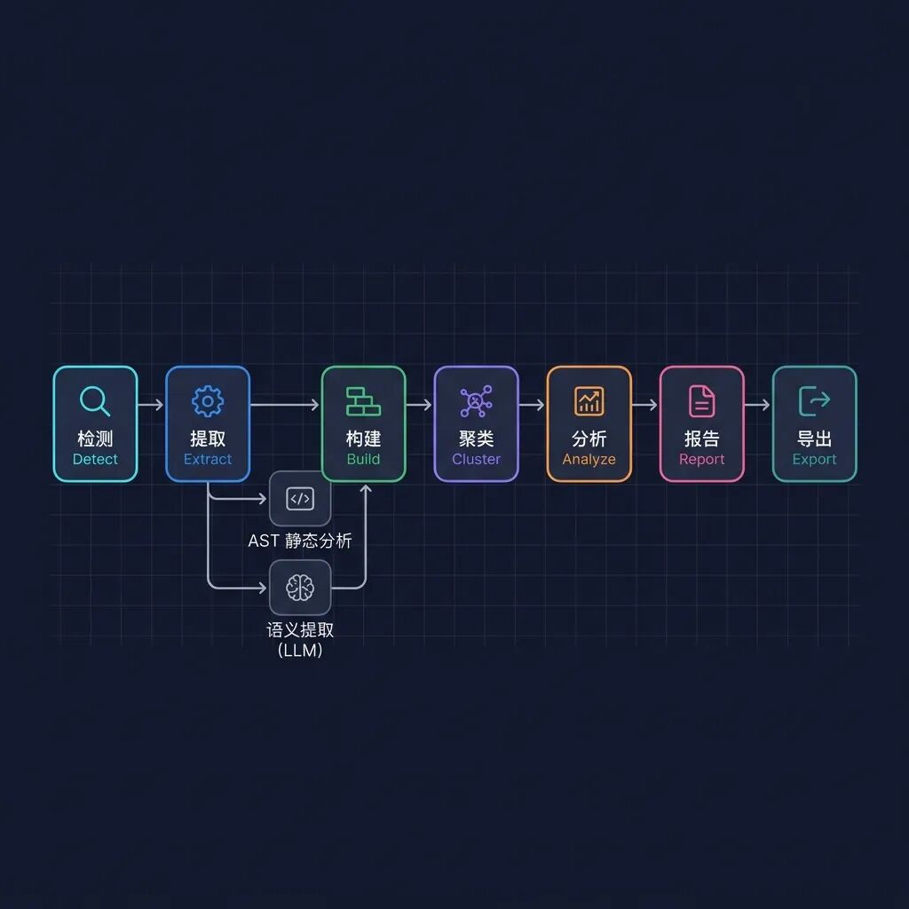
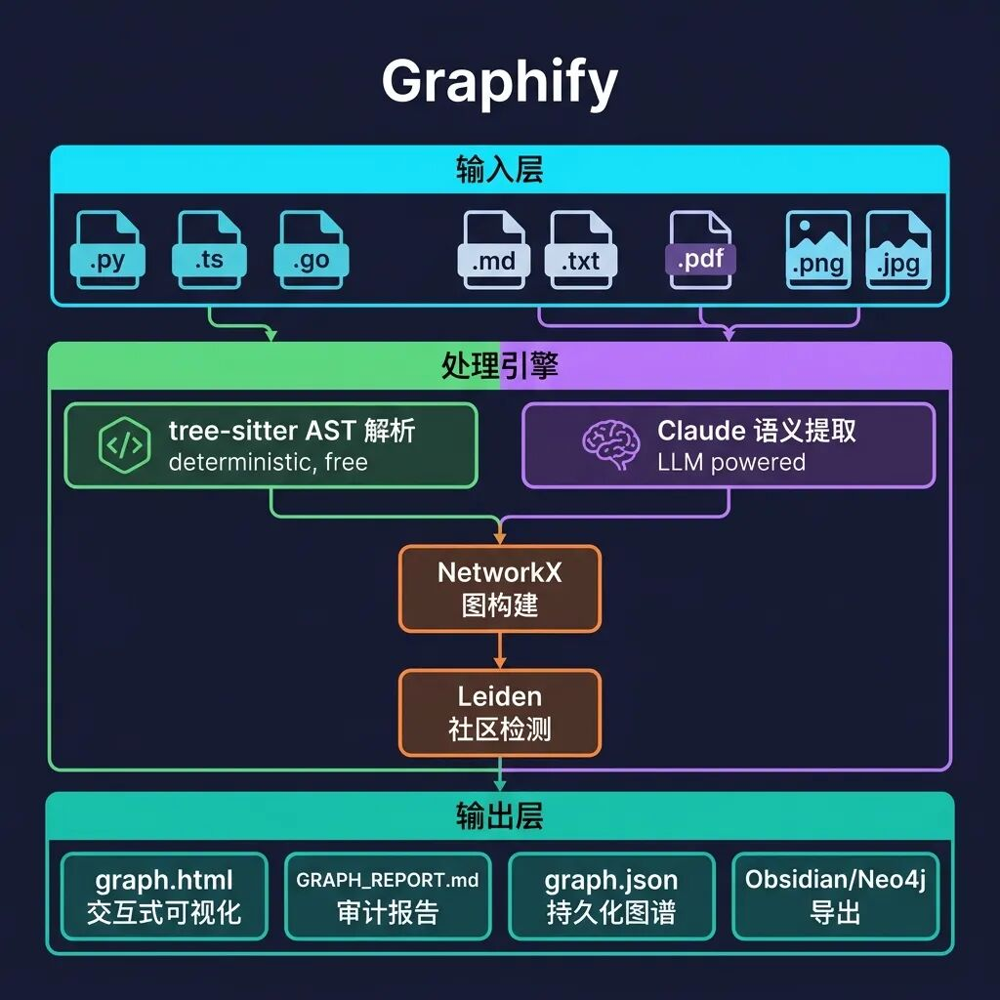
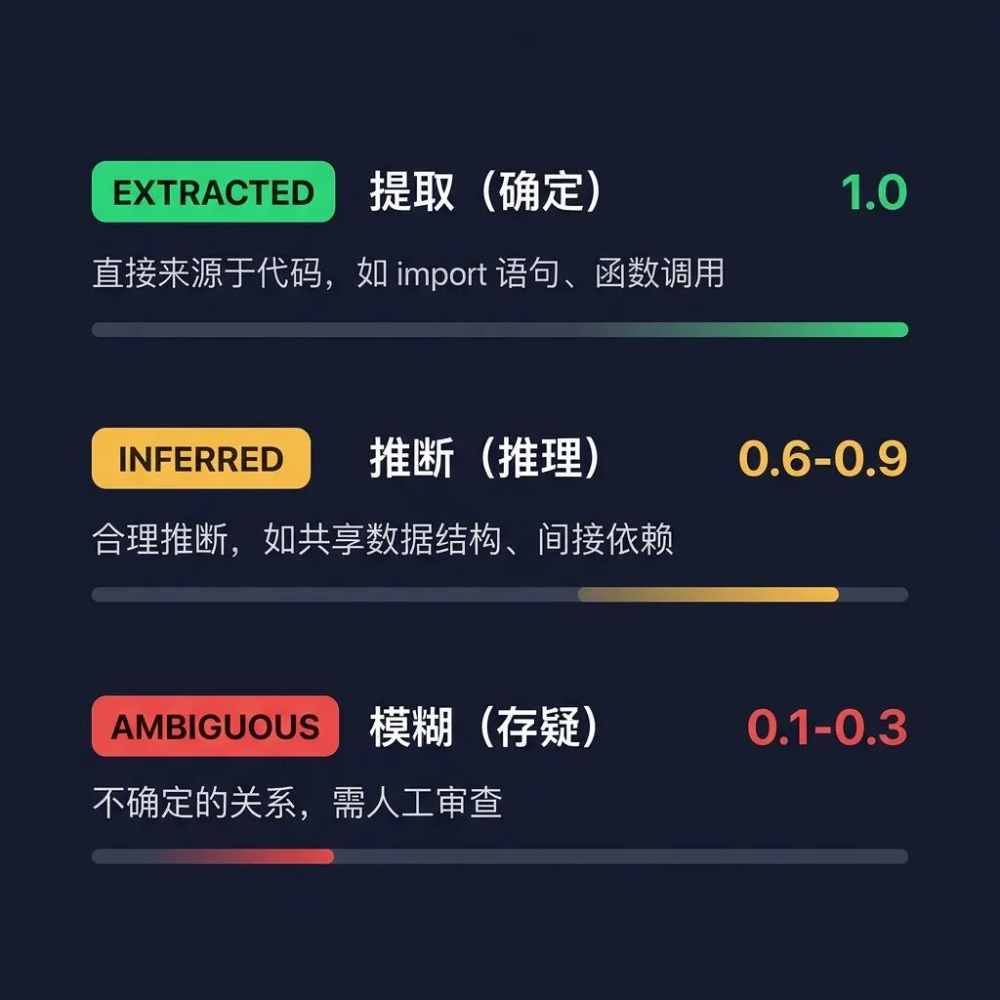

> 📎 来源: [AI作弊码](https://mp.weixin.qq.com/s?__biz=MzI2MzA5NjA4MQ==&mid=2665365309&idx=1&sn=e217eba5dcde14452dde395ad411315f&chksm=f0b929ed12438f2fbe9a30a9bab47d7cad3b01d05b9a005452101b476beb1533b2c320183e14&mpshare=1&scene=1&srcid=0511oVfmmFjeXvGXpdOOTc0S&sharer_shareinfo=0116277d18812bb95f7961c7b21d68fe&sharer_shareinfo_first=0116277d18812bb95f7961c7b21d68fe) | 时间: 2026-05-11 00:00

---


🔬 开源项目 Graphify 深度剖析

当 Karpathy 说「用 LLM 编译知识」时，一个开源项目把它做成了一条完整的流水线。
**/ graphify** — 一个命令，把任何文件夹变成可查询的知识图谱。

⭐ 3.2k Stars · 🍴 301 Forks · 📦 Python · MIT License

📌 这篇文章的前置阅读

本文是 **Karpathy LLM 知识库**系列的第二篇。Karpathy 在 2026 年 4 月初提出了「用 LLM 编译个人知识库」的理念（详见[Karpathy 的 LLM Wiki——当 AI 成为你的知识管家](https://mp.weixin.qq.com/s?__biz=MzI2MzA5NjA4MQ==&mid=2665365298&idx=1&sn=7cd879902644c1499309787df8d1ba55&scene=21#wechat_redirect)解读），而 **Graphify**（github.com/safishamsi/graphify）是**第一个将这一理念工程化实现**的开源项目，发布一周即获得 3200+ Star。

  

## 一、Graphify 是什么？

一句话定义：**Graphify 是一个 AI 编程助手技能（Skill）**，你在 Claude Code、Codex、OpenCode 等工具里输入 

```
/graphify
```

，它就会读取文件夹中的所有内容——代码、文档、论文、截图、白板照片——然后构建一张**可查询的知识图谱**。

💡 Graphify 比 Karpathy 的原始理念进化了什么？

Karpathy 的 llm-wiki 是一份**思想文档**（idea file），核心理念是「LLM 当图书管理员，维护 Markdown Wiki」。而 Graphify 在此基础上做了三个关键进化：

🔸 **从 Wiki 到 Graph** — 不是平面的 Markdown 文件，而是 NetworkX 知识图谱 + Leiden 社区检测

🔸 **双轨提取引擎** — 代码文件走确定性 AST 解析（零 Token 消耗），文档/图片走 LLM 语义提取

🔸 **信任审计链** — 每条边都标记为 EXTRACTED / INFERRED / AMBIGUOUS，你永远知道什么是「找到的」、什么是「猜的」

## 二、七级流水线：深入架构

Graphify 的核心是一条**七级处理流水线**，每一级都是一个独立的 Python 模块，通过纯 dict 和 NetworkX 图进行通讯——无共享状态，无副作用：



这条流水线的精妙之处在于**提取阶段的双轨并行设计**：

🔧 左轨：tree-sitter AST 静态解析

对代码文件进行确定性的语法树分析：类、函数、import、调用图、docstring。**不需要 LLM，零 Token 消耗，毫秒级完成。**支持 16 种编程语言：Python、TypeScript、Go、Rust、Java、C/C++、Ruby、Swift 等。

🧠 右轨：Claude 语义提取（并行子代理）

对文档、论文、图片启动**并行子代理**（每 20-25 个文件一个批次），利用 Claude 的视觉能力提取概念、实体、引用关系和**设计决策的「为什么」**。所有子代理在同一消息中调度，真正的并行执行。

## 三、全局架构：从输入到输出



整个系统的**技术栈极其精简**：

**图引擎：**NetworkX（纯 Python，无外部依赖）

**社区检测：**Leiden 算法（graspologic 库）— 基于边密度，不需要 embedding

**代码解析：**tree-sitter（确定性 AST，16 种语言）

**可视化：**vis.js（交互式 HTML 图谱）

**LLM 后端：**Claude（Claude Code）/ GPT-4（Codex）/ 你平台用的任何模型

⚡ 关键设计决策：无向量数据库

Graphify **刻意不使用 embedding 和向量数据库**。聚类完全基于图拓扑结构——Leiden 算法通过边密度发现社区。Claude 提取的语义相似性边（

```
semantically_similar_to
```

）直接作为图的边参与社区检测。
**图结构本身就是相似性信号**——不需要单独的 embedding 步骤。

## 四、信任审计链：知识图谱的「可追溯性」

这是 Graphify 最有价值的设计之一——**每条边都附带一个置信度标签**，让你清楚地知道每条关系是「确定发现的」还是「AI 猜测的」。



🟢 **EXTRACTED（提取）**：关系直接来源于代码——import 语句、函数调用、论文引用。置信度永远是 **1.0**

🟡 **INFERRED（推断）**：合理推论——共享数据结构、隐含依赖。每条边独立评分 **0.4-0.9**

🔴 **AMBIGUOUS（存疑）**：不确定的关系，标记供人工审查。置信度 **0.1-0.3**

此外，Graphify 还提取了一种特殊的节点类型——**rationale\_for（设计原理）**。代码中的 

```
# WHY:
```

、

```
# HACK:
```

、

```
# NOTE:
```

 注释和文档中阐述设计权衡的段落，会被提取为「原理节点」，指向它们解释的概念。**不只是记录代码做了什么，还记录为什么这样做。**

## 五、71.5× Token 压缩：数字背后的逻辑

71.5×

每次查询的 Token 减少倍率（混合语料库 52 个文件基准测试）

这是怎么做到的？

**第一次运行**：消耗 Token 进行提取和图谱构建（一次性成本）

**后续每次查询**：读取紧凑的 graph.json 而非原始文件——这就是节省 71.5× 的来源

**SHA256 缓存**：重新运行只处理变更的文件，增量更新已有图谱

简单来说：**付一次「编译」成本，获得无限次高效查询。**查询次数越多，ROI 越高。对于 6 个文件的小项目，图谱的价值在于结构清晰度；对于 50+ 文件的大项目，压缩效果显著。

## 六、亮眼特性逐个拆解

🔮 超边（Hyperedges）

传统图谱只有「A→B」的成对边。Graphify 支持**超边**——3 个以上的节点参与同一个概念、流程或模式。例如：所有实现认证流程的函数、所有实现同一接口的类。每个 chunk 最多生成 3 条超边。

🌐 全模态支持

代码、PDF、Markdown、截图、架构图、白板照片、甚至其他语言的图片——Graphify 用 Claude 视觉能力理解图中的内容（不是简单 OCR），提取概念和关系，融入统一的图谱。

🔄 Always-On 模式

运行 

```
graphify claude install
```

 后，Claude Code 的 PreToolUse 钩子会在**每次 Grep/Glob 操作前**先读取图谱报告。AI 助手按图谱结构导航，而不是暴力搜索文件。

📡 MCP 服务器模式

```
--mcp
```

 把图谱暴露为 MCP stdio 服务器，提供 query\_graph、get\_neighbors、shortest\_path 等工具。接入 Claude Desktop 或任何 MCP 兼容的 Agent 编排器，让其他 AI Agent 实时查询你的知识图谱。

## 七、5 分钟上手

# 安装

pip install graphifyy && graphify install

# 在 Claude Code / Codex 中一键运行

/graphify .

# 对特定文件夹运行

/graphify ./raw

# 深度模式（更激进的推断边提取）

/graphify ./raw --mode deep

# 增量更新（只处理变更文件）

/graphify ./raw --update

# 查询知识图谱

/graphify query "attention 和 optimizer 之间有什么联系？"

# 两个概念之间的最短路径

/graphify path "DigestAuth" "Response"

运行完成后，

```
graphify-out/
```

 目录下会生成：

📊 **graph.html** — 交互式知识图谱，可搜索、过滤、按社区着色

📝 **GRAPH\_REPORT.md** — God 节点、意外连接、建议查询问题

📦 **graph.json** — 持久化图谱数据，支持跨会话查询

💾 **cache/** — SHA256 缓存，增量更新只处理变更文件

## 八、对照：Karpathy 理念 vs Graphify 实现

📐 维度对比

**存储格式**｜Karpathy: Markdown Wiki → Graphify: **NetworkX 图 + JSON**

**知识发现**｜Karpathy: LLM 手动维护反向链接 → Graphify: **Leiden 算法自动社区检测**

**代码处理**｜Karpathy: 全部走 LLM → Graphify: **代码走 AST（零 Token），文档走 LLM**

**可信度**｜Karpathy: 无标注 → Graphify: **三级置信度标签 + 分数**

**增量更新**｜Karpathy: 概念性描述 → Graphify: **SHA256 缓存 + --update + git hooks**

**多模态**｜Karpathy: 提及图片 → Graphify: **完整视觉理解（截图/图表/白板）**

**工具生态**｜Karpathy: Obsidian → Graphify: **HTML + Obsidian + Neo4j + MCP + SVG**

🎯 **核心洞察**：Karpathy 的理念本质上是「LLM 维护 Flat File Wiki」。Graphify 把它升级为「LLM + AST 共同构建 Knowledge Graph」——这不是简单的工程实现，而是**范式提升**：从文档管理到图计算。

## 九、隐私与安全

🔒 **代码文件**通过 tree-sitter 在本地处理——**不会离开你的机器**

📄 文档/论文/图片会发送到你正在使用的 AI 平台的模型 API（Anthropic / OpenAI）

🚫 无遥测、无使用追踪、无任何分析

🛡️ URL 验证、路径沙箱、内容大小限制、HTML 转义——完整的安全防护层（见 security.py）

📮 编辑评语

Graphify 的出现充分证明了 Karpathy 提出的「LLM 编译知识」理念不只是推特上的灵感碎片——它是一个**可落地、可工程化、可扩展的架构模式**。

特别值得注意的是 Graphify 的**「诚实」设计哲学**——不是给你一个黑盒答案，而是通过三级置信度标签让你看到知识的**可追溯性**。在 AI 幻觉仍是主要挑战的今天，这种透明度可能比功能本身更有价值。

如果你正在用 Claude Code 写代码或做研究，**花 5 分钟试试 /graphify**。你会发现它帮你看到了代码库中自己都不知道存在的连接。

— END —

🔗 项目地址：github.com/safishamsi/graphify
📄 Karpathy 原始 Gist：gist.github.com/karpathy/442a6bf
