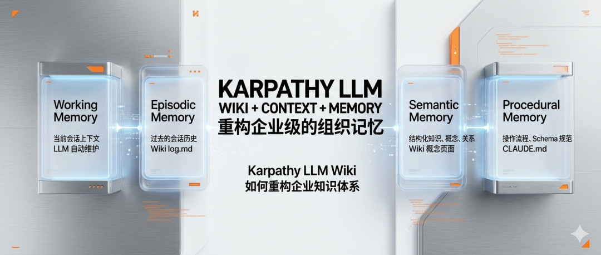
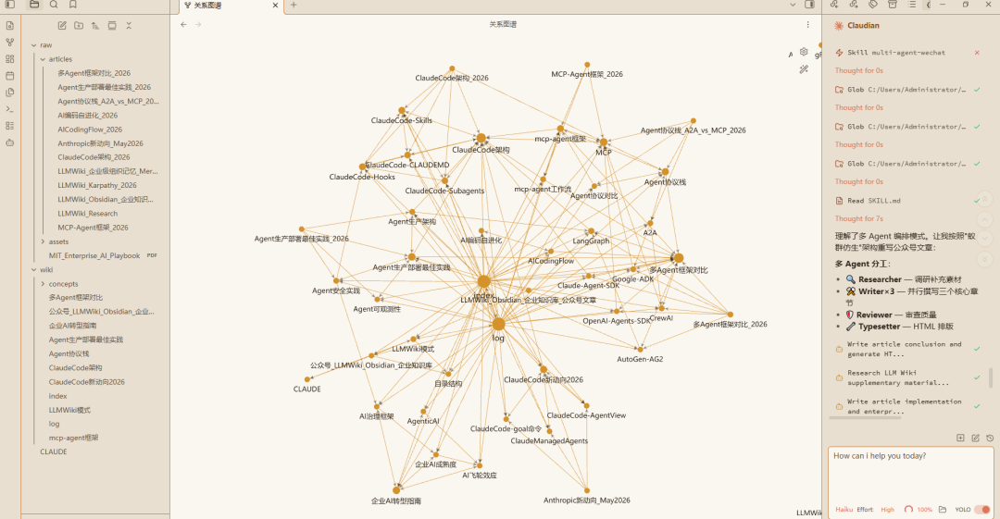
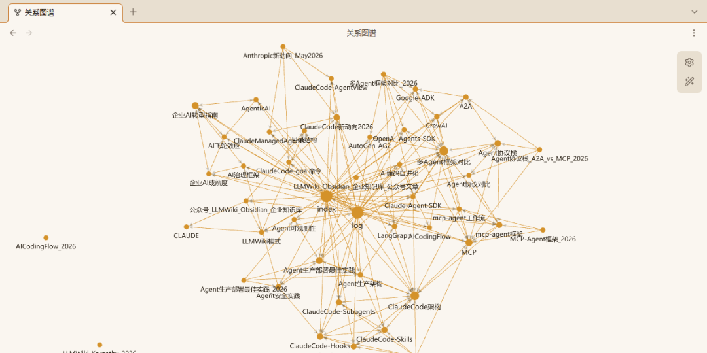

> 📎 来源: [木汝科技](https://mp.weixin.qq.com/s?__biz=MzkwMDIzMDEzMQ==&mid=2247491931&idx=1&sn=3f3ab69d6b17e2bbd0eaa79509c5ad4b&chksm=c1cad772458550f57a19eb9a1b0cc8ad0af724fa69743bb44942623a8e72929766308a3f2d2d&mpshare=1&scene=1&srcid=0528sqbG9o5u39bQnIEBJ8kJ&sharer_shareinfo=83cfb55149171f64cddbd3c2f2ee455c&sharer_shareinfo_first=83cfb55149171f64cddbd3c2f2ee455c) | 时间: 2026-05-28 20:35

---

知识管理 · AI · 架构

# 让 AI 真正懂业务

# 从金鱼记忆到固态大脑

Karpathy LLM Wiki 如何重构企业知识体系

当知识管理遇到 AI 范式革命，一次从检索到编译的认知升级正在发生



核心命题：LLM Wiki 的颠覆性不在于技术，而在于理念——**知识不是"存起来备查"，而是"编译进去活起来"**。

2026 年 4 月，前 OpenAI 科学家 Karpathy 在 GitHub 上发了一份不到 500 行的 Markdown 文件。没有新模型、没有新算法——只有一套关于「如何用 LLM 管理知识」的新思路。48 小时内席卷整个 AI 社区。

本文系统性地解析一种正在崛起的解法：用 LLM Wiki + Context + Memory，构建 AI 时代的"企业级组织记忆"。



## 一、为什么传统 RAG 正在失效

1.1 RAG 的本质缺陷

大多数人的 LLM 使用体验：上传文档 → 问问题 → LLM 检索 → 生成答案。这个流程存在致命缺陷：**每次查询都是一次"重新发现"**。

想象：你花三周研读 20 篇 AI Agent 论文，问 LLM "AI Agent 发展经历了哪几个阶段"，LLM 仍需要在这 20 篇论文中重新检索、重新理解、重新整合。这就是 Karpathy 所说的 **"rediscovering knowledge from scratch on every question"**——每次都在重新发明轮子。

1.2 知识积累的必要性

真正高效的知识管理：

第一周：读论文 A，理解"AI Agent 的定义"

第二周：读论文 B，发现与 A 有矛盾，整合分歧

第三周：读论文 C，提出新的分类框架

第四周：问 LLM 问题，LLM 直接引用已有的综合分析

源文件是源码，Wiki 是二进制，LLM 是编译器。

## 二、LLM Wiki 的三层架构

2.1 整体架构

LLM Wiki 模式将知识管理分为三个层次：

|  |  |  |
| --- | --- | --- |
| 层级 | 说明 | 特点 |
| Raw Sources 源文件层 | PDF、论文、文章、播客笔记、会议记录 | 不可变，LLM 只读取不修改 |
| The Wiki Wiki层 | 摘要页、概念页、实体页、对比分析 | LLM 维护，你读它，LLM 写它 |
| The Schema 规范层 | CLAUDE.md / AGENTS.md | 定义 Wiki 结构、操作流程、格式约定 |

2.2 源文件层设计原则

1. 不可变性（Immutability）：LLM 永远不修改原始文件，即使原文有错误也保留原样，在 Wiki 中标注

2. 格式优先：Markdown 是首选，PDF 需要转换，图片需要下载到本地

3. 版本管理：所有文件在 Git 版本控制下，可以回溯、对比、分支

2.3 Wiki 层组织方式

Wiki 层是 LLM 生成和维护的核心区域：

wiki/
├── index.md # 全局索引，按主题分类
├── log.md # 操作日志，记录所有 ingest/query
├── LLMWiki模式.md # 主摘要页
├── ClaudeCode架构.md # 主摘要页
└── concepts/ # 概念子目录
    ├── MCP.md
    ├── A2A.md
    └── ...（36个概念页面）

2.4 Schema 层作用

Schema 层通过 

```
CLAUDE.md
```

 定义，告诉 LLM：目录结构、Ingest/Query/Lint 操作流程、格式约定、上下文保持方式。**这是让 LLM 成为"有纪律的 Wiki 维护者"的关键。**

## 三、三项核心操作详解

3.1 Ingest：知识的编译

Ingest 是将源文件"编译"成 Wiki 页面的过程。以处理 Stanford《Enterprise AI Playbook》为例：

步骤 1：LLM 读取 PDF，提取关键发现（77% 挑战是非技术性的）

步骤 2：识别 AIME 成熟度框架、四个阶段

步骤 3：创建主摘要页 + 4 个概念页

步骤 4：更新 index.md 和 log.md

步骤 5：建立交叉引用

**关键洞察：**单次 Ingest 可能涉及 10-15 个 Wiki 页面的更新。如果没有 LLM，这个工作量大到让人放弃。

3.2 Query：知识的查询

Query 不仅是检索答案，而是综合分析与引用：

1. 定位：读 index.md 找到相关页面

2. 分析：整合多个来源，识别共性和差异

3. 回答：带引用的结构化回答

4. 沉淀：有价值的回答归档为新页面

3.3 Lint：知识的维护

Lint 是定期健康检查，确保 Wiki 不会"腐烂"：

|  |  |
| --- | --- |
| 检查类型 | 具体内容 |
| 矛盾检测 | 页面 A 说 21%，页面 B 说 30%，哪个对？ |
| 陈旧断言 | "最新"数据是否是 2023 年的？ |
| 孤立页面 | 哪些页面没有任何页面链接到它？ |
| 缺失链接 | 提到"Agentic AI"但没有独立页面？ |
| 数据空白 | 某个主题没有来源支撑？ |

**Karpathy 原话：**"维护知识库最繁琐的不是阅读或思考，而是 bookkeeping。LLM 不会厌倦、不会忘记更新交叉引用，一次能处理 15 个文件。"

## 四、Obsidian + Claude Code 实操配置

4.1 Obsidian 推荐插件

|  |  |
| --- | --- |
| 插件 | 用途 |
| Web Clipper | 浏览器文章一键转 Markdown |
| Dataview | Frontmatter 查询，动态生成视图 |
| Marp | Markdown 幻灯片，生成演示文稿 |
| Git | 版本控制，记录每一次变更 |
| Graph View | 可视化页面关系图 |

4.2 关键设置

1. 附件文件夹：设置为 

```
raw/assets/
```

2. 图片下载：使用 

```
Ctrl+Shift+D
```

 快捷键下载所有图片

3. 内部链接：使用 

```
[[页面名]]
```

 语法建立双向链接

4.3 OpenClaw 插件集成

对于 Obsidian 用户，可以安装 **OpenClaw 插件**，实现边栏即时对话：

1. 安装 OpenClaw 插件

2. 配置 Gateway 地址：

```
wss://127.0.0.1:18789
```

3. Token 在 

```
~/.openclaw/openclaw.json
```

 中获取

4. 使用 Obsidian 侧边栏直接与 AI 对话

## 五、企业级扩展

5.1 从个人到团队的演进

|  |  |  |
| --- | --- | --- |
| 层级 | 特点 | 工具 |
| 个人 | 快速迭代，自主决策 | Obsidian + Claude Code |
| 小团队 | 共享源文件，分工维护 | Obsidian Git 同步 + MCP |
| 部门 | 统一 Schema，权限控制 | Notion + Claude API |
| 企业 | 多语言支持，大规模检索 | 定制 RAG + Wiki 混合 |

5.2 长上下文处理的挑战

随着 Wiki 规模增长（数百个页面，数十万字），需要考虑：

1. 分层索引：index.md（全局）→ 子目录 index.md（局部）→ 具体页面

2. 语义搜索：qmd 提供 BM25 + 向量混合搜索 + LLM 重排序

3. 选择性上下文：根据问题选择相关页面，而非读取全部 Wiki

5.3 企业 Memory 处理

在企业场景中，Memory 处理是核心挑战：

|  |  |  |
| --- | --- | --- |
| 记忆类型 | 内容 | 实现位置 |
| Working Memory | 当前会话上下文 | LLM 自动维护 |
| Episodic Memory | 过去的会话历史 | Wiki log.md |
| Semantic Memory | 结构化知识、概念、关系 | Wiki 概念页面 |
| Procedural Memory | 操作流程、Schema 规范 | CLAUDE.md |

## 六、48 小时实操记录

6.1 知识库构建过程

Day 1：Ingest MIT《企业AI转型行动手册》、Claude Code 五层架构、6 大 Multi-Agent 框架、Agent 生产部署 15 最佳实践

Day 2：Ingest MCP Agent 框架、A2A 协议栈、Claude Code 新动向 2026、AICodingFlow、AI编码自进化、Karpathy LLM Wiki 原文

6.2 统计数据

|  |  |
| --- | --- |
| 指标 | 数值 |
| Wiki 页面总数 | 44 |
| 概念页面 | 36 |
| 主摘要页 | 8 |
| 原始引用文档 | 10 |

6.3 关键经验

1. 一次消化一个源文件：消化太快质量下降，太慢失去动力。节奏：每天 3-5 个源文件。

2. Schema 是活的文档：CLAUDE.md 不是一次性写完的，随实践改进。

3. Log 是最有价值的文件：可以回溯"这个结论从哪来的"，新成员快速了解历史。

4. 交叉引用是关键：每个页面至少链接 2 个其他页面，Graph View 帮助发现结构问题。



## 七、开始你的 LLM Wiki

7.1 最低门槛：5 分钟启动

your-wiki/
├── raw/
├── wiki/
│    ├── index.md
│    └── log.md
└── CLAUDE.md

步骤 1-3：创建目录结构和初始化文件

步骤 4：

```
cd your-wiki && claude
```

步骤 5：告诉 LLM："帮我消化这个文章"

7.2 中级配置：Obsidian + Claude Code

1. Obsidian：新建 Vault，安装 Web Clipper，设置附件文件夹为 

```
raw/assets/
```

2. CLAUDE.md：放在 Vault 根目录，Claude Code 会自动读取

3. OpenClaw（可选）：安装插件，配置 Gateway Token，在侧边栏直接对话

7.3 高级配置：团队 Wiki

Git 协作：所有成员克隆同一仓库，分支管理不同主题，PR 审核 Wiki 更新

Schema 分发：CLAUDE.md 是模板，新成员自动获得工作流规范

CI/CD 自动化：GitHub Actions 自动运行 Lint，定期检查孤立页面和矛盾

## 结语

Karpathy 的 LLM Wiki 模式之所以强大，是因为它解决了一个根本问题：**知识的维护成本**。

人类的记忆会遗忘，组织会遗忘，甚至整个行业都会遗忘。Vannevar Bush 在 1945 年就设想了 Memex——一种个人策划的知识库，文档间有关联轨迹。他无法解决的是谁来维护这些链接。**80 年后，LLM 解决了这个问题。**

Obsidian 是你的 IDE
LLM 是你的程序员
Wiki 是你的代码库
源文件是永远不变的真理来源

知识不再是一次性的消耗品，而是可以被编译、累积、复合的资产。**这，才是真正的"第二大脑"。**

━━━━━ ● ━━━━━

从"金鱼记忆"到"固态大脑"

Muru AI · 公众号推文引擎
