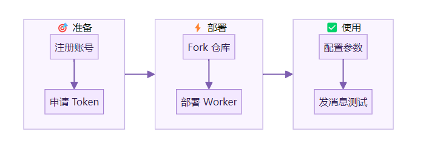
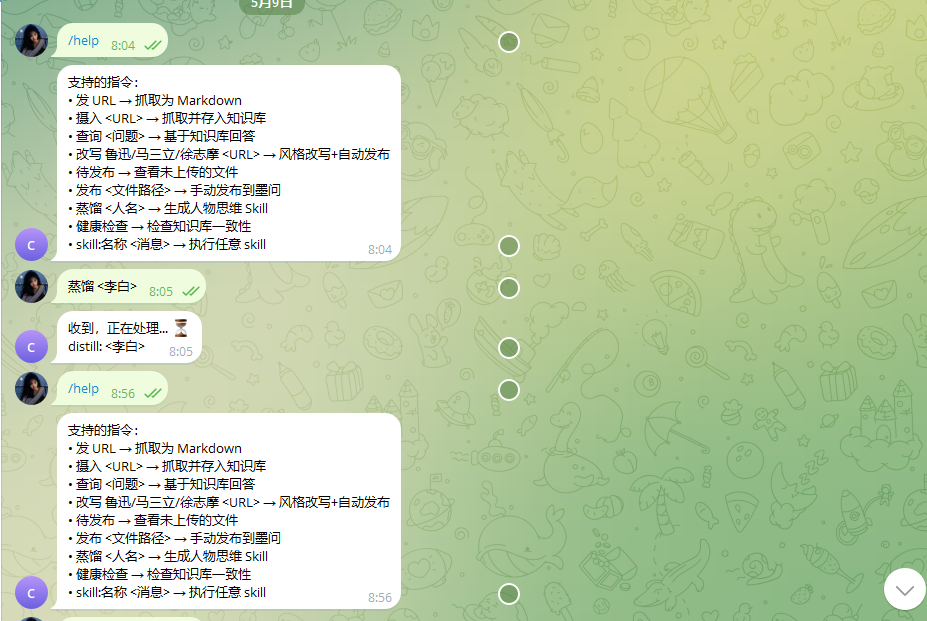
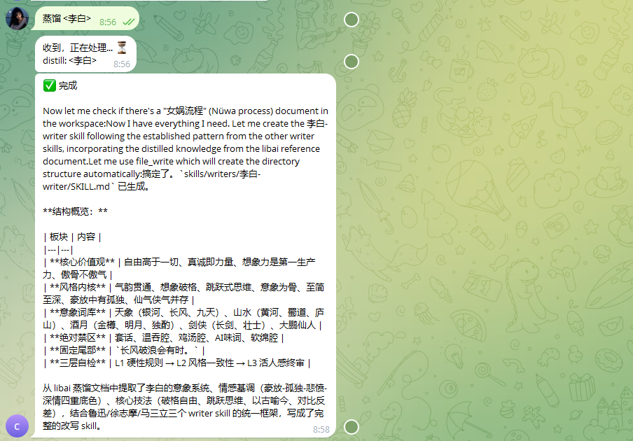
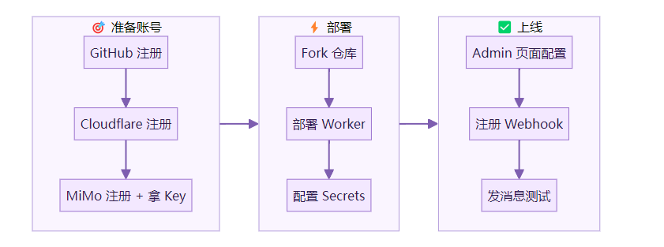
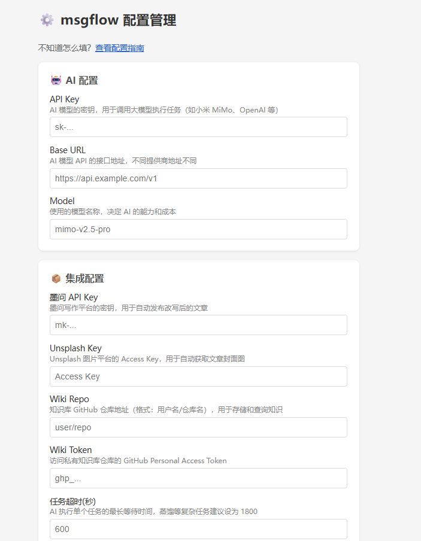

> 📎 来源: [AI赋能说](https://mp.weixin.qq.com/s?__biz=MzI3NjE4OTAyMg==&mid=2247488825&idx=1&sn=6e4f8c969ebe2739a22d67c05add3aa5&chksm=ea51f3a5009845ea29a71f0cddaf5e6e296a09acf86d28d0bd02fcd432525ab497863dc539ab&mpshare=1&scene=1&srcid=0510ew3IAgMhSKG7cOchcKFb&sharer_shareinfo=8a2b7a59eb9d4d1b78b7ff8681b9203b&sharer_shareinfo_first=8a2b7a59eb9d4d1b78b7ff8681b9203b) | 时间: 2026-05-10 15:50

---


上一篇讲了为什么。

这一篇讲怎么做。

读完这篇，你会拥有：一个在手机上发消息就能让 AI 干活的系统。抓取文章、改写风格、管理知识库。不花一分钱服务器费用。

先看流程：



搭建好以后的样子





## 前提条件

- 一个 GitHub 账号（免费注册）
- 一个 Cloudflare 账号（免费注册）
- 一个 Telegram 账号（或飞书/企业微信）
- 10 分钟时间

## 阶段一：获取免费 AI Token

没有 Token，AI 跑不起来。

好消息：小米 MiMo 有免费额度。性能接近 Claude，价格低 70%。

### 第一步：注册小米 MiMo 平台

打开 https://platform.xiaomimimo.com?ref=3K9FGL

用邮箱注册。注册后点控制台左下方入口，填入邀请码 

```
3K9FGL
```

，即得 **$2 API 体验金**（40 天有效）。

然后进入控制台，点击「API Keys」，创建一个 Key。

复制保存。格式类似 

```
sk-xxxxxxxx
```

。

> ❝

> $2 体验金足够跑通整个流程并日常使用很长时间。MiMo V2.5 Pro 的 token 价格很低。

### 第二步：申请 Orbit 100T 免费 Token（可选，额度更大）

小米在做一个限时活动：Orbit 100T Token Grant。面向全球开发者，免费发放 token。

打开 https://100t.xiaomimimo.com

填写申请表：

- **你在做什么**：写「搭建个人 AI 知识工作流，用 msgflow + llmwiki 管理个人知识库」
- **用什么工具**：写「GitHub Actions + Cloudflare Worker + MiMo API」
- **证明材料**：可以贴 msgflow 的 GitHub 链接 

  ```
  https://github.com/ohwiki/msgflow
  ```

提交后等 1 个工作日。审批通过会收到邮件。

> ❝

> 注意：申请邮箱必须和平台注册邮箱一致。不一致会导致 token 发不到。

**等不及审批？** 没关系。注册时的免费额度够你跑通整个流程。先往下走。

### 验证

你现在应该有：

- 一个 MiMo API Key（

  ```
  sk-xxxxxxxx
  ```

  ）
- Base URL：

  ```
  https://platform.xiaomimimo.com/v1
  ```
- 模型名：

  ```
  mimo-v2.5-pro
  ```

## 阶段二：部署 msgflow

### 第三步：Fork 仓库

打开 https://github.com/ohwiki/msgflow

点右上角「Fork」。Fork 到你自己的账号下。

Fork 完，进入你的仓库 → Settings → Secrets and variables → Actions → New repository secret。

添加一个 Secret：

| Name | Value |
| --- | --- |
| `CALLBACK_SECRET` | 自己编一个随机字符串，比如 `my-cb-2026-random` |

这个值后面要用，记住它。

### 第四步：创建 GitHub Token

打开 https://github.com/settings/tokens?type=beta

点「Generate new token」：

- Token name：

  ```
  msgflow
  ```
- Expiration：90 days
- Repository access：Only select repositories → 选你 Fork 的 msgflow
- Permissions：Actions **Read and write**，Contents **Read and write**

点 Generate。**立即复制**，只显示一次。

### 第五步：部署 Cloudflare Worker

打开 https://dash.cloudflare.com 注册/登录。

然后你有两个选择：

**选择 A：让 AI 帮你部署（推荐）**

如果你有 Claude Code、Kiro、Cursor 等 AI 工具，把下面这段话发给它：

> ❝

> 帮我部署 msgflow Worker。仓库在 

> ```
> 我的路径/msgflow/worker
> ```

> 。请执行：

> 1. wrangler login
> 2. wrangler kv namespace create MSGFLOW\_CONFIG，把 id 填入 wrangler.toml
> 3. echo "我的密码" | wrangler secret put ADMIN\_TOKEN
> 4. echo "我的GitHub Token" | wrangler secret put GITHUB\_TOKEN
> 5. echo "我的CALLBACK\_SECRET" | wrangler secret put CALLBACK\_SECRET
> 6. wrangler deploy

把「我的密码」「我的GitHub Token」「我的CALLBACK\_SECRET」换成你自己的值。

**选择 B：手动部署**

```
# 安装 wranglernpm install -g wrangler# 登录wrangler login# 进入 worker 目录cd msgflow/worker# 创建 KV 存储wrangler kv namespace create MSGFLOW_CONFIG# 输出的 id 填入 wrangler.toml# 设置密码（逐个输入）wrangler secret put ADMIN_TOKENwrangler secret put GITHUB_TOKENwrangler secret put CALLBACK_SECRETwrangler secret put TELEGRAM_BOT_TOKEN# 部署wrangler deploy
```

部署成功后会显示你的 Worker 地址，类似：

```
https://msgflow-worker.你的子域名.workers.dev
```

### 验证

浏览器打开你的 Worker 地址，看到 

```
OK
```

 就成功了。

## 阶段三：配置和测试

### 第六步：配置 AI 参数

打开管理页面：

```
https://你的Worker地址/admin?token=你的ADMIN_TOKEN
```

填入：

| 字段 | 值 |
| --- | --- |
| API Key | 第一步拿到的 `sk-xxxxxxxx` |
| Base URL | `https://platform.xiaomimimo.com/v1` |
| Model | `mimo-v2.5-pro` |

其他字段暂时留空。点「💾 保存」。

### 第七步：注册 Telegram Webhook

如果你用 Telegram（推荐，最简单）：

1. 在 Telegram 找 @BotFather，发 

   ```
   /newbot
   ```

   ，按提示创建一个 Bot
2. 拿到 Bot Token（格式：

   ```
   123456:ABC-xxx
   ```

   ）
3. 回到 Worker 目录，执行 

   ```
   wrangler secret put TELEGRAM_BOT_TOKEN
   ```

   ，输入 Bot Token
4. 重新部署：

   ```
   wrangler deploy
   ```
5. 浏览器打开：

   ```
   https://你的Worker地址/setup?token=你的CALLBACK_SECRET
   ```

看到 

```
{"ok":true}
```

 就注册成功了。

### 第八步：发消息测试

在 Telegram 找到你的 Bot，发一条消息：

```
https://github.com/ohwiki/msgflow
```

预期结果：

1. 立即收到「收到，正在处理... ⏳」
2. 1-2 分钟后收到抓取的 Markdown 内容

**收到了？恭喜。你的 AI 工作流跑通了。**

## 完整流程一览



配置页面



## 第一次做的建议

- 先只配 Telegram。最简单，不需要企业认证
- 先只用「发 URL 抓取」功能。确认跑通后再玩改写、知识库
- API Key 和 ADMIN\_TOKEN 找个地方记下来。丢了要重新设置

## 容易踩的坑

**坑：部署后 Telegram 没反应**原因：忘了访问 

```
/setup
```

 注册 webhook。 解决：每次重新部署后都要访问一次 

```
/setup?token=你的CALLBACK_SECRET
```

。

**坑：收到「收到」但没有后续结果**原因：GitHub Token 权限不够，或者 GITHUB\_REPO 变量没改。 解决：检查 wrangler.toml 里的 

```
GITHUB_REPO
```

 是否是你 Fork 后的仓库地址。

**坑：MiMo API 报错**原因：Base URL 写错了，或者免费额度用完了。 解决：确认 Base URL 是 

```
https://platform.xiaomimimo.com/v1
```

。额度用完可以申请 Orbit 100T。

**坑：Admin 页面打不开**原因：ADMIN\_TOKEN 没设置，或者 token 值打错了。 解决：重新执行 

```
wrangler secret put ADMIN_TOKEN
```

。

## 接下来可以玩什么

跑通基础流程后：

- 发 

  ```
  改写 鲁迅
  ```

   — 让 AI 用鲁迅风格改写文章
- 搭建知识库 — 用 llmwiki-template[1] 创建仓库，在 Admin 页面配置 Wiki Repo 和 Token
- 发 

  ```
  摄入
  ```

   — 自动抓取文章存入知识库
- 发 

  ```
  查询 <问题
  ```

   — 基于知识库回答

这些都不需要额外花钱。同一套基础设施，同一个 AI Token。

---

**参考资料：**

- msgflow[2] — 完整部署文档见 

  ```
  docs/deploy.md
  ```
- 配置项获取指南[3] — 每个配置项怎么拿
- 小米 MiMo 平台[4] — 注册送 $2，邀请码 

  ```
  3K9FGL
  ```
- Orbit 100T 申请[5] — 免费 Token 活动（截止 2026-05-28）
- llmwiki-template[6] — 知识库模板

Reference

[1] 

llmwiki-template: *https://github.com/ohwiki/llmwiki-template*

[2] 

msgflow: *https://github.com/ohwiki/msgflow*

[3] 

配置项获取指南: *https://github.com/ohwiki/msgflow/blob/main/docs/admin-config-guide.md*

[4] 

小米 MiMo 平台: *https://platform.xiaomimimo.com?ref=3K9FGL*

[5] 

Orbit 100T 申请: *https://100t.xiaomimimo.com*

[6] 

llmwiki-template: *https://github.com/ohwiki/llmwiki-template*

**下方是赋能君的AI学习交流永久免费星球，想学习更多内容，欢迎扫码加入。**


🙌 如果你阅读到这里，说明我们对信息的认可区域是有一定交集的，可以说我们是同道中人，所以如果你有自认为不错的信息获取渠道，欢迎留言或者私聊我，谢谢。

都看到这里了，就给个关注吧👀：

喜欢我的文章，可以请你右下角顺手来一波点赞&在看&分享三连么👉
