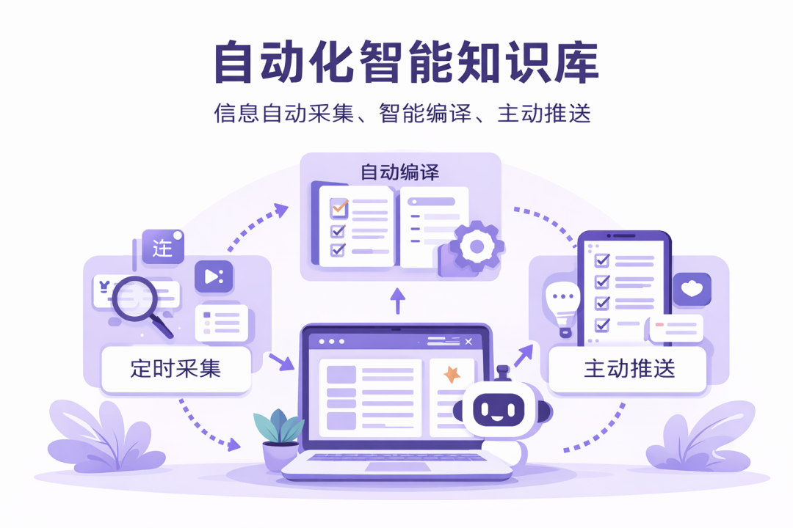
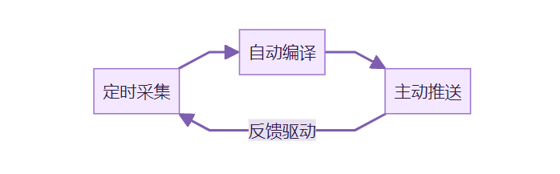

> 📎 来源: [AI赋能说](https://mp.weixin.qq.com/s?__biz=MzI3NjE4OTAyMg==&mid=2247488513&idx=2&sn=e8299e64ae6f7e580d71a1b24a36c01a&chksm=ead29b746f9268a2c6fb3322ad97168d80350a34c6a38295d6988357b109bf70eb252650be93&mpshare=1&scene=1&srcid=0522s1MI6Irglio2x844QiKE&sharer_shareinfo=86820b94c19c057e8420166f91a079e6&sharer_shareinfo_first=86820b94c19c057e8420166f91a079e6) | 时间: 2026-05-22 22:19

---

#

上一篇我写了一个教程。用 Karpathy 的 LLM Wiki 思路。[手把手搭了一个「用完不忘」的知识库。](https://mp.weixin.qq.com/s?__biz=MzI3NjE4OTAyMg==&mid=2247488348&idx=1&sn=66d9e69c98be064e360101e65c3d1839&scene=21#wechat_redirect)

不少朋友跟着搭了。也有人问我。搭完之后呢。

搭完之后的第三天。我坐在电脑前。打开 X。一篇一篇翻 AI 相关的帖子。看到好的。复制。粘贴到 raw/ 目录。然后告诉 Agent 去整理。

第五天。同样的动作。

第十天。我开始跳过了。

不是不想用。是这套流程太重了。每天要自己找文章。自己复制进来。AI 整理完了还要自己打开 wiki/ 去看。

说是知识库在帮我。其实是我在帮知识库。

我成了 AI 的手脚。

Karpathy 在他的 gist 里说过一句话。Obsidian 是 IDE，LLM 是程序员，wiki 是代码库。

但他没说的是。这个程序员需要有人喂代码给它。

喂代码的那个人。是你。

每天手动喂。三天热情。一周遗忘。一个月彻底荒废。

后来我想明白了。

问题不在知识库本身。在于它是一个「被动容器」。

你往里面放东西。它帮你整理。但你不放。它就停了。

真正好用的系统。不应该等你动手。

它应该自己转起来。

想了想。需要解决三件事。

第一件。信息自己进来。

我试了一个叫 AutoCLI 的开源项目。不需要 API Key。直接复用 Chrome 浏览器里已有的登录态。X、公众号、B站、知乎、Reddit 都能抓。

配合 AI Agent 设一个定时任务。每天下午自动去抓我关注领域的热门内容。抓完按日期归档到 Obsidian 里。

人不用动。

第二件。信息自己变成知识。

抓回来的东西是原始素材。还不是知识。

让 Agent 接着调用 LLM Wiki 的规则。把素材编译成结构化的 wiki 页面。更新 index.md。追加 log.md。

这一步我上次教程里是手动触发的。其实完全可以设成定时任务。抓取完成后自动接上。

整个入库过程不需要人盯着。

第三件。知识库主动来找你。

这一件我觉得最关键。

很多知识库最后都死在同一个地方。有沉淀。但没有反馈。

你知道它在更新。但你不会每天主动打开去看。

时间一长。库就又变回了一个被动仓库。

解决办法是加一层推送。每天入库完成后。自动生成一份日报。发到微信或者飞书。

不是长篇大论。一屏能看完的摘要。今天新增了什么。有哪些值得关注的。

知识库不再等你去打开它。

它主动来找你。

这三层串起来。形成一个闭环。

每天自动跑一圈。wiki 就厚一点。你知道的就多一点。

1945年。Vannevar Bush 在《As We May Think》里设想过一种叫 Memex 的设备。一张桌子大小。能存储一个人所有的书籍、记录和通信。随时检索。互相关联。

他把它叫做「记忆的延伸」。

那个设想从未落地。因为没人愿意持续做维护。

想了想。80年前的问题和我遇到的一模一样。不是工具不好。是维护太累。

LLM 解决了维护的问题。但采集和反馈的问题还在。

现在。Agent 把最后两块也补上了。

Memex 终于完整了。

Farza 做了一个叫 Farzapedia 的东西。把自己的日记、Apple Notes、iMessage 聊天记录全部喂进了 wiki。2500条素材。生成了400篇互相链接的个人百科。

他说了一句话。这个 wiki 不是为我建的。是为我的 Agent 建的。

这句话让我停了一下。

你往 wiki 里沉淀的不只是知识。还有你的判断、你的偏好、你的经验。

Agent 读了之后。它的输出就带上了你的印记。

wiki 不只是记忆。是你的 Agent 的工作底稿。

而一个能自动运转的 wiki。意味着这份底稿每天都在变厚。

不用你动手。

上次我说。用完可以不忘。

这次想补一句。

不用动手。它也能自己转起来。

下一篇。我把这套思路变成了一份手把手教程。从安装到定时任务到日报推送。跟着做就能跑通。

参考资料：

[1] Karpathy LLM Wiki gist：https://gist.github.com/karpathy/442a6bf555914893e9891c11519de94f

[2] Karpathy「LLM Knowledge Bases」长帖：https://x.com/karpathy/status/2039805659525644595

[3] Karpathy 转发补充「Obsidian 是 IDE，LLM 是程序员，wiki 是代码库」：https://x.com/karpathy/status/2040470801506541998

[4] Farzapedia — Farza 的个人 AI 百科：https://x.com/FarzaTV/status/2040563939797504467

[5] Vannevar Bush《As We May Think》：https://www.theatlantic.com/magazine/archive/1945/07/as-we-may-think/303881/

[6] AutoCLI — 开源浏览器信息抓取工具：https://github.com/nashsu/autocli-skill

**下方是赋能君的AI学习交流永久免费星球，想学习更多内容，欢迎扫码加入。**

🙌 如果你阅读到这里，说明我们对信息的认可区域是有一定交集的，可以说我们是同道中人，所以如果你有自认为不错的信息获取渠道，欢迎留言或者私聊我，谢谢。

都看到这里了，就给个关注吧👀：

喜欢我的文章，可以请你右下角顺手来一波点赞&在看&分享三连么👉
